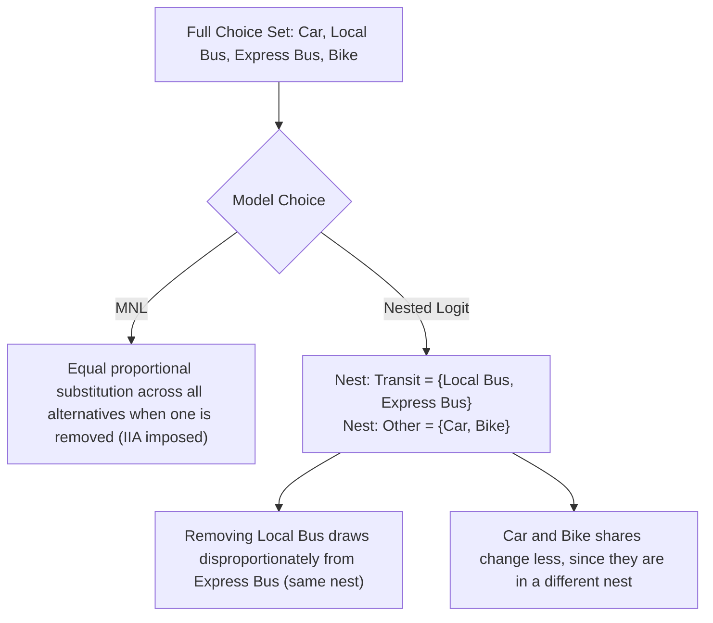

## Nested Logit and Independence of Irrelevant Alternatives

### Overview

The Independence of Irrelevant Alternatives (IIA) property is a defining feature of the multinomial logit (MNL) model, and it is often a source of severe misspecification in applied discrete choice work. The nested logit (NL) model was developed specifically to relax IIA by allowing correlation in unobserved utility among subsets ("nests") of alternatives, while retaining a closed-form likelihood. This topic covers the theoretical origin of IIA, why it fails in practice, the derivation and estimation of the nested logit model, and the diagnostic tests used to detect IIA violations.

### The IIA Property in Multinomial Logit

In the MNL model, an individual $n$ chooses alternative $i$ from choice set $C_n$ to maximize random utility:

$$U_{ni} = V_{ni} + \varepsilon_{ni}$$

where $V_{ni}$ is the deterministic (systematic) component and $\varepsilon_{ni}$ is an unobserved error term. MNL is derived under the assumption that $\varepsilon_{ni}$ is independently and identically distributed (i.i.d.) Type I Extreme Value (Gumbel) across alternatives $i$ and individuals $n$. This assumption yields the closed-form choice probability:

$$P_{ni} = \frac{e^{V_{ni}}}{\sum_{j \in C_n} e^{V_{nj}}}$$

**Key Points**

- The ratio of probabilities for any two alternatives $i$ and $k$ depends only on the utilities of $i$ and $k$:


  $$\frac{P_{ni}}{P_{nk}} = \frac{e^{V_{ni}}}{e^{V_{nk}}}$$
- This ratio is completely unaffected by the presence, absence, or attributes of any third alternative $j$. This is the IIA property.
- IIA is a mathematical consequence of the i.i.d. error assumption, not an independently imposed restriction — it cannot be "turned off" within a pure MNL specification.

### Why IIA Can Fail: The Red Bus/Blue Bus Problem

The canonical illustration of IIA failure is the red bus/blue bus paradox (McFadden, 1974).

Suppose an individual chooses between a car and a red bus, each with 50% probability, so $P_{car}/P_{redbus} = 1$. Now introduce a blue bus, which is identical to the red bus in every attribute that matters to the traveler (travel time, cost, comfort) except color. A rational traveler should be indifferent between red and blue bus and should still split their overall transit share 50/50 between car and "bus" (25% red bus, 25% blue bus, 50% car).

MNL, however, forces $P_{car}/P_{redbus} = 1$ to hold regardless of the blue bus's introduction, and by IIA the ratio $P_{redbus}/P_{bluebus}$ must also be governed only by their own utilities, which are equal — so MNL predicts each of the three alternatives gets exactly 1/3 probability. This shrinks car's share from 50% to 33%, an artifact of the model's independence assumption rather than genuine substitution behavior. The failure arises because red bus and blue bus are close substitutes — their unobserved utility components are correlated — violating the i.i.d. error assumption that IIA requires.

**Example**

```plaintext
Initial choice set: {Car, Red Bus}       -> P(Car) = 0.50, P(RedBus) = 0.50
Add near-identical alternative Blue Bus:
  MNL prediction:   P(Car) = 0.33, P(RedBus) = 0.33, P(BlueBus) = 0.33
  Intuitive/correct: P(Car) = 0.50, P(RedBus) = 0.25, P(BlueBus) = 0.25
```

### Nested Logit: Motivation and Structure

The nested logit model groups similar alternatives into "nests" and permits correlation in unobserved utility *within* a nest while retaining the i.i.d. Gumbel assumption *across* nests. This partially relaxes IIA: it holds within a nest (independence of irrelevant alternatives conditional on nest membership) but not across nests.

The nesting structure partitions the full choice set $C_n$ into $K$ mutually exclusive and exhaustive nests $B_1, \dots, B_K$. Utility for alternative $i$ in nest $k$ is:

$$U_{ni} = V_{ni} + \varepsilon_{ni}, \quad i \in B_k$$

The error terms are drawn from a Generalized Extreme Value (GEV) distribution such that errors within the same nest are correlated, and errors across nests are independent.

**Nesting Diagram (svg_diagram)**

```svg
<svg xmlns="http://www.w3.org/2000/svg" viewBox="0 0 640 260">
  <text x="320" y="20" font-size="14" text-anchor="middle" font-family="sans-serif" font-weight="bold">Nested Logit Structure (svg_diagram)</text>
  <rect x="270" y="35" width="100" height="30" fill="none" stroke="black" />
  <text x="320" y="55" font-size="12" text-anchor="middle" font-family="sans-serif">Root Choice</text>

  <line x1="300" y1="65" x2="140" y2="100" stroke="black" />
  <line x1="340" y1="65" x2="500" y2="100" stroke="black" />

  <rect x="80" y="100" width="120" height="30" fill="none" stroke="black" />
  <text x="140" y="120" font-size="12" text-anchor="middle" font-family="sans-serif">Nest: Motorized</text>

  <rect x="440" y="100" width="120" height="30" fill="none" stroke="black" />
  <text x="500" y="120" font-size="12" text-anchor="middle" font-family="sans-serif">Nest: Non-Motorized</text>

  <line x1="120" y1="130" x2="60" y2="170" stroke="black" />
  <line x1="160" y1="130" x2="220" y2="170" stroke="black" />
  <line x1="480" y1="130" x2="420" y2="170" stroke="black" />
  <line x1="520" y1="130" x2="580" y2="170" stroke="black" />

  <rect x="10" y="170" width="100" height="30" fill="none" stroke="black" />
  <text x="60" y="190" font-size="12" text-anchor="middle" font-family="sans-serif">Car</text>

  <rect x="170" y="170" width="100" height="30" fill="none" stroke="black" />
  <text x="220" y="190" font-size="12" text-anchor="middle" font-family="sans-serif">Bus</text>

  <rect x="370" y="170" width="100" height="30" fill="none" stroke="black" />
  <text x="420" y="190" font-size="12" text-anchor="middle" font-family="sans-serif">Bike</text>

  <rect x="530" y="170" width="100" height="30" fill="none" stroke="black" />
  <text x="580" y="190" font-size="12" text-anchor="middle" font-family="sans-serif">Walk</text>

  <text x="320" y="230" font-size="11" text-anchor="middle" font-family="sans-serif" fill="#555">IIA holds within a nest (Car vs Bus); violated across nests (Car vs Bike)</text>
</svg>
```

### Deriving the Nested Logit Probabilities

The joint choice probability factors into an unconditional probability of choosing nest $k$, and a conditional probability of choosing alternative $i$ given nest $k$:

$$P_{ni} = P_{ni|B_k} \cdot P_{nB_k}$$

**Conditional (within-nest) probability**

$$P_{ni|B_k} = \frac{e^{V_{ni}/\lambda_k}}{\sum_{j \in B_k} e^{V_{nj}/\lambda_k}}$$

**Marginal (nest-choice) probability**

$$P_{nB_k} = \frac{e^{\lambda_k I_{nk}}}{\sum_{l=1}^{K} e^{\lambda_l I_{nl}}}$$

where $I_{nk}$ is the **inclusive value** (also called the log-sum or inclusive utility) of nest $k$:

$$I_{nk} = \ln \left( \sum_{j \in B_k} e^{V_{nj}/\lambda_k} \right)$$

**Key Points**

- $\lambda_k$ is the nest (dissimilarity, or log-sum) parameter for nest $k$. It captures the degree of correlation among unobserved utility components of alternatives within nest $k$.
- $\lambda_k = 1$ corresponds to no correlation within the nest, and the model collapses to standard MNL for that nest.
- As $\lambda_k \to 0$, correlation within the nest approaches 1 (alternatives in that nest become near-perfect substitutes).
- For the model to be globally consistent with random utility maximization (RUM), $\lambda_k$ must lie in $(0, 1]$ for every nest. Values outside this range can still produce a fitted likelihood but are inconsistent with utility maximization.
- The inclusive value $I_{nk}$ summarizes the expected maximum utility available within nest $k$, and it enters the upper-level (nest) choice equation with coefficient $\lambda_k$ — this is why $\lambda_k$ is often called the "inclusive value parameter."

### Two-Level and Multi-Level Nesting

The two-level structure generalizes to deeper trees (three-level nested logit, or NL with sub-nests), where each level's choice probability depends on the inclusive value computed from the level immediately below it. Estimation proceeds recursively from the bottom of the tree upward.

**Multi-Level Nested Logit Tree (svg_diagram)**

```svg
<svg xmlns="http://www.w3.org/2000/svg" viewBox="0 0 600 220">
  <text x="300" y="20" font-size="14" text-anchor="middle" font-family="sans-serif" font-weight="bold">Three-Level Nesting (svg_diagram)</text>
  <circle cx="300" cy="45" r="18" fill="none" stroke="black" />
  <text x="300" y="49" font-size="10" text-anchor="middle" font-family="sans-serif">Root</text>

  <line x1="290" y1="60" x2="180" y2="95" stroke="black" />
  <line x1="310" y1="60" x2="420" y2="95" stroke="black" />
  <circle cx="180" cy="105" r="18" fill="none" stroke="black" />
  <text x="180" y="109" font-size="9" text-anchor="middle" font-family="sans-serif">Transit</text>
  <circle cx="420" cy="105" r="18" fill="none" stroke="black" />
  <text x="420" y="109" font-size="9" text-anchor="middle" font-family="sans-serif">Private</text>

  <line x1="170" y1="120" x2="120" y2="155" stroke="black" />
  <line x1="190" y1="120" x2="240" y2="155" stroke="black" />
  <line x1="410" y1="120" x2="360" y2="155" stroke="black" />
  <line x1="430" y1="120" x2="480" y2="155" stroke="black" />

  <rect x="80" y="155" width="80" height="26" fill="none" stroke="black" />
  <text x="120" y="172" font-size="9" text-anchor="middle" font-family="sans-serif">Local Bus</text>
  <rect x="200" y="155" width="80" height="26" fill="none" stroke="black" />
  <text x="240" y="172" font-size="9" text-anchor="middle" font-family="sans-serif">Express Bus</text>
  <rect x="320" y="155" width="80" height="26" fill="none" stroke="black" />
  <text x="360" y="172" font-size="9" text-anchor="middle" font-family="sans-serif">Car (self)</text>
  <rect x="440" y="155" width="80" height="26" fill="none" stroke="black" />
  <text x="480" y="172" font-size="9" text-anchor="middle" font-family="sans-serif">Car (pool)</text>
</svg>
```

### Estimation of Nested Logit

Two estimation approaches are used in practice.

**Full Information Maximum Likelihood (FIML)**

FIML estimates all parameters — the utility coefficients $\beta$ and all nest parameters $\lambda_k$ — jointly by maximizing the full log-likelihood function of the NL choice probabilities. This is statistically efficient and is the standard approach in modern software (e.g., `mlogit` in R, `nlogit`/Stata's `nlogitgen`/`nlogit`, Python's `pylogit`).

**Sequential (Limited Information) Estimation**

Historically, NL was estimated in two steps:

1. Estimate the within-nest model (conditional logit) for each nest separately using only individuals who chose an alternative in that nest, obtaining $\hat{\beta}$ and computing the inclusive value $\hat{I}_{nk}$ for each nest and individual.
2. Estimate the upper-level model using $\hat{I}_{nk}$ as a regressor.

**Key Points**

- Sequential estimation is consistent but not efficient, and standard errors from the second step are biased unless corrected (they don't account for estimation error in $\hat{I}_{nk}$ from the first step).
- [Inference] In modern applied work, FIML is preferred almost universally when computationally feasible; sequential estimation persists mainly in teaching contexts and legacy software workflows.
- The log-likelihood is not globally concave in $\lambda_k$, so NL estimation can be sensitive to starting values and may converge to different local optima; multiple starting points are recommended in practice.

### Normalization and the Degenerate Nested Logit Form

There are two common parameterizations found in software and textbooks, which are easy to confuse:

**Utility (scale) normalization** — used by most modern software (e.g., Stata, `mlogit` in R):

$$P_{ni|B_k} = \frac{e^{\mu \lambda_k V_{ni}}}{\sum_{j \in B_k} e^{\mu \lambda_k V_{nj}}}, \quad P_{nB_k} = \frac{e^{\mu I_{nk}}}{\sum_l e^{\mu I_{nl}}}$$

**McFadden's original ("non-normalized") parameterization** — divides by $\lambda_k$ inside the nest as shown in the derivation above, with $\mu$ (top-level scale) normalized to 1.

**Key Points**

- These two parameterizations are mathematically equivalent up to reparameterization but produce coefficient estimates on different scales, which is a frequent source of confusion when comparing results across software packages (e.g., NLOGIT vs. Stata's `nlogit` vs. R's `mlogit`).
- Always check a package's documentation for which convention it uses before interpreting $\lambda$ estimates or comparing them across packages. [Unverified: exact default convention should be confirmed against the specific software version in use, as defaults have changed across releases.]

### Testing IIA

Several formal tests exist to detect IIA violations in an estimated MNL model.

**Hausman-McFadden Test**

Compares MNL coefficients estimated on the full choice set against MNL coefficients estimated on a restricted choice set (with one or more alternatives removed). Under IIA, removing irrelevant alternatives should not change the coefficient estimates on the remaining alternatives (beyond sampling variation).

$$H = (\hat{\beta}_r - \hat{\beta}_f)' \left[ \text{Var}(\hat{\beta}_r) - \text{Var}(\hat{\beta}_f) \right]^{-1} (\hat{\beta}_r - \hat{\beta}_f)$$

where subscript $r$ denotes the restricted-set estimates and $f$ the full-set estimates. $H$ is asymptotically $\chi^2$ distributed with degrees of freedom equal to the number of coefficients compared.

**Key Points**

- A significant test statistic (rejecting the null of no systematic difference) indicates IIA is violated.
- [Inference] The Hausman-McFadden test is known in the literature to have poor finite-sample properties, occasionally producing negative test statistics (a negative semi-definite variance-covariance difference) or failing to reject even when IIA clearly does not hold, so it is generally treated as suggestive rather than definitive.

**Small-Hsiao Test**

An alternative to Hausman-McFadden with reportedly better finite-sample behavior, comparing log-likelihoods across a randomly split sample fit on full vs. restricted choice sets.

**Likelihood Ratio Test of Nest Parameters**

Since MNL is nested within NL as the special case $\lambda_k = 1 \,\forall k$, a likelihood ratio test can directly test $H_0: \lambda_k = 1$ for all $k$:

$$LR = -2(\ln L_{MNL} - \ln L_{NL}) \sim \chi^2_{q}$$

where $q$ is the number of nest parameters restricted. Rejecting $H_0$ supports the NL specification over MNL, providing indirect evidence that IIA does not hold within the assumed tree structure. A Wald test on individual $\hat\lambda_k$ against 1 is also commonly reported alongside the LR test.

### Determining the Nesting Structure

The nesting structure is typically specified by the researcher based on institutional knowledge or intuition about which alternatives are close substitutes (e.g., grouping transit modes together, grouping brands within a product category). This is a substantive modeling choice, not something estimated from the data directly.

**Key Points**

- Different nesting structures imply different substitution patterns and can be compared using non-nested tests (e.g., comparing log-likelihoods, AIC/BIC) since the models are not nested within each other when they impose different tree structures.
- A poorly chosen nesting structure can still fail to fully resolve IIA violations if the true substitution pattern does not match the assumed tree.
- The **Cross-Nested Logit (CNL)** model relaxes the requirement that each alternative belongs to exactly one nest, allowing alternatives to belong to multiple nests with allocation ("membership") parameters — useful when substitution patterns don't map cleanly onto a strict partition.

### Relationship to Other GEV and Mixed Models

**Key Points**

- Nested logit is a special case of the broader Generalized Extreme Value (GEV) class of models (McFadden, 1978), which also includes ordered GEV, paired combinatorial logit, and cross-nested logit as other members that relax IIA in different ways.
- The **mixed logit (random parameters logit)** model offers an alternative, more flexible route to relaxing IIA by allowing taste parameters $\beta$ to vary randomly across individuals, which induces correlation in utilities without requiring an a priori nesting structure. [Inference] In practice, mixed logit is often preferred over NL when the substitution pattern is not obviously groupable, at the cost of requiring simulation-based estimation rather than a closed-form likelihood.
- Nested logit retains a closed-form likelihood (a major computational advantage over mixed logit and probit-based alternatives), which is a key reason for its continued widespread use despite the availability of more flexible models.

### Substitution Patterns: A Worked Comparison



### Practical Implementation Notes

**Example**

```plaintext
# R (mlogit package) — sketch of nested logit estimation
library(mlogit)

mode_data <- mlogit.data(travel_df, choice = "chosen", shape = "long",
                          alt.var = "alt", chid.var = "id")

nl_model <- mlogit(chosen ~ cost + time | income,
                    data = mode_data,
                    nests = list(transit = c("bus", "train"),
                                 private = c("car", "bike")),
                    un.nest.el = FALSE)  # FALSE: constrain lambda equal across nests if desired

summary(nl_model)
```

**Key Points**

- Software will typically report each nest's $\hat{\lambda}_k$ with a standard error; check that $0 < \hat{\lambda}_k \le 1$ and, if not, reconsider the nesting structure or reparameterize.
- Some packages allow constraining all $\lambda_k$ to be equal across nests (a testable restriction) versus estimating a separate $\lambda_k$ per nest.
- [Note: behavior may vary by package version and default settings] Always verify the sign convention, normalization, and default optimizer settings against the specific software documentation being used, since defaults differ across `mlogit`, `nlogit`, Stata, and `pylogit`.

### Common Pitfalls

**Key Points**

- Misinterpreting $\lambda_k$ outside $(0,1]$ as merely "unusual" rather than as a signal of RUM-inconsistency or misspecified nesting structure.
- Applying the Hausman-McFadden test as the sole criterion for IIA violation despite its known finite-sample instability.
- Choosing a nesting structure post hoc based on which one gives the best log-likelihood, without substantive justification — this risks overfitting the tree structure to the sample rather than reflecting genuine behavioral substitution patterns.
- Confusing the two normalization conventions (utility vs. non-normalized) when comparing $\hat\lambda_k$ magnitudes across studies or software outputs.

**Next Steps**

- Mixed logit (random parameters logit) and simulation-based estimation (Halton draws, GHK simulator)
- Cross-nested logit and generalized nested logit (GNL) models
- Multinomial probit as a non-IIA alternative with flexible error covariance
- Willingness-to-pay and elasticity computation under nested logit substitution patterns
- Ordered logit/probit models for ordinal (rather than unordered) discrete outcomes
- Panel/longitudinal discrete choice models with individual-specific heterogeneity