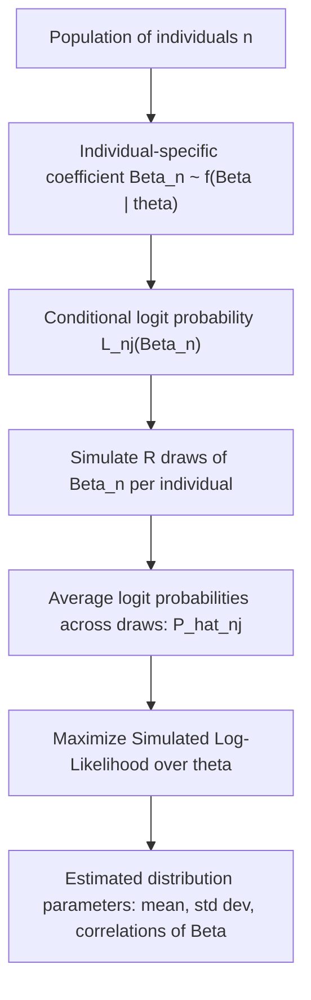

## Mixed Logit and Random Parameters Models

### Overview

The mixed logit model (also called random parameters logit, or error components logit) generalizes standard logit models by allowing taste parameters to vary across individuals according to a specified distribution. It is one of the most flexible discrete choice models available in applied econometrics because it can approximate any random utility model to an arbitrary degree of accuracy, relaxing both the Independence of Irrelevant Alternatives (IIA) property and the assumption of homogeneous preferences across the population. The cost of this flexibility is that the choice probabilities no longer have a closed form and must be evaluated by simulation.

### Motivation: Limitations of Standard Logit

**Key Points**

- Standard multinomial logit (MNL) assumes a single, fixed coefficient vector $\beta$ applies identically to every individual in the population.
- MNL imposes IIA, meaning the ratio of choice probabilities for any two alternatives is unaffected by other alternatives in the choice set.
- In practice, preferences are rarely homogeneous — individuals differ systematically in their sensitivity to price, time, quality, and other attributes due to unobserved (to the researcher) taste heterogeneity.
- Nested logit relaxes IIA partially through a fixed tree structure, but mixed logit relaxes it through a fundamentally different mechanism: randomness in tastes rather than a hierarchical grouping of alternatives.

### Model Specification

The utility that individual $n$ obtains from alternative $j$ in choice occasion $t$ is:

$$U_{njt} = \beta_n' x_{njt} + \varepsilon_{njt}$$

where $x_{njt}$ is a vector of observed attributes, $\varepsilon_{njt}$ is i.i.d. Type I Extreme Value across alternatives and individuals, and $\beta_n$ is a vector of individual-specific coefficients that follows some density $f(\beta \mid \theta)$ with parameters $\theta$ (e.g., mean and variance) to be estimated.

Conditional on knowing $\beta_n$, the choice probability has the standard logit form:

$$L_{nj}(\beta_n) = \frac{e^{\beta_n' x_{njt}}}{\sum_{k} e^{\beta_n' x_{nkt}}}$$

Since $\beta_n$ is not observed by the researcher, the unconditional choice probability integrates over its distribution:

$$P_{nj} = \int L_{nj}(\beta) \, f(\beta \mid \theta) \, d\beta$$

**Key Points**

- This integral generally has no closed-form solution (except in degenerate special cases), which is the defining computational challenge of mixed logit.
- The model is estimated by choosing $\theta$ (the parameters governing the distribution of $\beta$) to best fit the observed choices, typically via Maximum Simulated Likelihood (MSL).
- Mixed logit is a member of the broader class of "kernel" or "mixture" models: it is a mixture of logit kernels over a mixing distribution of coefficients.

### Simulation-Based Estimation: Maximum Simulated Likelihood

Because $P_{nj}$ has no closed form, it is approximated by simulation. The standard procedure is:

**Steps**

1. Specify a distribution $f(\beta \mid \theta)$ for each random coefficient (e.g., normal, lognormal, uniform, triangular).
2. Draw $R$ pseudo-random (or quasi-random) values $\beta^{(r)}$, $r = 1, \dots, R$, from $f(\beta \mid \theta)$ for each individual.
3. Compute the standard logit probability $L_{nj}(\beta^{(r)})$ for each draw.
4. Average across draws to obtain the simulated probability:


   $$\hat{P}_{nj} = \frac{1}{R} \sum_{r=1}^{R} L_{nj}(\beta^{(r)})$$
5. Construct the simulated log-likelihood across all individuals and maximize over $\theta$ using numerical optimization:


   $$SLL(\theta) = \sum_{n} \ln \hat{P}_{n, j_n}$$

**Key Points**

- The simulated probability $\hat{P}_{nj}$ is an unbiased estimator of the true probability $P_{nj}$ for any finite $R$, but the log of this simulated probability introduces a bias that shrinks as $R \to \infty$.
- As $R \to \infty$, MSL estimates converge to the maximum likelihood estimates; in practice, $R$ in the hundreds (with quasi-random draws) or low thousands (with pseudo-random draws) is common.
- [Inference] Practitioners generally consider a few hundred well-designed quasi-random draws sufficient for stable estimates in typical applied settings, though the necessary number of draws depends on model complexity, dimensionality of the mixing distribution, and desired precision, so this should be checked via sensitivity analysis (e.g., re-estimating with different $R$ and draw types to confirm stability) rather than assumed.

### Draw Types: Pseudo-Random vs. Quasi-Random (Halton and Sobol Sequences)

**Key Points**

- Standard pseudo-random draws (e.g., from a uniform random number generator) converge slowly and often require thousands of draws per dimension for stable simulation.
- Halton sequences are deterministic, low-discrepancy sequences that fill the unit interval more evenly than pseudo-random draws, substantially reducing simulation error for a given number of draws — commonly cited efficiency gains suggest that on the order of 100 Halton draws can perform comparably to 1,000+ pseudo-random draws in many applications. [Inference: exact equivalence ratios are model- and dimension-dependent and originate from simulation studies rather than a universal theorem.]
- A known limitation of standard Halton sequences is correlation between dimensions at higher dimensions (many random coefficients), which can degrade performance; scrambled Halton sequences or Sobol sequences are often used to mitigate this.
- Modern software (Stata's `mixlogit`/`gmnl`, R's `mlogit`/`gmnl`/`apollo`, Python's `pylogit`/`biogeme`) supports Halton, scrambled Halton, and Sobol draws as standard options.

### Choosing the Mixing Distribution

The choice of $f(\beta \mid \theta)$ has substantive implications for both interpretation and estimation stability.

**Key Points**

- **Normal distribution**: simplest and most common; allows coefficients of either sign, which can be problematic for parameters with known theoretical sign restrictions (e.g., price coefficients should be negative).
- **Lognormal distribution**: constrains the coefficient to one sign (useful for price or cost coefficients that must be negative, by specifying the negative of a lognormal variable); can produce very long right tails, sometimes leading to implausibly large implied willingness-to-pay values for a subset of the population.
- **Uniform and triangular distributions**: bounded support, avoiding the extreme-tail problem of lognormal; triangular distributions are popular because they allow both a spread and a peak while remaining bounded.
- **Fixed (non-random) coefficients**: not every coefficient needs to be random; researchers often fix coefficients with theoretically unambiguous, homogeneous effects and randomize only those expected to exhibit taste heterogeneity, both for parsimony and to aid convergence.
- [Inference] The choice among these distributions is frequently guided as much by convergence behavior and the plausibility of the resulting distribution of willingness-to-pay as by ex ante theory, and specification testing across distributional assumptions is considered good practice.

### Correlated Random Parameters

Coefficients are not required to be independent of one another. Allowing correlation across random coefficients is done via a full or partial Cholesky decomposition of the covariance matrix:

$$\beta_n = \bar{\beta} + L \eta_n$$

where $\bar{\beta}$ is the mean coefficient vector, $L$ is a lower-triangular Cholesky factor such that $LL' = \Sigma$ (the covariance matrix of $\beta_n$), and $\eta_n$ is a vector of i.i.d. standard normal draws.

**Key Points**

- Allowing full correlation substantially increases the number of parameters to estimate (a $K \times K$ covariance matrix has $K(K+1)/2$ unique elements), which can create convergence difficulties with limited data.
- Correlated random parameters are important when, for example, individuals who are more time-sensitive are also expected to be more cost-sensitive — ignoring this correlation can bias derived quantities like willingness-to-pay ratios.

### Panel (Repeated Choice) Mixed Logit

When the same individual is observed making multiple choices (panel data), the mixed logit framework extends naturally by holding $\beta_n$ fixed across an individual's choice occasions while integrating over the joint likelihood of that individual's entire sequence of choices:

$$P_n = \int \left( \prod_{t=1}^{T_n} L_{n j_{nt}}(\beta) \right) f(\beta \mid \theta) \, d\beta$$

**Key Points**

- This panel structure captures the intuition that an individual's unobserved tastes are stable across their own choice occasions, even though they vary across individuals.
- Failing to account for the panel structure (treating repeated observations as if from independent individuals) can understate the true heterogeneity captured by the model and bias standard errors.

### Error Components and Relationship to Nested/Cross-Nested Logit

**Key Points**

- Mixed logit can replicate the nested logit correlation structure as a special case, called the **error components logit**, by including a random coefficient on a nest-membership dummy variable rather than on an observed attribute.
- This makes mixed logit strictly more general than nested logit: with the right specification of random components, mixed logit can approximate GEV-class substitution patterns (nested, cross-nested) as well as capture continuous heterogeneity in tastes that nested logit cannot.
- Unlike nested logit, mixed logit does not require the researcher to specify a discrete nesting tree; substitution patterns emerge from the estimated (co)variances of the random coefficients themselves.

### Willingness-to-Pay and Distributional Outputs

A common use of mixed logit is deriving individual-level (or population-distributional) willingness-to-pay (WTP) measures, such as the value of travel time savings:

$$WTP_n = -\frac{\beta_n^{time}}{\beta_n^{cost}}$$

**Key Points**

- Because $\beta_n$ is random, $WTP_n$ is also a random variable with its own distribution across the population, which mixed logit allows the researcher to characterize (mean, median, and full distribution) rather than reporting a single population-average value as MNL would.
- Ratio distributions of two random normal variables (e.g., time coefficient / cost coefficient) can have undefined moments (infinite variance) if the denominator's distribution has support near zero — this is a well-documented issue when the cost coefficient is specified as normal rather than lognormal.
- The **WTP-space** formulation reparameterizes the utility function to have WTP itself (rather than the raw coefficient) as the random parameter, which avoids this ratio problem and is [Inference] increasingly recommended in the transportation and marketing choice-modeling literature, though it introduces its own estimation and scale-normalization complexities.

### Model Diagram



### Estimation Software and Implementation

**Example**

```plaintext
# R (mixl or apollo package) — sketch of mixed logit specification
library(apollo)

apollo_beta <- c(b_cost = -0.5, mu_time = -1.2, sigma_time = 0.8)
apollo_randCoeff <- function(apollo_beta, apollo_inputs) {
  randcoeff <- list()
  randcoeff[["b_time"]] <- mu_time + sigma_time * draws_time  # normal random coefficient
  return(randcoeff)
}

apollo_probabilities <- function(apollo_beta, apollo_inputs, functionality = "estimate") {
  V <- list(
    alt1 = b_cost * cost_1 + b_time * time_1,
    alt2 = b_cost * cost_2 + b_time * time_2
  )
  mnl_settings <- list(alternatives = c(alt1 = 1, alt2 = 2), choiceVar = choice, V = V)
  P <- apollo_mnl(apollo_beta, apollo_inputs, mnl_settings)
  P <- apollo_panelProd(P, apollo_inputs, functionality)
  P <- apollo_avgInterDraws(P, apollo_inputs, functionality)
  return(P)
}
```

**Key Points**

- Widely used implementations include Stata's `mixlogit` and `gmnl`, R's `apollo`, `gmnl`, and `mlogit` packages, Python's `PyLogit` and `xlogit`, and the standalone Biogeme package (Python-based, developed at EPFL).
- [Note: behavior may vary by package and version] Default number of draws, draw type, and optimizer algorithm differ across these packages; convergence and standard errors should be checked with multiple starting values and draw counts before finalizing results.
- Estimation of mixed logit models is computationally intensive relative to MNL or nested logit, and computation time scales with the number of random coefficients, the number of draws, and sample size; parallelization is common in modern implementations.

### Model Selection: Mixed Logit vs. Nested Logit vs. MNL

**Key Points**

- MNL is nested within mixed logit (setting all coefficient variances to zero recovers MNL), so a likelihood ratio test can formally test for the presence of random taste heterogeneity.
- Nested logit and mixed logit are not nested within each other in general (except via the error-components special case), so comparisons typically rely on non-nested criteria such as AIC, BIC, or out-of-sample predictive validation.
- [Inference] In applied practice, the choice between nested logit and mixed logit often depends on whether the researcher has strong a priori knowledge of a natural grouping of alternatives (favoring nested logit's interpretability and lower computational cost) versus a need to capture continuous, possibly correlated taste heterogeneity without imposing a discrete tree (favoring mixed logit).

### Common Pitfalls

**Key Points**

- Using too few simulation draws (especially pseudo-random draws) can produce simulation noise that is mistaken for genuine parameter instability or convergence failure.
- Specifying a normal distribution for a cost/price coefficient can allow the "wrong sign" for a nontrivial share of the simulated population, producing implausible individual-level WTP values.
- Ignoring panel structure in repeated-choice data understates the persistence of individual-specific tastes and can distort estimated variances.
- Over-parameterizing the covariance matrix of random coefficients relative to sample size can cause convergence failure or numerically unstable variance estimates.
- Comparing $\hat\theta$ estimates across studies without checking scale normalization, draw type, and distributional assumptions, all of which affect the magnitude (though not necessarily the substantive interpretation) of the results.

**Next Steps**

- Latent class (finite mixture) logit models as a discrete alternative to continuous mixed logit heterogeneity
- WTP-space vs. preference-space model formulations
- Multinomial probit as an alternative flexible substitution-pattern model
- Hybrid choice models incorporating latent psychological constructs
- Panel data methods for stated preference and revealed preference discrete choice experiments
- Bayesian estimation of mixed logit via Hierarchical Bayes (as an alternative to classical MSL)