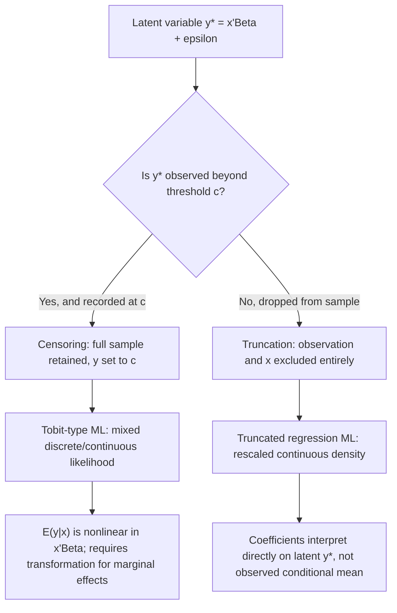

## Censoring and Truncation


### Overview

Censoring and truncation describe two distinct ways in which the observed values of a dependent variable can be limited or distorted relative to the true underlying variable of interest. Both phenomena arise frequently in economic data — corner solutions in expenditure, top-coded incomes, duration data, and non-random survey samples — and both, if ignored, produce inconsistent Ordinary Least Squares (OLS) estimates. Distinguishing between them precisely is essential because they require different estimators and imply different data-generating processes.

### Defining Censoring

A dependent variable is **censored** when values above or below a threshold are observed but recorded at the threshold value, even though the underlying variable exists and could in principle take values beyond that point. Critically, information on the explanatory variables $x_i$ is still available for every observation, including censored ones.

Formally, for a latent variable $y_i^*$:

$$y_i = \begin{cases} y_i^* & \text{if } y_i^* > c \\ c & \text{if } y_i^* \le c \end{cases}$$

**Example**

- Household expenditure on a durable good, recorded as $0 for households that chose not to purchase (left-censored at zero) — the "true" desire or latent expenditure may be negative, but it is recorded as zero.
- Top-coded survey income, where all incomes above $200,000 are recorded simply as "$200,000" (right-censored).
- Insurance claims data, where losses below a deductible are recorded as zero.

### Defining Truncation

A dependent variable is **truncated** when observations beyond a threshold are entirely excluded from the sample — not just recorded at a limit, but missing altogether, along with their corresponding $x_i$ values.

$$y_i \text{ is observed only if } y_i^* > c$$

**Example**

- A study of factory wages that only surveys currently employed workers, entirely excluding individuals who are not working (their wage, and their characteristics, are absent from the dataset — this is also a classic case of **sample selection**, closely related to truncation).
- A dataset on high-income taxpayers drawn only from individuals who filed a particular high-income tax form, excluding lower earners from the sample entirely.
- Analyzing the duration of hospital stays using only records of patients who have already been discharged, excluding those still admitted at the time of data collection.

### Censoring vs. Truncation: Key Distinction

**Key Points**

- Censoring: the full sample size $N$ is retained; extreme values of $y$ are replaced by the censoring point, but $x_i$ is fully observed for every unit.
- Truncation: the sample itself is restricted to units satisfying the truncation condition; units outside the condition are absent from both $y$ and $x$.
- Truncation is generally the more severe problem for estimation because it removes information on the explanatory variables for the excluded population, not just on $y$.
- A truncated distribution's density is the corresponding piece of the untruncated distribution's density, rescaled to integrate to one over the truncated support. A censored distribution instead has a *mixed* density: continuous over the uncensored region and a point mass at the censoring threshold.

**Diagram (svg_diagram)**

```svg
<svg xmlns="http://www.w3.org/2000/svg" viewBox="0 0 640 300">
  <text x="320" y="20" font-size="14" text-anchor="middle" font-family="sans-serif" font-weight="bold">Censoring vs. Truncation at c = 0 (svg_diagram)</text>

  <text x="160" y="45" font-size="12" text-anchor="middle" font-family="sans-serif" font-weight="bold">Censored Distribution</text>
  <line x1="40" y1="150" x2="280" y2="150" stroke="black" />
  <line x1="160" y1="150" x2="160" y2="60" stroke="black" stroke-dasharray="3,3" />
  <text x="160" y="165" font-size="10" text-anchor="middle" font-family="sans-serif">c = 0</text>
  <path d="M 160 150 Q 220 100 270 60" fill="none" stroke="black" />
  <rect x="150" y="140" width="20" height="10" fill="black" />
  <text x="160" y="185" font-size="9" text-anchor="middle" font-family="sans-serif">Point mass at c</text>
  <text x="220" y="90" font-size="9" text-anchor="middle" font-family="sans-serif">Continuous density above c</text>

  <text x="480" y="45" font-size="12" text-anchor="middle" font-family="sans-serif" font-weight="bold">Truncated Distribution</text>
  <line x1="360" y1="150" x2="600" y2="150" stroke="black" />
  <line x1="480" y1="150" x2="480" y2="60" stroke="black" stroke-dasharray="3,3" />
  <text x="480" y="165" font-size="10" text-anchor="middle" font-family="sans-serif">c = 0</text>
  <path d="M 480 60 Q 540 100 590 150" fill="none" stroke="black" />
  <text x="480" y="185" font-size="9" text-anchor="middle" font-family="sans-serif">No mass below c</text>
  <text x="540" y="90" font-size="9" text-anchor="middle" font-family="sans-serif">Rescaled density above c</text>
</svg>
```

### Why OLS Fails

**Key Points**

- Applying OLS to a censored sample using the observed (censored) $y_i$ as the dependent variable produces biased and inconsistent estimates of the structural parameters, because the conditional mean $E[y_i \mid x_i]$ no longer equals $x_i'\beta$ once censoring is present — it is a nonlinear function of $x_i'\beta$ and the error variance.
- Applying OLS to a truncated sample (using only the observed subsample) is also biased and inconsistent, because the truncation induces a correlation between the included error term and $x_i$: conditioning on $y_i^* > c$ changes the conditional expectation of the error term given $x_i$ away from zero.
- Both biases persist asymptotically; they are not resolved by increasing sample size, since the misspecification is in the functional form of the conditional mean, not sampling variability.
- [Inference] The direction and magnitude of OLS bias in these settings is well established analytically for the Gaussian case (typically attenuation toward zero for censored regression, and similarly attenuated or sign-ambiguous depending on specification for truncated regression), though exact magnitudes are model- and parameter-specific.

### The Truncated Normal Distribution

If $y^* \sim N(\mu, \sigma^2)$ and we truncate from below at $c$, the density of the observed (truncated) variable is:

$$f(y \mid y > c) = \frac{\phi\left(\frac{y - \mu}{\sigma}\right)}{\sigma \left[1 - \Phi\left(\frac{c - \mu}{\sigma}\right)\right]}, \quad y > c$$

where $\phi(\cdot)$ and $\Phi(\cdot)$ are the standard normal PDF and CDF, respectively.

The conditional mean of the truncated normal (truncated from below at $c$) is:

$$E[y^* \mid y^* > c] = \mu + \sigma \lambda(\alpha)$$

where $\alpha = \frac{c - \mu}{\sigma}$ and $\lambda(\alpha) = \frac{\phi(\alpha)}{1 - \Phi(\alpha)}$ is the **inverse Mills ratio**.

**Key Points**

- The inverse Mills ratio $\lambda(\alpha)$ is always positive for lower truncation, meaning the truncated mean is always shifted upward relative to $\mu$ — truncating from below necessarily raises the conditional mean.
- The inverse Mills ratio is the central object linking truncated/censored regression to the Heckman sample selection correction, where it appears as an additional regressor to correct for the selection-induced bias in a second-stage OLS regression.
- The variance of the truncated normal is always less than $\sigma^2$: truncation reduces variance, since it removes probability mass from one tail.

### Truncated Regression Model

For a linear model $y_i^* = x_i'\beta + \varepsilon_i$, $\varepsilon_i \sim N(0, \sigma^2)$, observed only when $y_i^* > c$, the truncated regression model is estimated via maximum likelihood using the truncated normal density directly:

$$\ln L = \sum_{i: y_i > c} \left[ -\ln \sigma + \ln \phi\left(\frac{y_i - x_i'\beta}{\sigma}\right) - \ln\left(1 - \Phi\left(\frac{c - x_i'\beta}{\sigma}\right)\right) \right]$$

**Key Points**

- Truncated regression is estimated by maximum likelihood (ML), not OLS, precisely because the likelihood must account for the fact that only $y_i > c$ observations are ever seen.
- Coefficients from truncated regression are interpreted directly as marginal effects on the latent variable $y^*$, analogous to standard linear regression coefficients, but caution is needed if using them to predict the *observed* conditional mean, since that requires adding the inverse Mills ratio term.

### Censored Regression: The Tobit Model

The most common approach for censored dependent variables is the **Tobit model** (Tobin, 1958), covered in more depth elsewhere in this chapter, but its likelihood structure directly illustrates how censoring differs from truncation in estimation. For left-censoring at zero:

$$\ln L = \sum_{i: y_i = 0} \ln \left[1 - \Phi\left(\frac{x_i'\beta}{\sigma}\right)\right] + \sum_{i: y_i > 0} \left[-\ln\sigma + \ln \phi\left(\frac{y_i - x_i'\beta}{\sigma}\right)\right]$$

**Key Points**

- The likelihood has two components: a discrete probability mass term for censored observations (probability that $y_i^* \le 0$) and a continuous density term for uncensored observations — this mixed discrete/continuous structure is the hallmark of censored-data likelihoods, in contrast to the purely continuous (rescaled) density used in truncated regression.
- Because censored observations still contribute their $x_i$ information (through the probability term), Tobit uses more information than truncated regression applied to the same underlying process, and the two will generally yield different coefficient estimates even under correctly specified models.
- $E[y_i \mid x_i]$ in the Tobit model is $\Phi(x_i'\beta/\sigma) \cdot (x_i'\beta + \sigma\lambda(x_i'\beta/\sigma))$, a nonlinear function of $x_i'\beta$, which is why raw Tobit coefficients cannot be interpreted as marginal effects on $E[y_i \mid x_i]$ without further transformation (this is covered fully under the Tobit model topic).

### Left, Right, and Interval Censoring/Truncation

**Key Points**

- **Left-censoring**: values below a threshold are recorded at the threshold (e.g., zero expenditure, minimum wage floors).
- **Right-censoring**: values above a threshold are recorded at the threshold (e.g., top-coded income, survival/duration data where the study ends before the event occurs).
- **Interval censoring**: the exact value is unknown but known to lie within a bounded interval (common in duration/survival analysis with periodic follow-up).
- **Double censoring**: both a lower and upper threshold apply simultaneously (e.g., data top-coded and bottom-coded, or bounded rating scales).
- The same left/right/interval/double distinctions apply analogously to truncation, with the corresponding change that affected observations are dropped from the sample entirely rather than set to the threshold.

### Relationship to Sample Selection Models

**Key Points**

- Truncation is a special case within the broader class of **sample selection** problems, but classical truncation assumes selection depends only on $y^*$ itself crossing a threshold, whereas general sample selection models (e.g., Heckman's two-step model) allow selection to depend on a *separate* latent selection equation correlated with, but not identical to, the outcome equation.
- The Heckman selection model nests the pure truncated-regression case as a special situation where the selection and outcome equations are the same equation.
- [Inference] In applied labor economics, this distinction matters substantially: wage regressions estimated only on employed individuals are more accurately modeled as a sample-selection problem (participation decision separate from wage-setting) than as simple truncation, since the decision to work is not simply "wage exceeds a threshold" but depends on a distinct reservation-wage comparison.

### Diagnostic and Practical Considerations

**Key Points**

- The censoring or truncation threshold $c$ need not be zero or a single fixed constant; it can vary by observation (e.g., a top-code that differs by survey year, or a deductible that varies by policy).
- Detecting whether data are censored versus truncated requires knowledge of the sample construction (survey design, administrative rules) rather than something recoverable from the observed data distribution alone — a spike in the histogram of $y$ at a boundary value is suggestive of censoring, while an oddly cut-off distribution `without` such a spike may suggest truncation, but this heuristic is not definitive. [Inference: this is a practical diagnostic heuristic, not a formal statistical test.]
- Both censored and truncated regression models rely heavily on the correct specification of the error distribution (typically normality); under distributional misspecification, ML estimates of both models are inconsistent, unlike OLS in a standard linear model, which remains consistent even under some forms of non-normality. This distributional sensitivity motivates semi-parametric and quantile-based alternatives (e.g., Powell's Censored Least Absolute Deviations estimator) for censored data.

### Model Flow



### Common Pitfalls

**Key Points**

- Treating a truncated sample as if it were merely censored (or vice versa) leads to use of the wrong likelihood function and inconsistent parameter estimates.
- Running OLS on a censored or truncated sample "because it still runs without error" — the estimator computes a numerical result, but that result is not a consistent estimate of the structural parameters of interest.
- Interpreting Tobit or truncated-regression coefficients as if they were OLS marginal effects on the observed dependent variable's conditional mean, without applying the appropriate nonlinear transformation.
- Ignoring the possibility that the censoring/truncation threshold itself varies across observations, which if unmodeled biases the likelihood.
- Assuming normality of $\varepsilon_i$ without verification, given that both censored and truncated ML estimators are generally inconsistent under distributional misspecification.

**Next Steps**

- The Tobit model (Type I) in full detail, including marginal effects decomposition
- Heckman two-step and full maximum likelihood sample selection models
- Type II, III, IV, and V Tobit generalizations (multi-equation censored/selection systems)
- Duration/survival analysis and censoring in hazard models
- Powell's Censored Least Absolute Deviations (CLAD) and other semi-parametric estimators for censored data
- Two-part and hurdle models for corner-solution outcomes