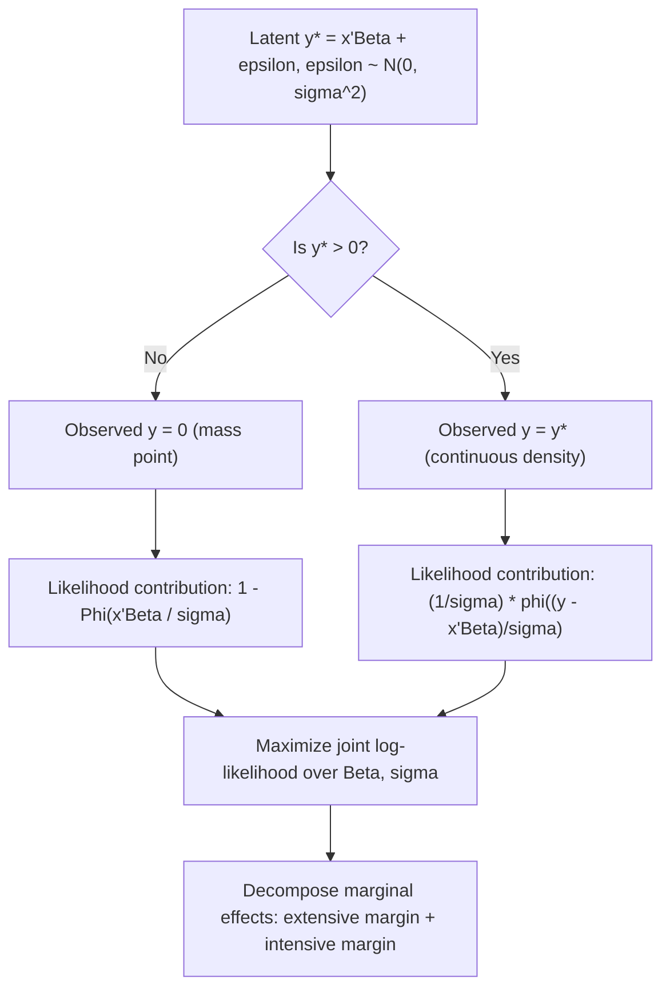

## The Tobit Model

### Overview

The Tobit model, introduced by James Tobin (1958), is the foundational econometric model for a continuous dependent variable that is censored at a threshold — most commonly a corner solution at zero. It combines a discrete probability mass (the probability of being at the limit) with a continuous density (for observations away from the limit) into a single latent-variable framework estimated by maximum likelihood. Tobin's original application modeled household expenditure on durable goods, where a substantial fraction of households spend exactly zero.

### The Latent Variable Framework

The Tobit model (also called the "Type I Tobit" in Amemiya's classification of censored/selection models) specifies an underlying latent variable $y_i^*$ that follows a standard linear regression model:

$$y_i^* = x_i'\beta + \varepsilon_i, \quad \varepsilon_i \sim N(0, \sigma^2)$$

but $y_i^*$ is only observed above (or below) a threshold, conventionally normalized to zero:

$$y_i = \begin{cases} y_i^* & \text{if } y_i^* > 0 \\ 0 & \text{if } y_i^* \le 0 \end{cases}$$

**Key Points**

- $y_i^*$ represents the theoretical, uncensored quantity of interest (e.g., desired expenditure, which can be conceptually negative for a household that would prefer not to purchase at all).
- $y_i$ is the observed variable actually recorded in the data.
- The censoring threshold need not be zero or fixed across observations; it can be any known constant or observation-varying value $c_i$.
- The Tobit model is a special case of the broader class of censored regression models, distinguished by its assumption of a single equation governing both the "participation" (censoring) decision and the "intensity" (level) decision.

### The Likelihood Function

The Tobit likelihood combines a discrete mass point at zero with a continuous density above zero. For an observation with $y_i = 0$:

$$P(y_i = 0 \mid x_i) = P(y_i^* \le 0) = P(\varepsilon_i \le -x_i'\beta) = 1 - \Phi\left(\frac{x_i'\beta}{\sigma}\right)$$

For an observation with $y_i > 0$, the density is the standard normal regression density:

$$f(y_i \mid x_i) = \frac{1}{\sigma} \phi\left(\frac{y_i - x_i'\beta}{\sigma}\right)$$

The full log-likelihood across the sample is:

$$\ln L(\beta, \sigma) = \sum_{i: y_i = 0} \ln\left[1 - \Phi\left(\frac{x_i'\beta}{\sigma}\right)\right] + \sum_{i: y_i > 0} \left[-\ln \sigma + \ln \phi\left(\frac{y_i - x_i'\beta}{\sigma}\right)\right]$$

**Key Points**

- This mixed discrete-continuous likelihood is the defining feature of the Tobit model, distinguishing it from a purely continuous truncated-regression likelihood (covered under "Censoring and truncation").
- $\beta$ and $\sigma$ are estimated jointly by numerical maximization of $\ln L$; no closed-form solution exists.
- The Tobit log-likelihood is globally concave in $(\beta, \sigma)$ under standard regularity conditions (specifically, in the reparameterization $\gamma = \beta/\sigma$ and $1/\sigma$), which generally ensures a unique maximum and reliable convergence in standard software implementations.

### Why OLS on the Censored Sample Fails

**Key Points**

- Running OLS of $y_i$ on $x_i$ using the full sample (including zeros) is inconsistent because $E[y_i \mid x_i] \ne x_i'\beta$; the true conditional mean is a nonlinear function of $x_i'\beta$ (derived below), so OLS is misspecified for the conditional mean function itself.
- Running OLS only on the uncensored (positive) subsample is also inconsistent, for the same reason a truncated sample is problematic: conditioning on $y_i^* > 0$ induces a non-zero conditional mean for the error term given $x_i$, correlated with $x_i'\beta$.
- [Inference] Both OLS approaches typically produce estimates that are attenuated (biased toward zero) relative to the true $\beta$, a well-documented result in the Tobit literature originating from Tobin's and later Amemiya's analyses, although the exact degree of attenuation depends on the fraction of censored observations and the true parameter values.

### The Conditional Expectations

Three conditional expectations are commonly used with Tobit output, and confusing them is one of the most frequent errors in applied work.

**Expected value of the latent variable:**

$$E[y_i^* \mid x_i] = x_i'\beta$$

**Expected value of the observed variable, conditional on being uncensored:**

$$E[y_i \mid x_i, y_i > 0] = x_i'\beta + \sigma \lambda_i, \quad \lambda_i = \frac{\phi(x_i'\beta/\sigma)}{\Phi(x_i'\beta/\sigma)}$$

**Expected value of the observed variable, unconditional (the actual observed $y$):**

$$E[y_i \mid x_i] = \Phi\left(\frac{x_i'\beta}{\sigma}\right) \left[x_i'\beta + \sigma \lambda_i\right]$$

**Key Points**

- $\lambda_i$ here is the inverse Mills ratio evaluated at $x_i'\beta/\sigma$, the same object that arises in truncated regression and Heckman selection models.
- $E[y_i \mid x_i]$ is a nonlinear function of $x_i'\beta$: it can be decomposed as the probability of being uncensored, $\Phi(x_i'\beta/\sigma)$, multiplied by the conditional mean given uncensoring.
- Raw Tobit coefficients $\hat\beta$ estimate the effect of $x$ on the **latent** variable $y^*$, not directly on the observed $y$ or on the probability of a positive outcome — this is the single most important interpretive caveat for the Tobit model.

### Marginal Effects Decomposition (McDonald-Moffitt)

McDonald and Moffitt (1980) showed that the marginal effect of a regressor $x_k$ on the unconditional expected value $E[y_i \mid x_i]$ decomposes into two components:

$$\frac{\partial E[y_i \mid x_i]}{\partial x_{ik}} = \Phi\left(\frac{x_i'\beta}{\sigma}\right) \beta_k$$

This can be further decomposed as the sum of two effects:

$$\frac{\partial E[y_i \mid x_i]}{\partial x_{ik}} = \underbrace{\Phi\left(\frac{x_i'\beta}{\sigma}\right) \frac{\partial E[y_i \mid x_i, y_i>0]}{\partial x_{ik}}}_{\text{intensive margin}} + \underbrace{\frac{\partial \Phi(x_i'\beta/\sigma)}{\partial x_{ik}} E[y_i \mid x_i, y_i>0]}_{\text{extensive margin}}$$

**Key Points**

- The **extensive margin** captures how $x_k$ changes the probability of crossing the censoring threshold (moving from zero to positive).
- The **intensive margin** captures how $x_k$ changes the expected level of $y$ among those already above the threshold.
- Reporting only raw $\hat\beta$ coefficients without this decomposition is a common and significant misinterpretation in applied Tobit studies, since $\hat\beta$ conflates both margins.
- $\Phi(x_i'\beta/\sigma)$ is always between 0 and 1, meaning the marginal effect on $E[y_i \mid x_i]$ is always smaller in magnitude than the corresponding raw coefficient $\beta_k$.

### Assumptions and Sensitivity to Misspecification

**Key Points**

- The Tobit MLE relies critically on two assumptions: (1) normality of $\varepsilon_i$, and (2) homoskedasticity ($\text{Var}(\varepsilon_i) = \sigma^2$ constant across observations).
- Under heteroskedasticity, the Tobit MLE is generally inconsistent for $\beta$, not merely inefficient as in the OLS case — this is a critical difference from standard linear regression, where heteroskedasticity only affects efficiency and standard errors.
- Under non-normality of $\varepsilon_i$, the Tobit MLE is likewise generally inconsistent.
- [Inference] This sensitivity to distributional and homoskedasticity assumptions is one of the most cited critiques of the classical Tobit model and is the primary motivation for semi-parametric alternatives such as Powell's Censored Least Absolute Deviations (CLAD) estimator, which is consistent under heteroskedasticity and relaxes the normality assumption, at the cost of requiring symmetry of the error distribution and different (typically slower) convergence rates.
- Diagnostic tests for heteroskedasticity and non-normality (e.g., conditional moment tests, the Lagrange Multiplier test of Bera and Jarque adapted for Tobit) are recommended before relying on Tobit MLE results for structural interpretation.

### The Tobit Model as a Special Case of Censored Regression

**Key Points**

- The Tobit model is mathematically the special case of the general censored regression framework (see "Censoring and truncation") in which the censoring/selection mechanism and the outcome equation are governed by the *same* underlying latent index, using the *same* coefficient vector $\beta$ for both the participation and the intensity decision.
- This "same equation, same coefficients" restriction is often economically implausible: the same $x$ variables that determine *whether* a household spends anything are forced to have proportionally the same effect (up to the single scale $\sigma$) on *how much* they spend, conditional on spending something.
- This restrictiveness motivates generalizations, most notably the two-part / hurdle model and the Type II Tobit (Heckman selection) model, which allow separate coefficient vectors for the participation and intensity decisions.

### Extensions: Tobit Model Taxonomy (Amemiya's Classification)

**Key Points**

- **Type I Tobit**: the standard model described above — a single latent equation, censored observation.
- **Type II Tobit**: equivalent to the Heckman sample selection model — a separate selection equation determines whether $y$ is observed, and a second equation determines the value of $y$ given selection, with the two equations' error terms allowed to be correlated ($\rho \ne 0$).
- **Type III Tobit**: similar to Type II, but the *selection equation's outcome itself* (rather than just its sign) also enters as a variable in the second equation.
- **Type IV and V Tobit**: further multi-equation generalizations used for markets with switching regimes (e.g., a market where one equation applies if a variable is positive and a different equation applies otherwise).
- [Inference] In modern applied econometrics, the terms "Tobit" typically refer to Type I by default, while Type II is more commonly called by its alternative name, the "Heckman selection model," reflecting how the literature's terminology has diverged somewhat from Amemiya's original unifying taxonomy.

### Two-Part (Hurdle) Model as an Alternative

**Key Points**

- The two-part model separates the participation decision (modeled by, e.g., a probit or logit) from the intensity decision (modeled by, e.g., OLS or a GLM on the log of $y$, conditional on $y>0$), allowing entirely different coefficient vectors — and even different regressors — for each part.
- Unlike Tobit, the two-part model does not require the assumption that the same latent process governs both whether $y$ is positive and how large it is when positive.
- The two-part model does not nest, nor is nested within, the standard Tobit model; the two are typically compared via non-nested model selection criteria (AIC, BIC) or by testing the substantive economic restriction (equal coefficients across the two decisions) that Tobit imposes.

### Implementation and Model Diagram

**Example**

```plaintext
# R (AER package) — sketch of Tobit estimation
library(AER)

tobit_model <- tobit(expenditure ~ income + age + household_size,
                      left = 0, right = Inf,
                      data = household_df)

summary(tobit_model)

# Marginal effects (McDonald-Moffitt decomposition) via margins-style package, e.g. 'censReg' or manual computation
```



### Common Pitfalls

**Key Points**

- Interpreting $\hat\beta$ directly as the marginal effect on observed $E[y \mid x]$, rather than applying the McDonald-Moffitt decomposition (or reporting the effect on $E[y^* \mid x]$, which is what raw $\hat\beta$ actually estimates).
- Using Tobit when a two-part/hurdle model is more appropriate — specifically, when the economic process generating zeros is conceptually distinct from the process generating the positive values (e.g., a fundamentally different decision to "participate" versus "how much," driven by different factors).
- Failing to test for heteroskedasticity or non-normality, given that both violations render the Tobit MLE inconsistent (not just inefficient), unlike in standard OLS.
- Treating "censoring at zero" as the only valid Tobit application — the model generalizes to any known threshold, and to right-censoring or double-censoring, with corresponding modifications to the likelihood.
- Comparing Tobit coefficients across studies or specifications without accounting for differences in $\hat\sigma$, since raw $\hat\beta$ magnitudes are scaled by the latent error variance and are not directly comparable to OLS coefficients from an uncensored model of the same outcome.

**Next Steps**

- Heckman two-step and full information maximum likelihood sample selection models (Type II Tobit)
- Two-part and hurdle models for corner-solution and count-like outcomes
- Powell's Censored Least Absolute Deviations (CLAD) and other semi-parametric censored regression estimators
- Panel data Tobit models with fixed and random effects
- Marginal effects computation and standard errors via the delta method for nonlinear limited dependent variable models
- Duration/survival analysis as a related censored-data framework