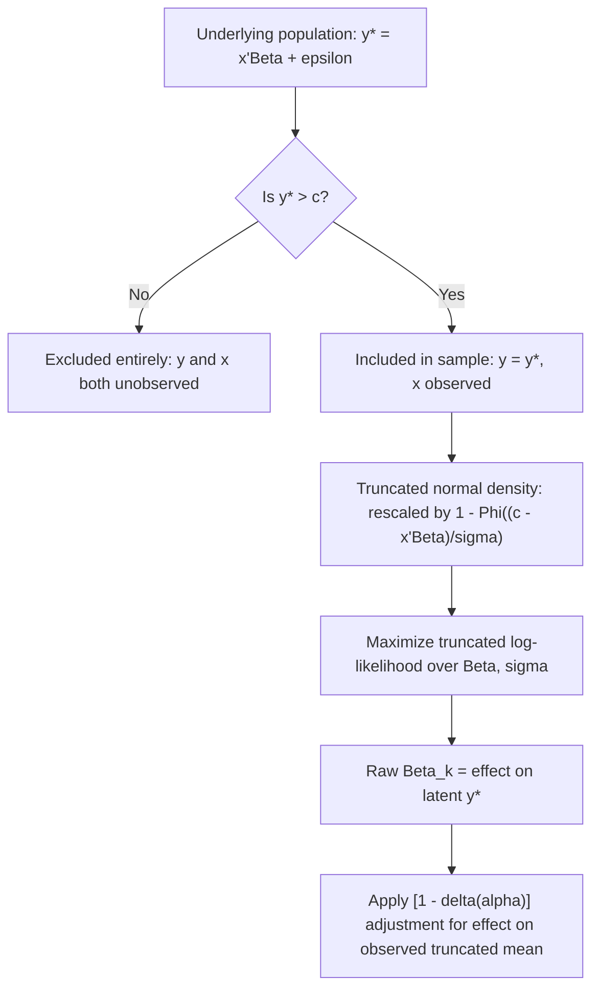

## Truncated Regression Models

### Overview

Truncated regression models are the maximum likelihood framework used when the sample itself is restricted to observations satisfying a threshold condition on the dependent variable, with all other observations — including their explanatory variable values — entirely absent from the data. This distinguishes truncated regression from Tobit-type censored regression, where the full sample is retained but extreme values of $y$ are recorded at a limit. Truncated regression directly models the conditional density of $y$ given that it lies within the observed (truncated) region.

### The Truncation Mechanism

Let $y_i^*$ be a latent variable generated by a standard linear model:

$$y_i^* = x_i'\beta + \varepsilon_i, \quad \varepsilon_i \sim N(0, \sigma^2)$$

Under truncation from below at a threshold $c$, the sample includes observation $i$ **only if** $y_i^* > c$:

$$\{(y_i, x_i)\}_{i \in \text{sample}} = \{(y_i^*, x_i) : y_i^* > c\}$$

**Key Points**

- Observations with $y_i^* \le c$ are not merely recoded — they, and their associated $x_i$ values, never appear in the dataset at all.
- The population from which the sample is drawn is itself a subpopulation of the full population of interest, defined by the truncation rule.
- Truncation can occur from below (left truncation), from above (right truncation), or both (double truncation), analogous to the censoring taxonomy but applied to sample inclusion rather than value recording.

### The Truncated Normal Density

Given that $y_i^* \sim N(x_i'\beta, \sigma^2)$, the distribution of $y_i$ conditional on $y_i^* > c$ is the truncated normal distribution, with density:

$$f(y_i \mid x_i, y_i > c) = \frac{\phi\left(\frac{y_i - x_i'\beta}{\sigma}\right)}{\sigma \left[1 - \Phi\left(\frac{c - x_i'\beta}{\sigma}\right)\right]}, \quad y_i > c$$

**Key Points**

- The numerator is the ordinary normal density; the denominator rescales this density so that it integrates to 1 over the truncated support $(c, \infty)$, since the untruncated normal density alone would integrate to less than 1 over this restricted range.
- This rescaling by $1 - \Phi\left(\frac{c - x_i'\beta}{\sigma}\right)$ (the probability of falling above $c$) is what makes the truncated density a valid probability density function on its restricted support.
- Unlike the Tobit likelihood, there is no discrete mass point in the truncated regression likelihood — the entire likelihood contribution for every observation is continuous, since by construction every observed $y_i$ satisfies $y_i > c$.

### The Log-Likelihood Function

The truncated regression model is estimated by maximizing:

$$\ln L(\beta, \sigma) = \sum_{i=1}^{N} \left[ -\ln \sigma + \ln \phi\left(\frac{y_i - x_i'\beta}{\sigma}\right) - \ln\left(1 - \Phi\left(\frac{c - x_i'\beta}{\sigma}\right)\right) \right]$$

where $N$ is the number of observations actually present in the truncated sample (not the size of the underlying, unobserved population).

**Key Points**

- The first two terms inside the summation are the standard normal log-likelihood contribution familiar from OLS/Gaussian MLE.
- The third term, $-\ln\left(1 - \Phi\left(\frac{c - x_i'\beta}{\sigma}\right)\right)$, is the truncation-correction term; it penalizes parameter values that would imply a low probability of $y_i^* > c$ for observation $i$, since such parameter values are inconsistent with observation $i$ having been selected into the sample in the first place.
- If this correction term is omitted (i.e., if one estimates a standard Gaussian regression on the truncated sample as if it were an ordinary complete sample), the resulting estimator is the naive OLS-on-truncated-sample estimator, which is inconsistent.

### Why OLS on a Truncated Sample Is Biased

Consider OLS estimated only on the observed (truncated) subsample. The conditional expectation of $y_i$ given $x_i$ and given $y_i^* > c$ is:

$$E[y_i \mid x_i, y_i^* > c] = x_i'\beta + \sigma \lambda(\alpha_i), \quad \alpha_i = \frac{c - x_i'\beta}{\sigma}, \quad \lambda(\alpha_i) = \frac{\phi(\alpha_i)}{1 - \Phi(\alpha_i)}$$

**Key Points**

- $\lambda(\alpha_i)$ is the inverse Mills ratio, and it is a nonlinear function of $x_i'\beta$ — it does not vanish and is not constant across observations.
- Regressing $y_i$ on $x_i$ using only the truncated sample effectively omits this $\sigma \lambda(\alpha_i)$ term, which is correlated with $x_i$ through $\alpha_i$'s dependence on $x_i'\beta$ — this is a textbook omitted-variable-bias problem, and it renders OLS inconsistent even asymptotically.
- [Inference] The direction of bias in truncated OLS regression is well established in the classical Gaussian case (typically toward zero/attenuation for the slope coefficients, since truncation compresses the effective variance of the error term conditional on inclusion), though the precise magnitude depends on the truncation point, the true parameters, and the distribution of $x$.
- The variance of $\varepsilon_i$ conditional on truncation is also smaller than $\sigma^2$ and varies systematically with $x_i'\beta$, meaning the truncated-sample residuals from a naive OLS regression will also tend to exhibit heteroskedasticity-like patterns even if $\varepsilon_i$ is homoskedastic in the underlying population.

### Marginal Effects in Truncated Regression

Because the truncated regression model is estimated on the restricted sample, care is needed in interpreting $\hat\beta$ depending on the quantity of interest:

**Effect on the latent variable:**

$$\frac{\partial E[y_i^* \mid x_i]}{\partial x_{ik}} = \beta_k$$

**Effect on the observed (truncated) conditional mean:**

$$\frac{\partial E[y_i \mid x_i, y_i^* > c]}{\partial x_{ik}} = \beta_k \left[1 - \delta(\alpha_i)\right], \quad \delta(\alpha_i) = \lambda(\alpha_i)\left[\lambda(\alpha_i) - \alpha_i\right]$$

**Key Points**

- $\delta(\alpha_i)$ lies strictly between 0 and 1 for the truncated normal, so the marginal effect on the observed truncated mean is always attenuated in magnitude relative to $\beta_k$, the effect on the latent variable.
- Unlike Tobit, there is no "extensive margin" component to decompose in truncated regression, since by construction every unit in a truncated sample already satisfies $y_i^* > c$ — there is no probability of crossing the threshold left to model within the sample itself.
- Reporting raw $\hat\beta_k$ from a truncated regression as if it directly answered "how does $x_k$ affect the value that will be observed" without applying the $[1-\delta(\alpha_i)]$ adjustment is a common misinterpretation.

### Relationship to Censored (Tobit) Regression

**Key Points**

- Truncated regression and Tobit regression applied to the *same* underlying censoring/truncation threshold will generally produce numerically different coefficient estimates, because Tobit exploits additional information: the number and covariate values of the observations at or below the threshold, which truncated regression discards entirely.
- [Inference] When the underlying data-generating process genuinely follows the Tobit assumptions (single-index censoring, normal, homoskedastic errors), Tobit is asymptotically more efficient than truncated regression on the corresponding truncated subsample, since it uses strictly more information (the censored observations) under a correctly specified common model.
- Truncated regression is the *only* appropriate ML approach when the researcher has no access to information on excluded units at all (true truncation, e.g., an administrative dataset that was constructed to include only qualifying records) — in that setting, Tobit cannot be estimated because the full-sample censored-mass-point information does not exist in the data.

### Relationship to Sample Selection

**Key Points**

- Classical truncated regression is a special case of the more general Heckman-style sample selection model in which the selection rule and the outcome equation are the *same* equation (selection determined by $y_i^* > c$ for the same $y^*$ that is the outcome of interest).
- The generalized sample selection model instead allows a *separate* selection equation, $z_i^* = w_i'\gamma + u_i$, with sample inclusion determined by $z_i^* > 0$, and permits the errors $u_i$ and $\varepsilon_i$ to be correlated ($\rho \ne 0$) but not necessarily identical.
- Estimating a pure truncated regression model when the true process involves a distinct selection mechanism (e.g., labor force participation driven by a reservation wage comparison, which is conceptually distinct from the wage equation itself) will generally misspecify the correction term and produce inconsistent estimates — the Heckman selection framework, not truncated regression, is appropriate in that setting.

### Model Diagram



### Implementation

**Example**

```plaintext
# R (truncreg package) — sketch of truncated regression estimation
library(truncreg)

trunc_model <- truncreg(wage ~ education + experience + age,
                         data = employed_only_df,
                         point = 0,      # truncation point
                         direction = "left")

summary(trunc_model)

# Stata equivalent:
# truncreg wage education experience age, ll(0)
```

**Key Points**

- Widely used implementations include R's `truncreg` package, Stata's `truncreg` command, and general-purpose maximum likelihood routines (e.g., custom likelihoods in `optim`, `bbmle`, or Python's `statsmodels`/`scipy.optimize`) for non-normal truncation distributions.
- [Note: behavior may vary by package version] Default conventions for specifying the truncation point and direction (left/right, inclusive/exclusive of the boundary) differ across packages and should be verified against current documentation before estimation.
- Standard errors from truncated regression ML are obtained from the inverse Hessian (or outer product of gradients) of the log-likelihood at convergence, exactly as in any other MLE setting — no special correction is needed beyond the usual asymptotic ML theory, in contrast to the two-step Heckman procedure, which requires a correction for generated-regressor uncertainty in its second stage.

### Distributional Sensitivity

**Key Points**

- As with Tobit, the truncated regression MLE is generally inconsistent under misspecification of the error distribution (non-normality) or under heteroskedasticity, since both violate the assumed truncated normal likelihood used for estimation.
- [Inference] This distributional dependence is often considered even more consequential for truncated regression than for Tobit, since truncated regression relies entirely on the shape of the assumed distribution in the excluded tail to correct for the missing observations, with no additional censored-mass-point information to anchor the estimates.
- Semi-parametric and distribution-free approaches to truncated regression exist in the literature (e.g., based on symmetric trimming or quantile methods) but are less commonly implemented in standard software relative to the mainstream ML normal-truncated approach.

### Common Pitfalls

**Key Points**

- Applying naive OLS to a truncated sample without any inverse-Mills-ratio-type correction, mistaking a converging numerical OLS result for a valid consistent estimate.
- Confusing truncated regression with Tobit/censored regression and using the wrong likelihood function, particularly when the researcher has (or believes they have) information on the excluded population — if any information on excluded units exists, Tobit-type censored regression using the full sample is generally preferable.
- Treating raw $\hat\beta_k$ as directly informative about the effect on the *observed* truncated conditional mean, without applying the $[1-\delta(\alpha_i)]$ marginal-effects adjustment.
- Applying classical truncated regression to a genuine sample-selection setting where the selection rule differs from the outcome equation, rather than using a Heckman-type model with a separate selection equation.
- Failing to check robustness to distributional assumptions, given that both non-normality and heteroskedasticity generally produce inconsistent truncated regression MLE estimates.

**Next Steps**

- The Tobit model and its relationship to truncated regression via the shared truncated-normal density
- Heckman two-step and full maximum likelihood sample selection models
- The inverse Mills ratio and its role across truncated, censored, and selection models
- Semi-parametric estimators for truncated and censored regression (Powell's CLAD, symmetric trimming methods)
- Duration/survival analysis models, where left-truncation (delayed entry) is a common feature of the data
- Panel data extensions of truncated and censored regression models