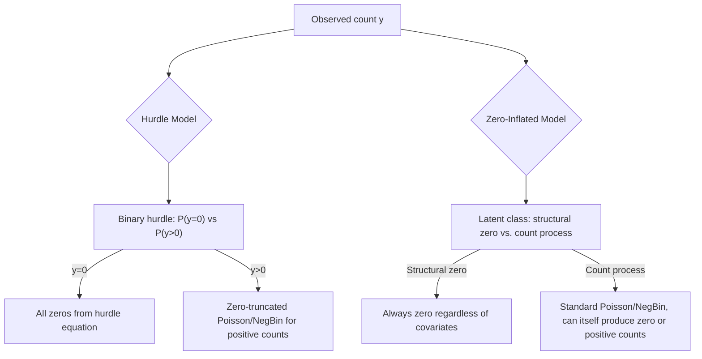

## Two-Part and Hurdle Models

### Overview

Two-part and hurdle models are a class of estimators for limited dependent variables in which the process determining whether an outcome is zero (or absent) is modeled separately from the process determining its value conditional on being nonzero. This directly relaxes the single-index restriction imposed by the Tobit model, which forces the same latent equation and coefficient vector to govern both the participation decision and the intensity decision. Two-part and hurdle models are widely used for corner-solution continuous outcomes (e.g., health expenditure) and for count outcomes with excess zeros (e.g., number of doctor visits, number of insurance claims).

### Motivation: The Tobit Restriction

**Key Points**

- The Tobit model assumes $y_i^* = x_i'\beta + \varepsilon_i$ governs both whether $y_i^* > 0$ (determining whether $y_i = 0$) and the magnitude of $y_i$ when positive, using the identical coefficient vector $\beta$ scaled only by $\sigma$.
- This is often economically implausible: the variables that determine *whether* a household purchases a durable good, or *whether* a patient visits a doctor at all, may have a different sign or relative magnitude of effect than the variables that determine *how much* is spent or *how many* visits occur, conditional on the decision to participate.
- Two-part and hurdle models relax this restriction by allowing entirely separate equations — potentially with different coefficients, different regressors, and even different distributional families — for the participation/hurdle stage and the intensity/count stage.

### The General Two-Part Model Structure

The two-part model specifies:

**Part 1 (participation/hurdle equation):** models $P(y_i > 0 \mid x_i)$, typically via a binary choice model:

$$P(y_i > 0 \mid x_i) = F(x_i'\gamma)$$

where $F(\cdot)$ is a probit or logit CDF.

**Part 2 (intensity equation):** models the distribution of $y_i$ conditional on $y_i > 0$:

$$f(y_i \mid x_i, y_i > 0) = g(y_i \mid x_i, \beta)$$

where $g(\cdot)$ is chosen appropriately for the outcome type (e.g., a lognormal or gamma density for continuous positive expenditure, a truncated-at-zero Poisson or negative binomial for count data).

The overall (unconditional) density combines the two parts multiplicatively:

$$f(y_i \mid x_i) = \begin{cases} 1 - F(x_i'\gamma) & \text{if } y_i = 0 \\ F(x_i'\gamma) \cdot g(y_i \mid x_i, \beta) & \text{if } y_i > 0 \end{cases}$$

**Key Points**

- Because the two parts are estimated separately (or jointly but multiplicatively, without shared parameters), the log-likelihood is additively separable: $\ln L = \ln L_{part1}(\gamma) + \ln L_{part2}(\beta)$, meaning the two parts can be estimated independently by separate maximum likelihood procedures without any loss of efficiency, unlike in models with cross-equation parameter restrictions.
- This additive separability is a key computational and practical advantage of the two-part model over Tobit and over sample selection models with correlated errors — no simultaneous estimation or correction terms (e.g., inverse Mills ratio) are required.
- Part 1 and Part 2 need not even use the same set of regressors $x_i$; different variables can be included in each equation based on economic reasoning about which factors drive participation versus intensity.

### Two-Part Model for Continuous Corner-Solution Outcomes

For continuous $y_i$ with a mass point at zero (e.g., health expenditure, charitable donations), a common specification is:

**Part 1**: Probit or logit for $P(y_i > 0 \mid x_i)$

**Part 2**: OLS (often on $\ln y_i$) or a Generalized Linear Model (GLM) with a log link, estimated only on the subsample with $y_i > 0$

**Example**

```plaintext
# R — sketch of two-part model for health expenditure
part1 <- glm(I(expenditure > 0) ~ age + income + insurance,
             family = binomial(link = "probit"), data = df)

part2 <- lm(log(expenditure) ~ age + income + insurance,
            data = subset(df, expenditure > 0))

# Predicted unconditional mean (with retransformation, e.g. Duan's smearing estimator)
prob_positive <- predict(part1, type = "response")
cond_mean_log <- predict(part2)
```

**Key Points**

- When Part 2 is estimated on $\ln y_i$, retransforming predictions back to the raw scale to compute $E[y_i \mid x_i]$ requires a correction (e.g., Duan's smearing estimator) because $E[\exp(\hat{u})] \ne \exp(E[\hat{u}])$ under non-normal or heteroskedastic residuals; naively exponentiating fitted log-values produces biased predictions of the level.
- The choice between OLS-on-log and a GLM with a log link (estimated via quasi-maximum likelihood, avoiding the need to log-transform $y$ directly) is a well-known modeling decision in the health economics literature, driven by concerns about heteroskedasticity and retransformation bias; [Inference] GLM-with-log-link approaches are often preferred in applied health economics specifically to avoid the retransformation problem inherent in the log-OLS approach, though the appropriate choice depends on the conditional variance structure of the data (tested via, e.g., the Park test).

### The Hurdle Model for Count Data

The hurdle model is the count-data analogue of the two-part model, most commonly built from Poisson or negative binomial components.

**Part 1 (hurdle/zero equation):** a binary model (often logit or probit) for whether the count crosses the "hurdle" of at least one occurrence:

$$P(y_i = 0 \mid x_i) = 1 - F(x_i'\gamma)$$

**Part 2 (truncated count equation):** a zero-truncated count distribution (zero-truncated Poisson or zero-truncated negative binomial) for the positive counts:

$$P(y_i = k \mid x_i, y_i > 0) = \frac{P(Y=k \mid x_i, \beta)}{1 - P(Y=0 \mid x_i, \beta)}, \quad k = 1, 2, 3, \dots$$

**Key Points**

- The hurdle model directly addresses "excess zeros" relative to a standard Poisson distribution: once the zero/positive decision is separated out, the truncated count distribution only needs to fit the shape of the positive counts, which is often much closer to Poisson or negative binomial than the raw (untruncated) data would suggest.
- Unlike the standard Poisson model, which restricts the mean to equal the variance, the hurdle model's flexibility in Part 1 can absorb substantial overdispersion arising specifically from an excess mass at zero, though a negative binomial Part 2 is still often used to address any remaining overdispersion among the positive counts themselves.
- The hurdle interpretation is explicitly two-stage in an economic sense: e.g., for doctor visits, Part 1 might represent the decision of whether to seek care at all, and Part 2 represents the number of visits conditional on having decided to seek care — two conceptually distinct behavioral processes.

### Hurdle Models vs. Zero-Inflated Models: A Critical Distinction

Hurdle models are frequently confused with **zero-inflated** models (zero-inflated Poisson, ZIP; zero-inflated negative binomial, ZINB), but the two have a fundamentally different structure for the zero observations.

**Key Points**

- In a **hurdle model**, all zeros come from a single source: the binary hurdle equation. Once $y_i > 0$ is determined, the count distribution is truncated at zero (cannot generate additional zeros).
- In a **zero-inflated model**, zeros can arise from *two* latent sources: a "structural" zero (from a degenerate point mass, e.g., individuals who would never visit a doctor regardless of covariates) and a "sampling" zero (a zero realization from the count process itself, e.g., someone who could visit a doctor but happened to have zero visits this period). The count component in ZIP/ZINB is a standard (non-truncated) Poisson or negative binomial, since it can still generate zeros.
- This distinction has substantive economic content: hurdle models are appropriate when there is a single behavioral threshold to cross, while zero-inflated models are appropriate when there are two conceptually distinct sub-populations (e.g., "never-users" vs. "users who happened to have zero events").
- The two model classes are not nested within each other in general and are typically compared using non-nested criteria (Vuong test, AIC, BIC) or based on which zero-generating story is more economically plausible for the application at hand.

### Model Diagram: Hurdle vs. Zero-Inflated



### Relationship to Tobit and Sample Selection

**Key Points**

- Two-part/hurdle models are not nested within Tobit: Tobit restricts Part 1 and Part 2 to share the same coefficients (up to scale $\sigma$), while the two-part model estimates them freely and separately, so a likelihood ratio test cannot directly compare them; researchers use non-nested tests or simply test the economic plausibility/fit of the shared-coefficient restriction.
- Unlike the Heckman sample selection model, the two-part model assumes the error terms in Part 1 and Part 2 are **independent** (no unobserved correlation between the participation decision and the intensity outcome); this is what permits the additively separable likelihood and separate estimation.
- If unobserved factors that drive participation are correlated with unobserved factors that drive intensity (e.g., unobserved health status affects both whether someone seeks care and how much care they need once they do), the two-part model's independence assumption is violated, and a Heckman-type selection model with a correlated error structure would be more appropriate.
- [Inference] The independence assumption is often viewed as a testable simplification rather than a universally defensible structural assumption; applied researchers frequently note this as a limitation and, where feasible, test sensitivity to allowing correlated errors via a selection model comparison.

### Estimation and Software

**Example**

```plaintext
# R (pscl and countreg packages) — hurdle and zero-inflated count models
library(pscl)

hurdle_model <- hurdle(visits ~ age + income + chronic_condition,
                        dist = "negbin", zero.dist = "binomial",
                        link = "logit", data = df)

zinb_model <- zeroinfl(visits ~ age + income + chronic_condition | age + income,
                        dist = "negbin", data = df)

summary(hurdle_model)
```

**Key Points**

- Widely used implementations include R's `pscl` and `countreg` packages (hurdle and zero-inflated Poisson/negative binomial), Stata's `hplogit`/`hnblogit` and `zip`/`zinb` commands, and Python's `statsmodels` (which includes zero-inflated Poisson and negative binomial via its discrete choice models module).
- For continuous two-part models, standard `glm` (for the binary part) and `lm`/`glm` (for the intensity part) in most statistical software suffice, since no specialized joint-estimation routine is required given the independence assumption.
- [Note: behavior may vary by package version] Some packages allow (and default to) different regressor sets for the count and zero components (as shown by the `|` separator syntax in `zeroinfl` above); verify the current syntax and defaults against package documentation before estimation.

### Interpreting Coefficients

**Key Points**

- Coefficients from Part 1 (the binary hurdle/participation equation) are interpreted exactly as in any standard probit/logit model: as effects on the probability of a positive/nonzero outcome, requiring the usual marginal-effects transformation for direct probability interpretation.
- Coefficients from Part 2 (the intensity/truncated-count equation) are interpreted as effects on the outcome *conditional on* being nonzero — they do not, by themselves, describe the unconditional (overall population) marginal effect.
- To obtain the overall marginal effect on $E[y_i \mid x_i]$ (unconditional on the zero/positive split), the two parts must be combined analogous to the Tobit McDonald-Moffitt decomposition: an extensive-margin term (change in probability of being positive) plus an intensive-margin term (change in the conditional mean given positive), each now driven by potentially different coefficients from the two separately estimated equations.
- This combined unconditional marginal effect is generally more complex to compute (and its standard errors more involved, often requiring the delta method or bootstrap) than in Tobit, precisely because the two-part model does not impose a single shared parameter vector that simplifies the decomposition.

### Common Pitfalls

**Key Points**

- Confusing hurdle models with zero-inflated models — they impose different assumptions about the source of zeros and are not interchangeable, despite superficially similar two-equation structures.
- Assuming independence between the participation and intensity error terms without considering whether unobserved confounders plausibly affect both stages; if such confounding is suspected, a correlated-error selection model is the more defensible choice.
- Exponentiating log-scale Part 2 predictions without a retransformation correction (e.g., Duan's smearing estimator), leading to biased predictions of the level of $y$.
- Reporting only Part 1 or only Part 2 coefficients as if they represented the full/unconditional effect of a regressor, rather than computing the combined marginal effect across both parts.
- Selecting between hurdle, zero-inflated, and standard count models purely by in-sample fit statistics without considering which zero-generating economic story is most plausible for the application.

**Next Steps**

- The Tobit model and its single-equation restriction relative to two-part models
- Zero-inflated Poisson and zero-inflated negative binomial models in full detail
- Heckman sample selection models with correlated participation/outcome errors
- Count data models: Poisson, negative binomial, and overdispersion diagnostics
- Duan's smearing estimator and other retransformation methods for log-linear models
- Marginal effects and delta-method standard errors in multi-equation limited dependent variable models