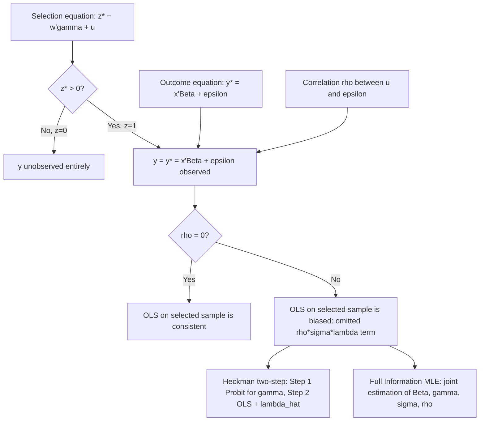

## Sample Selection and the Heckman Correction

### Overview

Sample selection bias arises when the process by which observations enter a sample is correlated with the unobserved determinants of the outcome variable itself, so that the observed subsample is not a random draw from the population of interest. Heckman's (1976, 1979) sample selection model — often called the Heckit model — provides a formal two-equation framework and a widely used two-step estimator to correct for this bias, building directly on the inverse-Mills-ratio machinery introduced in truncated and censored regression.

### The Sample Selection Problem

The canonical example is estimating a wage equation using only data on employed individuals. The wage of a non-working individual is not simply "low" or "zero" — it is genuinely unobserved, because the decision to work is itself driven by a comparison between the (unobserved) offered wage and a reservation wage. If the unobserved factors driving the decision to work (e.g., unobserved ability, health, or preference for leisure) are correlated with the unobserved factors driving the wage itself, then restricting the wage regression to workers only produces biased estimates of the wage equation's parameters.

**Key Points**

- Sample selection is distinct from simple truncation: in truncation, the same latent variable determines both sample inclusion and the outcome. In sample selection, a *separate* selection equation determines inclusion, and its error term may be correlated with the outcome equation's error term.
- The bias arises specifically because $E[\varepsilon_i \mid x_i, \text{selected}] \ne 0$ when the selection and outcome errors are correlated — this is a classic omitted-variable problem, where the omitted variable is the correlation-induced conditional expectation of the error term.
- Selection bias is pervasive beyond labor economics: it appears in studies of insurance claims (observing claims only from insured individuals who chose a policy), program evaluation (observing outcomes only for participants who chose to enroll), and international trade (observing prices only for firms that chose to export).

### The Two-Equation Model Structure

The Heckman model specifies two latent equations:

**Selection equation:**

$$z_i^* = w_i'\gamma + u_i, \qquad z_i = \mathbb{1}[z_i^* > 0]$$

**Outcome equation:**

$$y_i^* = x_i'\beta + \varepsilon_i$$

$y_i$ is observed **only when** $z_i = 1$:

$$y_i = \begin{cases} y_i^* & \text{if } z_i = 1 \\ \text{unobserved} & \text{if } z_i = 0 \end{cases}$$

The error terms are assumed to follow a bivariate normal distribution:

$$\begin{pmatrix} u_i \\ \varepsilon_i \end{pmatrix} \sim N\left( \begin{pmatrix} 0 \\ 0 \end{pmatrix}, \begin{pmatrix} 1 & \rho\sigma_\varepsilon \\ \rho\sigma_\varepsilon & \sigma_\varepsilon^2 \end{pmatrix} \right)$$

**Key Points**

- $u_i$ is normalized to have unit variance because only the sign of $z_i^*$ is observed (it is a probit-type latent index), so its scale is not separately identified — this mirrors the scale normalization in standard probit models.
- $\rho$ is the correlation between the selection and outcome errors; $\rho \ne 0$ is precisely what generates sample selection bias.
- If $\rho = 0$, the selection and outcome processes are independent, and OLS on the selected subsample would be consistent — the Heckman correction becomes unnecessary, though generally harmless, in that special case.
- The classical truncated regression model (see "Truncated regression models") is the special case where $z_i^* = y_i^*$ exactly (i.e., $w_i = x_i$, $\gamma = \beta$, $u_i = \varepsilon_i/\sigma_\varepsilon$, and $\rho = 1$) — Heckman's model strictly generalizes it by allowing the selection rule to be a distinct process.

### The Source of Bias: Conditional Expectation of the Error

Given the bivariate normality assumption, the conditional expectation of the outcome error given selection is:

$$E[\varepsilon_i \mid z_i = 1, w_i] = E[\varepsilon_i \mid u_i > -w_i'\gamma] = \rho \sigma_\varepsilon \lambda(w_i'\gamma)$$

where $\lambda(w_i'\gamma) = \frac{\phi(w_i'\gamma)}{\Phi(w_i'\gamma)}$ is the inverse Mills ratio evaluated at the selection index.

Therefore, the conditional expectation of the outcome variable for the selected subsample is:

$$E[y_i \mid x_i, z_i = 1] = x_i'\beta + \rho\sigma_\varepsilon \lambda(w_i'\gamma)$$

**Key Points**

- This equation shows precisely why OLS on the selected subsample is biased: the true conditional mean includes the additional term $\rho\sigma_\varepsilon \lambda(w_i'\gamma)$, which is omitted by standard OLS.
- If $\lambda(w_i'\gamma)$ is correlated with $x_i$ (which it generally is, especially if $w_i$ and $x_i$ share common variables), this omission produces the classic omitted-variable bias in $\hat\beta$.
- The magnitude and even the sign of the bias depend on the sign of $\rho$ and the correlation structure between $x_i$ and $w_i'\gamma$; the bias does not have a universally fixed direction, unlike some special cases of Tobit or truncated regression bias.

### The Heckman Two-Step Estimator

Heckman's two-step (also called "Heckit" or the limited-information estimator) proceeds as follows:

**Steps**

1. Estimate the selection equation by probit MLE using the full sample (both selected and non-selected observations, since $z_i$ is observed for everyone): $\hat\gamma$.
2. Compute the estimated inverse Mills ratio for each selected observation: $\hat\lambda_i = \phi(w_i'\hat\gamma)/\Phi(w_i'\hat\gamma)$.
3. Estimate the outcome equation by OLS on the selected subsample only, including $\hat\lambda_i$ as an additional regressor:


   $$y_i = x_i'\beta + \rho\sigma_\varepsilon \hat\lambda_i + \text{error}_i, \quad \text{for } i \text{ with } z_i = 1$$
4. Correct the standard errors from Step 3 to account for the fact that $\hat\lambda_i$ is a generated regressor estimated with sampling error from Step 1.

**Key Points**

- The coefficient on $\hat\lambda_i$ in Step 3 is a direct estimate of $\rho\sigma_\varepsilon$; a statistically significant coefficient on $\hat\lambda_i$ is evidence of selection bias (equivalent to testing $\rho = 0$).
- Because $\hat\lambda_i$ is a generated regressor, standard OLS standard errors from Step 3 are incorrect (understated); appropriate standard errors require either the Murphy-Topel correction, an analytical formula accounting for the two-step estimation, or a bootstrap procedure resampling both steps jointly.
- Heckman's two-step estimator is consistent but not efficient relative to full information maximum likelihood, since it does not use the full joint likelihood of $(z_i, y_i)$.
- [Inference] The two-step estimator remains widely taught and used because of its computational simplicity and transparency (the significance of $\hat\lambda_i$ provides a direct, interpretable selection-bias diagnostic), even though full maximum likelihood is generally considered more efficient when computationally feasible.

### Full Information Maximum Likelihood (FIML)

An alternative to the two-step procedure is joint estimation of $\beta$, $\gamma$, $\sigma_\varepsilon$, and $\rho$ by maximizing the full likelihood implied by the bivariate normal structure directly. The likelihood for the selected observations combines the marginal density of $y_i$ with the conditional probability of selection given $y_i$; for non-selected observations, only the marginal probability of non-selection, $\Phi(-w_i'\gamma)$, contributes.

**Key Points**

- FIML is asymptotically more efficient than the two-step estimator when the model is correctly specified, since it uses the joint distributional assumption directly rather than a two-stage plug-in approach.
- FIML avoids the generated-regressor standard error problem inherent in the two-step method, since all parameters are estimated simultaneously within a single likelihood.
- [Inference] In modern applied practice, FIML (often labeled simply "heckman" in software, as opposed to "heckman twostep") is generally recommended over the two-step estimator when computational convergence is not an issue, though the two-step method remains valuable diagnostically and as a robustness check.

### Identification: The Exclusion Restriction

**Key Points**

- The model is technically identified even if $w_i = x_i$ exactly, but only through the nonlinearity of the inverse Mills ratio $\lambda(w_i'\gamma)$ — this is called identification "by functional form alone."
- Identification by functional form alone is widely regarded as fragile: if $w_i'\gamma$ happens to be in a region where $\lambda(\cdot)$ is nearly linear, $\hat\lambda_i$ becomes highly collinear with $x_i'\beta$, producing unstable, imprecisely estimated coefficients.
- The preferred and much more robust identification strategy is an **exclusion restriction**: including at least one variable in $w_i$ (the selection equation) that plausibly affects the selection decision but does not directly affect the outcome equation, so that $w_i$ is not a strict subset of $x_i$.
- A classic exclusion restriction example in labor supply/wage models is the presence of young children in the household (or other non-labor income), argued to affect the decision to work but not the wage rate offered conditional on working — though [Inference] the validity of any specific exclusion restriction is a substantive economic argument, not a statistical guarantee, and is often contested in applied literature.
- Weak or invalid exclusion restrictions can produce results that are highly sensitive to specification, which is one of the most common practical critiques of applied Heckman selection studies.

### Model Diagram



### Implementation

**Example**

```plaintext
# R (sampleSelection package) — Heckman two-step and FIML
library(sampleSelection)

heckit_2step <- selection(
  selection = worked ~ age + education + kids_under_6,   # exclusion restriction: kids_under_6
  outcome   = log(wage) ~ age + education,
  data = labor_df,
  method = "2step"
)

heckit_mle <- selection(
  selection = worked ~ age + education + kids_under_6,
  outcome   = log(wage) ~ age + education,
  data = labor_df,
  method = "ml"
)

summary(heckit_mle)

# Stata equivalent:
# heckman logwage age education, select(worked = age education kids_under_6)
```

**Key Points**

- Widely used implementations include Stata's `heckman` command (supporting both `twostep` and default ML options), R's `sampleSelection` package, and Python's `statsmodels` (via manual construction) or specialized packages.
- Output typically reports $\hat\rho$, $\hat\sigma_\varepsilon$, and their product (sometimes labeled "lambda" or "mills" in two-step output) directly, along with a test of $\rho = 0$ (or equivalently, of the significance of the Mills ratio coefficient), which serves as the standard diagnostic for whether selection correction was needed at all.
- [Note: behavior may vary by package and version] Exact output labels, default standard error corrections, and convergence algorithms differ across software; verify current documentation, especially regarding which standard error correction (analytical vs. bootstrap) is applied by default in the two-step mode.

### Extensions and Related Models

**Key Points**

- **Endogenous switching regression models** generalize the Heckman framework further by allowing entirely different outcome equations (different $\beta$ vectors) depending on the value of $z_i$, rather than treating $z_i = 0$ as simply "unobserved."
- **Panel data selection models** extend the framework to account for selection that may vary over time within the same individual (e.g., attrition in longitudinal surveys), requiring more complex assumptions about the joint distribution of selection and outcome errors across periods.
- **Semi-parametric selection models** (e.g., based on the work of Ahn and Powell, or series estimators for the selection correction term) relax the bivariate normality assumption, which is otherwise critical to both the two-step and FIML Heckman estimators.
- [Inference] Given the well-documented sensitivity of Heckman-type estimates to both the normality assumption and the validity of exclusion restrictions, applied researchers are often encouraged to report the naive OLS-on-selected-sample result alongside the Heckman-corrected result and to conduct sensitivity analysis across alternative exclusion restrictions where feasible, though there is no universal consensus procedure for this robustness reporting in the literature.

### Common Pitfalls

**Key Points**

- Relying on identification "by functional form alone" (no genuine exclusion restriction) and treating the resulting estimates as robust, when in fact they may be highly sensitive to the specific parametric assumptions.
- Using OLS standard errors on the second-stage regression of the two-step estimator without correcting for the generated-regressor problem introduced by using $\hat\lambda_i$ in place of the true, unobserved $\lambda_i$.
- Failing to test $\rho = 0$ (via the significance of the Mills ratio coefficient, or a direct Wald/LR test under FIML) before concluding that selection correction was necessary — if $\rho$ is statistically indistinguishable from zero, the simpler OLS-on-selected-sample estimate may be preferable on efficiency grounds.
- Choosing an exclusion restriction based on statistical convenience (e.g., "it's available in the data and correlates with selection") rather than a genuine economic argument for its exclusion from the outcome equation.
- Assuming bivariate normality of the errors without considering the sensitivity of results to this assumption, given that both the two-step and FIML Heckman estimators are generally inconsistent under non-normality.

**Next Steps**

- Truncated regression models as the special case with an identical selection and outcome equation
- Endogenous switching regression models
- Semi-parametric and distribution-free approaches to sample selection correction
- Panel data models with selection and attrition
- Instrumental variables and the connection between exclusion restrictions in selection models and IV validity arguments
- Program evaluation methods (matching, difference-in-differences) as alternatives to parametric selection correction