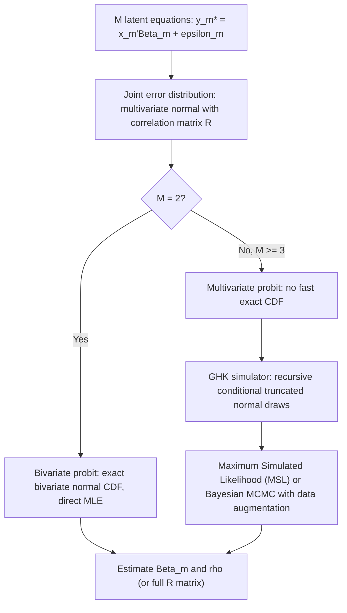

## Bivariate and Multivariate Probit Models


### Overview

Bivariate and multivariate probit models extend the standard probit framework to settings with two or more correlated binary outcomes, allowing the researcher to model the joint distribution of multiple binary dependent variables rather than estimating separate univariate probit models for each. This is essential whenever the unobserved factors driving multiple binary decisions are correlated — for example, a household's joint decisions to own a car and to own a home, or a patient's joint diagnoses of multiple correlated conditions.

### Motivation: Why Not Separate Univariate Probits?

**Key Points**

- Estimating separate univariate probit models for each binary outcome implicitly assumes the error terms across the equations are uncorrelated (independent), which discards potentially useful information and can produce inefficient (though still consistent, under correct marginal specification) estimates of each equation's own coefficients.
- More importantly, many quantities of substantive interest — such as the joint probability that both outcomes equal 1, or the correlation between the two underlying latent propensities — simply cannot be recovered from separate univariate probits at all, regardless of efficiency considerations.
- If the binary outcomes are related through a recursive/simultaneous structure (one outcome causally affects another), separate univariate probits can also produce inconsistent estimates due to endogeneity, which the multivariate framework can address in specific recursive formulations.

### The Bivariate Probit Model

The bivariate probit model specifies two latent equations:

$$y_{1i}^* = x_{1i}'\beta_1 + \varepsilon_{1i}, \qquad y_{1i} = \mathbb{1}[y_{1i}^* > 0]$$


$$y_{2i}^* = x_{2i}'\beta_2 + \varepsilon_{2i}, \qquad y_{2i} = \mathbb{1}[y_{2i}^* > 0]$$

with the error terms jointly distributed as bivariate standard normal:

$$\begin{pmatrix} \varepsilon_{1i} \\ \varepsilon_{2i} \end{pmatrix} \sim N\left( \begin{pmatrix} 0 \\ 0 \end{pmatrix}, \begin{pmatrix} 1 & \rho \\ \rho & 1 \end{pmatrix} \right)$$

**Key Points**

- Both error variances are normalized to 1, exactly as in univariate probit, since only the sign of each latent variable is observed and the scale is not separately identified.
- $\rho$ is the single correlation parameter between the two equations' unobserved determinants; $\rho = 0$ recovers two independent univariate probit models exactly.
- $x_{1i}$ and $x_{2i}$ may overlap partially, be identical, or be entirely distinct sets of regressors, depending on the application.

### The Joint Likelihood

The bivariate probit likelihood requires the joint CDF of the bivariate normal distribution, $\Phi_2(\cdot, \cdot; \rho)$. The four possible outcome combinations have probabilities:

$$P(y_{1i}=1, y_{2i}=1) = \Phi_2(x_{1i}'\beta_1, x_{2i}'\beta_2; \rho)$$


$$P(y_{1i}=1, y_{2i}=0) = \Phi_1(x_{1i}'\beta_1) - \Phi_2(x_{1i}'\beta_1, x_{2i}'\beta_2; \rho)$$


$$P(y_{1i}=0, y_{2i}=1) = \Phi_1(x_{2i}'\beta_2) - \Phi_2(x_{1i}'\beta_1, x_{2i}'\beta_2; \rho)$$


$$P(y_{1i}=0, y_{2i}=0) = 1 - \Phi_1(x_{1i}'\beta_1) - \Phi_1(x_{2i}'\beta_2) + \Phi_2(x_{1i}'\beta_1, x_{2i}'\beta_2; \rho)$$

The log-likelihood sums the log of the appropriate probability across all observations, and $(\beta_1, \beta_2, \rho)$ are estimated jointly by maximum likelihood.

**Key Points**

- $\Phi_2(a, b; \rho)$, the bivariate normal CDF, does not have a closed-form analytical expression and must be evaluated numerically (e.g., via Gauss-Hermite quadrature, the algorithm of Drezner and Wesolowsky, or similar numerical integration routines built into standard software).
- Because a closed-form bivariate normal CDF exists in the sense of being numerically well-approximated by fast, accurate algorithms (unlike higher-dimensional cases), the bivariate probit model can be estimated efficiently by full information maximum likelihood in virtually all standard software without resorting to simulation.
- The four joint probabilities above must each lie in $[0,1]$ and sum to 1 by construction, providing an internal consistency check on the estimated model.

### Interpreting the Correlation Parameter $\rho$

**Key Points**

- A statistically significant $\hat\rho \ne 0$ indicates that unobserved factors influencing the two binary outcomes are correlated, beyond what is explained by the observed regressors $x_{1i}$ and $x_{2i}$.
- $\hat\rho > 0$ indicates positive correlation in unobserved propensities (e.g., unobserved factors that make outcome 1 more likely also tend to make outcome 2 more likely); $\hat\rho < 0$ indicates the reverse.
- A likelihood ratio test comparing the bivariate probit log-likelihood to the sum of the two separate univariate probit log-likelihoods (equivalent to testing $H_0: \rho = 0$) is the standard formal test of whether joint modeling is statistically warranted.
- [Inference] Even when $\hat\rho$ is not statistically significant, some researchers still prefer to report the bivariate specification when the joint probability of both outcomes (or their correlation) is itself a quantity of substantive economic interest, since the bivariate model nests independence as a special case and does not impose a cost in terms of consistency.

### Recursive (Simultaneous) Bivariate Probit

A common extension allows one binary outcome to appear as a regressor in the other equation, creating a recursive structure:

$$y_{1i}^* = x_{1i}'\beta_1 + \alpha y_{2i} + \varepsilon_{1i}$$


$$y_{2i}^* = x_{2i}'\beta_2 + \varepsilon_{2i}$$

**Key Points**

- This recursive structure is used to model situations where one binary decision is believed to causally influence another (e.g., whether a firm exports affects whether it innovates, holding other factors fixed).
- If $\varepsilon_{1i}$ and $\varepsilon_{2i}$ are correlated ($\rho \ne 0$), treating $y_{2i}$ as an ordinary exogenous regressor in a univariate probit for $y_{1i}$ produces inconsistent estimates of $\alpha$, analogous to the endogeneity problem in linear simultaneous equations models — this recursive bivariate probit framework corrects for that endogeneity under the joint normality assumption.
- Identification of $\alpha$ in the recursive model, especially when $x_{1i}$ and $x_{2i}$ overlap substantially, benefits from an exclusion restriction (a variable in $x_{2i}$ that is excluded from $x_{1i}$), analogous to the identification concerns in the Heckman selection model — [Inference] though some literature notes the recursive bivariate probit can be identified even without an exclusion restriction due to the nonlinearity of the probit functional form, this identification-by-functional-form-alone is similarly considered fragile in practice.

### The Multivariate Probit Model

The multivariate probit model generalizes the bivariate case to $M > 2$ correlated binary outcomes:

$$y_{mi}^* = x_{mi}'\beta_m + \varepsilon_{mi}, \qquad y_{mi} = \mathbb{1}[y_{mi}^* > 0], \qquad m = 1, \dots, M$$

with the full error vector $(\varepsilon_{1i}, \dots, \varepsilon_{Mi})'$ jointly distributed as multivariate standard normal with an $M \times M$ correlation matrix $R$ (unit diagonal, off-diagonal elements $\rho_{jk}$ to be estimated).

**Key Points**

- The number of free correlation parameters grows as $M(M-1)/2$, so even moderate $M$ (e.g., $M=5$ gives 10 correlation parameters) substantially increases the dimensionality of the estimation problem.
- Evaluating the exact likelihood requires the $M$-dimensional multivariate normal CDF, which — unlike the bivariate case — has no fast, exact numerical evaluation method for $M \ge 3$ or 4 in general; this makes direct maximum likelihood computationally prohibitive for larger $M$.
- Estimation of the multivariate probit model therefore typically relies on **simulation-based methods**, most commonly the GHK (Geweke-Hajivassiliou-Keane) simulator, which simulates draws from the multivariate normal distribution via a sequence of conditional univariate truncated normal draws, enabling Maximum Simulated Likelihood (MSL) estimation analogous to the simulation methods used in mixed logit.

### The GHK Simulator

**Key Points**

- The GHK simulator recursively factors the joint probability of the observed outcome pattern into a product of univariate conditional probabilities, using a Cholesky decomposition of the correlation matrix $R$ and simulating each successive error term from its truncated conditional normal distribution given the previous draws.
- This recursive, conditionally-truncated simulation approach is substantially more efficient (lower simulation variance for a given number of draws) than naive accept-reject simulation of the multivariate normal CDF, which is why GHK became the standard simulator for multivariate probit estimation.
- As with mixed logit, quasi-random (e.g., Halton) sequences are commonly used within the GHK simulator to further improve simulation efficiency relative to pseudo-random draws.
- [Inference] Bayesian estimation via Markov Chain Monte Carlo (MCMC), using data augmentation to sample the latent $y_{mi}^*$ values directly, is also widely used as a computationally attractive alternative to simulated maximum likelihood for multivariate probit models, particularly as $M$ grows large, since Gibbs sampling with data augmentation avoids direct high-dimensional numerical integration altogether.

### Model Diagram



### Implementation

**Example**

```plaintext
# R (mvProbit or Zelig / bivariate: VGAM) — sketch of bivariate and multivariate probit
library(mvProbit)

biv_model <- mvProbit(cbind(owns_car, owns_home) ~ income + age + family_size,
                       data = household_df)

summary(biv_model)

# Stata equivalent for bivariate probit:
# biprobit (owns_car = income age family_size) (owns_home = income age family_size)

# Stata equivalent for recursive bivariate probit:
# biprobit y1 y2 x1 x2, ...  (with y2 included as regressor in y1 equation)
```

**Key Points**

- Widely used implementations include Stata's `biprobit` (bivariate) and `mvprobit` (multivariate, via GHK simulation) commands, R's `mvProbit` package, and Python's `statsmodels` or custom GHK implementations for larger $M$.
- [Note: behavior may vary by package version] The number of GHK simulation draws, draw type, and optimization algorithm defaults differ across packages and should be checked against current documentation; results should be checked for sensitivity to the number of simulation draws, as with any simulated maximum likelihood procedure.
- For genuinely large $M$ (many correlated binary outcomes), [Inference] Bayesian MCMC approaches are often considered more computationally tractable than frequentist simulated maximum likelihood, though the choice between the two frameworks also depends on the researcher's preference for a Bayesian versus frequentist inferential framework more broadly.

### Relationship to Other Models

**Key Points**

- The bivariate/multivariate probit model is structurally related to the multinomial probit model (used for unordered multi-category choice), since both rely on evaluating multivariate normal probabilities and both use the GHK simulator for $M \ge 3$ alternatives/outcomes; the key conceptual difference is that multivariate probit models $M$ separate binary decisions, while multinomial probit models a single choice among $M$ mutually exclusive alternatives.
- The recursive bivariate probit is closely related in spirit to the Heckman selection model: both address endogeneity/correlation between two jointly determined processes under a joint normality assumption, though Heckman's model has a continuous outcome equation while recursive bivariate probit has a second binary outcome equation.
- Seemingly Unrelated Regression (SUR) is the linear-model analogue of multivariate probit: SUR models correlated continuous outcomes via a similarly structured correlated-error system, but without the need for simulation, since the linear/normal joint likelihood is fully closed-form.

### Common Pitfalls

**Key Points**

- Estimating separate univariate probits when the joint probability of outcomes or the correlation between them is itself of interest — this quantity is simply unavailable from separate models regardless of how well each marginal model fits.
- Treating a second binary outcome as an ordinary exogenous regressor in a recursive structure without accounting for the correlation between error terms, producing inconsistent estimates of the causal parameter $\alpha$.
- Attempting exact (non-simulated) maximum likelihood for multivariate probit with $M \ge 3$ using naive numerical integration, which becomes computationally infeasible as $M$ grows — simulation-based methods (GHK) or Bayesian MCMC are the standard practical alternatives.
- Failing to check simulation-draw sensitivity (number and type of draws) when using GHK-based simulated maximum likelihood, analogous to the same concern in mixed logit estimation.
- Assuming joint normality of the error terms without considering whether this distributional assumption is appropriate for the specific application, since — as with other latent-normal-index models — misspecification of the error distribution generally produces inconsistent estimates.

**Next Steps**

- Multinomial probit models for unordered multi-category choice
- The Heckman sample selection model and its relationship to recursive bivariate probit
- The GHK simulator in full technical detail, including the Cholesky factorization step
- Seemingly Unrelated Regression (SUR) as the linear analogue for continuous correlated outcomes
- Bayesian estimation via Gibbs sampling and data augmentation for latent variable models
- Panel probit models with correlated errors across time periods