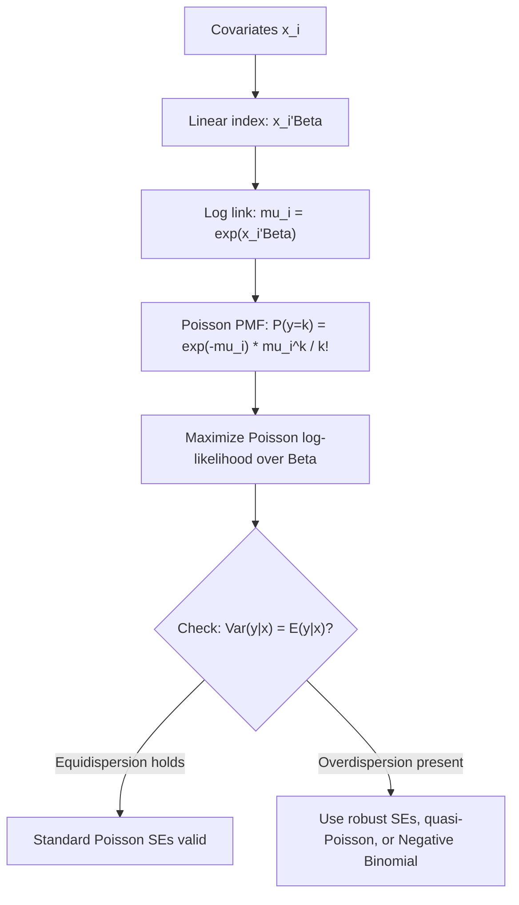

## Poisson Regression

### Overview

Poisson regression is the foundational econometric model for count-dependent variables — outcomes that take non-negative integer values representing the number of times an event occurs (e.g., number of patents filed, number of insurance claims, number of doctor visits, number of trade transactions). It applies the Poisson distribution's probability mass function within a generalized linear model framework, linking the conditional mean of the count to a set of explanatory variables through an exponential (log-linear) function.

### The Poisson Distribution

A random variable $Y$ follows a Poisson distribution with parameter $\mu > 0$ if:

$$P(Y = y) = \frac{e^{-\mu} \mu^y}{y!}, \quad y = 0, 1, 2, \dots$$

**Key Points**

- The Poisson distribution has the defining property that its mean and variance are equal: $E[Y] = \text{Var}(Y) = \mu$. This is called **equidispersion**.
- The Poisson distribution arises theoretically as the limiting distribution of a Binomial$(n, p)$ random variable as $n \to \infty$ and $p \to 0$ with $np = \mu$ held fixed, and also as the count of events in a fixed interval under a Poisson process with constant event rate.
- $\mu$ is both the mean and the single parameter governing the entire distribution, which is why regression models for count data focus on modeling $\mu$ as a function of covariates.

### The Poisson Regression Model

The Poisson regression model specifies the conditional mean of the count $y_i$ as an exponential function of a linear index of covariates:

$$E[y_i \mid x_i] = \mu_i = \exp(x_i'\beta)$$

so that the conditional probability mass function is:

$$P(y_i = y \mid x_i) = \frac{e^{-\mu_i} \mu_i^{y}}{y!}, \quad \mu_i = \exp(x_i'\beta)$$

**Key Points**

- The exponential (log-link) functional form guarantees $\mu_i > 0$ for any value of $x_i'\beta$, which is essential since a count's expected value cannot be negative — this is the count-data analogue of using a CDF link function to bound probabilities in binary choice models.
- The log-link also gives the model a convenient multiplicative interpretation: $\ln \mu_i = x_i'\beta$, so $\beta_k$ represents the effect of $x_k$ on the **log** of the expected count.
- The Poisson regression model belongs to the exponential family and is a canonical example of a Generalized Linear Model (GLM), fitting within the broader GLM estimation framework alongside logistic and other regression models.

### Maximum Likelihood Estimation

The log-likelihood function for a sample of $N$ independent observations is:

$$\ln L(\beta) = \sum_{i=1}^{N} \left[ -\exp(x_i'\beta) + y_i (x_i'\beta) - \ln(y_i!) \right]$$

**Key Points**

- The Poisson log-likelihood is globally concave in $\beta$, which generally ensures reliable convergence to a unique maximum using standard Newton-Raphson or iteratively reweighted least squares (IRLS) algorithms, as is standard for GLM estimation.
- The first-order conditions from maximizing this log-likelihood are equivalent to the moment condition $\sum_i (y_i - \exp(x_i'\beta)) x_i = 0$, which shows that Poisson MLE is a special case of a broader class of estimators that only require correct specification of the *conditional mean* function, not the full distribution — this underlies the quasi-MLE robustness property discussed below.
- Because the first-order conditions depend only on correctly specifying $E[y_i \mid x_i] = \exp(x_i'\beta)$, the Poisson MLE point estimates of $\beta$ remain **consistent** even if the true data-generating process is not Poisson-distributed, as long as the conditional mean is correctly specified — this is the basis for treating Poisson regression as a quasi-maximum likelihood (QMLE) or pseudo-maximum likelihood estimator, widely used even for non-count, non-negative continuous data in some applications.

### Interpreting Coefficients: Incidence Rate Ratios

Because $\ln \mu_i = x_i'\beta$, the coefficient $\beta_k$ represents a semi-elasticity: a one-unit increase in $x_k$ is associated with a $(\beta_k \times 100)\%$ approximate change in the expected count, holding other regressors fixed (exact for small $\beta_k$; the exact multiplicative effect is $e^{\beta_k}$).

**Key Points**

- $e^{\beta_k}$ is commonly reported as the **Incidence Rate Ratio (IRR)**: the multiplicative factor by which the expected count changes for a one-unit increase in $x_k$.
- An IRR of 1 corresponds to $\beta_k = 0$ (no effect); an IRR of 1.20 indicates a 20% increase in the expected count per one-unit increase in $x_k$; an IRR of 0.85 indicates a 15% decrease.
- For a marginal (rather than discrete unit) change, the marginal effect on the level of $\mu_i$ is $\frac{\partial \mu_i}{\partial x_{ik}} = \beta_k \exp(x_i'\beta) = \beta_k \mu_i$, which — unlike the coefficient itself — varies across observations depending on $x_i$, exactly analogous to marginal effects in probit/logit models.

### The Exposure/Offset Term

In many applications, counts are naturally generated over varying periods of time, geographic areas, or population sizes (e.g., number of accidents per highway segment of differing length, number of disease cases per city of differing population). The **offset** (or exposure) term adjusts for this:

$$E[y_i \mid x_i] = t_i \exp(x_i'\beta) \quad \Longleftrightarrow \quad \ln \mu_i = \ln t_i + x_i'\beta$$

**Key Points**

- $\ln t_i$ is included in the linear index with its coefficient constrained to exactly 1, distinguishing an offset from an ordinary control variable (which would have its coefficient freely estimated).
- Omitting a necessary offset term when exposure genuinely varies across observations is a specification error: it implicitly assumes all observations have the same exposure/opportunity for the event to occur, which is often substantively false and biases the remaining coefficients if exposure is correlated with the included regressors.
- Nearly all standard statistical software supports a dedicated "offset" argument in Poisson (and negative binomial) regression commands, distinct from including $\ln t_i$ as an ordinary covariate.

### The Equidispersion Assumption and Its Failure

**Key Points**

- The Poisson model's restriction $\text{Var}(y_i \mid x_i) = E[y_i \mid x_i]$ is a strong and often empirically violated assumption in real count data.
- **Overdispersion** (the empirically far more common case), where $\text{Var}(y_i \mid x_i) > E[y_i \mid x_i]$, typically arises from unobserved heterogeneity across individuals that the included covariates do not capture, or from positive correlation among the events being counted (violating the independence assumption underlying the Poisson process).
- **Underdispersion**, where $\text{Var}(y_i \mid x_i) < E[y_i \mid x_i]$, is less common in economic applications but can arise in specific contexts (e.g., counts subject to a strict, nearly deterministic upper limit or scheduling constraint).
- Overdispersion does not bias the Poisson MLE point estimates of $\beta$ (consistency is preserved via the QMLE property above, as long as the conditional mean is correctly specified), but it does invalidate the standard Poisson MLE standard errors, since these are derived under the assumption that $\text{Var}(y_i) = \mu_i$ exactly — under overdispersion, standard Poisson standard errors are too small, leading to overstated statistical significance.

### Correcting for Overdispersion: Robust and Quasi-Poisson Standard Errors

**Key Points**

- The simplest correction is to use **robust (sandwich) standard errors**, which do not require correct specification of the variance function beyond the correctly specified conditional mean, and remain valid under arbitrary forms of overdispersion (or even underdispersion).
- An alternative is the **quasi-Poisson** approach, which introduces a single dispersion parameter $\phi$ such that $\text{Var}(y_i \mid x_i) = \phi \mu_i$ (with $\phi > 1$ indicating overdispersion), estimated from the Pearson chi-squared statistic divided by the residual degrees of freedom, and used to scale up the naive Poisson standard errors uniformly.
- [Inference] Robust sandwich standard errors are generally considered more flexible than the quasi-Poisson scalar correction, since they do not impose a specific parametric relationship (like the fixed linear-in-mean form assumed by quasi-Poisson) between the mean and variance, though both are common in applied practice and often yield similar results.
- Neither correction changes the point estimates of $\beta$ — both operate purely on the standard errors, leaving the (already consistent, under correct mean specification) coefficient estimates unchanged.

### The Negative Binomial Alternative

When overdispersion is substantial, the **negative binomial regression model** is frequently used as a fully parametric alternative that explicitly models the extra variance (rather than merely correcting standard errors post hoc), typically by introducing a gamma-distributed individual-specific unobserved heterogeneity term into the Poisson mean. This model is covered in depth as a separate topic in this chapter; the key relationship to note here is:

**Key Points**

- The negative binomial model nests the Poisson model as the limiting special case where the overdispersion parameter approaches zero, allowing a direct likelihood ratio test of Poisson against negative binomial.
- Unlike the robust-standard-error or quasi-Poisson corrections, negative binomial regression changes the likelihood function itself, and can in principle yield different point estimates of $\beta$ from Poisson MLE, though [Inference] in well-specified models the two are often similar in practice, with the larger practical difference typically appearing in the standard errors and in predicted probabilities for specific count values.

### Diagnosing Overdispersion

**Key Points**

- A common informal diagnostic is comparing the Pearson chi-squared statistic (or deviance) to its degrees of freedom: a ratio substantially greater than 1 suggests overdispersion.
- A formal test (Cameron and Trivedi's overdispersion test) regresses a transformation of the squared Poisson residuals on the fitted mean to test $H_0: \text{Var}(y_i) = E[y_i]$ against a specific overdispersion alternative.
- [Inference] In applied count-data work, checking for overdispersion is generally treated as a standard diagnostic step before reporting final Poisson regression standard errors, given how frequently overdispersion is present in real-world count data relative to the strict equidispersion assumption.

### Handling Excess Zeros

**Key Points**

- Real count data often exhibit more zero observations than the Poisson distribution would predict given the estimated mean — this is a specific manifestation of overdispersion and is addressed by the hurdle and zero-inflated Poisson models covered as a separate topic in this course (see "Two-part and hurdle models" and related zero-inflated count model topics).
- A simple visual/diagnostic check is comparing the observed proportion of zeros in the data to the proportion predicted by the fitted Poisson model, $\widehat{P}(y_i=0) = e^{-\hat\mu_i}$, averaged across observations.

### Model Diagram



### Implementation

**Example**

```plaintext
# R — Poisson regression with offset and robust standard errors
model <- glm(claims ~ age + vehicle_type + offset(log(exposure_years)),
             family = poisson(link = "log"), data = insurance_df)

summary(model)

# Robust (sandwich) standard errors
library(sandwich); library(lmtest)
coeftest(model, vcov = sandwich)

# Incidence rate ratios
exp(coef(model))
```

**Key Points**

- Widely used implementations include R's base `glm(family = poisson)`, Stata's `poisson` command (with `irr` option for incidence rate ratios and `robust`/`vce(robust)` for sandwich standard errors), and Python's `statsmodels.discrete.discrete_model.Poisson` or the GLM interface.
- [Note: behavior may vary by package version] Exact syntax for specifying offsets and robust standard errors differs across packages; always verify the specific offset and variance-covariance options against current documentation.
- Standard GLM diagnostic tools (deviance residuals, Pearson residuals, leverage/influence measures) generalize directly from other GLM families to the Poisson case and are standard practice for model checking.

### Common Pitfalls

**Key Points**

- Reporting default Poisson MLE standard errors without checking for overdispersion, leading to overstated statistical significance when (as is common) overdispersion is present.
- Interpreting raw $\hat\beta_k$ coefficients as level effects on the count, rather than as semi-elasticities on the log of the expected count (or converting to IRRs, $e^{\hat\beta_k}$, for a multiplicative interpretation).
- Failing to include an offset term when the exposure/opportunity period varies meaningfully across observations, implicitly treating all observations as having identical exposure.
- Ignoring excess zeros relative to the Poisson prediction, which may call for a hurdle or zero-inflated specification rather than standard Poisson or even negative binomial regression alone.
- Using Poisson regression to model a genuinely continuous non-negative outcome as if it were justified purely by convenience, without checking whether the QMLE consistency property (correct conditional mean specification) plausibly holds in that application.

**Next Steps**

- Negative binomial regression and formal overdispersion modeling
- Zero-inflated and hurdle Poisson/negative binomial models for excess zeros
- Panel data count models (fixed effects and random effects Poisson/negative binomial)
- Truncated and censored count data models
- Duration/survival analysis as a related framework for event-count and event-timing data
- Quasi-maximum likelihood theory and its role in justifying Poisson regression for non-Poisson data