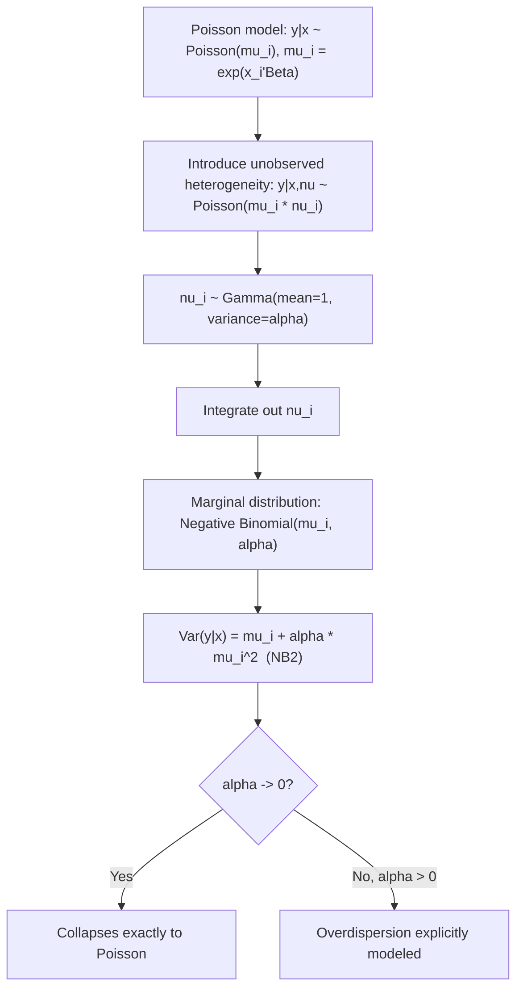

## Overdispersion and the Negative Binomial Model

### Overview

Overdispersion — the empirical phenomenon in which the conditional variance of a count variable exceeds its conditional mean — is the most common violation of the Poisson regression model's core equidispersion assumption. The negative binomial (NB) regression model is the standard fully parametric response to overdispersion, explicitly modeling the excess variance through unobserved heterogeneity rather than merely correcting standard errors after the fact. This topic covers the theoretical origin of overdispersion, the derivation of the negative binomial model as a Poisson-gamma mixture, its major parameterizations, and how it relates to and differs from simpler corrections.

### Recap: The Equidispersion Restriction

**Key Points**

- The Poisson distribution imposes $\text{Var}(y_i \mid x_i) = E[y_i \mid x_i] = \mu_i$ by construction — a single parameter governs both the mean and the variance.
- This restriction is rarely satisfied exactly in real count data; empirically, the sample variance of most economic and social-science count variables substantially exceeds the sample mean.
- Overdispersion does not bias Poisson MLE point estimates of $\beta$ (which remain consistent under correct conditional mean specification, per the QMLE property), but it invalidates the model-based standard errors, since these rely on the Poisson variance formula holding exactly.

### Sources of Overdispersion

**Key Points**

- **Unobserved heterogeneity**: individuals with identical observed covariates $x_i$ may have different underlying event rates due to unobserved factors (e.g., unobserved health status affecting doctor visits, unobserved firm-level R&D culture affecting patent counts) — averaging a Poisson process over this unobserved heterogeneity mechanically produces a marginal distribution with variance exceeding the mean.
- **Event clustering/contagion**: if the occurrence of one event makes subsequent events more likely (positive within-unit correlation across the counted events), this violates the independence assumption of the underlying Poisson process and generates overdispersion (e.g., one insurance claim increasing the likelihood of related follow-up claims).
- **Excess zeros**: a disproportionate share of zero counts relative to what a Poisson distribution with the estimated mean would predict is a specific manifestation of overdispersion, often addressed by zero-inflated or hurdle models rather than (or in addition to) standard negative binomial regression.
- **Omitted covariates or misspecified functional form**: general model misspecification can also manifest empirically as overdispersion, even when the true underlying process might be closer to Poisson conditional on the correct (but unavailable) full set of covariates.

### The Negative Binomial Model as a Poisson-Gamma Mixture

The standard derivation of the negative binomial model introduces an individual-specific unobserved heterogeneity term $\nu_i$ into the Poisson mean:

$$y_i \mid x_i, \nu_i \sim \text{Poisson}(\mu_i \nu_i), \quad \mu_i = \exp(x_i'\beta)$$

where $\nu_i$ is assumed to follow a Gamma distribution with mean 1 and variance $\alpha$ (the overdispersion parameter):

$$\nu_i \sim \text{Gamma}\left(\frac{1}{\alpha}, \alpha\right), \quad E[\nu_i] = 1, \quad \text{Var}(\nu_i) = \alpha$$

Integrating out the unobserved $\nu_i$ yields the (marginal, negative binomial) distribution of $y_i$ given $x_i$ alone:

$$P(y_i = y \mid x_i) = \frac{\Gamma(y + 1/\alpha)}{\Gamma(1/\alpha) \, y!} \left( \frac{1/\alpha}{1/\alpha + \mu_i} \right)^{1/\alpha} \left( \frac{\mu_i}{1/\alpha + \mu_i} \right)^{y}$$

**Key Points**

- The gamma distribution is chosen for $\nu_i$ primarily because it is the conjugate mixing distribution for the Poisson, yielding this closed-form negative binomial marginal density — a major computational advantage over needing to numerically integrate the mixture.
- This derivation gives overdispersion an explicit structural interpretation: it arises precisely because individuals share the same observed $x_i'\beta$ but differ in an unobserved multiplicative scaling factor $\nu_i$ on their underlying event rate.
- $\alpha$ is the overdispersion parameter (also denoted $\theta^{-1}$ or other symbols depending on software/textbook convention); larger $\alpha$ implies greater unobserved heterogeneity and greater overdispersion.

### The Mean-Variance Relationship (NB2)

The most common parameterization, often called **NB2**, implies the following conditional mean and variance:

$$E[y_i \mid x_i] = \mu_i = \exp(x_i'\beta)$$


$$\text{Var}(y_i \mid x_i) = \mu_i + \alpha \mu_i^2$$

**Key Points**

- The conditional mean is identical to the Poisson model's conditional mean — the negative binomial model does not change the interpretation of $\beta$ as governing $\ln E[y_i \mid x_i]$, nor the availability of incidence rate ratios $e^{\beta_k}$.
- The variance is quadratic in the mean, exceeding the Poisson variance $\mu_i$ by the additional term $\alpha \mu_i^2$, which grows faster than the mean itself as $\mu_i$ increases — a hallmark of the NB2 specification.
- As $\alpha \to 0$, $\text{Var}(y_i \mid x_i) \to \mu_i$, and the negative binomial distribution converges exactly to the Poisson distribution — this nesting is what permits a direct likelihood ratio test of Poisson against negative binomial.

### The NB1 (Linear) Parameterization

An alternative, less commonly used parameterization (**NB1**) instead specifies:

$$\text{Var}(y_i \mid x_i) = \mu_i (1 + \alpha) = \mu_i + \alpha \mu_i$$

**Key Points**

- NB1 imposes a variance that is linear in the mean (a constant multiple of $\mu_i$), analogous in spirit to the quasi-Poisson scalar-dispersion correction, but derived from and estimated within a full negative binomial likelihood rather than as a post hoc standard-error scaling.
- NB2 is by far the more widely used and more commonly reported parameterization in applied econometrics and is typically the software default when a command or function is simply labeled "negative binomial" without further qualification, though [Unverified: exact default naming and behavior should be confirmed against the specific software package and version in use, since conventions and default labels have varied historically across statistical packages].
- The choice between NB1 and NB2 is an empirical, testable specification decision (e.g., via a likelihood ratio or information-criterion comparison of the two fitted models on the same data) rather than a matter of pure convention, though NB2's connection to the natural gamma-mixture derivation makes it the more theoretically motivated default in most textbook treatments.

### Estimation by Maximum Likelihood

The negative binomial log-likelihood, using the NB2 density derived above, is maximized jointly over $(\beta, \alpha)$:

$$\ln L(\beta, \alpha) = \sum_{i=1}^{N} \left[ \ln \Gamma(y_i + 1/\alpha) - \ln \Gamma(1/\alpha) - \ln(y_i!) + \frac{1}{\alpha}\ln\left(\frac{1/\alpha}{1/\alpha + \mu_i}\right) + y_i \ln\left(\frac{\mu_i}{1/\alpha + \mu_i}\right) \right]$$

**Key Points**

- Unlike the Poisson log-likelihood, the negative binomial log-likelihood is not guaranteed globally concave in $(\beta, \alpha)$ jointly, though it is typically well-behaved and converges reliably in practice under standard numerical optimization routines.
- $\hat\alpha$ is estimated jointly with $\hat\beta$ via full maximum likelihood, in contrast to the quasi-Poisson approach, where the analogous dispersion parameter is computed after the fact from Pearson residuals rather than estimated within the likelihood itself.
- A Wald test or likelihood ratio test of $H_0: \alpha = 0$ (equivalently, comparing the NB and Poisson log-likelihoods) is the standard formal test of whether overdispersion is present and whether the negative binomial specification is a statistically warranted improvement over Poisson.

### Negative Binomial vs. Robust/Quasi-Poisson Corrections

**Key Points**

- Robust (sandwich) standard errors and the quasi-Poisson scalar correction leave the Poisson point estimates $\hat\beta$ unchanged and only adjust the standard errors; the negative binomial model instead re-estimates $\beta$ within a different (though related) likelihood function, so $\hat\beta_{NB}$ can, in principle, differ numerically from $\hat\beta_{Poisson}$.
- [Inference] In practice, when the conditional mean is correctly specified in both cases, Poisson and negative binomial point estimates of $\beta$ are often quite similar, with the more consequential differences appearing in standard errors, predicted probabilities for specific count values (especially near zero or in the tails), and model-based forecasts — though the exact degree of similarity is data- and application-specific.
- A key conceptual advantage of the full negative binomial model over the robust-standard-error-only approach is that it provides a complete, internally consistent probability model for $y_i$, enabling valid predicted probabilities $\hat P(y_i = k \mid x_i)$ for any count $k$, not just a corrected variance for the mean estimate.
- A key advantage of the robust/quasi-Poisson approach is its simplicity and its validity under essentially arbitrary (not just gamma-mixture-implied) forms of overdispersion, since it does not require the specific parametric variance structure imposed by the negative binomial derivation.

### Testing for Overdispersion

**Key Points**

- The most direct formal test is the likelihood ratio test comparing nested Poisson ($\alpha=0$) and negative binomial ($\alpha$ estimated) models, though because $\alpha=0$ is on the boundary of the parameter space, the standard chi-squared reference distribution for the LR statistic requires an adjustment (commonly, using a 50:50 mixture of a point mass at zero and a chi-squared distribution, following the general theory for boundary-parameter hypothesis tests).
- The Cameron-Trivedi regression-based overdispersion test (regressing a transformation of squared Poisson residuals on the fitted Poisson mean) is a widely used and simpler alternative diagnostic that does not require estimating the full NB model first.
- Comparing the Pearson chi-squared statistic to its degrees of freedom under the fitted Poisson model remains a common informal first check, with a ratio well above 1 signaling likely overdispersion warranting a formal test or a move to negative binomial regression.

### Model Diagram



### Implementation

**Example**

```plaintext
# R (MASS package) — Negative binomial regression (NB2)
library(MASS)

nb_model <- glm.nb(claims ~ age + vehicle_type + offset(log(exposure_years)),
                    data = insurance_df)

summary(nb_model)   # reports theta = 1/alpha directly

# Likelihood ratio test against Poisson
poisson_model <- glm(claims ~ age + vehicle_type + offset(log(exposure_years)),
                      family = poisson, data = insurance_df)
library(lmtest)
lrtest(poisson_model, nb_model)
```

**Key Points**

- Widely used implementations include R's `MASS::glm.nb` (NB2 by default) and the `pscl`/`countreg` packages, Stata's `nbreg` (with an `nb1`/`nb2` dispersion option) and `glm, family(nbinomial)`, and Python's `statsmodels.discrete.discrete_model.NegativeBinomial`.
- [Note: behavior may vary by package version] Software typically reports either $\alpha$ directly or its reciprocal $\theta = 1/\alpha$; always check the specific parameterization and labeling convention used by the software before interpreting the reported dispersion parameter.
- As with Poisson regression, an offset term for varying exposure periods is specified the same way and remains essential whenever exposure genuinely varies across observations.

### Common Pitfalls

**Key Points**

- Assuming negative binomial regression is a universal "fix" for all forms of count-data misspecification — it specifically addresses overdispersion arising from gamma-distributed unobserved heterogeneity, and does not, by itself, address excess zeros beyond what its variance structure already implies (a hurdle or zero-inflated negative binomial model may still be needed).
- Using a standard chi-squared reference distribution without the boundary adjustment when conducting a likelihood ratio test of $\alpha = 0$, potentially understating the significance of overdispersion.
- Confusing the NB1 and NB2 parameterizations when comparing $\hat\alpha$ estimates across studies or software outputs, given their different implied mean-variance relationships.
- Treating negative binomial regression as automatically superior to Poisson-with-robust-standard-errors in all cases, when in fact the appropriate choice depends on whether a fully specified predictive/probabilistic model (favoring NB) or a minimal, distribution-agnostic correction (favoring robust SEs) is needed for the application.
- Failing to include a necessary offset/exposure term, an error that carries over identically from the Poisson to the negative binomial setting.

**Next Steps**

- Zero-inflated negative binomial models for data with both overdispersion and excess zeros
- Hurdle negative binomial models as an alternative excess-zeros framework
- Panel data negative binomial models (fixed effects and random effects specifications)
- Truncated negative binomial models for count data with sample truncation
- Generalized Poisson and other alternative overdispersion-accommodating count distributions
- Duration/survival analysis as a related framework linking count processes to event-timing data