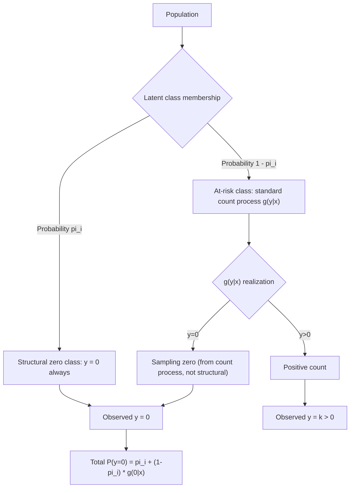

## Zero-Inflated Count Models

### Overview

Zero-inflated count models address count data exhibiting more zero observations than a standard Poisson or negative binomial distribution predicts, by explicitly modeling the population as a mixture of two latent sub-populations: a group that can never experience the event of interest (structural zeros) and a group governed by an ordinary count process (which can itself produce zero or positive counts). This distinguishes zero-inflated models sharply from hurdle models, with which they are frequently — and incorrectly — conflated.

### Motivation: Excess Zeros

**Key Points**

- A standard Poisson (or even negative binomial) model may substantially under-predict the observed frequency of zero counts in real data, a pattern commonly described as "excess zeros" relative to model predictions.
- Excess zeros often arise because the population being studied is a mixture of genuinely distinct groups: for example, in a study of number of doctor visits, some individuals may be permanently healthy and would report zero visits under essentially any circumstance ("never-users"), while others could visit zero, one, or more times depending on realized health shocks in the observation period.
- Failing to account for this latent mixture, when it genuinely exists, can distort both the estimated coefficients and the substantive interpretation of the model, since a single count process is being asked to simultaneously explain two conceptually distinct zero-generating mechanisms.

### The Two-Component Mixture Structure

The zero-inflated model specifies that with probability $\pi_i$, an observation is a "structural zero" (always zero), and with probability $1 - \pi_i$, the observation is drawn from a standard count distribution (Poisson or negative binomial), which can itself produce a zero or a positive count:

$$P(y_i = 0 \mid x_i, w_i) = \pi_i + (1 - \pi_i) \, g(0 \mid x_i)$$


$$P(y_i = k \mid x_i, w_i) = (1 - \pi_i) \, g(k \mid x_i), \quad k = 1, 2, 3, \dots$$

where $g(\cdot \mid x_i)$ is the standard (non-truncated) count density — typically Poisson or negative binomial — and $\pi_i$ is modeled via a binary link function on a separate index $w_i'\gamma$:

$$\pi_i = F(w_i'\gamma)$$

with $F(\cdot)$ commonly a logit or probit CDF.

**Key Points**

- $g(0 \mid x_i)$ is not truncated — it is the ordinary Poisson (or negative binomial) probability of observing a zero, which is generally nonzero — so a zero can arise either from the structural-zero component (probability $\pi_i$) or from the count process itself producing a zero by chance (probability $(1-\pi_i)g(0 \mid x_i)$).
- This is the structural feature that distinguishes zero-inflated models from hurdle models: in a hurdle model, once the count process is "activated" (crosses the hurdle), it can never itself produce a zero (it uses a zero-truncated density), whereas in a zero-inflated model the count component retains its full, non-truncated support including zero.
- $w_i$ (the regressors in the structural-zero equation) may overlap with, be identical to, or differ entirely from $x_i$ (the regressors in the count equation), analogous to the flexibility in two-part/hurdle model specification.

### Zero-Inflated Poisson (ZIP)

When $g(\cdot \mid x_i)$ is Poisson, the resulting model is **Zero-Inflated Poisson (ZIP)**:

$$P(y_i = 0 \mid x_i, w_i) = \pi_i + (1-\pi_i) e^{-\mu_i}, \qquad \mu_i = \exp(x_i'\beta)$$


$$P(y_i = k \mid x_i, w_i) = (1-\pi_i) \frac{e^{-\mu_i} \mu_i^{k}}{k!}, \quad k \ge 1$$

**Key Points**

- ZIP is a natural extension when the researcher believes a portion of the sample is genuinely incapable of experiencing the counted event, and the remaining "at-risk" population's counts are adequately described by the Poisson distribution.
- ZIP itself generates a form of overdispersion in the marginal (unconditional, across both latent groups) distribution of $y_i$, even though the count component conditional on being in the "at-risk" group is exactly Poisson (equidispersed) — this is a key reason ZIP is often considered as an alternative response to overdispersion driven specifically by excess zeros, as distinct from the negative binomial's response to overdispersion driven by continuous unobserved heterogeneity across all observations.
- The unconditional mean and variance of $y_i$ under ZIP are $E[y_i] = (1-\pi_i)\mu_i$ and $\text{Var}(y_i) = (1-\pi_i)\mu_i(1 + \pi_i \mu_i)$, both more complex functions of the underlying parameters than the simple Poisson formulas, reflecting the added structure from the mixture.

### Zero-Inflated Negative Binomial (ZINB)

**Key Points**

- **Zero-Inflated Negative Binomial (ZINB)** replaces the Poisson count component with a negative binomial density, allowing the model to simultaneously accommodate excess zeros (via the $\pi_i$ mixing component) and additional overdispersion among the positive/at-risk counts beyond what the ZIP structure alone can capture.
- ZINB nests ZIP as the special case where the negative binomial overdispersion parameter $\alpha \to 0$, permitting a likelihood ratio test (with the same boundary-parameter caveat noted for testing Poisson against negative binomial) to assess whether the additional negative binomial overdispersion parameter is needed on top of the zero-inflation structure.
- [Inference] In applied practice, ZINB is often the more robust default choice over ZIP when overdispersion is suspected to arise from multiple sources simultaneously (both excess zeros and unobserved heterogeneity among the positive counts), though this adds an additional parameter and correspondingly requires more data to estimate reliably.

### Maximum Likelihood Estimation

The full log-likelihood combines the two mixture-component probabilities across all observations:

$$\ln L(\beta, \gamma) = \sum_{i: y_i=0} \ln\left[\pi_i + (1-\pi_i)g(0 \mid x_i)\right] + \sum_{i: y_i>0} \left[\ln(1-\pi_i) + \ln g(y_i \mid x_i)\right]$$

**Key Points**

- Unlike the two-part/hurdle model, the zero-inflated model's log-likelihood does **not** decompose additively into two independently estimable pieces, because the first summation (over zero observations) mixes both the $\pi_i$ and $g(0 \mid x_i)$ terms together — $\beta$ and $\gamma$ must generally be estimated jointly by full maximum likelihood.
- This joint estimation requirement is a key computational and conceptual distinction from the hurdle model, whose additive separability (see "Two-part and hurdle models") permits independent estimation of the two components.
- The zero-inflated log-likelihood is not guaranteed globally concave, and convergence can be sensitive to starting values, particularly when $\pi_i$ and $g(0 \mid x_i)$ are both large for many observations (a form of identification weakness discussed below).

### Interpreting the Two Components

**Key Points**

- Coefficients $\gamma$ in the structural-zero (inflation) equation are interpreted as effects on the probability of being a structural (always-zero) observation, exactly as in a standard binary choice model — the sign convention depends on the software's parameterization of $\pi_i$ (some report the probability of being an "always-zero" case directly, others parameterize the complementary "not structural zero" probability, so signs should be checked carefully against documentation).
- Coefficients $\beta$ in the count equation are interpreted exactly as in standard Poisson or negative binomial regression: as semi-elasticities on the conditional mean of the count process for the "at-risk" sub-population, with $e^{\beta_k}$ interpretable as an incidence rate ratio within that latent group.
- The overall (unconditional) marginal effect of a regressor on $E[y_i \mid x_i]$ — combining both the effect on the probability of being at-risk and the effect on the conditional count within that group — is a more complex, nonlinear combination of both sets of coefficients, generally requiring the delta method or bootstrap for valid standard errors, analogous to the combined marginal effects in two-part/hurdle models.

### Vuong's Test: Comparing Zero-Inflated Models to Standard Count Models

**Key Points**

- Because a standard Poisson (or negative binomial) model is not nested within its zero-inflated counterpart in the conventional sense (the null $\pi_i = 0$ for all $i$ is again a boundary case, and setting $\gamma = 0$ typically forces $\pi_i$ to a constant rather than exactly zero unless the intercept is also specifically restricted), the **Vuong test** (Vuong, 1989) is the standard tool for comparing the fit of a zero-inflated model against its non-inflated counterpart.
- The Vuong test statistic compares the pointwise log-likelihood contributions of the two models across observations and is asymptotically standard normal under the null that the two models fit equally well; a significantly positive statistic favors the zero-inflated model, while a significantly negative statistic favors the simpler (non-inflated) model.
- [Inference] The Vuong test is widely used for this comparison in applied count-data literature, though it has been noted in the broader model-selection literature as having some sensitivity to sample size and to violations of its underlying assumptions, so results are often supplemented with AIC/BIC comparisons and, importantly, substantive judgment about whether a genuine "always-zero" sub-population is plausible for the specific application.

### Identification Concerns

**Key Points**

- Zero-inflated models can suffer from weak identification or near-perfect collinearity between the two equations' predicted probabilities when $w_i$ and $x_i$ overlap substantially and/or when the data do not contain strong empirical evidence distinguishing structural from sampling zeros.
- As with the Heckman selection model and recursive bivariate probit, including at least one variable in $w_i$ that is excluded from $x_i$ (or vice versa) — justified by a substantive economic or behavioral argument for why it affects only one of the two processes — is generally recommended to improve identification stability, though it is not strictly mathematically required given the models' distinct functional forms.
- Convergence warnings, extremely large standard errors on either component's coefficients, or estimated $\hat\pi_i$ values clustering near 0 or 1 for most observations can be practical symptoms of weak identification in an estimated zero-inflated model.

### Model Diagram



### Implementation

**Example**

```plaintext
# R (pscl package) — Zero-inflated Poisson and Negative Binomial
library(pscl)

zip_model <- zeroinfl(claims ~ age + vehicle_type | prior_claims + region,
                       data = insurance_df, dist = "poisson")

zinb_model <- zeroinfl(claims ~ age + vehicle_type | prior_claims + region,
                        data = insurance_df, dist = "negbin")

summary(zinb_model)

# Vuong test: zero-inflated vs. standard count model
poisson_model <- glm(claims ~ age + vehicle_type, family = poisson, data = insurance_df)
vuong(zip_model, poisson_model)
```

**Key Points**

- Widely used implementations include R's `pscl::zeroinfl` (supporting both Poisson and negative binomial count components, with the `|` syntax separating count and inflation equation regressors) and `countreg`, Stata's `zip` and `zinb` commands, and Python's `statsmodels` (zero-inflated Poisson and generalized Poisson via its count models module).
- [Note: behavior may vary by package version] The sign convention and default link function for the inflation ($\pi_i$) equation differ across packages; always verify whether the reported coefficients correspond to the probability of being an "always-zero" observation or its complement before interpreting signs.
- As with standard Poisson/negative binomial regression, offset terms for varying exposure can typically be incorporated into the count component of a zero-inflated model, though the exact syntax for doing so alongside a separate inflation equation should be checked against the specific software's documentation.

### Zero-Inflated vs. Hurdle: A Direct Comparison

**Key Points**

- **Zero-inflated models** assume two latent sources of zeros (structural and sampling) and require joint (non-separable) maximum likelihood estimation of both equations.
- **Hurdle models** assume a single source of zeros (the hurdle/participation decision) and use a zero-truncated count density for the positive observations, permitting additively separable (and thus independently estimable) equations.
- Choosing between the two is fundamentally a question of which zero-generating economic story is more plausible for the application: a genuine always-zero sub-population (favoring zero-inflated) versus a single behavioral threshold that, once crossed, still allows for the possibility of a realized zero in a given period under the underlying process's own randomness (favoring hurdle, though this scenario is conceptually a bit unusual since crossing the hurdle at all typically implies a positive outcome in most applications) — more commonly, the hurdle model is favored when the zero/positive split is truly a single well-defined decision with the intensity component modeled as strictly positive thereafter.
- [Inference] Because both models can often fit similarly well in terms of raw likelihood or information criteria, the choice between zero-inflated and hurdle specifications in applied work is frequently guided as much by the plausibility of the underlying economic story and by conventions within a given subfield as by formal statistical tests alone.

### Common Pitfalls

**Key Points**

- Conflating zero-inflated models with hurdle models, given their similar two-equation appearance but fundamentally different assumptions about the source(s) of zeros and different estimation requirements (joint vs. separable likelihoods).
- Including a genuine structural-zero equation ($w_i'\gamma$) that overlaps too heavily with the count equation ($x_i'\beta$) without an exclusion restriction, risking weak identification and unstable estimates.
- Interpreting either component's coefficients as directly informative about the overall (unconditional) marginal effect on $E[y_i \mid x_i]$, without properly combining both components' contributions via the delta method or bootstrap.
- Relying solely on the Vuong test (or solely on AIC/BIC) to choose a zero-inflated specification, without considering whether a genuine always-zero sub-population is economically plausible for the application at hand.
- Misreading the sign of the inflation-equation coefficients due to a software's specific parameterization convention (probability of structural zero vs. its complement).

**Next Steps**

- Hurdle models as the additively separable alternative for excess zeros
- Negative binomial regression and the general theory of overdispersion
- Finite mixture models more generally, as the broader class to which zero-inflated models belong
- Panel data extensions of zero-inflated count models
- The Vuong test and other non-nested model selection procedures in applied econometrics
- Latent class models for unobserved population heterogeneity beyond the binary structural/at-risk split