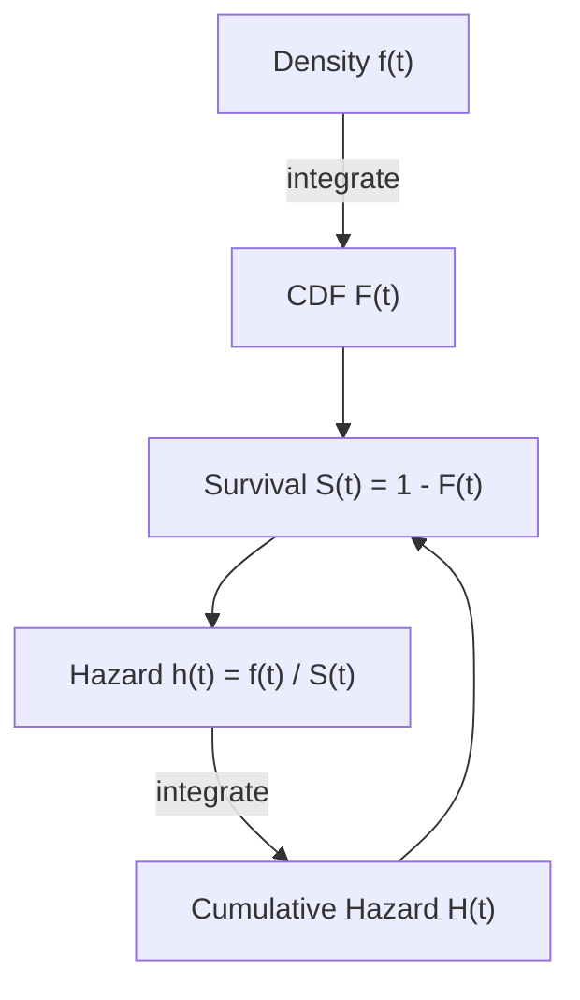

## Hazard Functions and Survival Analysis

### Overview

Survival analysis (also called duration analysis in econometrics, or event history analysis in sociology) models the time until an event occurs — death, unemployment spell termination, firm failure, contract duration, machine failure. The central object of interest is the **hazard function**, which describes the instantaneous risk of the event occurring at time $t$, conditional on survival up to $t$. Unlike standard regression on duration $T$, hazard-based methods explicitly handle right-censoring (spells not yet complete when observation ends) and allow flexible, non-monotonic relationships between elapsed time and event risk.

### Core Definitions

Let $T$ be a non-negative random variable representing the duration until the event.

**Survival function:**

$$S(t) = P(T > t) = 1 - F(t)$$

where $F(t)$ is the CDF of $T$. $S(t)$ is the probability of "surviving" (not experiencing the event) beyond time $t$; $S(0)=1$, $S(\infty)=0$, monotonically non-increasing.

**Probability density function:**

$$f(t) = -\frac{dS(t)}{dt}$$

**Hazard function:**

$$h(t) = \lim_{\Delta t \to 0} \frac{P(t \leq T < t+\Delta t \mid T \geq t)}{\Delta t} = \frac{f(t)}{S(t)}$$

The hazard is the instantaneous rate of event occurrence at $t$, given survival to $t$ — not a probability itself (it can exceed 1), but a rate.

**Cumulative hazard function:**

$$H(t) = \int_0^t h(u)\,du = -\ln S(t)$$

so that:

$$S(t) = \exp(-H(t))$$

### Key Points

- The four functions $\{f(t), F(t), S(t), h(t)\}$ are mathematically equivalent representations — any one fully determines the others.
- The hazard function's **shape over time** (increasing, decreasing, constant, U-shaped/"bathtub") carries substantive meaning: e.g., increasing hazard implies positive duration dependence (the risk of the event rises the longer the spell has lasted).
- Duration dependence is central to many economic applications — e.g., whether unemployment exit hazard falls with elapsed unemployment duration (a "scarring" or discouragement effect) versus remains flat (consistent with search-theoretic models without state dependence).

### Censoring and Truncation

**Right censoring** is the defining feature that necessitates specialized methods: for some observations, the event has not occurred by the end of the observation window, so only $T_i > c_i$ is known, not $T_i$ itself.

**Types of censoring:**

- **Type I (fixed censoring time):** observation ends at a predetermined calendar time (e.g., end of study period).
- **Type II:** observation ends after a fixed number of events have occurred.
- **Random censoring:** censoring time varies across individuals (e.g., due to migration out of a sample, employer-employee match dissolution for unrelated reasons).

**Left truncation** (delayed entry) occurs when individuals only enter the risk set after surviving to some point (e.g., left-truncated at labor market entry), requiring the likelihood to condition on survival to the truncation point.

**Key Points**

- Censoring is **not** the same as measurement error or missing data; conditional on the censoring mechanism being "non-informative" (independent of the event process given covariates), standard survival methods remain valid.
- Ignoring censoring — e.g., dropping censored observations or treating censoring time as the observed duration — biases estimates, typically understating true duration/overstating hazard, since censored (surviving) spells are systematically the longer ones.

### The Likelihood Function with Censoring

For a sample with censoring indicator $\delta_i = 1$ if the event is observed, $\delta_i = 0$ if censored at $c_i$, the contribution to the likelihood is:

$$L_i = f(t_i)^{\delta_i} \, S(c_i)^{1-\delta_i} = \left[h(t_i)S(t_i)\right]^{\delta_i} S(c_i)^{1-\delta_i}$$

Uncensored spells contribute their density; censored spells contribute the probability of surviving beyond the censoring point. The full log-likelihood sums over $i$:

$$\ln L = \sum_i \left\{\delta_i \ln h(t_i) - H(t_i)\right\}$$

using $S(t) = \exp(-H(t))$, which holds for both censored and uncensored observations after algebraic simplification (since $\delta_i \ln h(t_i)$ vanishes for censored spells and $H(t_i)$ enters for all).

### Non-Parametric Estimation: Kaplan-Meier

The **Kaplan-Meier (product-limit) estimator** estimates $S(t)$ without assuming a parametric hazard shape. At each distinct event time $t_{(j)}$ with $d_j$ events out of $n_j$ individuals at risk:

$$\hat{S}(t) = \prod_{j: t_{(j)} \leq t} \left(1 - \frac{d_j}{n_j}\right)$$

**Key Points**

- Handles right-censoring naturally: censored individuals remain in the risk set $n_j$ up to their censoring time, then exit without contributing a "death."
- The **Nelson-Aalen estimator** provides a non-parametric estimate of the cumulative hazard directly: $\hat{H}(t) = \sum_{j:t_{(j)}\leq t} d_j/n_j$.
- Kaplan-Meier is purely descriptive (no covariates); comparing survival curves across groups uses the **log-rank test** for equality of hazard functions.

### Parametric Hazard Models

Common parametric distributions for $T$, each implying a specific hazard shape:

| Distribution | Hazard function $h(t)$ | Shape |
| --- | --- | --- |
| Exponential | $h(t) = \lambda$ | Constant (no duration dependence) |
| Weibull | $h(t) = \lambda p (\lambda t)^{p-1}$ | Monotonic increasing ($p>1$) or decreasing ($p<1$); $p=1$ nests exponential |
| Log-logistic | $h(t) = \frac{\lambda p (\lambda t)^{p-1}}{1+(\lambda t)^p}$ | Non-monotonic (can rise then fall) |
| Log-normal | derived from normal CDF of $\ln t$ | Non-monotonic, typically rises then falls |
| Gompertz | $h(t) = \lambda e^{\gamma t}$ | Exponentially increasing or decreasing |
| Generalized Gamma | flexible, nests several above | Highly flexible, nests exponential/Weibull/log-normal |

Covariates $x_i$ are typically incorporated multiplicatively into the hazard (Accelerated Failure Time or Proportional Hazards parameterizations — see below), with $\lambda_i = \exp(x_i'\beta)$ or similar link functions.

### Proportional Hazards (PH) Models

The PH assumption specifies:

$$h(t \mid x_i) = h_0(t) \exp(x_i'\beta)$$

where $h_0(t)$ is the **baseline hazard** (common to all individuals, shape unrestricted or parametrically specified) and $\exp(x_i'\beta)$ is a multiplicative scaling factor depending on covariates. The **hazard ratio** for a unit change in $x_k$ is $\exp(\beta_k)$, constant across all $t$ — the defining "proportionality" feature.

**Cox Proportional Hazards Model (semi-parametric):**

Cox's (1972) key insight: $\beta$ can be estimated **without specifying $h_0(t)$ at all**, via the **partial likelihood**:

$$PL(\beta) = \prod_{i: \delta_i=1} \frac{\exp(x_i'\beta)}{\sum_{j \in R(t_i)} \exp(x_j'\beta)}$$

where $R(t_i)$ is the risk set (individuals still at risk) at event time $t_i$. This conditions out the baseline hazard entirely, making Cox PH robust to misspecification of the baseline hazard's functional form — a major reason for its widespread use.

**Key Points**

- The baseline hazard $h_0(t)$ can be recovered afterward (e.g., via the Breslow estimator) if needed for predicted survival curves, but is not required for estimating $\beta$.
- **Ties** in event times require an approximation to the partial likelihood (Breslow or Efron methods); Efron's method is generally preferred as more accurate with substantial tying.
- The **proportional hazards assumption itself is testable** — via Schoenfeld residuals (testing whether residuals are correlated with time) or by including time-interacted covariates and testing their significance.

### Accelerated Failure Time (AFT) Models

An alternative parameterization models covariates as **rescaling time itself** rather than multiplying the hazard:

$$\ln T_i = x_i'\beta + \sigma \varepsilon_i$$

where $\varepsilon_i$'s distribution determines the model (extreme value → Weibull AFT; logistic → log-logistic AFT; normal → log-normal AFT). Positive $\beta_k$ means increasing $x_k$ **accelerates** survival time (stretches out the duration until failure), interpreted directly as a time-scaling effect rather than a hazard-ratio effect.

**Key Points**

- AFT coefficients have a direct interpretation as **percentage change in survival time**, which some practitioners find more intuitive than hazard ratios.
- The Weibull distribution is the only one that is **simultaneously** a valid PH model and a valid AFT model — for all other distributions, PH and AFT parameterizations imply different coefficient interpretations and are not simple transformations of one another except for Weibull.
- Choice between PH and AFT is partly a matter of substantive interpretation preference and partly an empirical question of which fits the duration-dependence pattern better.

### Diagram: Hazard, Survival, and Density Relationships

### Unobserved Heterogeneity (Frailty)

Standard hazard models assume covariates $x_i$ fully capture individual heterogeneity; if unobserved factors also affect the hazard, ignoring them causes **spurious negative duration dependence** — even if the true individual-level hazard is flat or increasing, the population-average hazard can appear to decline over time as high-hazard (frail) individuals exit the risk pool disproportionately early, leaving a selected, lower-hazard remaining sample.

**Frailty models** address this by adding a multiplicative random effect $v_i$:

$$h(t \mid x_i, v_i) = v_i \, h_0(t) \exp(x_i'\beta)$$

with $v_i$ typically assumed Gamma-distributed (for analytical tractability, since the Gamma-mixed hazard has closed-form marginal likelihood) or log-normal (requiring numerical integration). This is directly analogous to random-effects panel models.

### Time-Varying Covariates

Many applications require covariates that change during the spell (e.g., local unemployment rate changing during an unemployment spell). The Cox partial likelihood extends naturally by allowing $x_i(t)$ to enter the risk set comparison at each event time using the covariate's value at that time — but this requires the data be structured in **counting-process (start-stop) format**, with each individual contributing multiple records for distinct covariate-constant intervals.

### Competing Risks

When multiple distinct event types can end the spell (e.g., unemployment ending via new job vs. exit from labor force), competing-risks models estimate **cause-specific hazards**:

$$h_k(t \mid x) = \lim_{\Delta t \to 0} \frac{P(t \leq T < t+\Delta t, \, \text{event type}=k \mid T \geq t)}{\Delta t}$$

The overall hazard is $h(t) = \sum_k h_k(t)$. Cause-specific hazards can be estimated by treating other event types as censored observations within each cause-specific model, but this requires the assumption that competing risks are independent conditional on covariates — often not verifiable from the data — motivating the alternative **subdistribution hazard (Fine-Gray) model** for estimating cumulative incidence directly.

### Example: Unemployment Duration

Modeling time to re-employment with Cox PH, covariates: age, education, unemployment benefit generosity, local labor market tightness.

**Output** (illustrative):

- $\hat\beta_{\text{benefit}} > 0$ with hazard ratio $\exp(\hat\beta) = 0.85$: a one-unit increase in benefit generosity is associated with a 15% *lower* hazard of exiting unemployment at any given duration — consistent with a work-disincentive channel, though **[Inference]** this coefficient alone does not distinguish disincentive effects from liquidity/search-quality channels without further identification strategy (e.g., discontinuities in benefit schedules).
- Schoenfeld residual test: if $p < 0.05$ for the benefit variable, the proportional hazards assumption is violated for that covariate, suggesting a time-interacted specification or a switch to a stratified Cox model.

### Software Implementation Notes

- **Stata:** `stset` to declare survival-time data, `stcox` for Cox PH, `streg` for parametric AFT/PH models, `stcurve` for predicted survival/hazard plots.
- **R:** `survival` package — `Surv()` to construct the response object, `coxph()` for Cox PH, `survreg()` for parametric AFT models, `survfit()` for Kaplan-Meier.
- **Python:** `lifelines` package provides `CoxPHFitter`, `KaplanMeierFitter`, and parametric AFT fitters (`WeibullAFTFitter`, `LogNormalAFTFitter`).

### Limitations

- Cox PH's proportional hazards assumption, while testable, is frequently violated in practice, especially over long follow-up periods; uncritical use without diagnostic testing is a common applied error.
- Frailty distributional assumptions (commonly Gamma for tractability) are rarely testable directly and can materially affect estimated duration dependence and covariate effects.
- Competing-risks analysis requires care distinguishing questions answerable by cause-specific hazards (etiological questions) from those requiring cumulative incidence/subdistribution approaches (prediction questions) — conflating the two is a well-documented source of misinterpretation in applied work.
- Discrete-time approximations (e.g., complementary log-log models on interval-censored data) are common in economics with survey-interval data, but their properties differ from the continuous-time hazard models presented above and require separate treatment.

**Related Topics**

- Cox proportional hazards model and partial likelihood
- Kaplan-Meier and Nelson-Aalen non-parametric estimators
- Accelerated failure time models (Weibull, log-logistic, log-normal)
- Frailty models and unobserved heterogeneity in duration data
- Competing risks and the Fine-Gray subdistribution hazard model
- Discrete-time hazard models (complementary log-log, discrete logit)
- Poisson and negative binomial models for count data (chapter cross-reference)