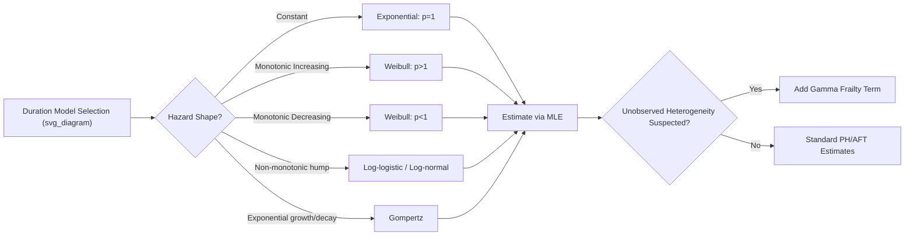

## Parametric Duration Models

### Overview

Parametric duration models (also called parametric survival models or hazard models) analyze the time until an event occurs — such as unemployment spell duration, time to firm failure, time to loan default, or patient survival time. Unlike nonparametric (Kaplan-Meier) or semiparametric (Cox proportional hazards) approaches, parametric duration models specify a complete probability distribution for the duration variable $T$, which allows full likelihood-based estimation, direct interpretation of the baseline hazard shape, and extrapolation beyond the observed data range.

### Core Concepts

**Duration/Survival Time**

Let $T$ be a nonnegative continuous random variable representing the time to an event.

**Density, Survival, and Hazard Functions**

The relationship between the three defining functions of a duration model:

$$f(t) = -\frac{dS(t)}{dt}$$

$$S(t) = P(T > t) = 1 - F(t)$$

$$\lambda(t) = \frac{f(t)}{S(t)} = -\frac{d\ln S(t)}{dt}$$

where $\lambda(t)$ is the **hazard rate**: the instantaneous rate of event occurrence at time $t$, conditional on survival up to $t$.

The **cumulative hazard function** is:

$$\Lambda(t) = \int_0^t \lambda(u)\,du = -\ln S(t)$$

so that $S(t) = \exp(-\Lambda(t))$.

**Key Points**

- $f(t)$: unconditional probability of the event occurring at exactly $t$
- $S(t)$: probability of surviving past $t$ (no event yet)
- $\lambda(t)$: conditional instantaneous risk given survival to $t$
- These three functions are mathematically equivalent representations — knowing one determines the other two

### Censoring

Duration data is almost always subject to **censoring**, and parametric models are built around likelihood contributions that explicitly accommodate it.

- **Right censoring**: the spell has not ended by the end of observation (most common in economics — e.g., a worker still unemployed at the survey's last wave)
- **Left censoring**: the event already occurred before observation began
- **Left truncation (delayed entry)**: subjects enter the risk set only after surviving some initial period

For right-censored data, the likelihood contribution of individual $i$ is:

$$L_i = f(t_i)^{d_i} \, S(t_i)^{1-d_i}$$

where $d_i = 1$ if the event is observed (uncensored) and $d_i = 0$ if censored at $t_i$. Taking logs:

$$\ln L_i = d_i \ln f(t_i) + (1-d_i) \ln S(t_i)$$

The full-sample log-likelihood sums this across all $i$, and is maximized numerically to obtain parameter estimates.

### Common Parametric Distributions

**Exponential Distribution**

The simplest duration model, assuming a **constant hazard** (memoryless property):

$$f(t) = \lambda e^{-\lambda t}, \quad S(t) = e^{-\lambda t}, \quad \lambda(t) = \lambda$$

The hazard does not depend on $t$ — the risk of the event is the same regardless of how long the spell has already lasted. This is a strong and often unrealistic assumption (e.g., unemployment duration typically shows duration dependence).

**Weibull Distribution**

Generalizes the exponential by allowing monotonic duration dependence via a shape parameter $p$:

$$f(t) = \lambda p (\lambda t)^{p-1} e^{-(\lambda t)^p}$$

$$S(t) = e^{-(\lambda t)^p}$$

$$\lambda(t) = \lambda p (\lambda t)^{p-1}$$

- $p = 1$: reduces to the exponential (constant hazard)
- $p > 1$: hazard increasing in $t$ (positive duration dependence — risk rises the longer the spell lasts)
- $p < 1$: hazard decreasing in $t$ (negative duration dependence)

The Weibull is the most widely used parametric duration model in econometrics because of this flexible but still monotonic hazard shape.

**Log-Logistic Distribution**

Allows a **non-monotonic** hazard (rising then falling), useful when risk peaks at some intermediate duration:

$$S(t) = \frac{1}{1 + (\lambda t)^p}$$

$$\lambda(t) = \frac{\lambda p (\lambda t)^{p-1}}{1 + (\lambda t)^p}$$

If $p > 1$, the hazard increases then decreases; if $p \le 1$, the hazard is monotonically decreasing.

**Log-Normal Distribution**

Assumes $\ln T \sim N(\mu, \sigma^2)$. Also produces a non-monotonic (hump-shaped) hazard. Convenient because standard normal CDF/PDF tables and software routines apply directly to $\ln t$.

**Gompertz Distribution**

Common in demography/mortality modeling; hazard grows or decays exponentially:

$$\lambda(t) = \lambda e^{\gamma t}$$

**Generalized Gamma**

A flexible three-parameter family nesting the exponential, Weibull, and log-normal as special cases — often used for formal specification testing (a likelihood-ratio test of nested models can indicate which simpler distribution is adequate).

### Incorporating Covariates

**Proportional Hazards (PH) Form**

Covariates shift the hazard multiplicatively:

$$\lambda(t \mid x) = \lambda_0(t) \exp(x'\beta)$$

where $\lambda_0(t)$ is the baseline hazard. The Weibull and Gompertz can be written in PH form. A positive $\beta_k$ means covariate $x_k$ increases the hazard (shortens expected duration).

**Accelerated Failure Time (AFT) Form**

Covariates rescale time itself:

$$\ln T = x'\beta + \sigma \varepsilon$$

where $\varepsilon$ follows a distribution corresponding to the chosen model (extreme value → Weibull; logistic → log-logistic; normal → log-normal). Here $\beta_k > 0$ means covariate $x_k$ *lengthens* the expected duration (opposite sign interpretation direction from PH, since it acts on $\ln T$ directly rather than the hazard).

**Key Points**

- The Weibull is the only common distribution that admits **both** a PH and an AFT representation simultaneously
- AFT coefficients are interpreted as proportional changes in survival time: $\exp(\beta_k)$ is the "time ratio" — how the expected/median survival time scales per unit change in $x_k$
- PH coefficients are interpreted via the "hazard ratio": $\exp(\beta_k)$

### Unobserved Heterogeneity (Frailty)

A major econometric concern: individuals differ in unobserved risk factors, and this generates **spurious negative duration dependence** even if each individual's true hazard is constant or increasing. High-risk individuals exit early, so the surviving population becomes increasingly composed of low-risk types — the *aggregate* hazard can decline even when *individual* hazards do not.

The standard fix multiplies the individual hazard by an unobserved frailty term $v$:

$$\lambda(t \mid x, v) = v \cdot \lambda_0(t) \exp(x'\beta)$$

with $v$ typically assumed to follow a Gamma distribution (for closed-form integration) with mean 1 and variance $\theta$ to be estimated. The population (mixed) survivor function integrates $v$ out:

$$S(t \mid x) = \int_0^\infty S(t \mid x, v)\, g(v)\, dv$$

**[Inference]** Because frailty and baseline duration dependence are not always separately identified from duration data alone without covariates or repeated spells, estimates of $\theta$ can be sensitive to model specification — this is a well-documented identification concern (Elbers–Ridder / Heckman–Singer) rather than a universal failure, but caution is warranted in interpreting frailty variance estimates in isolation.

### Estimation

Maximum likelihood estimation (MLE) is standard. Given $n$ independent spells with censoring indicator $d_i$:

$$\ln L(\theta) = \sum_{i=1}^n \left[ d_i \ln f(t_i \mid x_i; \theta) + (1-d_i) \ln S(t_i \mid x_i; \theta) \right]$$

Software implementations (Stata's `streg`, R's `survival::survreg` and `flexsurv`, Python's `lifelines`) parameterize this directly and return coefficient estimates along with the shape/scale parameters, standard errors (via the inverse Hessian/information matrix), and log-likelihood for model comparison.

### Model Diagnostics and Selection

- **Likelihood-ratio tests** between nested models (e.g., exponential vs. Weibull, testing $H_0: p=1$)
- **AIC/BIC** for comparing non-nested parametric families
- **Cox-Snell residuals**: if the model is correctly specified, these residuals should follow a unit exponential distribution — plotted against the cumulative hazard, a straight 45° line indicates good fit
- **Graphical hazard shape inspection**: plotting the estimated hazard against $t$ to visually assess whether monotonic (Weibull) or non-monotonic (log-logistic, log-normal) forms are appropriate

### Worked Example

Suppose modeling unemployment spell duration (in months) with covariates: age, education, and an unemployment benefit indicator. A Weibull PH specification:

$$\lambda(t \mid x) = \lambda p (\lambda t)^{p-1} \exp(\beta_1 \, \text{age} + \beta_2 \, \text{educ} + \beta_3 \, \text{benefit})$$

If estimation yields $\hat{p} = 1.3$ (positive duration dependence — job-finding likelihood rises with spell length, perhaps due to search intensity increasing near benefit exhaustion) and $\hat{\beta}_3 = 0.4$, the hazard ratio for benefit recipients is $\exp(0.4) \approx 1.49$, meaning benefit recipients exit unemployment at a hazard **1.49 times** that of non-recipients, holding other covariates fixed. **[Inference]** This numeric illustration uses hypothetical parameter values for pedagogical purposes and is not drawn from a specific empirical study.

### Diagram: Hazard Shapes by Distribution

### Hazard Function Curves (SVG)

<svg xmlns="http://www.w3.org/2000/svg" viewBox="0 0 640 340">
<text x="320" y="24" font-size="16" font-weight="bold" text-anchor="middle" fill="#222">Hazard Rate Shapes by Distribution (svg_diagram)</text>
<line x1="60" y1="290" x2="600" y2="290" stroke="#333" stroke-width="2" />
<line x1="60" y1="290" x2="60" y2="50" stroke="#333" stroke-width="2" />
<text x="330" y="320" font-size="13" text-anchor="middle" fill="#333">Duration (t)</text>
<text x="25" y="170" font-size="13" text-anchor="middle" fill="#333" transform="rotate(-90 25 170)">Hazard λ(t)</text>

<line x1="60" y1="200" x2="600" y2="200" stroke="#1f77b4" stroke-width="2.5" fill="none" />
<text x="605" y="204" font-size="11" fill="#1f77b4">Exponential (p=1)</text>

<path d="M 60 270 Q 330 220 600 90" stroke="#d62728" stroke-width="2.5" fill="none" />
<text x="605" y="94" font-size="11" fill="#d62728">Weibull (p&gt;1)</text>

<path d="M 60 90 Q 330 220 600 265" stroke="#2ca02c" stroke-width="2.5" fill="none" />
<text x="605" y="269" font-size="11" fill="#2ca02c">Weibull (p&lt;1)</text>

<path d="M 60 280 Q 220 60 340 130 Q 460 190 600 240" stroke="#9467bd" stroke-width="2.5" fill="none" />
<text x="345" y="115" font-size="11" fill="#9467bd">Log-logistic (hump)</text>
</svg>

### Software Implementation Notes

- **R**: `survreg(Surv(time, status) ~ x1 + x2, dist = "weibull")` from the `survival` package (AFT parameterization by default); `flexsurvreg()` from `flexsurv` supports PH parameterization and more distributions (Gompertz, generalized gamma, generalized F)
- **Stata**: `streg x1 x2, distribution(weibull) time` (AFT) or omit `time` for PH metric
- **Python**: `lifelines.WeibullAFTFitter`, `lifelines.WeibullFitter`, or `lifelines.CoxPHFitter` for comparison against the semiparametric benchmark

**[Unverified]** Exact default parameterizations (PH vs. AFT) and option names may differ across package versions; consult the current documentation of the specific version in use before interpreting coefficient signs.

### Comparison with Alternative Approaches

| Approach | Baseline hazard | Covariate effects | Strengths | Limitations |
| --- | --- | --- | --- | --- |
| Kaplan-Meier | Nonparametric | None (or stratified only) | No distributional assumption | Cannot easily incorporate continuous covariates |
| Cox PH | Unspecified (semiparametric) | Estimated via partial likelihood | Robust to baseline hazard misspecification | No direct prediction of $S(t)$ without extra estimation of baseline |
| Parametric (Weibull, etc.) | Fully specified | Estimated via full MLE | Efficient if correctly specified; allows extrapolation and direct hazard/survival prediction | Sensitive to distributional misspecification |

### Related Topics

- Cox proportional hazards model (semiparametric benchmark)
- Competing risks models
- Discrete-time hazard models (complementary log-log, logit)
- Count data models (Poisson, Negative Binomial) — related via duration-count time aggregation relationships
- Time-varying covariates in duration models
- Mixed proportional hazard models and identification (Elbers–Ridder)
- Multi-spell / recurrent event duration models