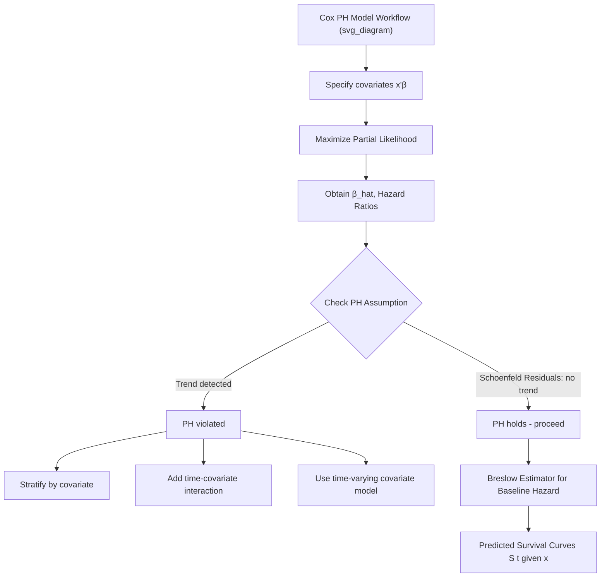

## The Cox Proportional Hazards Model

### Overview

The Cox proportional hazards model (Cox, 1972) is the most widely used **semiparametric** approach to duration/survival analysis. It models the effect of covariates on the hazard rate without requiring the analyst to specify the functional form of the baseline hazard over time — a major advantage over fully parametric duration models (exponential, Weibull, etc.) when the true shape of duration dependence is unknown or not of primary interest.

### The Model Specification

The hazard function for individual $i$ with covariate vector $x_i$ is specified as:

$$\lambda_i(t \mid x_i) = \lambda_0(t) \exp(x_i'\beta)$$

where:

- $\lambda_0(t)$ is the **baseline hazard function** — the hazard for an individual with $x_i = 0$ — left completely unspecified (nonparametric component)
- $\exp(x_i'\beta)$ is the **relative risk** (or hazard ratio) component, a parametric function of covariates
- $\beta$ is the vector of coefficients to be estimated

**Key Points**

- The model is called "semiparametric" because $\beta$ is estimated without ever specifying $\lambda_0(t)$
- The multiplicative structure gives the model its name: the ratio of hazards for any two individuals is constant over time (does not depend on $t$)

### The Proportional Hazards Assumption

For two individuals with covariate vectors $x_i$ and $x_j$, the hazard ratio is:

$$\frac{\lambda_i(t)}{\lambda_j(t)} = \frac{\lambda_0(t)\exp(x_i'\beta)}{\lambda_0(t)\exp(x_j'\beta)} = \exp\big((x_i - x_j)'\beta\big)$$

The $\lambda_0(t)$ terms cancel, so this ratio is **constant across all values of $t$** — this is the defining "proportional hazards" property. It implies that covariate effects scale the hazard uniformly over the entire duration; the hazards for two groups (e.g., treated vs. control) never cross.

### Partial Likelihood Estimation

The key methodological innovation of Cox's model is estimating $\beta$ **without estimating $\lambda_0(t)$ at all**, via the **partial likelihood**.

At each observed event time $t_{(k)}$, let $R(t_{(k)})$ denote the **risk set** — the set of all individuals still "at risk" (not yet failed, not yet censored) just before $t_{(k)}$. Conditional on exactly one event occurring at $t_{(k)}$, the probability that it is individual $i$ (who did fail) rather than any other individual in the risk set is:

$$L_k(\beta) = \frac{\exp(x_i'\beta)}{\sum_{j \in R(t_{(k)})} \exp(x_j'\beta)}$$

The **partial likelihood** across all $K$ observed event times is the product:

$$PL(\beta) = \prod_{k=1}^{K} \frac{\exp(x_{i(k)}'\beta)}{\sum_{j \in R(t_{(k)})} \exp(x_j'\beta)}$$

Maximizing $\ln PL(\beta)$ with respect to $\beta$ yields the Cox estimator $\hat{\beta}$. Because censored observations still contribute to the risk-set denominator (they are "at risk" until censored) but never appear in the numerator, censoring is naturally accommodated.

**Key Points**

- The partial likelihood depends only on the **rank ordering** of event times, not their actual numeric values — this is what allows $\lambda_0(t)$ to drop out entirely
- $\hat{\beta}$ from partial likelihood maximization is consistent and asymptotically normal under standard regularity conditions
- Standard errors come from the inverse of the observed information matrix (negative Hessian of the partial log-likelihood)

### Handling Tied Event Times

The exact partial likelihood formula assumes no two events occur at exactly the same time, which real (often discretely recorded) data frequently violates. Three standard approximations exist:

- **Breslow method**: simplest, uses the full sum over all tied individuals in the denominator for each tied event — computationally cheap but biased when ties are numerous
- **Efron method**: more accurate approximation, adjusts the denominator by successively reducing the tied risk set — the standard default in most modern software
- **Exact (discrete) method**: computes the true combinatorial partial likelihood over all possible orderings of tied events — most accurate but computationally expensive with many ties

**[Unverified]** Which method is the software default varies by package and version (e.g., R's `coxph()` defaults to Efron; other packages may default to Breslow) — confirm the active default before relying on numerical results.

### Interpretation of Coefficients

- $\hat{\beta}_k$ represents the **log hazard ratio** per unit increase in $x_k$
- $\exp(\hat{\beta}_k)$ is the **hazard ratio (HR)**:
  - $HR > 1$: covariate increases the hazard (shortens expected duration / raises event risk)
  - $HR < 1$: covariate decreases the hazard (protective effect, lengthens duration)
  - $HR = 1$: no effect
- Because $\lambda_0(t)$ is never estimated, **the Cox model does not directly yield fitted survival probabilities** without an additional step (see below)

**Example**

If a covariate "treatment" (1 = treated, 0 = control) has $\hat{\beta} = -0.51$, then $HR = \exp(-0.51) \approx 0.60$. Treated individuals experience the event at 60% of the hazard rate of controls at any point in time, holding other covariates fixed — a 40% hazard reduction.

### Recovering the Baseline Hazard and Survival Function

Although $\lambda_0(t)$ is not estimated as part of $\hat{\beta}$'s partial likelihood, it can be estimated afterward using the **Breslow estimator** of the cumulative baseline hazard:

$$\hat{\Lambda}_0(t) = \sum_{t_{(k)} \le t} \frac{d_k}{\sum_{j \in R(t_{(k)})} \exp(x_j'\hat{\beta})}$$

where $d_k$ is the number of events at $t_{(k)}$. The estimated survival function for an individual with covariates $x$ is then:

$$\hat{S}(t \mid x) = \exp\left(-\hat{\Lambda}_0(t) \exp(x'\hat{\beta})\right) = \hat{S}_0(t)^{\exp(x'\hat{\beta})}$$

This is a step function (since $\hat{\Lambda}_0(t)$ jumps only at observed event times), in contrast to the smooth survival curves produced by fully parametric models.

### Checking the Proportional Hazards Assumption

The PH assumption is testable and should not be assumed without verification:

- **Schoenfeld residuals**: plotted against time; a non-zero slope/trend indicates a violation of proportionality for that covariate. A formal test (e.g., `cox.zph()` in R) provides a chi-squared test statistic per covariate and globally
- **Log-log survival plots**: for a categorical covariate, plotting $\ln(-\ln \hat{S}(t))$ against $\ln(t)$ for each group — parallel curves support PH; crossing or diverging curves suggest violation
- **Time-varying covariate interaction test**: adding an interaction term $x_k \times g(t)$ (e.g., $g(t) = \ln t$) and testing whether its coefficient is significantly different from zero

**Key Points — Remedies for PH Violations**

- **Stratification**: stratify the baseline hazard by the violating covariate (allows a separate, unspecified $\lambda_{0,s}(t)$ per stratum $s$), sacrificing the ability to estimate that covariate's own coefficient
- **Time-varying coefficients**: replace $\beta_k$ with $\beta_k(t)$, e.g., $\beta_k + \gamma_k \cdot t$, and estimate the interaction
- **Extended Cox model with time-dependent covariates**: split the time axis into intervals and let covariate values (or their effects) change across intervals

### Extensions

**Time-Dependent Covariates**

Covariates that change value during the spell (e.g., time-varying income, evolving treatment status) require the "counting process" or start-stop data format, where each subject contributes multiple rows, each with a $(t_{start}, t_{stop}]$ interval and covariate values valid over that interval. The partial likelihood generalizes naturally since the risk set at each event time simply uses the covariate value in effect at that moment.

**Stratified Cox Model**

Allows a separate baseline hazard for each level of a stratifying variable while sharing $\beta$ across strata:

$$\lambda_{is}(t) = \lambda_{0s}(t)\exp(x_i'\beta)$$

Useful when a variable (e.g., study center, cohort) is believed to affect the baseline hazard shape but its own coefficient is not of interest, or when it violates the PH assumption.

**Frailty (Shared and Individual)**

As with parametric models, unobserved heterogeneity can be incorporated via a multiplicative frailty term, often estimated via a **shared frailty** model for clustered data (e.g., multiple spells per firm), typically assuming a Gamma-distributed frailty for computational tractability.

**Competing Risks Extension**

When multiple distinct event types can terminate a spell (e.g., exit to employment vs. exit to inactivity), cause-specific Cox models are fit separately for each cause, treating other-cause events as censored, or a **Fine-Gray subdistribution hazard model** is used when interest is in cumulative incidence.

### Cox Model vs. Parametric Duration Models

| Feature | Cox PH | Parametric (e.g., Weibull) |
| --- | --- | --- |
| Baseline hazard | Unspecified | Fully specified functional form |
| Estimation | Partial likelihood | Full maximum likelihood |
| Efficiency | Less efficient if parametric form is correct | More efficient if correctly specified |
| Robustness | Robust to baseline hazard misspecification | Biased if distribution misspecified |
| Direct survival prediction | Requires Breslow estimator (step function) | Direct smooth $S(t)$ formula |
| Extrapolation beyond data | Not reliable (baseline hazard undefined outside observed range) | Possible (analytical form) |

### Diagnostics Diagram

### Software Implementation Notes

- **R**: `coxph(Surv(time, status) ~ x1 + x2, data = df, ties = "efron")` from the `survival` package; `cox.zph()` for PH diagnostics; `survfit()` on the fitted object for Breslow-based survival curves
- **Stata**: `stcox x1 x2, efron` (or `breslow`/`exactm`); `estat phtest` for the PH assumption test
- **Python**: `lifelines.CoxPHFitter().fit(df, duration_col='time', event_col='status')`; `.check_assumptions()` for Schoenfeld-residual-based diagnostics

**[Unverified]** Exact function names, default tie-handling methods, and diagnostic output formats can change between package versions; verify against the documentation for the specific version installed.

### Worked Example

Modeling firm survival (time to bankruptcy) with covariates: leverage ratio, firm size (log assets), and industry sector dummy.

$$\lambda(t \mid x) = \lambda_0(t)\exp(\beta_1 \, \text{leverage} + \beta_2 \, \text{log\_assets} + \beta_3 \, \text{industry})$$

Suppose $\hat{\beta}_1 = 0.85$ (leverage) and $\hat{\beta}_2 = -0.30$ (log assets). Then:

- $HR_{leverage} = \exp(0.85) \approx 2.34$: a one-unit increase in leverage ratio more than doubles the bankruptcy hazard, holding size and industry fixed
- $HR_{assets} = \exp(-0.30) \approx 0.74$: larger firms (higher log assets) face a 26% lower bankruptcy hazard

A Schoenfeld residual test finds a significant time-trend in the leverage coefficient — the effect of leverage on bankruptcy risk **weakens** in later periods. This is a PH violation and would motivate either stratifying by a leverage category or adding a leverage × $\ln(t)$ interaction term. **[Inference]** These specific coefficient values and the described PH-violation pattern are illustrative constructs for exposition, not results from a cited empirical study.

### Related Topics

- Parametric duration models (Weibull, exponential, log-logistic)
- Schoenfeld and martingale residual diagnostics
- Time-varying covariates and counting-process data structures
- Stratified and frailty extensions of the Cox model
- Competing risks and the Fine-Gray model
- Discrete-time hazard models (complementary log-log link) as an alternative when many exact ties occur
- Accelerated failure time (AFT) models as a non-PH parametric alternative