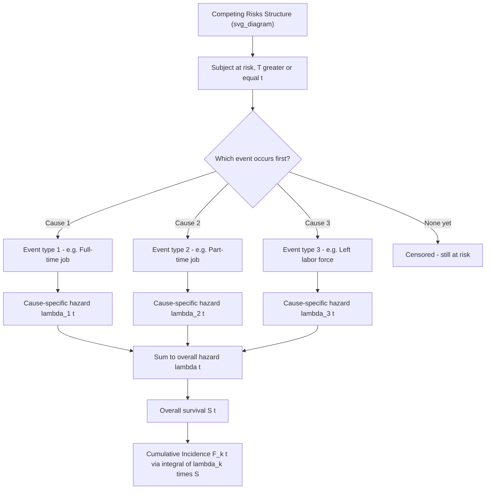

## Competing Risks Models

### Overview

Competing risks models extend duration/survival analysis to settings where a subject can experience one of **several mutually exclusive event types**, and the occurrence of one event precludes (or "censors") the others. Standard examples: an unemployed worker can exit to full-time employment, part-time employment, or leave the labor force; a patient can die from disease progression or from unrelated causes; a loan can end in prepayment or default. Treating competing events as ordinary independent censoring — the naive approach — generally produces biased estimates of the event-specific risk of interest.

### Setup and Notation

Let $T$ be the time to the first of $K$ mutually exclusive event types, and let $C \in \{1, \dots, K\}$ denote which **cause** occurred. The data for individual $i$ consist of $(t_i, d_i, c_i)$ where $t_i$ is the observed time (event or censoring), $d_i$ indicates whether an event of any kind was observed, and $c_i$ indicates the cause among those with $d_i = 1$.

### Cause-Specific Hazard

The **cause-specific hazard function** for cause $k$ is defined as the instantaneous rate of experiencing event $k$, given survival free of *any* event up to $t$:

$$\lambda_k(t) = \lim_{\Delta t \to 0} \frac{P(t \le T < t + \Delta t, \, C = k \mid T \ge t)}{\Delta t}$$

The **overall (all-cause) hazard** is the sum across causes:

$$\lambda(t) = \sum_{k=1}^{K} \lambda_k(t)$$

and the overall survival function (probability of remaining event-free of any type) is:

$$S(t) = \exp\left(-\int_0^t \lambda(u)\,du\right) = \exp\left(-\sum_{k=1}^K \Lambda_k(t)\right)$$

**Key Points**

- $\lambda_k(t)$ is a legitimate, well-defined hazard even in the presence of competing risks
- Individuals who experience a competing event (cause $\ne k$) are treated as censored at that time when estimating $\lambda_k(t)$ — this is valid for the cause-specific hazard *itself*, unlike for the cumulative incidence (see below)

### Cumulative Incidence Function (CIF)

The quantity of central applied interest is usually not the hazard but the **probability of actually experiencing cause $k$ by time $t$**, accounting for the fact that other causes may occur first and remove the subject from risk. This is the **cumulative incidence function**:

$$F_k(t) = P(T \le t, C = k) = \int_0^t \lambda_k(u) \, S(u^-) \, du$$

**Key Points — Why CIF Differs from Naive Kaplan-Meier**

- $F_k(t)$ is weighted by the *overall* survival function $S(u^-)$, not by a survival function computed treating only cause $k$'s events as failures
- If one naively applies the standard Kaplan-Meier estimator to cause $k$ (treating competing-cause events as independent censoring) and computes $1 - \hat{S}_k(t)$, this **overestimates** the true cumulative incidence of cause $k$, because it implicitly assumes that individuals who experienced a competing event would have gone on to experience cause $k$ eventually — an assumption that cannot be verified and is often implausible
- The CIFs across causes sum to the overall event probability: $\sum_k F_k(t) = 1 - S(t)$, but each $F_k(t)$ individually is generally **not** equal to $1 - S_k(t)$ from a cause-specific Kaplan-Meier

### Modeling Approaches

**1. Cause-Specific Hazards Approach**

Fit a separate Cox (or parametric) hazard model for each cause $k$, treating all other-cause events as censored:

$$\lambda_k(t \mid x) = \lambda_{0k}(t) \exp(x'\beta_k)$$

This is estimated by simply running $K$ separate standard survival analyses, each with only cause-$k$ events coded as "failures" and everything else (competing events plus true censoring) coded as censored.

- **Interpretation**: $\exp(\beta_{k,j})$ is the hazard ratio for covariate $j$ on the instantaneous rate of cause $k$, among those currently event-free
- **Limitation**: coefficients from this approach describe the *hazard*, not the cumulative probability of cause $k$ occurring — a covariate can have a "protective" cause-specific hazard ratio for cause $k$ while still being associated with a *higher* cumulative incidence of cause $k$, if it strongly reduces the hazard of the competing cause (freeing up more of the population to eventually experience cause $k$)

**2. Fine-Gray Subdistribution Hazard Model**

Proposed by Fine and Gray (1999) to model the CIF directly via regression. Defines the **subdistribution hazard**:

$$\lambda_k^{sd}(t) = \lim_{\Delta t \to 0} \frac{P(t \le T < t+\Delta t, \, C=k \mid T \ge t \; \text{OR} \; (T < t \; \text{AND} \; C \ne k))}{\Delta t}$$

The key conceptual difference: the risk set for the subdistribution hazard **keeps individuals who already experienced a competing event** in the (artificial) risk set, rather than removing them. This ensures a direct, monotonic relationship between $\lambda_k^{sd}(t)$ and $F_k(t)$:

$$F_k(t) = 1 - \exp\left(-\Lambda_k^{sd}(t)\right)$$

Fit via a Cox-type partial likelihood using **inverse probability of censoring weights (IPCW)** to properly weight individuals who have already failed from a competing cause but are kept artificially at risk.

**Key Points**

- $\exp(\beta_k^{sd})$ from the Fine-Gray model has a direct interpretation as the effect of a covariate on the **cumulative incidence** of cause $k$ (a subdistribution hazard ratio), which is often the policy-relevant quantity
- Fine-Gray and cause-specific hazard models can, and often do, give **coefficients of different sign or magnitude** for the same covariate — this is not a contradiction, but reflects that they answer different questions (instantaneous rate vs. cumulative probability)

**3. Direct Parametric Modeling of the CIF**

Flexible parametric or spline-based models (e.g., Fine-Gray with flexible baseline, or multinomial-logit-style discrete-time competing risk models) can also directly parameterize $F_k(t \mid x)$.

### Comparison Table

| Approach | Target quantity | Risk-set treatment of competing events | Typical use case |
| --- | --- | --- | --- |
| Cause-specific Cox | Instantaneous hazard $\lambda_k(t)$ | Removed from risk set (treated as censored) | Etiological/biological questions about mechanism |
| Fine-Gray | Cumulative incidence $F_k(t)$ | Kept in risk set (weighted) | Prognostic/policy questions about probability of outcome |
| Naive KM on cause $k$ | $1 - S_k(t)$ (biased for $F_k(t)$) | Removed, treated as independent censoring | Not recommended — included here for contrast only |

### Diagnostic and Practical Considerations

- Always report and plot **all** cause-specific CIFs together — since they sum (with overall survival) to 1, examining them jointly avoids over-interpreting one cause in isolation
- The independent-censoring assumption required for standard survival techniques does **not** apply between competing causes by construction — competing events are, by definition, informative about the process, not administratively unrelated censoring. This is why the Fine-Gray/cause-specific distinction exists in the first place
- **[Inference]** Model choice (cause-specific vs. Fine-Gray) should generally be guided by the substantive research question rather than by preferring one as universally "more correct" — this is the mainstream methodological recommendation, though some applied literature still defaults to Fine-Gray by convention for regulatory/clinical reporting

### Worked Example

Consider a labor economics application: unemployed workers can exit to (1) full-time employment, (2) part-time employment, or remain unemployed (censored at survey end).

- A cause-specific Cox model for "exit to full-time employment" finds a job-training-program covariate has hazard ratio $\exp(\beta) = 1.3$ — trainees exit to full-time work at 1.3 times the *instantaneous rate* of non-trainees, among those still unemployed
- A Fine-Gray model for the same cause might find a subdistribution hazard ratio of only $1.1$ — the effect on the *actual cumulative probability* of ever reaching full-time employment by, say, month 12 is smaller, because the training program *also* increases the competing hazard of part-time exit, which removes some workers from the pool who might otherwise have gone on to full-time work

**[Inference]** This example is a stylized construction to illustrate the divergence between cause-specific and subdistribution hazard interpretations; it is not drawn from a specific cited study.

### Diagram: Competing Risks Framework

### Cumulative Incidence Curves (SVG Illustration)

<svg xmlns="http://www.w3.org/2000/svg" viewBox="0 0 640 340">
<text x="320" y="24" font-size="16" font-weight="bold" text-anchor="middle" fill="#222">Stacked Cumulative Incidence Functions (svg_diagram)</text>
<line x1="60" y1="290" x2="600" y2="290" stroke="#333" stroke-width="2" />
<line x1="60" y1="290" x2="60" y2="50" stroke="#333" stroke-width="2" />
<text x="330" y="320" font-size="13" text-anchor="middle" fill="#333">Time (t)</text>
<text x="25" y="170" font-size="13" text-anchor="middle" fill="#333" transform="rotate(-90 25 170)">Cumulative Probability</text>
<text x="90" y="70" font-size="11" fill="#333">1.0</text>
<line x1="60" y1="70" x2="600" y2="70" stroke="#ccc" stroke-dasharray="4" />

<path d="M 60 290 C 200 280 400 240 600 210 L 600 290 Z" fill="#1f77b4" opacity="0.55" />
<text x="610" y="215" font-size="11" fill="#1f77b4">F1(t): Full-time exit</text>

<path d="M 60 290 C 200 280 400 240 600 210 C 420 190 220 175 60 165 Z" fill="#d62728" opacity="0.55" />
<text x="610" y="170" font-size="11" fill="#d62728">F2(t): Part-time exit</text>

<path d="M 60 165 C 220 175 420 190 600 210 L 600 70 L 60 70 Z" fill="#7f7f7f" opacity="0.25" />
<text x="610" y="120" font-size="11" fill="#555">Still at risk (1 - sum F_k)</text>
</svg>

### Software Implementation Notes

- **R**: `survival::coxph()` with cause-specific censoring coding for cause-specific hazards; `cmprsk::crr()` or `survival::finegray()` (transforms data, then feeds into `coxph()`) for Fine-Gray; `cuminc()` in `cmprsk` for nonparametric CIF estimation (Aalen-Johansen estimator)
- **Stata**: `stcrreg` for Fine-Gray regression; `stcox` with cause-specific censoring for cause-specific hazards; `stcompet` for nonparametric CIF
- **Python**: `lifelines.AalenJohansenFitter` for nonparametric CIF estimation; Fine-Gray implementations are less mature natively in Python compared to R/Stata

**[Unverified]** Package function names and required data restructuring steps (e.g., the "long" format needed for `finegray()`) can change across versions — consult current documentation before implementation.

### Related Topics

- The Cox proportional hazards model (foundation for cause-specific and Fine-Gray extensions)
- Parametric duration models (as an alternative baseline specification within cause-specific approaches)
- Multi-state models (a generalization allowing transitions between more than two states, of which competing risks is a special case with one starting state and $K$ absorbing states)
- Aalen-Johansen estimator (nonparametric CIF estimation)
- Frailty and unobserved heterogeneity in multi-cause duration settings
- Discrete-time competing risks models (multinomial logit / complementary log-log with multiple outcomes)