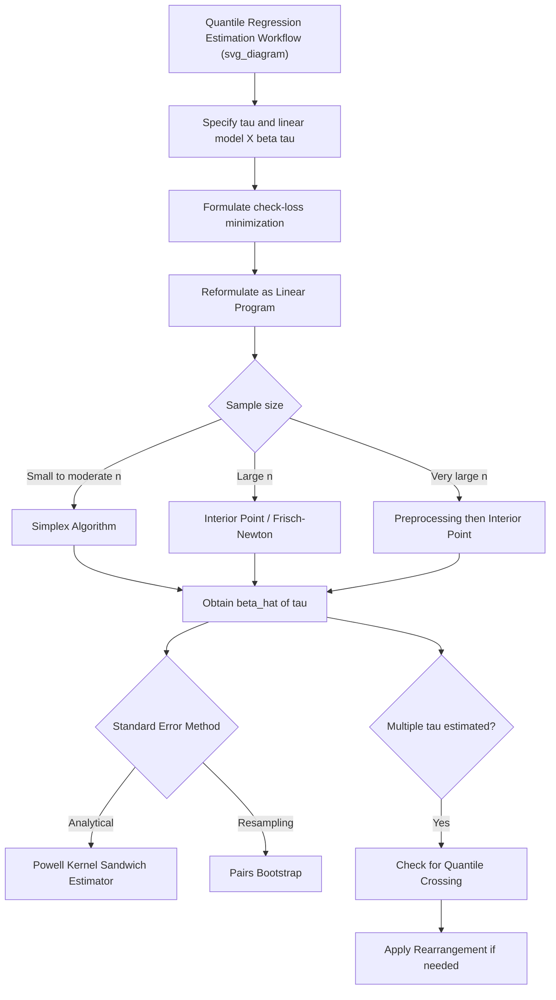

## Estimation of Quantile Regression Models

### Overview

Estimating a quantile regression model requires minimizing an asymmetric, piecewise-linear loss function that is not differentiable everywhere — unlike OLS, where a closed-form solution follows from setting the gradient of a smooth squared-error objective to zero. This non-differentiability means quantile regression estimation relies on **linear programming** methods rather than calculus-based normal equations, and understanding this computational structure is essential to interpreting the estimator's properties, including its asymptotic behavior and the standard error methods used in practice.

### The Estimation Problem

For the linear conditional quantile specification $Q_{Y|X}(\tau \mid x) = x'\beta(\tau)$, the quantile regression estimator $\hat{\beta}(\tau)$ solves:

$$\hat{\beta}(\tau) = \arg\min_{\beta \in \mathbb{R}^k} \sum_{i=1}^{n} \rho_\tau(y_i - x_i'\beta)$$

where $\rho_\tau(u)$ is the check (pinball) loss:

$$\rho_\tau(u) = u\big(\tau - \mathbb{1}(u<0)\big)$$

Expanding, the sample objective function is:

$$\sum_{i: y_i \ge x_i'\beta} \tau |y_i - x_i'\beta| + \sum_{i: y_i < x_i'\beta} (1-\tau)|y_i - x_i'\beta|$$

Residuals above the fitted quantile line are weighted by $\tau$; residuals below are weighted by $1-\tau$. At $\tau = 0.5$, both weights equal $0.5$, and the problem reduces to **Least Absolute Deviations (LAD)** regression — minimizing the sum of absolute residuals, which is itself a special case of quantile regression.

### Linear Programming Formulation

The objective function $\sum_i \rho_\tau(y_i - x_i'\beta)$ is piecewise linear in $\beta$ (a sum of absolute-value-like kinks), so it cannot be minimized by setting a smooth derivative to zero. The standard approach reformulates the problem as a **linear program (LP)**.

Introduce nonnegative slack variables $u_i^+ \ge 0$ (positive part of the residual) and $u_i^- \ge 0$ (negative part), such that:

$$y_i - x_i'\beta = u_i^+ - u_i^-, \quad u_i^+ , u_i^- \ge 0, \quad u_i^+ \cdot u_i^- = 0$$

The estimation problem becomes:

$$\min_{\beta, u^+, u^-} \; \tau \sum_{i=1}^n u_i^+ + (1-\tau) \sum_{i=1}^n u_i^- \quad \text{subject to} \quad y_i - x_i'\beta = u_i^+ - u_i^-, \; u_i^+, u_i^- \ge 0$$

This is a standard-form linear program: a linear objective subject to linear equality and nonnegativity constraints. It is solved via specialized LP algorithms rather than general nonlinear optimizers.

**Key Points**

- The **simplex method** was the original algorithm proposed by Koenker and Bassett (1978) and remains efficient for moderate sample sizes
- **Interior point methods** (e.g., the Frisch-Newton algorithm) scale much better to large datasets and are the modern default in most software for large $n$
- Because the solution is an LP vertex solution, the quantile regression fit exhibits an "exact fit" property: at the optimum, exactly $k$ residuals (where $k$ is the number of parameters) are typically driven to zero — the fitted line passes exactly through $k$ data points, analogous to how a LAD line is pinned by extreme/median observations rather than smoothly averaging all of them

### Algorithms in Practice

**Simplex-Based Algorithms**

Efficient for small-to-moderate $n$ and $k$; guarantees an exact solution up to numerical precision since the LP has no rounding/convergence tolerance issues inherent to iterative smooth optimization.

**Interior Point / Frisch-Newton Algorithm**

Preferred for large datasets because computational cost grows more favorably with $n$. Approximates the solution via a sequence of smoothed subproblems, converging to the exact LP solution.

**Preprocessing/Partitioning Methods**

For very large $n$ (e.g., millions of observations), preprocessing algorithms (e.g., Portnoy-Koenker) reduce the effective problem size by eliminating observations unlikely to be binding at the LP solution before running the full optimization, substantially speeding up estimation without sacrificing exactness.

**[Unverified]** The specific algorithm invoked by default varies by software and sample size threshold (e.g., R's `quantreg` package automatically switches between simplex, Frisch-Newton, and preprocessing methods depending on data size) — consult current package documentation for the active default in a given version.

### Asymptotic Properties

Under standard regularity conditions (correct specification of the linear conditional quantile model, i.i.d. or appropriately dependent sampling, and continuity of the conditional density of $Y$ at the quantile of interest), the quantile regression estimator is:

- **Consistent**: $\hat{\beta}(\tau) \xrightarrow{p} \beta(\tau)$
- **Asymptotically normal**:

$$\sqrt{n}\big(\hat{\beta}(\tau) - \beta(\tau)\big) \xrightarrow{d} N\big(0, \; \tau(1-\tau) \, D^{-1} \Omega D^{-1}\big)$$

where $D = E[f_{Y|X}(x'\beta(\tau) \mid x) \, xx']$ involves the conditional density of $Y$ evaluated at the quantile itself, and $\Omega = E[xx']$.

**Key Points**

- The asymptotic variance depends on the **conditional density** $f_{Y|X}(\cdot)$ evaluated exactly at the fitted quantile — this is the "sparsity function" and is the main complication in variance estimation, since density estimation is inherently less precise than distribution estimation
- The factor $\tau(1-\tau)$ shows that the asymptotic variance is largest at $\tau = 0.5$ and shrinks toward the tails ($\tau \to 0$ or $\tau \to 1$) in this component — but this is often offset by the conditional density term $D$, which is typically smaller in the tails (sparser data), so overall precision at extreme quantiles is generally worse in practice, not better. **[Inference]** The net direction of precision change across $\tau$ depends on the interaction of both terms and the specific data-generating process; it should not be assumed a priori without diagnostic checks in a given application.

### Standard Error Estimation Methods

Because the sparsity function $f_{Y|X}(\cdot)$ must be estimated (it involves a density, not a distribution function, and cannot be estimated as precisely), several distinct approaches to inference exist:

**1. Direct (Analytical) Sandwich Estimator**

Plugs a kernel density estimate of $f_{Y|X}$ into the sandwich formula above. Requires choosing a bandwidth for the density estimate, which introduces a bias-variance tradeoff sensitive to the bandwidth choice.

**2. Powell's Kernel Estimator**

A widely used analytical approach (Powell, 1991) that estimates the sparsity function locally using a kernel around each fitted residual, producing heteroskedasticity-robust standard errors without requiring i.i.d. errors across $x$.

**3. Bootstrap Methods**

- **Pairs (XY-pairs) bootstrap**: resamples entire $(y_i, x_i)$ observations with replacement, re-estimates $\hat{\beta}(\tau)$ on each resample, and uses the empirical distribution of the resampled estimates for inference — robust to heteroskedasticity and does not require estimating the sparsity function directly
- **Wild/residual bootstrap variants**: adapted versions for specific dependence structures (e.g., clustered or panel data)

**Key Points**

- Bootstrap methods are the most commonly recommended default in applied work **[Inference]** because they avoid the bandwidth-selection sensitivity of direct density-based estimators, though this reflects a common practitioner preference rather than a universal theoretical dominance result
- For clustered data (e.g., repeated observations per firm or individual), a cluster-robust bootstrap (resampling clusters rather than individual observations) is necessary to obtain valid standard errors

### Estimating Multiple Quantiles Simultaneously

In applied work, it is standard to estimate $\hat{\beta}(\tau)$ across a grid of $\tau$ values (e.g., $\tau = 0.1, 0.25, 0.5, 0.75, 0.9$) to trace out the full conditional quantile process. Two considerations arise:

- **Quantile crossing**: since each $\hat{\beta}(\tau)$ is estimated as a separate LP solution, nothing mechanically guarantees $x'\hat{\beta}(\tau_1) \le x'\hat{\beta}(\tau_2)$ for $\tau_1 < \tau_2$ at every $x$ in finite samples, even though the true population quantile functions must satisfy this. Crossing is more likely in regions with sparse data (extreme $x$ values) or with many quantiles estimated on small samples
- **Rearrangement**: a common post-estimation fix (Chernozhukov, Fernández-Val, and Galichon, 2010) that monotonically re-sorts the fitted quantile curves at each $x$ to restore the theoretical monotonicity property, without altering the estimates' asymptotic properties

### Diagram: Quantile Regression Estimation Pipeline

### Estimation vs. OLS: Summary Comparison

| Feature | OLS | Quantile Regression |
| --- | --- | --- |
| Loss function | Squared error (smooth, differentiable) | Check/pinball loss (piecewise linear, non-differentiable at 0) |
| Solution method | Closed-form (normal equations) | Linear programming (simplex / interior point) |
| Estimates | Conditional mean | Conditional quantile at chosen τ |
| Standard errors | Homoskedastic or heteroskedasticity-robust (White) formulas | Powell kernel sandwich, or bootstrap (pairs/cluster) |
| Sensitive to outliers in Y | Yes (quadratic penalty) | Less so, especially near median |
| Exact-fit property | No | Yes — fitted line passes through exactly $k$ data points at the LP optimum |

### Worked Example

Estimating the median (τ = 0.5) and 90th percentile (τ = 0.9) of firm profit margins as a function of firm size (log employees), using a sample of 5,000 firms:

1. Formulate the LP for $\tau = 0.5$: minimize $\sum_i \rho_{0.5}(y_i - x_i'\beta)$, equivalent to LAD regression
2. Solve via interior point (Frisch-Newton) given the moderate-to-large $n$
3. Obtain $\hat{\beta}(0.5)$; compute Powell kernel standard errors, or run a pairs bootstrap with, e.g., 500 replications for confidence intervals
4. Repeat steps 1–3 for $\tau = 0.9$, obtaining a separate $\hat{\beta}(0.9)$
5. Compare $\hat{\beta}_{size}(0.5)$ vs. $\hat{\beta}_{size}(0.9)$: if the coefficient on firm size is larger at $\tau = 0.9$, larger firms disproportionately drive up the *upper tail* of profit margins relative to the typical (median) firm
6. Check whether $x'\hat{\beta}(0.5) \le x'\hat{\beta}(0.9)$ holds across the observed range of firm sizes in the sample; if crossing is detected at extreme values, apply a rearrangement procedure

**[Inference]** This example uses a hypothetical dataset and stylized results for illustration; it is not drawn from a specific cited study.

### Software Implementation Notes

- **R**: `quantreg::rq(y ~ x, tau = 0.5, data = df)`; `method = "br"` (Barrodale-Roberts simplex variant, default for small-to-moderate $n$), `method = "fn"` (Frisch-Newton, recommended for large $n$), `method = "pfn"` (preprocessing Frisch-Newton for very large $n$); `summary(fit, se = "boot")` or `se = "nid"` for different standard error methods
- **Stata**: `qreg y x, quantile(0.5)` (simplex-based by default); `bsqreg` for bootstrap standard errors; `sqreg` for estimating multiple quantiles jointly with a joint bootstrap covariance matrix (allows testing equality of coefficients across quantiles)
- **Python**: `statsmodels.regression.quantile_regression.QuantReg` (interior-point-based); scikit-learn's `QuantileRegressor` (linear-programming-based via `scipy.optimize.linprog` or similar solvers)

**[Unverified]** Default algorithm choices, standard error options, and solver backends can differ across package versions — confirm current defaults against the installed version's documentation before drawing methodological conclusions from default output.

### Related Topics

- Conditional quantile functions (theoretical foundation)
- Check/pinball loss function properties
- Quantile crossing and rearrangement methods (Chernozhukov-Fernández-Val-Galichon)
- Powell's kernel-based sparsity estimator
- Bootstrap inference methods for non-smooth estimators
- Quantile regression for panel/clustered data
- Extensions: quantile regression with instrumental variables, censored quantile regression