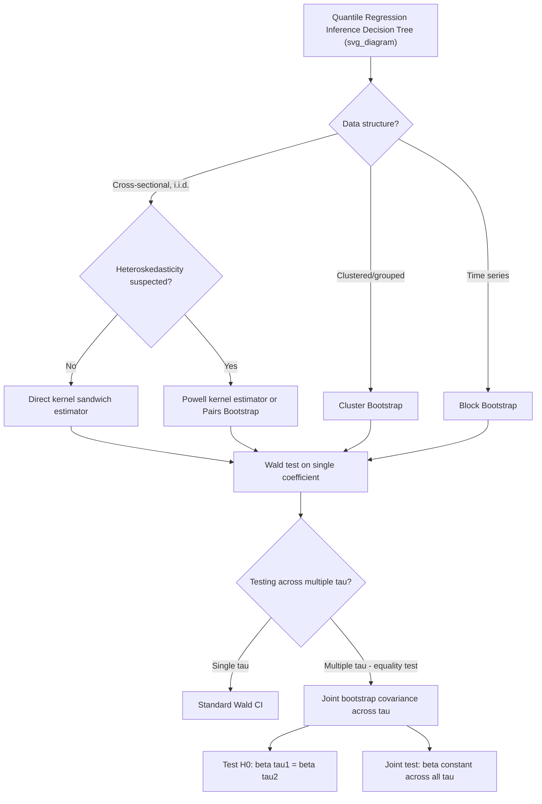

## Inference for Quantile Regression

### Overview

Inference for quantile regression — constructing standard errors, confidence intervals, and hypothesis tests for $\hat{\beta}(\tau)$ — presents challenges distinct from OLS inference because the estimator's asymptotic variance depends on the **conditional density** of the outcome at the fitted quantile (the "sparsity function"), a quantity that is inherently harder to estimate precisely than a distribution function. This chapter-level treatment covers the main analytical and resampling-based approaches, tests specific to the quantile regression setting (such as testing for equality of slopes across quantiles), and practical considerations for dependent or clustered data.

### The Core Inference Problem

Recall the asymptotic distribution of the quantile regression estimator:

$$\sqrt{n}\big(\hat{\beta}(\tau) - \beta(\tau)\big) \xrightarrow{d} N\big(0, \; \tau(1-\tau) \, D(\tau)^{-1} \Omega \, D(\tau)^{-1}\big)$$

where $\Omega = E[xx']$ and:

$$D(\tau) = E\big[f_{Y|X}(x'\beta(\tau) \mid x)\, xx'\big]$$

The matrix $D(\tau)$ involves $f_{Y|X}(\cdot \mid x)$ — the **conditional probability density function** of $Y$, evaluated exactly at the $\tau$-th conditional quantile. Unlike $\Omega$, which is trivially estimated by the sample average of $x_ix_i'$, $D(\tau)$ requires **density estimation**, and density estimates converge more slowly than distribution function estimates and are sensitive to smoothing-parameter (bandwidth) choices. This single fact motivates most of the methodological alternatives below.

### Analytical (Sandwich) Approaches

**Direct Kernel-Based Sparsity Estimation**

The most direct approach estimates $f_{Y|X}(x_i'\hat{\beta}(\tau) \mid x_i)$ using a kernel density estimator built from the residuals around the fitted quantile line, then plugs this into the sandwich formula. Requires a bandwidth choice (commonly via Silverman's rule-of-thumb or Hall-Sheather bandwidth), which introduces a bias-variance tradeoff: too narrow a bandwidth gives a noisy density estimate; too wide oversmooths and biases the variance estimate.

**Powell's Kernel Estimator**

Powell (1991) proposed a widely adopted alternative that estimates the sparsity locally without requiring an i.i.d. error assumption, making it robust to heteroskedasticity in the conditional distribution of $Y \mid X$ across observations. This is one of the most commonly implemented "analytical" standard error options in applied quantile regression software.

**Hall-Sheather Bandwidth**

A bandwidth selection rule specifically designed for quantile regression sparsity estimation (as opposed to general-purpose density bandwidths like Silverman's), often used as the default within Powell-type estimators.

**Key Points**

- Under **homoskedasticity of the underlying error term** across $x$ (i.e., $f_{Y|X}(\cdot|x)$ does not depend on $x$ except through location), $D(\tau)$ simplifies and variance estimation is more straightforward
- Under heteroskedasticity, robust sandwich-style estimators (Powell-type) are necessary; naive homoskedastic formulas will be biased

### Resampling-Based Approaches

**Pairs (XY) Bootstrap**

Resamples entire $(y_i, x_i)$ pairs with replacement, re-estimates $\hat{\beta}^{(b)}(\tau)$ on each bootstrap sample $b = 1, \dots, B$, and constructs standard errors or confidence intervals from the empirical distribution of $\{\hat{\beta}^{(b)}(\tau)\}$. This approach does not require direct estimation of the sparsity function and is robust to heteroskedasticity by construction, since resampling preserves the joint $(y,x)$ dependence structure observed in the data.

**Wild Bootstrap Variants**

Adapted for settings with specific error structures; particularly relevant when resampling residuals directly (rather than pairs) is desired while preserving heteroskedasticity patterns.

**Subsampling / $m$-out-of-$n$ Bootstrap**

Used in settings where the standard bootstrap is known to perform poorly (e.g., certain non-smooth or boundary-adjacent estimation problems); resamples subsets smaller than $n$ to restore valid asymptotic approximation in edge cases.

**Key Points — Practical Recommendation**

- The pairs bootstrap is generally the most commonly used default in applied quantile regression work **[Inference]**, reflecting a common practitioner preference for avoiding bandwidth-sensitivity in sparsity estimation, though this is not a universal theoretical dominance claim over all analytical alternatives in every setting
- For **clustered data** (e.g., repeated observations within firms, states, or individuals over time), a cluster bootstrap — resampling entire clusters rather than individual rows — is necessary; applying the standard pairs bootstrap to clustered data understates standard errors

### Hypothesis Testing in the Quantile Regression Framework

**Testing a Single Coefficient at One Quantile**

Standard Wald-type tests apply directly once a variance estimator (analytical or bootstrap) is obtained:

$$W = \frac{\hat{\beta}_j(\tau)}{\widehat{SE}(\hat{\beta}_j(\tau))} \sim N(0,1) \text{ asymptotically, under } H_0: \beta_j(\tau) = 0$$

**Testing Equality of Slopes Across Quantiles**

A test of particular interest in quantile regression: does a covariate's effect differ across the conditional distribution (e.g., is the effect of education on wages different at the 10th vs. 90th percentile)? Formally:

$$H_0: \beta_j(\tau_1) = \beta_j(\tau_2) \quad \text{for chosen } \tau_1 \ne \tau_2$$

This requires the **joint** asymptotic covariance of $\hat{\beta}(\tau_1)$ and $\hat{\beta}(\tau_2)$ (since both are estimated from the same sample, they are correlated), not just their individual variances. Joint bootstrap procedures (resampling once and re-estimating at both $\tau_1$ and $\tau_2$ from the same resample) naturally capture this correlation; some software (e.g., Stata's `sqreg`) implements simultaneous-quantile estimation with a joint bootstrap covariance matrix specifically to support this test.

**Testing the Overall Slope Equality (Location-Shift Null)**

A broader test asks whether the **entire vector** $\beta(\tau)$ is constant across all $\tau$ (except the intercept) — i.e., whether covariates only shift the location of $Y$'s conditional distribution without affecting its shape. This is a joint test across multiple quantiles simultaneously (an "F-type" or Wald test over the stacked quantile coefficient vector), and rejecting it is direct evidence that a covariate affects **more than just the conditional mean/location** — informing whether quantile regression provides information beyond a location-shift model.

**Key Points**

- Rejecting the equality-of-slopes test is often the primary substantive finding reported in applied quantile regression papers, since it directly demonstrates that OLS (which recovers only the average/location effect) misses heterogeneous covariate effects across the distribution
- Confidence bands across the full $\tau \in (0,1)$ process (rather than a single point-in-time confidence interval) require accounting for the correlation of $\hat{\beta}(\tau)$ across the entire grid — uniform confidence bands (e.g., via a Kolmogorov-Smirnov-type sup-statistic bootstrap) are used when the object of interest is the entire quantile process rather than a few isolated quantiles

### Confidence Intervals

Given a variance estimator $\widehat{Var}(\hat{\beta}(\tau))$, a standard Wald-based $(1-\alpha)$ confidence interval is:

$$\hat{\beta}_j(\tau) \pm z_{1-\alpha/2} \cdot \widehat{SE}(\hat{\beta}_j(\tau))$$

Alternatively, **bootstrap percentile intervals** use the empirical $\alpha/2$ and $1-\alpha/2$ quantiles of the bootstrap distribution $\{\hat{\beta}_j^{(b)}(\tau)\}_{b=1}^B$ directly, without assuming asymptotic normality — often preferred in smaller samples or when the sampling distribution of $\hat{\beta}(\tau)$ may be skewed.

### Special Considerations for Dependent and Panel Data

- **Time series / serial dependence**: standard i.i.d.-based sparsity and bootstrap formulas are invalid under serial correlation; block bootstrap methods (resampling contiguous blocks of time periods) are used to preserve dependence structure
- **Panel/fixed-effects quantile regression**: inference is complicated by the incidental parameters problem when including many individual fixed effects, and specialized estimators (e.g., Canay's two-step estimator, or Koenker's penalized fixed-effects approach) come with their own tailored inference procedures rather than a direct extension of cross-sectional formulas
- **[Unverified]** The precise finite-sample performance of these panel-quantile inference procedures is an active area of methodological research; simulation-based validation is recommended before relying on asymptotic approximations in small panels

### Comparison of Inference Approaches

| Method | Requires density estimation? | Robust to heteroskedasticity? | Typical use case |
| --- | --- | --- | --- |
| Direct kernel sandwich | Yes (bandwidth-sensitive) | Only if kernel allows local variation | Simple cross-sectional settings, large $n$ |
| Powell kernel estimator | Yes, but locally/robustly | Yes | Standard applied default for heteroskedastic cross-sectional data |
| Pairs bootstrap | No | Yes | General-purpose default; avoids bandwidth choice |
| Cluster bootstrap | No | Yes (plus cluster-robust) | Grouped/clustered data (firms, states, repeated units) |
| Block bootstrap | No | Yes (plus serial-dependence-robust) | Time series data |

### Diagram: Inference Workflow

### Worked Example

Testing whether the returns to education differ between the 10th and 90th percentiles of the log-wage distribution:

1. Estimate $\hat{\beta}_{educ}(0.1) = 0.05$ and $\hat{\beta}_{educ}(0.9) = 0.12$ using simultaneous-quantile regression (e.g., `sqreg` in Stata) with 500 bootstrap replications
2. The joint bootstrap procedure yields $\widehat{Var}(\hat{\beta}_{educ}(0.1))$, $\widehat{Var}(\hat{\beta}_{educ}(0.9))$, and $\widehat{Cov}(\hat{\beta}_{educ}(0.1), \hat{\beta}_{educ}(0.9))$
3. Construct the Wald statistic for $H_0: \beta_{educ}(0.1) = \beta_{educ}(0.9)$:

$$W = \frac{\big(\hat{\beta}_{educ}(0.9) - \hat{\beta}_{educ}(0.1)\big)^2}{\widehat{Var}(\hat{\beta}_{educ}(0.9)) + \widehat{Var}(\hat{\beta}_{educ}(0.1)) - 2\widehat{Cov}(\cdot,\cdot)}$$

4. If $W$ exceeds the relevant $\chi^2_1$ critical value, reject the null — providing statistical evidence that education's effect on wages differs across the wage distribution, a finding invisible to a single OLS regression

**[Inference]** The specific coefficient values in this example are illustrative constructs for exposition, not drawn from a cited empirical study.

### Software Implementation Notes

- **R**: `quantreg::rq()` with `summary(fit, se = "boot")` (pairs bootstrap), `se = "nid"` (analytical, assumes independent but non-identical errors), `se = "ker"` (Powell-type kernel estimator); `quantreg::rq.process` and related functions support inference across the full quantile process
- **Stata**: `qreg` with `vce(bootstrap)`; `sqreg` for simultaneous quantile estimation with joint bootstrap covariance, directly enabling slope-equality tests via `test`; `bsqreg` as a bootstrap-only single-quantile alternative
- **Python**: `statsmodels`' `QuantReg` supports basic analytical standard errors; joint multi-quantile inference and cluster/block bootstrap procedures are less mature natively and often require custom bootstrap loops

**[Unverified]** Exact default standard-error methods, bandwidth rules, and bootstrap replication counts differ across package versions; confirm current defaults in the specific version's documentation before interpreting reported significance levels.

### Related Topics

- Conditional quantile functions (theoretical foundation)
- Estimation of quantile regression models (linear programming, algorithms)
- Powell's kernel sparsity estimator and Hall-Sheather bandwidth selection
- Quantile crossing and rearrangement methods
- Panel and fixed-effects quantile regression (incidental parameters problem)
- Uniform confidence bands for the quantile regression process
- Quantile treatment effects and distributional policy evaluation