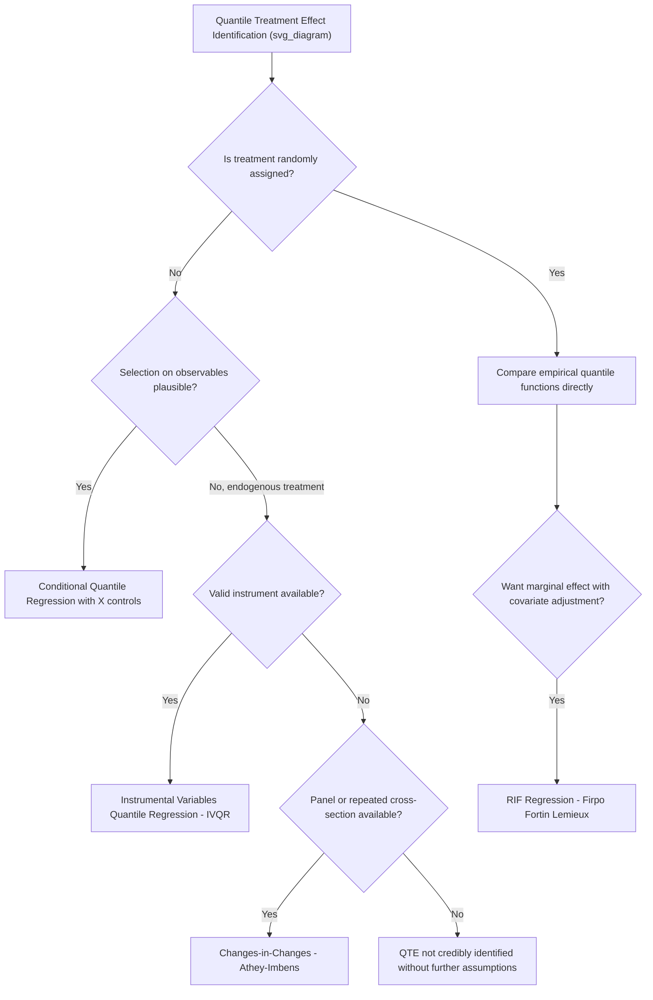

## Quantile Treatment Effects

### Overview

Quantile treatment effects (QTE) extend causal inference beyond the average treatment effect (ATE) by characterizing how a treatment or intervention shifts different points of the **outcome distribution**, not just its mean. Rather than answering "what is the average impact of treatment?", QTE analysis answers "how does treatment affect the 10th percentile, the median, or the 90th percentile of the outcome?" — a distinction that matters greatly for policy evaluation when treatment effects are heterogeneous across the population and the mean can mask substantially different impacts on different parts of the distribution.

### Definitions

**Quantile Treatment Effect (Distributional Definition)**

Let $Y_1$ and $Y_0$ denote potential outcomes under treatment and control, with marginal (unconditional) distributions $F_1(y)$ and $F_0(y)$. The QTE at quantile $\tau$ is defined as the difference between the $\tau$-th quantile of each distribution:

$$\Delta(\tau) = Q_{Y_1}(\tau) - Q_{Y_0}(\tau) = F_1^{-1}(\tau) - F_0^{-1}(\tau)$$

**Key Points**

- This is fundamentally a comparison of two **distributions**, not a comparison at the individual level
- $\Delta(\tau)$ compares the $\tau$-th quantile of the treated distribution to the $\tau$-th quantile of the untreated distribution — it does **not**, in general, represent the effect of treatment on any specific individual who happens to sit at that quantile in one distribution

**Critical Distinction: QTE ≠ Effect on a Given Individual**

A central and frequently misunderstood point: unless treatment effects are assumed to be a constant location shift ("rank preservation" or "rank invariance" — the individual at the $\tau$-th percentile of $Y_0$ remains at the $\tau$-th percentile of $Y_1$), the QTE does **not** identify the treatment effect experienced by the individual at percentile $\tau$. Without rank invariance, an individual could move to a completely different rank in the treated distribution, and $\Delta(\tau)$ only compares the *shape* of the two marginal distributions, aggregated across possibly different individuals at that rank.

**[Inference]** Rank invariance is a strong, typically untestable assumption without individual-level panel data on both potential outcomes (which are never jointly observed for the same person) — treating QTE as an individual-level causal effect requires this assumption to be explicitly invoked and justified, not assumed by default.

### Conditional vs. Unconditional QTE

**Conditional QTE (CQTE)**

Defined analogously, but conditional on covariates $X = x$:

$$\Delta(\tau \mid x) = Q_{Y_1|X}(\tau \mid x) - Q_{Y_0|X}(\tau \mid x)$$

This is what a quantile regression with a treatment dummy and controls typically estimates: the coefficient on the treatment indicator at quantile $\tau$, holding $X$ fixed.

**Unconditional QTE (UQTE)**

The QTE on the marginal (population-level) distribution, integrating over the distribution of $X$:

$$\Delta(\tau) = Q_{Y_1}(\tau) - Q_{Y_0}(\tau)$$

**Key Points**

- CQTE and UQTE can differ substantially, and neither is generally a simple weighted average of the other, because quantiles do not aggregate linearly across subgroups (unlike means, where the overall mean *is* a weighted average of conditional means)
- The **unconditional quantile regression** approach of Firpo, Fortin, and Lemieux (2009), using recentered influence functions (RIF), was developed specifically to estimate the effect of a covariate (or policy intervention) on unconditional (marginal) quantiles, addressing this aggregation problem directly

### Identification Strategies

**Randomized Experiments**

Under random assignment, $Y_1$ and $Y_0$ distributions for the treatment and control groups are directly comparable, and the QTE is identified nonparametrically as the difference in the empirical quantile functions of the two groups' observed outcomes:

$$\hat{\Delta}(\tau) = \hat{F}_1^{-1}(\tau) - \hat{F}_0^{-1}(\tau)$$

This requires no rank invariance assumption to identify $\Delta(\tau)$ as defined above (the distributional comparison); rank invariance is needed only if one wants to interpret $\Delta(\tau)$ as an individual-level effect.

**Quantile Regression with Selection on Observables**

When treatment is not randomly assigned but is plausibly unconfounded conditional on observed covariates $X$ (a "selection on observables" or conditional-independence assumption), conditional quantile regression with $X$ controls identifies the CQTE $\Delta(\tau \mid x)$.

**Instrumental Variables Quantile Regression (IVQR)**

When treatment is endogenous (correlated with unobserved determinants of the outcome), Chernozhukov and Hansen's (2005, 2006) IVQR framework extends quantile regression to accommodate an instrument, identifying the QTE under a rank-similarity or rank-invariance-type condition combined with a standard instrument exogeneity/relevance requirement. Estimation typically involves a grid search over candidate treatment-effect parameters combined with a quantile regression moment condition, since the model is not linear in parameters in the same direct sense as standard IV.

**Difference-in-Differences in Quantiles (Changes-in-Changes)**

Athey and Imbens' (2006) **Changes-in-Changes (CIC)** model extends the difference-in-differences framework to the full distribution, relaxing the parallel-trends-in-levels assumption of standard DiD to a more general condition on the underlying distributional structure, and identifies distributional (quantile) treatment effects in a panel/repeated cross-section DiD setting.

**Key Points**

- Each identification strategy carries its own specific assumptions (random assignment, conditional independence, instrument validity plus rank conditions, or the CIC model's structural assumptions) — the appropriate strategy depends entirely on the institutional/data context, and none is a universal default
- IVQR in particular tends to require stronger assumptions (rank similarity across treatment states) than are needed for identifying a scalar local average treatment effect (LATE) via standard IV, reflecting the greater ambition of recovering an entire distributional effect function

### Estimation Approaches

**1. Direct Quantile Regression (Conditional QTE)**

$$Q_{Y|D,X}(\tau \mid d, x) = d \cdot \delta(\tau) + x'\beta(\tau)$$

where $D$ is the treatment indicator. $\hat{\delta}(\tau)$ estimates the CQTE at quantile $\tau$, holding $X$ fixed, via standard quantile regression estimation (linear programming, as previously covered).

**2. Distributional Difference (Unconditional QTE, experimental)**

Estimate the empirical CDFs $\hat{F}_1(y)$ and $\hat{F}_0(y)$ separately within treatment and control groups, invert them, and difference:

$$\hat{\Delta}(\tau) = \hat{F}_1^{-1}(\tau) - \hat{F}_0^{-1}(\tau)$$

**3. RIF Regression (Unconditional QTE with covariates)**

Firpo-Fortin-Lemieux regress a **recentered influence function** transformation of the outcome (a linearization of the unconditional quantile around $\tau$) on treatment and covariates via OLS, yielding coefficients that approximate the marginal effect of a covariate (or treatment) on the unconditional quantile $\tau$, while still allowing covariate adjustment.

**4. IVQR Estimation**

Involves searching over candidate values of the endogenous treatment-effect parameter and checking a moment condition (based on instrument orthogonality to the quantile regression "check function" score) at each candidate value, selecting the value that best satisfies the moment condition — computationally more intensive than standard quantile regression or 2SLS.

### Comparison of QTE Estimation Approaches

| Approach | Target quantity | Requires exogenous treatment? | Key assumption |
| --- | --- | --- | --- |
| Empirical quantile difference (RCT) | Unconditional QTE | No (randomization suffices) | Random assignment |
| Conditional quantile regression | Conditional QTE | Yes (selection on observables) | Conditional independence |
| RIF regression | Unconditional QTE | Yes (selection on observables) | Conditional independence + linear RIF approximation |
| IVQR | Conditional/structural QTE | No (instrument-based) | Instrument validity + rank similarity |
| Changes-in-Changes | Unconditional QTE, panel/DiD setting | No (parallel-trends-type condition) | CIC structural model assumptions |

### Diagram: QTE Identification Decision Tree

### Illustration: QTE vs. ATE Divergence

<svg xmlns="http://www.w3.org/2000/svg" viewBox="0 0 640 340">
<text x="320" y="24" font-size="16" font-weight="bold" text-anchor="middle" fill="#222">Treated vs Control Outcome Distributions (svg_diagram)</text>
<line x1="60" y1="290" x2="600" y2="290" stroke="#333" stroke-width="2" />
<line x1="60" y1="290" x2="60" y2="50" stroke="#333" stroke-width="2" />
<text x="330" y="320" font-size="13" text-anchor="middle" fill="#333">Outcome Y</text>
<text x="25" y="170" font-size="13" text-anchor="middle" fill="#333" transform="rotate(-90 25 170)">Density</text>

<path d="M 100 290 C 150 100 220 100 270 290" stroke="#1f77b4" stroke-width="2.5" fill="none" />
<text x="150" y="95" font-size="11" fill="#1f77b4">Control: F0(y)</text>

<path d="M 200 290 C 280 200 480 60 560 290" stroke="#d62728" stroke-width="2.5" fill="none" />
<text x="470" y="55" font-size="11" fill="#d62728">Treated: F1(y) - wider spread</text>

<line x1="185" y1="290" x2="185" y2="150" stroke="#1f77b4" stroke-dasharray="4" />
<line x1="330" y1="290" x2="330" y2="150" stroke="#d62728" stroke-dasharray="4" />
<text x="240" y="140" font-size="10" fill="#555">Median shift = QTE(0.5)</text>
</svg>

*Note: this illustration shows treatment not only shifting location (as ATE would summarize) but also widening the spread of outcomes — the treated distribution's upper tail extends further than a simple mean shift would suggest, which QTE at $\tau=0.9$ would capture but ATE alone would not.*

### Worked Example

Evaluating a job training program using a randomized controlled trial, where the outcome is post-program earnings:

- **ATE** estimate: the program raises average earnings by $2,000/year
- **QTE at $\tau = 0.25$**: $\hat{\Delta}(0.25) = \$500$ — modest effect for lower-earning participants
- **QTE at $\tau = 0.75$**: $\hat{\Delta}(0.75) = \$4,500$ — substantially larger effect for higher-earning participants

**Interpretation**: the program's average effect masks strong heterogeneity — it appears to primarily benefit participants who would have already been on a stronger earnings trajectory, with much smaller gains for those in the lower part of the distribution. This has direct policy relevance: if the program's goal is poverty reduction (helping the lowest earners), the ATE alone would overstate its effectiveness for that specific goal, while the QTE profile reveals the program disproportionately benefits already-higher earners. **[Inference]** These specific dollar figures are illustrative constructs for exposition and are not drawn from a specific cited evaluation.

### Software Implementation Notes

- **R**: `quantreg::rq()` for conditional QTE via quantile regression with a treatment dummy; `ivqr` (various user-contributed packages) or manual grid-search implementation for Chernozhukov-Hansen IVQR; `rifreg`-type user-contributed packages for RIF regression; `qte` package implements Changes-in-Changes and related quantile DiD estimators directly
- **Stata**: `qreg` with treatment dummy for conditional QTE; user-written commands (e.g., `ivqte`, `cic`) implement IVQR and Changes-in-Changes respectively
- **Python**: native support for IVQR and CIC is less mature; conditional QTE via `statsmodels.QuantReg` with a treatment indicator is straightforward; RIF regression typically requires custom implementation of the influence function transformation

**[Unverified]** Availability, naming, and default options of specialized packages (`qte`, `ivqte`, `cic`, `rifreg`) evolve over time and across versions; confirm current package status and syntax before use.

### Related Topics

- Conditional quantile functions and quantile regression estimation
- Rank invariance and rank similarity assumptions
- Recentered influence function (RIF) regression (Firpo-Fortin-Lemieux)
- Instrumental variables quantile regression (Chernozhukov-Hansen)
- Changes-in-Changes model (Athey-Imbens) and distributional difference-in-differences
- Average treatment effects (ATE) and average treatment effect on the treated (ATT) as complementary summary measures
- Distributional decomposition methods (Machado-Mata, DiNardo-Fortin-Lemieux)