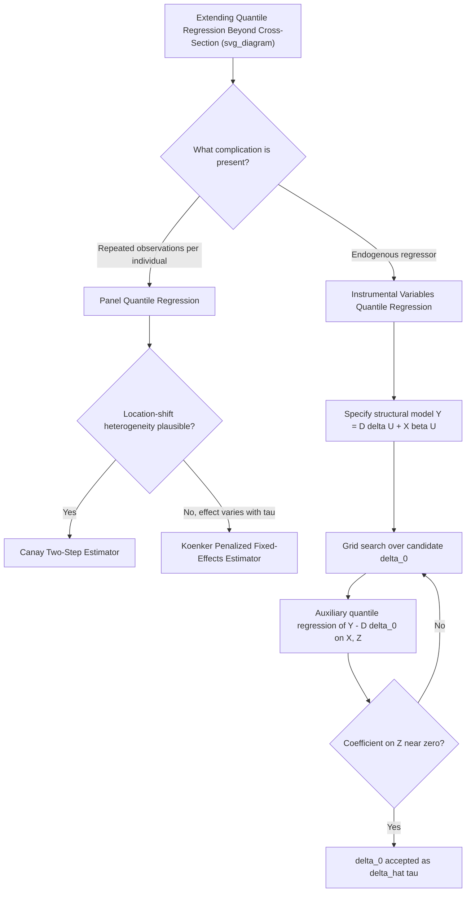

## Panel and Instrumental Variable Quantile Regression

### Overview

This item covers two major extensions of the standard cross-sectional quantile regression model: (1) **panel quantile regression**, which addresses unobserved individual heterogeneity in longitudinal/repeated-observations data, and (2) **instrumental variables quantile regression (IVQR)**, which addresses endogenous regressors. Both extensions confront a common underlying challenge: the linear programming machinery that makes cross-sectional quantile regression tractable does not extend trivially once fixed effects or endogeneity are introduced, requiring specialized estimators with their own identifying assumptions and computational strategies.

## Part 1: Panel Quantile Regression

### The Incidental Parameters Problem

The natural extension of the linear quantile model to panel data with individual fixed effects would be:

$$Q_{y_{it}|x_{it}, \alpha_i}(\tau \mid x_{it}, \alpha_i) = x_{it}'\beta(\tau) + \alpha_i$$

where $\alpha_i$ is a time-invariant individual fixed effect. Unlike linear panel OLS, where the within (demeaning) transformation eliminates $\alpha_i$ exactly, quantile regression's check-loss objective is **not separable** in the same way — the median (or any $\tau$-quantile) of a sum is not simply the sum of individual quantile components, so a "within" quantile transformation analogous to OLS demeaning does not exist in general.

Directly estimating $\alpha_i$ jointly with $\beta(\tau)$ (a fixed-effects "dummy variable" approach) suffers from the **incidental parameters problem**: as the number of individuals $n$ grows with a fixed number of time periods $T$, the number of nuisance parameters $\alpha_i$ grows with $n$, and $\hat{\beta}(\tau)$ generally remains **inconsistent** as $n \to \infty$ with $T$ fixed, because each $\alpha_i$ is estimated from only $T$ observations, and the estimation error in each $\hat{\alpha}_i$ does not vanish and contaminates $\hat{\beta}(\tau)$.

**Key Points**

- This is analogous to the incidental parameters problem in nonlinear panel models generally (e.g., fixed-effects logit/probit), but is a **more severe** difficulty in quantile regression because there is no exact sufficient-statistic-based fix analogous to conditional logit
- The severity of the resulting bias diminishes as $T$ grows, but many empirical panels have small $T$ (e.g., a handful of survey waves), so the problem is often first-order relevant in practice

### Approaches to Panel Quantile Regression

**1. Koenker's Penalized Fixed-Effects Estimator**

Koenker (2004) proposed jointly estimating $\{\alpha_i\}$ and $\beta(\tau)$ across **multiple quantiles simultaneously**, with an $\ell_1$ (LASSO-type) penalty shrinking the individual fixed effects toward a common value. The penalty partially mitigates (though does not fully eliminate) the incidental parameters bias, and pooling information across several $\tau$ values when estimating $\alpha_i$ improves efficiency relative to fitting each quantile separately.

**2. Canay's Two-Step Estimator**

Canay (2011) proposed a computationally simple two-step approach under the assumption that individual effects enter as a pure **location shift** (not affecting the shape of the conditional distribution across $\tau$):

$$Q_{y_{it}|x_{it},\alpha_i}(\tau \mid x_{it}, \alpha_i) = x_{it}'\beta(\tau) + \alpha_i$$

with $\alpha_i$ assumed constant **across** $\tau$ (a strong restriction — it rules out effects where unobserved heterogeneity interacts with the quantile level). Step one estimates $\alpha_i$ via a preliminary within-group mean-regression-type step; step two subtracts the estimated $\hat{\alpha}_i$ from $y_{it}$ and runs standard quantile regression on the adjusted outcome. This is computationally far simpler than Koenker's penalized approach but relies critically on the location-shift restriction.

**3. Correlated Random Effects Approaches**

Alternative approaches (e.g., Abrevaya and Dahl, 2008) model $\alpha_i$ as correlated with $x_{it}$ through a parametric auxiliary equation (in the spirit of Chamberlain-Mundlak devices from linear panel data), avoiding the incidental parameters problem by treating heterogeneity as a function of observables rather than as free nuisance parameters.

**Key Points — Practical Tradeoffs**

- Canay's estimator is simple and widely implemented but requires the location-shift (pure fixed-effect, no interaction with $\tau$) assumption to hold — if unobserved heterogeneity genuinely affects the *shape* of the conditional distribution (not just its location), this assumption is violated and the estimator is inconsistent for the quantile-specific slopes
- Koenker's penalized estimator relaxes this somewhat by allowing effects to vary with $\tau$, at the cost of greater computational complexity and the need to choose a penalty tuning parameter
- **[Inference]** No single panel quantile regression estimator dominates across all settings; the choice depends on whether the location-shift assumption is substantively plausible for the application at hand, which is often difficult to verify directly

### Inference in Panel Quantile Regression

Standard errors typically rely on cluster-bootstrap procedures (resampling at the individual/cluster level) given the complexity of deriving closed-form sandwich variance formulas for these two-step or penalized estimators. **[Unverified]** The finite-sample performance of these bootstrap procedures in small-$T$, small-$n$ panels is an active area of ongoing methodological research; simulation-based validation is advisable before relying on asymptotic approximations in small panels.

## Part 2: Instrumental Variables Quantile Regression (IVQR)

### Motivation

Standard quantile regression, like OLS, produces inconsistent estimates when a regressor is **endogenous** — correlated with unobserved determinants of the conditional quantile function. The Chernozhukov-Hansen IVQR framework (2005, 2006) extends the instrumental variables idea to the quantile setting.

### Model and Identification

Consider a structural model where the endogenous treatment/regressor $D$ has a quantile-specific structural effect $\delta(\tau)$:

$$Y = D\delta(U) + X'\beta(U), \quad U \mid X, Z \sim \text{Uniform}(0,1)$$

where $Z$ is a vector of instruments excluded from the structural equation, and $U$ represents the rank of the individual in the outcome's conditional distribution. The key identifying assumption is that $U$ (the individual's "type" or rank) is **independent of the instrument $Z$** conditional on $X$ — analogous to the standard IV exogeneity condition, but stated at the level of the unobserved rank rather than a scalar residual.

**Key Points**

- This framework nests the possibility of a **rank-similarity** condition: individuals' relative ranking in the outcome distribution should be similar whether or not they receive treatment (a generalization of, but conceptually related to, rank invariance in the QTE context)
- Under these conditions, $\delta(\tau)$ is interpreted as the structural quantile treatment effect — a causal effect purged of the endogeneity bias that would afflict a naive quantile regression of $Y$ on $D$ and $X$

### Estimation via Grid Search

Because the IVQR model is not linear in the endogenous parameter $\delta(\tau)$ in the same tractable way that 2SLS is linear, estimation proceeds via a **grid search / inverse quantile regression** procedure:

1. For a candidate value $\delta_0$ of the structural parameter, construct the "de-endogenized" outcome $Y - D\delta_0$
2. Run a standard quantile regression of $(Y - D\delta_0)$ on $X$ and the instrument(s) $Z$
3. Test whether the coefficient on $Z$ in this auxiliary regression is zero (the moment condition implied by instrument exogeneity)
4. Search over candidate $\delta_0$ values to find the one that best satisfies (drives closest to zero) this moment condition — this value is $\hat{\delta}(\tau)$

**Key Points**

- This grid-search structure makes IVQR estimation substantially more computationally intensive than either standard quantile regression or linear 2SLS, particularly with multiple endogenous regressors (requiring a multi-dimensional grid search)
- Confidence intervals for $\delta(\tau)$ can be constructed by inverting the test statistic across the grid (an approach analogous to Anderson-Rubin confidence sets in weak-instrument-robust linear IV), which remains valid even under weak instruments — a notable robustness advantage of the grid-search-based approach

### IVQR vs. Standard (2SLS-style) Approaches

| Feature | Linear 2SLS | IVQR |
| --- | --- | --- |
| Target parameter | Average causal effect | Quantile-specific structural effect $\delta(\tau)$ |
| Functional form | Linear, closed-form via projection | Nonlinear in $\delta$; requires grid search |
| Identifying assumption | Instrument exogeneity + relevance | Instrument exogeneity + relevance + rank similarity/independence of $U$ |
| Weak-instrument robustness | Requires separate diagnostics (weak-IV tests) | Grid-search/inversion approach can yield weak-instrument-robust confidence sets directly |
| Computational cost | Low (closed-form) | High (grid search, especially multi-dimensional) |

### Comparison: Panel vs. IVQR — What Problem Each Solves

| Extension | Problem addressed | Core difficulty | Key estimator(s) |
| --- | --- | --- | --- |
| Panel quantile regression | Unobserved individual heterogeneity in repeated-observations data | Incidental parameters problem; no exact "within" transform | Canay (two-step, location-shift); Koenker (penalized) |
| IVQR | Endogenous regressor(s) | Model nonlinear in structural parameter; no closed-form | Chernozhukov-Hansen (grid search / inverse quantile regression) |

### Diagram: Extensions to Standard Quantile Regression

### Worked Example

**Panel setting**: Estimating the effect of minimum wage changes on the distribution of firm-level employment growth using a panel of firms observed over several years, with firm fixed effects capturing time-invariant firm characteristics (e.g., management quality) that plausibly affect the *level* but not necessarily the *shape* of the employment growth distribution. Using Canay's two-step estimator (invoking the location-shift assumption), the median employment growth effect might be estimated at $\hat{\delta}(0.5) = -1.2\%$, while at $\tau = 0.9$ (fast-growing firms) the effect is smaller in magnitude, $\hat{\delta}(0.9) = -0.4\%$ — suggesting the minimum wage increase disproportionately constrains employment growth among firms that would otherwise have grown modestly, with less impact on already-fast-growing firms.

**IVQR setting**: Estimating the effect of years of schooling on log wages, where schooling is endogenous (correlated with unobserved ability) and instrumented using a compulsory schooling law change (quarter-of-birth instrument, following Angrist-Krueger-style designs). Grid search over candidate $\delta_0$ finds the structural QTE of schooling at $\tau = 0.25$ to be smaller than at $\tau = 0.75$, suggesting that returns to education are more pronounced for individuals who would otherwise be higher in the wage distribution.

**[Inference]** Both numeric examples are hypothetical constructs for pedagogical illustration and are not drawn from specific cited empirical studies.

### Software Implementation Notes

- **R**: `rqpd` (user-contributed, penalized/Koenker-style panel quantile regression); manual implementation of Canay's two-step estimator is common given its simplicity; `ivqr`-type user-contributed packages or manual grid-search loops using `quantreg::rq()` as the inner estimator for IVQR
- **Stata**: user-written commands such as `xtqreg` or `qregpd` for panel quantile regression (implementations and exact syntax vary); `ivqte` (Frölich-Melly) for related instrumental-variable quantile treatment effect estimation
- **Python**: native support for both panel quantile regression and IVQR is limited; implementations generally require custom grid-search or penalized-optimization code built around `statsmodels.QuantReg`

**[Unverified]** Package availability, maintenance status, and exact command syntax for these specialized panel/IV quantile regression tools change over time and vary by software version; confirm current availability and correct usage against up-to-date documentation before implementation.

### Related Topics

- Estimation of quantile regression models (linear programming foundation)
- Quantile treatment effects (QTE) and rank invariance/rank similarity assumptions
- Incidental parameters problem in nonlinear panel models generally (fixed-effects logit/probit)
- Weak-instrument-robust inference (Anderson-Rubin confidence sets) in linear IV, for comparison
- Correlated random effects models (Chamberlain-Mundlak devices)
- Recentered influence function (RIF) regression as an alternative unconditional-effects approach