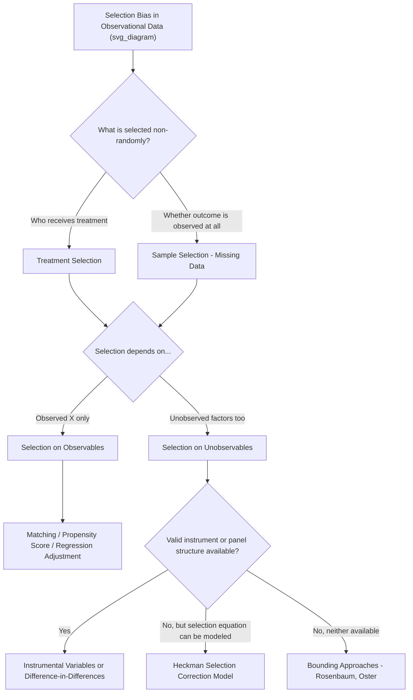

## Selection Bias in Observational Data

### Overview

Selection bias arises when the process by which units enter a sample, receive treatment, or have their outcomes observed is systematically related to the outcome itself, causing naive comparisons (e.g., simple mean differences or OLS coefficients) to conflate the true causal effect with differences arising purely from who ends up being observed or treated. This is among the most pervasive threats to causal inference in observational (non-experimental) data and motivates the entire family of sample selection and treatment effect models covered in this chapter.

### Conceptual Foundation: The Selection Problem

Let $Y_1$ and $Y_0$ denote potential outcomes under treatment and non-treatment, and let $D \in \{0,1\}$ indicate observed treatment status. The observed outcome is $Y = D Y_1 + (1-D) Y_0$. The naive comparison of treated and untreated means is:

$$E[Y \mid D=1] - E[Y \mid D=0] = \underbrace{E[Y_1 - Y_0 \mid D=1]}_{\text{ATT}} + \underbrace{\big(E[Y_0 \mid D=1] - E[Y_0 \mid D=0]\big)}_{\text{selection bias}}$$

**Key Points**

- The first term is the **average treatment effect on the treated (ATT)** — the causal quantity typically of interest
- The second term is **selection bias**: the difference in what the *untreated* potential outcome $Y_0$ would have been, on average, between those who selected into treatment and those who did not
- Selection bias is zero if and only if $E[Y_0 \mid D=1] = E[Y_0 \mid D=0]$ — i.e., in the absence of treatment, the treated and untreated groups would have had the same average outcome. Under random assignment, this holds by construction; in observational data, it generally does not

### Types of Selection Bias

**Selection on Observables**

Treatment assignment depends only on variables $X$ that the researcher observes and can condition on. Formally, the **conditional independence assumption (CIA)** or "unconfoundedness":

$$(Y_1, Y_0) \perp D \mid X$$

Under CIA, controlling for $X$ (via regression, matching, or propensity score methods) removes the selection bias, since conditional on $X$, treatment assignment is "as good as random."

**Selection on Unobservables**

Treatment assignment depends on variables *not* observed by the researcher (e.g., unmeasured ability, motivation, health status) that are also correlated with the outcome. This is the more difficult and more commonly worried-about case in applied work, since no amount of controlling for observed $X$ removes the bias — the CIA fails by construction.

**Key Points**

- Selection on observables is addressable with standard cross-sectional methods (regression adjustment, matching, propensity score weighting) **provided** the researcher has actually measured the relevant confounders — an assumption that is fundamentally untestable from the observational data alone, since it requires knowing that *no* relevant unobserved confounder exists
- Selection on unobservables requires either a credible source of exogenous variation (instrumental variables, natural experiments), a design that exploits panel structure (difference-in-differences, fixed effects), or an explicit parametric model of the selection process (Heckman-style selection correction models)

### Sample Selection vs. Treatment Selection

A useful distinction within "selection bias" broadly construed:

**Sample Selection (Missing Data / Truncation)**

The outcome $Y$ itself is only observed for a non-random subset of the population, and this subset is determined by a process correlated with $Y$. The canonical example is the **Heckman (1979) selection model**: wages are only observed for individuals who choose to work, and the decision to work is itself correlated with unobserved wage-relevant characteristics (e.g., a woman with a very low potential wage may rationally choose not to work, so the observed wage distribution among workers is not representative of the wage distribution that would prevail if everyone worked).

**Treatment Selection (Endogenous Program Participation)**

All outcomes are observed, but *which* units received a treatment or intervention is non-random and correlated with the outcome — the standard "selection into treatment" problem framed above (e.g., job training program participants may differ systematically from non-participants in ways related to future earnings).

**Key Points**

- Both problems produce biased estimates of causal parameters from naive comparisons, but they call for **different modeling strategies**: sample selection problems are typically addressed via Heckman-type selection-correction models (explicitly modeling the observation/participation mechanism as a separate equation), while treatment selection problems are typically addressed via matching, propensity scores, IV, or DiD-style designs
- The two problems can co-occur in the same application (e.g., studying the effect of a training program on wages, where both program participation *and* labor force participation are non-random)

### Illustrative Sources of Selection Bias

**Self-Selection**

Individuals choose to participate in a program, occupation, or activity based partly on their anticipated gains from it — e.g., individuals who expect to benefit most from job training are more likely to enroll, biasing naive estimates of the program's average effectiveness upward relative to what would be observed if participation were random.

**Survivorship Bias**

Only units that "survive" to the point of observation are included in the sample, systematically excluding units that failed or exited — e.g., studying the performance of currently-operating mutual funds overstates average fund performance because poorly performing funds have already been closed and dropped from the observable universe.

**Attrition Bias**

In longitudinal/panel studies, subjects who drop out of the study before its conclusion may differ systematically from those who remain, and if attrition is correlated with the outcome of interest (e.g., sicker patients are more likely to drop out of a clinical trial), the remaining sample is no longer representative.

**Berkson's Paradox / Collider Bias**

Selection based on a variable that is a common effect (collider) of two otherwise independent variables can induce a spurious association between them within the selected sample, even when no true association exists in the underlying population — a subtle and often-overlooked form of selection bias arising from conditioning on a collider.

### Diagnosing and Detecting Selection Bias

- **Comparing observable characteristics** across treated/untreated or observed/unobserved groups — while this cannot rule out selection on unobservables, large observable imbalances raise suspicion that unobservable imbalances may also exist
- **Sensitivity analysis** (e.g., Rosenbaum bounds, Oster's coefficient-stability bounds) — formally quantifies how large an unobserved confounder would need to be to overturn a given estimated effect, providing a way to gauge robustness without directly observing the confounder
- **Placebo/falsification tests** — checking whether treatment appears to "affect" outcomes that should be theoretically unaffected (e.g., pre-treatment outcomes in a panel setting), which would indicate the treatment/control comparison is contaminated by selection rather than isolating a genuine causal effect
- **[Inference]** No diagnostic can definitively prove the *absence* of selection on unobservables; all such tools provide indirect evidence and bounds rather than definitive confirmation, which is why credible identification strategies (exogenous variation) remain preferable to diagnostics run on a purely observational comparison whenever available

### Consequences for Estimation

| Selection scenario | Naive OLS/mean-comparison bias | Standard remedy |
| --- | --- | --- |
| Selection on observables only | Removable by conditioning on $X$ | Regression adjustment, matching, propensity score methods |
| Selection on unobservables, model of selection known | Removable via explicit selection-correction model | Heckman two-step / MLE selection models |
| Selection on unobservables, no valid selection model or instrument | Not removable from this data alone | Requires external identification (IV, natural experiment, panel methods) or bounding approach |
| Survivorship / attrition | Biases toward outcomes of "survivors" | Inverse probability weighting, joint modeling of attrition and outcome, bounding |

### Diagram: Selection Bias Taxonomy

### Illustration: Selection Bias in a Wage Example

<svg xmlns="http://www.w3.org/2000/svg" viewBox="0 0 640 340">
<text x="320" y="24" font-size="16" font-weight="bold" text-anchor="middle" fill="#222">Observed vs. True Wage Distribution (svg_diagram)</text>
<line x1="60" y1="290" x2="600" y2="290" stroke="#333" stroke-width="2" />
<line x1="60" y1="290" x2="60" y2="50" stroke="#333" stroke-width="2" />
<text x="330" y="320" font-size="13" text-anchor="middle" fill="#333">Wage</text>
<text x="25" y="170" font-size="13" text-anchor="middle" fill="#333" transform="rotate(-90 25 170)">Density</text>

<path d="M 100 290 C 180 100 380 100 460 290" stroke="#999" stroke-width="2" stroke-dasharray="5,3" fill="none" />
<text x="160" y="95" font-size="11" fill="#777">True potential wage distribution (all individuals)</text>

<path d="M 240 290 C 300 130 420 130 500 290" stroke="#d62728" stroke-width="2.5" fill="none" />
<text x="420" y="120" font-size="11" fill="#d62728">Observed wages (workers only)</text>
<line x1="240" y1="290" x2="240" y2="250" stroke="#333" stroke-dasharray="3" />
<text x="180" y="270" font-size="10" fill="#333">Reservation wage cutoff</text>
</svg>

*Note: individuals with potential wages below their reservation wage choose not to work, so the observed wage distribution (solid line) is truncated and shifted upward relative to the true underlying distribution across the full population (dashed line) — a direct illustration of sample selection.*

### Worked Example

A researcher studies the returns to a job training program using observational data, comparing average post-program earnings of self-selected participants versus non-participants:

- **Naive comparison**: participants earn $3,000/year more on average than non-participants
- **Concern**: individuals who expect to benefit most (e.g., those with strong unobserved motivation or latent skill) may be more likely to enroll — a case of selection on unobservables
- **Diagnostic step**: comparing pre-program earnings trends between participants and non-participants reveals participants already had *faster-growing* earnings trajectories **before** the program began — a placebo/pre-trend test suggesting the naive $3,000 estimate is contaminated by selection bias, not solely a treatment effect
- **Implication**: given this pre-trend violation, a simple selection-on-observables adjustment (matching or regression controls) will not solve the problem, since the confounder (motivation, ambition) driving both program enrollment and prior earnings growth is unobserved. An IV, a difference-in-differences design exploiting the pre-trend information, or a Heckman-style model of program selection would be needed to credibly isolate the causal effect

**[Inference]** This example uses stylized, hypothetical figures for illustration and is not drawn from a specific cited study.

### Software Implementation Notes

- **R**: `MatchIt`, `Matching`, or `WeightIt` packages for propensity score matching/weighting as a partial remedy for selection on observables; `sampleSelection` package for Heckman-type selection models; `sensemakr` for Oster-type and related sensitivity analysis
- **Stata**: `psmatch2` or `teffects` suite for matching/weighting; `heckman` command for Heckman selection models; `rbounds` for Rosenbaum bounds sensitivity analysis
- **Python**: `causalinference` or `DoWhy` libraries for propensity score and matching-based approaches; native Heckman selection model support is more limited and often requires custom MLE implementation

**[Unverified]** Package names, active maintenance status, and exact syntax evolve over time; confirm current availability against up-to-date documentation before implementation.

### Related Topics

- The Heckman selection model (sample selection correction)
- Propensity score matching and inverse probability weighting
- Instrumental variables estimation
- Difference-in-differences and panel fixed-effects designs
- Rosenbaum bounds and Oster's coefficient-stability sensitivity analysis
- Collider bias and directed acyclic graph (DAG)-based causal reasoning
- Average treatment effect (ATE) vs. average treatment effect on the treated (ATT)