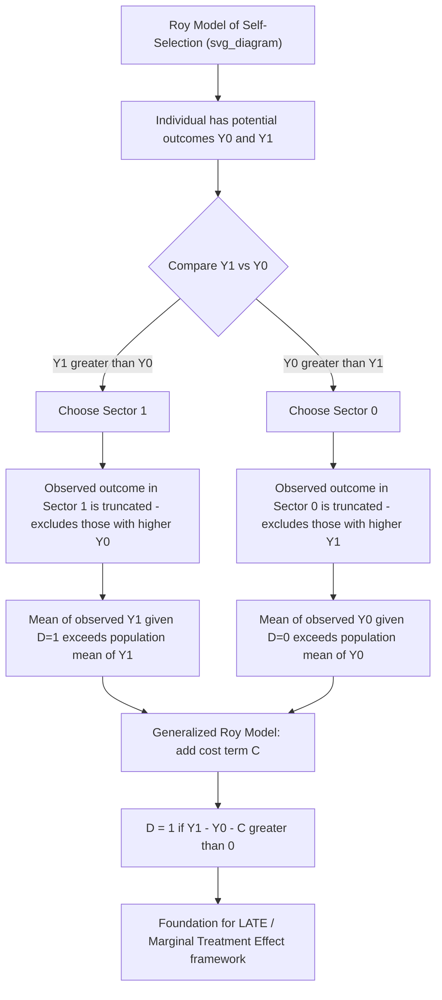

## The Roy Model of Selection

### Overview

The Roy model, originating from Roy's (1951) analysis of occupational choice, provides the canonical theoretical framework for understanding **self-selection based on comparative advantage**. It formalizes the idea that individuals choose between alternative sectors, occupations, or treatment states by comparing their potential outcomes in each, and this optimizing choice behavior mechanically generates a specific, structured form of selection bias in the observed data. The Roy model is foundational to the modern treatment effects literature and underlies the Heckman selection model, the generalized Roy model, and much of the theoretical framework for interpreting instrumental variables estimates.

### The Basic Roy Model Setup

Consider two sectors (originally: hunting vs. fishing, in Roy's motivating example; more commonly discussed today as, e.g., the wage an individual would earn in the formal vs. informal sector, or union vs. non-union employment). Each individual $i$ has two potential outcomes:

$$Y_{0i} = \text{potential outcome (e.g., earnings) in sector 0}$$

$$Y_{1i} = \text{potential outcome (e.g., earnings) in sector 1}$$

Both are defined for every individual (as potential outcomes), even though only one is ever observed, depending on which sector the individual actually chooses. The individual chooses sector 1 if and only if it yields a higher outcome:

$$D_i = \mathbb{1}(Y_{1i} > Y_{0i})$$

The observed outcome is $Y_i = D_i Y_{1i} + (1-D_i) Y_{0i}$.

**Key Points**

- This is a model of **comparative advantage sorting**: individuals sort into the sector where they are relatively more productive/successful, based on their own potential outcomes
- The selection rule $D_i = \mathbb{1}(Y_{1i} > Y_{0i})$ is a direct, mechanical implication of outcome-maximizing behavior — there is no separate "cost of choice" term in the most basic version (this is added in the **generalized Roy model**, discussed below)

### Distributional Assumptions and the Two-Sector Log-Normal Model

Roy's original formulation, and most textbook treatments, assume $(\ln Y_0, \ln Y_1)$ follow a **bivariate normal distribution**:

$$\begin{pmatrix}\ln Y_{0i} \\ \ln Y_{1i}\end{pmatrix} \sim N\left(\begin{pmatrix}\mu_0 \\ \mu_1\end{pmatrix}, \begin{pmatrix}\sigma_0^2 & \sigma_{01} \\ \sigma_{01} & \sigma_1^2\end{pmatrix}\right)$$

This tractable parametric structure allows closed-form derivation of the properties of the selected (observed) distributions of $Y_0$ and $Y_1$ within each sector.

### Key Theoretical Results

**Selection Bias is Structurally Guaranteed**

Under the Roy model's selection rule, the *observed* distribution of $Y_0$ among those who chose sector 0 (i.e., $Y_0 \mid D=0$) is **not** representative of the population distribution of $Y_0$: it is truncated to include only individuals for whom $Y_0 \ge Y_1$, i.e., those who happened to be relatively unproductive in sector 1. Symmetrically, the observed $Y_1 \mid D=1$ excludes individuals who would have earned even more in sector 0.

$$E[Y_0 \mid D=0] < E[Y_0] \quad \text{and} \quad E[Y_1 \mid D=1] > E[Y_1]$$

**[Inference]** These specific inequality directions hold given the standard Roy model assumptions (positive selection into each sector based on comparative advantage); the exact magnitude of divergence depends on the correlation $\sigma_{01}$ and variances of the joint distribution, not on the sign pattern alone.

**Correlation Structure Determines the Nature of Selection**

- If $\sigma_{01}$ (the covariance between $\ln Y_0$ and $\ln Y_1$) is **high** (individuals with high potential outcomes in one sector also tend to have high potential outcomes in the other — a case of a general "high-ability" factor dominating), selection based on comparative advantage sorts on relatively small differences, and the sectors' observed outcome distributions can still overlap substantially
- If $\sigma_{01}$ is **low or negative** (skills that raise $Y_0$ do not raise, or actively lower, $Y_1$ — genuine sector-specific specialization), selection is sharper, and the gap between observed sector means understates the *population* mean-outcome differences less than under high correlation, because individuals sort strongly according to a comparative-advantage signal specific to each sector

**Implication for Measuring Inequality**

A widely cited theoretical implication (formalized in later work building on Roy, notably by Heckman and Honoré, 1990) is that self-selection based on comparative advantage can either **increase or decrease** observed earnings inequality relative to a counterfactual world with random sector assignment, depending on the correlation structure of potential outcomes — a result that complicates simple interpretations of observed wage-inequality trends as reflecting only changes in the underlying "skill price" structure, since compositional shifts in who selects into which sector also matter.

### The Generalized Roy Model

The basic Roy model assumes selection is purely outcome-maximizing with no other consideration. The **generalized Roy model** (as formalized by Heckman and Vytlacil in later work) adds a cost/net-benefit term $C_i$ to the selection rule, and allows selection to be based on a latent index that need not be simply "compare $Y_1$ to $Y_0$":

$$D_i = \mathbb{1}(Y_{1i} - Y_{0i} - C_i > 0)$$

where $C_i$ can include monetary costs (tuition, moving costs), psychic costs, or other non-pecuniary factors affecting the choice that are not part of the outcome itself. This generalization is the direct theoretical ancestor of the modern **local average treatment effect (LATE)** framework and the **marginal treatment effect (MTE)** approach (Heckman-Vytlacil), which explicitly model selection based on both outcome gains and idiosyncratic costs, and characterize treatment effects for the specific subpopulation of individuals whose selection decision is affected by an instrument (the "compliers").

**Key Points**

- The generalized Roy model is the theoretical bridge connecting the classical selection-bias literature (Roy, Heckman selection models) to the modern instrumental-variables-based treatment effects literature (LATE, MTE)
- It clarifies *why* IV estimates in the presence of heterogeneous treatment effects identify a treatment effect specific to "compliers" (those induced to switch selection status by the instrument) rather than the ATE — because the underlying selection process is itself outcome-and-cost dependent, exactly as the Roy framework describes

### Connection to the Heckman Selection Model

The Heckman (1979) two-step selection correction model can be understood as a **one-sector special case** of the Roy framework: $Y_1$ (e.g., market wage) is only observed when $D=1$ (labor force participation), and $D$ is determined by comparing $Y_1$ to a reservation value (which may itself be a function of $Y_0$, e.g., the value of home production/leisure, plus additional cost/preference shifters). The Roy model's bivariate-normal machinery is exactly the structure underlying the classical Heckman selection correction's identification strategy (using the inverse Mills ratio to correct for the truncation induced by the selection rule).

### Roy Model vs. Related Frameworks

| Framework | Selection rule | Key extension over basic Roy |
| --- | --- | --- |
| Basic Roy model | $D = \mathbb{1}(Y_1 > Y_0)$ | — (baseline) |
| Heckman selection model | $D = \mathbb{1}(Y_1 > \text{reservation value})$, one outcome observed only if $D=1$ | Focuses on one-sector observability (e.g., wages observed only for workers) |
| Generalized Roy model | $D = \mathbb{1}(Y_1 - Y_0 - C > 0)$ | Adds idiosyncratic cost term $C$ to the selection decision |
| LATE / MTE framework | Selection driven by an instrument-shifted latent index | Explicitly characterizes treatment effects for compliers; foundation is the generalized Roy selection equation |

### Diagram: Roy Model Selection Mechanism

### Illustration: Comparative Advantage Sorting

<svg xmlns="http://www.w3.org/2000/svg" viewBox="0 0 640 360">
<text x="320" y="24" font-size="16" font-weight="bold" text-anchor="middle" fill="#222">Roy Model: Sorting by Comparative Advantage (svg_diagram)</text>
<line x1="80" y1="300" x2="560" y2="300" stroke="#333" stroke-width="2" />
<line x1="80" y1="300" x2="80" y2="50" stroke="#333" stroke-width="2" />
<text x="320" y="330" font-size="13" text-anchor="middle" fill="#333">Potential Outcome in Sector 0 (Y0)</text>
<text x="35" y="180" font-size="13" text-anchor="middle" fill="#333" transform="rotate(-90 35 180)">Potential Outcome in Sector 1 (Y1)</text>

<line x1="80" y1="300" x2="530" y2="60" stroke="#333" stroke-width="2" stroke-dasharray="6,4" />
<text x="380" y="115" font-size="11" fill="#333">Y1 = Y0 (indifference line)</text>

<text x="440" y="90" font-size="12" fill="`#d62728`" font-weight="bold">Choose Sector 1</text>

<circle cx="460" cy="100" r="4" fill="`#d62728`" />

<circle cx="500" cy="150" r="4" fill="`#d62728`" />

<circle cx="420" cy="130" r="4" fill="`#d62728`" />

<circle cx="480" cy="200" r="4" fill="`#d62728`" />

<text x="200" y="260" font-size="12" fill="`#1f77b4`" font-weight="bold">Choose Sector 0</text>

<circle cx="220" cy="280" r="4" fill="`#1f77b4`" />

<circle cx="280" cy="250" r="4" fill="`#1f77b4`" />

<circle cx="180" cy="230" r="4" fill="`#1f77b4`" />

<circle cx="330" cy="270" r="4" fill="`#1f77b4`" />

</svg>

*Note: individuals scatter throughout the potential-outcome space, but the selection rule partitions them exactly along the 45-degree line — those above it (higher $Y_1$ than $Y_0$) sort into Sector 1, mechanically truncating each sector's observed outcome distribution to individuals with relatively higher outcomes in their chosen sector.*

### Worked Example

Consider workers choosing between the union and non-union sectors, with potential log-wages $\ln Y_1$ (union) and $\ln Y_0$ (non-union) jointly normally distributed with $\mu_0 = 2.8$, $\mu_1 = 3.0$, $\sigma_0 = \sigma_1 = 0.3$, and correlation $\rho = 0.4$.

- The naive comparison of *observed* mean log-wages between union and non-union workers overstates the union wage premium relative to the *population-level* mean difference $\mu_1 - \mu_0 = 0.2$, because workers who select into the union sector are disproportionately those with a comparative (not just absolute) advantage there
- If $\rho$ were instead close to 1 (union and non-union potential wages driven almost entirely by a common "general skill" factor), selection would be based on very small idiosyncratic differences, and the observed sectoral wage gap would more closely track the true population gap $\mu_1 - \mu_0$
- If $\rho$ were low or negative (sector-specific skills dominate), selection would be sharp, and the observed gap could substantially overstate $\mu_1 - \mu_0$

**[Inference]** These parameter values are a hypothetical construction for pedagogical illustration of the Roy model's mechanics, not estimates from a specific cited empirical study of union wage premiums.

### Software Implementation Notes

The Roy model is primarily a **theoretical/structural framework** rather than a directly "estimated" reduced-form procedure; empirical implementation typically proceeds through:

- **R**: `sampleSelection` package (Heckman-type estimation, the applied one-sector special case); structural two-sector Roy model estimation is typically implemented via custom maximum likelihood code given the bivariate normal selection structure
- **Stata**: `heckman` command for the one-sector applied special case; two-sector structural Roy models generally require custom `ml` (maximum likelihood) programming
- **Python**: no widely standardized package for full structural Roy model estimation; typically implemented via custom likelihood construction using `scipy.optimize` or similar

**[Unverified]** Availability of any specialized two-sector Roy model estimation packages varies and changes over time; the theoretical framework is far more commonly taught and referenced than directly estimated via a standardized command, since it primarily underlies applied selection and treatment-effect models (Heckman, MTE) that do have dedicated software implementations.

### Related Topics

- The Heckman selection model (one-sector applied special case of Roy)
- Generalized Roy model and the Marginal Treatment Effect (MTE) framework (Heckman-Vytlacil)
- Local Average Treatment Effects (LATE) and complier populations
- Selection bias in observational data (general treatment)
- Comparative advantage and occupational/sectoral choice models in labor economics
- Quantile treatment effects and rank invariance (related self-selection concerns)