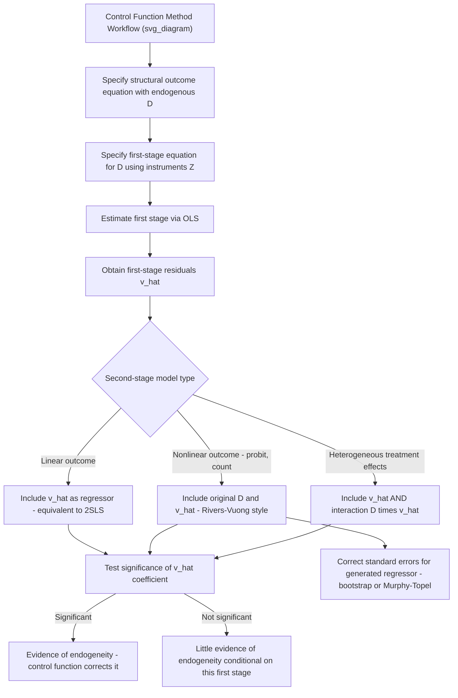

## Control Function Methods for Treatment Effects

### Overview

Control function methods address endogeneity in treatment effect estimation by explicitly modeling the source of endogeneity — typically the correlation between a treatment/regressor and the outcome equation's error term — and then including an estimated proxy for that correlated component directly in the outcome equation. This is conceptually related to instrumental variables estimation but proceeds via a fundamentally different mechanical route: rather than projecting the endogenous variable onto instruments and using only the exogenous predicted component (as in 2SLS), control function approaches add a **correction term** to the outcome equation itself, estimated in a first stage, so that the *conditional* error in the second-stage equation is purged of its correlation with the treatment variable.

### The Core Idea

Consider a structural outcome equation with an endogenous treatment/regressor $D$:

$$Y = D\alpha + X'\beta + \varepsilon$$

where $D$ is correlated with $\varepsilon$ (endogeneity), and covariates $X$ are exogenous. The control function approach specifies a **first-stage (reduced-form) equation** for $D$:

$$D = Z'\gamma + X'\delta + v$$

where $Z$ is an instrument (or set of instruments) satisfying exclusion and relevance conditions, and $v$ is the first-stage error. The key control function insight: if $\varepsilon$ and $v$ are correlated (which is precisely what makes $D$ endogenous), then:

$$E[\varepsilon \mid D, X, Z] = E[\varepsilon \mid v] = \rho \cdot v$$

under a joint normality (or other parametric) assumption linking $\varepsilon$ and $v$. Substituting this into the outcome equation:

$$Y = D\alpha + X'\beta + \rho v + \eta$$

where $\eta = \varepsilon - \rho v$ is now, by construction, uncorrelated with $D$ (since all the correlation between $\varepsilon$ and $D$ operated through $v$, which is now included directly). The term $\rho v$ is the **control function** — it "controls for" the endogeneity by explicitly modeling and including the correlated component of the error.

**Key Points**

- Since $v$ is unobserved, it is replaced by its estimated residual $\hat{v}$ from the first-stage regression, and the second-stage regression of $Y$ on $D$, $X$, and $\hat{v}$ is estimated
- The coefficient on $\hat{v}$ in the second stage is a direct test of endogeneity: if $\hat{\rho}$ is statistically indistinguishable from zero, this provides evidence that $D$ is not endogenous after all (conditional on the specified first stage) — this is the logic underlying the **Hausman-Wu test** for endogeneity, which can be implemented exactly this way (a "regression-based Hausman test")

### Control Function vs. Standard 2SLS

For a purely **linear** model with a **continuous** endogenous regressor, the control function approach and standard two-stage least squares (2SLS) yield **numerically identical** coefficient estimates for $\alpha$ (the treatment effect), because both are, in this special case, algebraically equivalent decompositions of the same IV moment condition.

**Key Points — Where Control Functions Diverge from 2SLS**

- The equivalence with 2SLS **breaks down** once the model is **nonlinear** — e.g., a binary/limited dependent variable outcome, a treatment effect that interacts with covariates, or a discrete/censored endogenous regressor. In these nonlinear settings, control function methods and standard IV/2SLS generally produce **different** estimates, and the control function approach becomes the more natural and often the only tractable extension
- Control function methods are the standard approach for endogenous treatment in **nonlinear** models: e.g., a probit outcome equation with an endogenous continuous regressor (Rivers-Vuong two-step estimator), or a Poisson/count outcome with an endogenous regressor
- Because the control function relies on a **parametric assumption** linking $\varepsilon$ and $v$ (commonly joint normality), it is generally **less robust** to distributional misspecification than 2SLS, which requires no such distributional assumption for consistency in the linear IV case

### The Rivers-Vuong Estimator (Binary Outcome, Endogenous Continuous Regressor)

A widely used control function application: a probit outcome model with an endogenous continuous treatment/regressor.

**Structural model**:

$$Y^* = D\alpha + X'\beta + \varepsilon, \quad Y = \mathbb{1}(Y^* > 0)$$

$$D = Z'\gamma + X'\delta + v, \quad (\varepsilon, v) \sim N(0, \Sigma)$$

**Two-Step Procedure**:

1. **First stage**: regress $D$ on $Z$ and $X$ via OLS; obtain residuals $\hat{v}_i = D_i - \hat{Z}_i'\hat{\gamma} - \hat{X}_i'\hat{\delta}$
2. **Second stage**: estimate a probit of $Y$ on $D$, $X$, **and** $\hat{v}$ (the control function term):

$$P(Y=1 \mid D, X, \hat{v}) = \Phi(D\alpha + X'\beta + \rho \hat{v})$$

**Key Points**

- Standard errors from the naive two-step procedure must be corrected (e.g., via bootstrap or the appropriate two-step variance formula) because they do not account for the estimation error introduced by using $\hat{v}$ rather than the true $v$ in the second stage — a general feature of generated-regressor problems (the Murphy-Topel correction is one classical analytical fix)
- This is the standard approach referenced when applied papers describe "instrumenting for an endogenous regressor in a probit/binary outcome model," since a literal 2SLS-style approach (plugging first-stage fitted values into a nonlinear second stage) is generally inconsistent in nonlinear models — a common and important pitfall known as the **"forbidden regression"**

### The Forbidden Regression Problem

A frequently emphasized pitfall directly motivating the use of control functions rather than naive 2SLS-style plug-in approaches: in nonlinear second-stage models, simply replacing the endogenous regressor $D$ with its first-stage fitted value $\hat{D}$ and plugging this into the nonlinear model (e.g., a probit or logit) is generally **inconsistent**. This is because the nonlinear second-stage function does not commute with the linear projection used to construct $\hat{D}$ — unlike OLS, where the linear-in-parameters structure of 2SLS's second stage makes the substitution algebraically valid.

**Key Points**

- The correct approach is the control function method: include the estimated *residual* $\hat{v}$ (not the fitted value $\hat{D}$) as an additional regressor, alongside the *original* (not fitted) $D$, in the nonlinear second-stage equation
- This distinction — residual as regressor vs. fitted value substitution — is the crux of avoiding the forbidden regression problem in nonlinear IV-type settings

### Control Functions for Treatment Effect Heterogeneity

Control function methods extend naturally to settings with **heterogeneous treatment effects**, where the coefficient on $D$ is allowed to vary across individuals (a random coefficient model):

$$Y = D\alpha_i + X'\beta + \varepsilon, \quad \alpha_i = \alpha + \zeta_i$$

Here, the control function approach (following work by Garen, 1984, and more modern treatments by Wooldridge and Heckman-Vytlacil) typically requires including **both** the control function term $\hat{v}$ **and an interaction** $D \times \hat{v}$ in the second-stage regression, since the correlation between the individual-specific treatment effect $\zeta_i$ and the endogeneity term $v_i$ must also be accounted for. This links control function methods directly to the **marginal treatment effect (MTE)** framework, where $\hat{v}$ (or a related transformation) serves as the basis for tracing out treatment effect heterogeneity across the population's distribution of unobserved resistance to treatment.

### Comparison of Approaches

| Feature | 2SLS | Control Function |
| --- | --- | --- |
| Linear model, continuous endogenous regressor | Standard, no distributional assumption needed | Numerically identical to 2SLS |
| Nonlinear outcome model (probit, Poisson, etc.) | Generally inconsistent if naively applied (forbidden regression) | Standard, consistent approach (e.g., Rivers-Vuong) |
| Distributional assumptions required | None (for linear IV consistency) | Typically requires parametric assumption on joint error distribution (e.g., joint normality) |
| Provides direct endogeneity test | Requires separate Hausman test | Built-in: test significance of $\hat{v}$'s coefficient |
| Handles heterogeneous treatment effects | Requires separate IV-heterogeneity framework (LATE) | Natural extension via interaction terms; links to MTE |
| Standard error complications | Standard IV formulas apply | Requires correction for generated-regressor (two-step) estimation |

### Diagram: Control Function Estimation Workflow

### Worked Example

Estimating the effect of health insurance coverage ($D$, endogenous) on the probability of a preventive care visit ($Y$, binary), instrumenting with an eligibility threshold or policy-driven variation in insurance premiums ($Z$):

1. **First stage**: regress insurance coverage $D$ on the instrument $Z$ and covariates $X$ (age, income, health status), obtaining residuals $\hat{v}$
2. **Second stage**: estimate a probit of preventive care visit $Y$ on $D$, $X$, and $\hat{v}$
3. Suppose $\hat{\rho}$ (coefficient on $\hat{v}$) is statistically significant and negative — this indicates that unobserved factors positively correlated with insurance take-up (e.g., risk aversion) are *negatively* correlated with the probit outcome equation's error, meaning naive probit estimates (ignoring endogeneity) would be biased
4. The corrected coefficient $\hat{\alpha}$ on $D$ (from the control-function-adjusted probit) represents the causal effect of insurance on preventive care utilization, purged of this selection/endogeneity bias

**[Inference]** This example uses a hypothetical empirical setup and stylized results for illustration; it is not drawn from a specific cited study of health insurance and preventive care.

### Software Implementation Notes

- **R**: manual two-step implementation is common (first-stage `lm()`, extract residuals, include in second-stage `glm(family = binomial())`); `ivtools` and related packages provide some automated control function support; bootstrap for correct standard errors is standard practice given generated-regressor concerns
- **Stata**: `etregress` (endogenous treatment effects, continuous outcome) and `eprobit`/`ivprobit` implement control-function-based estimation for binary/continuous outcomes with endogenous treatment directly, computing corrected standard errors internally
- **Python**: no single standardized package fully automates the Rivers-Vuong or general control function approach; typically implemented manually via `statsmodels` for both stages, with bootstrap for standard error correction

**[Unverified]** Exact command syntax, default standard error corrections, and which specific control-function variant (e.g., Rivers-Vuong vs. more general two-step estimators) is implemented by a given command can differ across software versions; consult current documentation before drawing methodological conclusions from a specific command's default output.

### Related Topics

- Instrumental variables estimation and the forbidden regression problem
- The Heckman selection model (a closely related control-function-style correction, using the inverse Mills ratio)
- Marginal treatment effects (MTE) and the Heckman-Vytlacil framework
- Rivers-Vuong two-step estimator for endogenous binary/limited dependent variable models
- Hausman-Wu specification tests for endogeneity
- Generated regressors and two-step estimation standard error corrections (Murphy-Topel)
- The Roy model of selection (theoretical foundation for endogenous treatment selection)