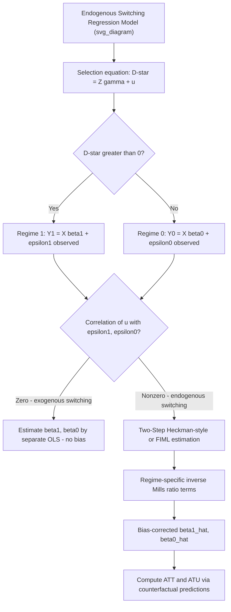

## Switching Regression Models

### Overview

Switching regression models describe settings where the population is divided into two (or more) distinct **regimes**, with a separate outcome equation governing each regime, and where regime membership may itself be determined by an observable rule (exogenous switching) or by an unobserved, endogenous selection process (endogenous switching). These models generalize the Roy model and the Heckman selection model into a unified regression framework and are widely used to estimate treatment effects when the "treatment" corresponds to sorting into one of two structurally distinct regimes — e.g., union vs. non-union wage-setting, public vs. private sector employment, or formal vs. informal credit markets.

### Basic Model Structure

Consider two regime-specific outcome equations:

$$Y_{1i} = X_i'\beta_1 + \varepsilon_{1i} \quad \text{(Regime 1)}$$

$$Y_{0i} = X_i'\beta_0 + \varepsilon_{0i} \quad \text{(Regime 0)}$$

and a **selection (switching) equation** determining which regime an individual is observed in:

$$D_i^* = Z_i'\gamma + u_i, \quad D_i = \mathbb{1}(D_i^* > 0)$$

The observed outcome is $Y_i = D_i Y_{1i} + (1-D_i) Y_{0i}$ — exactly one of $Y_{1i}$ or $Y_{0i}$ is observed for each individual, depending on which regime they fall into.

**Key Points**

- This is structurally the Roy model framework generalized to allow the outcome equations to depend on covariates $X$ (rather than being unconditional potential outcomes), and to allow the switching rule to depend on a separate set of variables $Z$ (rather than being a pure comparison of $Y_1$ and $Y_0$ themselves)
- $Z$ may overlap with $X$, but typically includes at least one variable excluded from the outcome equations (an "exclusion restriction") to aid identification, analogous to instrument requirements in the Heckman selection model

### Exogenous vs. Endogenous Switching

**Exogenous Switching**

Regime membership $D_i$ is determined by an observable rule unrelated to the unobserved determinants of $Y_1$ and $Y_0$ (i.e., $u_i$ is independent of $\varepsilon_{1i}, \varepsilon_{0i}$, or the switching rule depends only on observed, non-stochastic criteria). In this case, each regime's outcome equation can be estimated by **OLS separately on the subsample belonging to that regime**, with no selection bias, since sorting into the regime is unrelated to the unobserved outcome determinants.

**Endogenous Switching**

Regime membership is correlated with the unobserved outcome determinants — i.e., $\text{Cov}(u_i, \varepsilon_{1i}) \ne 0$ and/or $\text{Cov}(u_i, \varepsilon_{0i}) \ne 0$. This is the empirically relevant and more commonly modeled case: individuals self-select into a regime partly based on unobserved factors that also affect their outcome in that regime (exactly the Roy-model comparative-advantage sorting logic). Applying OLS separately within each regime in this case produces **biased** estimates of $\beta_1$ and $\beta_0$, analogous to the bias in the Heckman selection model.

**Key Points**

- Exogenous switching is a much stronger (and often less plausible) assumption in applied economic settings, since regime choice is frequently the outcome of some optimizing behavior (comparative advantage, self-selection) correlated with unobserved ability or preferences
- The term "switching regression" in applied econometrics almost always refers to the **endogenous** switching case, since the exogenous case reduces to trivial subsample OLS

### The Endogenous Switching Regression Model (Full Specification)

Under joint normality of the error terms:

$$\begin{pmatrix}\varepsilon_{1i} \\ \varepsilon_{0i} \\ u_i\end{pmatrix} \sim N\left(0, \begin{pmatrix}\sigma_1^2 & \sigma_{10} & \sigma_{1u} \\ \sigma_{10} & \sigma_0^2 & \sigma_{0u} \\ \sigma_{1u} & \sigma_{0u} & 1\end{pmatrix}\right)$$

(the variance of $u$ is normalized to 1, as in a standard probit setup for the selection equation). The conditional expectations of the observed outcomes become:

$$E[Y_{1i} \mid D_i=1, X_i, Z_i] = X_i'\beta_1 + \sigma_{1u} \cdot \lambda_1(Z_i'\gamma)$$

$$E[Y_{0i} \mid D_i=0, X_i, Z_i] = X_i'\beta_0 - \sigma_{0u} \cdot \lambda_0(Z_i'\gamma)$$

where $\lambda_1(\cdot)$ and $\lambda_0(\cdot)$ are the **inverse Mills ratio** terms specific to each regime (analogous in structure to the single inverse Mills ratio in the standard one-equation Heckman model, but now appearing — with opposite-signed selection corrections — in both regime equations simultaneously).

**Key Points**

- This is a direct two-regime generalization of the Heckman (1979) selection model: instead of one outcome equation observed only when $D=1$ (with the alternative simply unobserved/missing), switching regression models specify **both** regime outcome equations explicitly, since both $Y_1$ and $Y_0$ correspond to a genuinely observed outcome for *some* subpopulation (just never both for the same individual)
- $\sigma_{1u}$ and $\sigma_{0u}$ govern the direction and magnitude of selection bias in each regime: positive $\sigma_{1u}$ means individuals with unobserved factors that raise their probability of being in regime 1 also tend to have higher unobserved $Y_1$ — the same comparative-advantage-driven selection logic as the Roy model

### Estimation Methods

**Two-Step (Heckman-Style) Estimation**

1. Estimate the selection equation via probit: $D_i$ on $Z_i$, obtaining $\hat{\gamma}$
2. Construct regime-specific inverse Mills ratio terms $\hat{\lambda}_1(Z_i'\hat{\gamma})$ and $\hat{\lambda}_0(Z_i'\hat{\gamma})$
3. Estimate the two outcome equations separately by OLS, each augmented with its respective inverse Mills ratio term as an additional regressor, using only the relevant subsample ($D_i=1$ observations for the regime-1 equation, $D_i=0$ for the regime-0 equation)

**Full Information Maximum Likelihood (FIML)**

Jointly estimates the selection equation and both outcome equations by maximizing the full likelihood implied by the joint trivariate normal distribution of $(\varepsilon_1, \varepsilon_0, u)$. More efficient than the two-step approach if the model is correctly specified, but computationally more demanding and more sensitive to distributional misspecification since all parameters are estimated jointly rather than sequentially.

**Key Points**

- As with the standard Heckman model, two-step standard errors require correction for the generated-regressor problem (the inverse Mills ratio terms are themselves estimated, not observed), typically via bootstrap or an appropriate analytical correction
- Identification, as in the single-equation Heckman model, is aided by an **exclusion restriction**: a variable in $Z$ that predicts regime selection but does not directly enter either outcome equation. Without an exclusion restriction, identification relies solely on the nonlinearity of the inverse Mills ratio function, which is generally regarded as a weaker and less credible source of identification in practice

### Treatment Effect Parameters from Switching Regression

Switching regression models allow direct computation of standard treatment effect parameters by comparing predicted regime-specific outcomes:

**Average Treatment Effect on the Treated (ATT)**:

$$ATT = E[Y_1 - Y_0 \mid D=1] = X'(\beta_1 - \beta_0) + \big(\sigma_{1u} \lambda_1 + \sigma_{0u}\lambda_1\big)$$

**Average Treatment Effect on the Untreated (ATU)**:

$$ATU = E[Y_1 - Y_0 \mid D=0] = X'(\beta_1 - \beta_0) - \big(\sigma_{1u}\lambda_0 + \sigma_{0u}\lambda_0\big)$$

**Key Points**

- Because both $\beta_1$ and $\beta_0$ are estimated (not just one outcome equation as in the single-equation Heckman model), switching regression models directly deliver **regime-specific counterfactuals**: the predicted outcome for someone in regime 0 *had they instead been assigned to regime 1*, and vice versa — a form of counterfactual prediction not directly available from a standard single-outcome Heckman correction
- The gap between ATT and ATU reflects **heterogeneous treatment effects** correlated with the switching/selection process itself — precisely the Roy-model comparative advantage logic formalized into an estimable regression framework

### Switching Regression vs. Related Models

| Model | Number of outcome equations | Selection process | Key output |
| --- | --- | --- | --- |
| Standard Heckman selection model | One (observed only if $D=1$) | Binary selection into observability | Bias-corrected coefficient for the one observed equation |
| Switching regression (endogenous) | Two (each observed for its respective regime) | Binary, correlated with both outcome errors | $\beta_1$, $\beta_0$, ATT, ATU, full counterfactual comparison |
| Roy model | Two (theoretical, both potential outcomes defined) | $D = \mathbb{1}(Y_1 > Y_0)$, no separate cost term | Theoretical characterization of selection bias direction |
| Generalized Roy / MTE | Two (or continuum) | Latent index including cost term | Marginal treatment effects across resistance-to-treatment distribution |

### Diagram: Switching Regression Structure

### Worked Example

Modeling wages in the union vs. non-union sector, where union membership is endogenously determined:

$$\ln W_{1i} = X_i'\beta_1 + \varepsilon_{1i} \quad \text{(union wage equation)}$$

$$\ln W_{0i} = X_i'\beta_0 + \varepsilon_{0i} \quad \text{(non-union wage equation)}$$

$$D_i^* = Z_i'\gamma + u_i \quad \text{(union membership selection, } Z \text{ includes state right-to-work law status as an exclusion restriction)}$$

Suppose two-step estimation yields $\hat{\sigma}_{1u} > 0$ (workers with unobserved characteristics raising their probability of joining a union also tend to have higher unobserved union wages — positive selection into the union sector) and $\hat{\sigma}_{0u} < 0$ (those same characteristics are associated with *lower* unobserved non-union wages). This pattern implies the *observed* union wage premium (naive comparison of mean wages) **overstates** the ATT, since union members are disproportionately drawn from those who would have earned relatively less in the non-union sector, while also being especially productive in the union sector — the classic Roy-model comparative-advantage sorting pattern applied to a specific labor-market institution.

**[Inference]** This example uses a hypothetical model setup and directionally illustrative (not numerically specific) results for exposition; it is not drawn from a specific cited empirical study of union wage premiums.

### Software Implementation Notes

- **R**: `sampleSelection` package's `selection()` function supports switching regression specifications (the "switching regression" or two-equation variant) alongside the standard one-equation Heckman model; FIML and two-step options are both typically available
- **Stata**: `movestay` (user-written) implements switching regression models; `heckman` extended with manual regime-specific estimation can replicate the two-step approach; some implementations of `etregress`-adjacent commands cover related endogenous-switching setups
- **Python**: no widely standardized package for full switching regression estimation; typically requires custom two-step or MLE implementation using `statsmodels` and `scipy.optimize`

**[Unverified]** Exact package names, active maintenance status, and available estimation options (two-step vs. FIML) vary across software and change over time; confirm current availability and syntax against up-to-date documentation before implementation.

### Related Topics

- The Heckman selection model (one-equation special case)
- The Roy model of selection (theoretical foundation for endogenous regime sorting)
- Control function methods for treatment effects
- Marginal treatment effects (MTE) and the Heckman-Vytlacil framework
- Average treatment effect on the treated (ATT) vs. on the untreated (ATU)
- Exclusion restrictions and identification in selection models
- Generated regressor standard error corrections (Murphy-Topel, bootstrap)