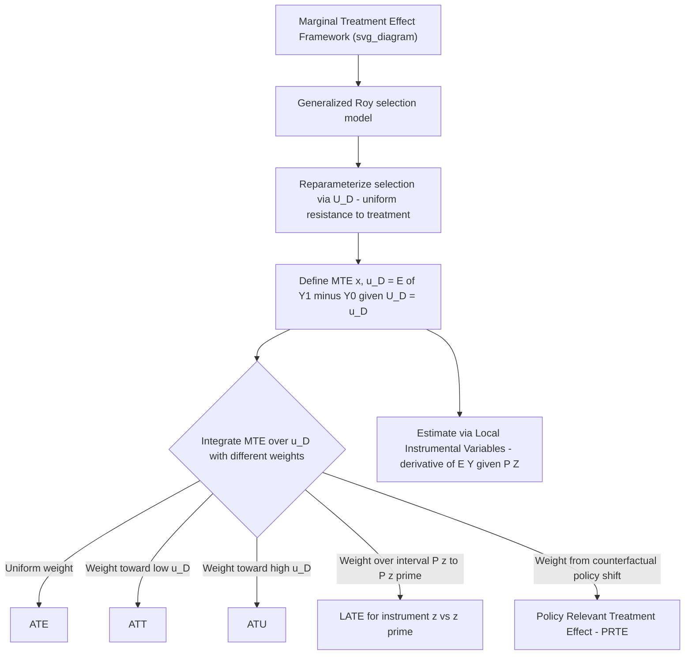

## Marginal Treatment Effects

### Overview

The marginal treatment effect (MTE) framework, developed by Heckman and Vytlacil across a series of papers (notably 1999, 2001, 2005), provides a unifying structure for treatment effect analysis under essential heterogeneity — settings where treatment effects vary across individuals in ways correlated with their own treatment selection decision. The MTE is defined for individuals at the margin of indifference between treatment and non-treatment, and the framework shows that nearly all other treatment effect parameters (ATE, ATT, ATU, LATE, and policy-relevant treatment effects) can be expressed as specific *weighted averages* of the underlying MTE function — making it, in a precise sense, the most fundamental building block of the treatment effects literature.

### Theoretical Foundation: The Generalized Roy Model

The MTE framework is built directly on the **generalized Roy model** of selection. Potential outcomes are:

$$Y_1 = X'\beta_1 + U_1, \quad Y_0 = X'\beta_0 + U_0$$

and the selection (treatment participation) equation is a latent index model:

$$D^* = Z'\gamma - V, \quad D = \mathbb{1}(D^* \ge 0)$$

where $Z$ includes an instrument satisfying standard exogeneity and relevance conditions, and $V$ is an unobserved "resistance to treatment" term. A key normalization defines the **propensity score** $P(Z) = P(D=1 \mid Z) = F_V(Z'\gamma)$, and re-expresses the selection rule in terms of the individual's rank in the distribution of $V$:

$$D = \mathbb{1}(U_D \le P(Z))$$

where $U_D = F_V(V)$ is a **uniform(0,1)** random variable representing the individual's percentile rank in the distribution of unobserved resistance to treatment.

**Key Points**

- $U_D$ close to 0 indicates individuals with very low resistance to treatment (they select into treatment even when the propensity score $P(Z)$ is very low, i.e., even when few in their group take treatment) — these are the "always-most-likely-to-treat" types
- $U_D$ close to 1 indicates individuals with very high resistance (they only take treatment when $P(Z)$ is very high — nearly everyone in their group is treated)
- This reparameterization in terms of $U_D$ is the technical device that allows treatment effects to be indexed by a single unobserved rank variable, enabling the MTE's clean interpretation

### Definition of the Marginal Treatment Effect

The MTE is defined as the expected treatment effect for individuals whose unobserved resistance to treatment $U_D$ places them **exactly at the margin** of indifference, given a particular value of the propensity score:

$$MTE(x, u_D) = E[Y_1 - Y_0 \mid X=x, U_D = u_D] = x'(\beta_1 - \beta_0) + E[U_1 - U_0 \mid U_D = u_D]$$

**Interpretation**: $MTE(x, u_D)$ is the average treatment effect for the subpopulation of individuals with covariates $X=x$ whose unobserved resistance to treatment happens to equal $u_D$ — i.e., individuals who would be indifferent between treatment and non-treatment if the propensity score they faced were exactly $u_D$. As $u_D$ varies from 0 to 1, the MTE traces out treatment effects across the entire distribution of unobserved resistance, from those "easiest to treat" ($u_D \to 0$) to those "hardest to treat" ($u_D \to 1$).

**Key Points**

- The MTE is the treatment-effects analogue of a **marginal cost curve**: just as a marginal cost curve traces out the cost of producing one more unit as output expands, the MTE traces out the treatment effect for one more marginal participant as the fraction treated expands
- Under **essential heterogeneity** (the empirically relevant and interesting case), $MTE(x, u_D)$ varies with $u_D$ — individuals who select into treatment more readily (low $u_D$) often have systematically different (frequently larger) gains from treatment than those who resist it (high $u_D$), reflecting the same comparative-advantage selection logic as the Roy model

### Unifying Other Treatment Effect Parameters as Weighted Averages of the MTE

The central theoretical result of the MTE framework: essentially every commonly used treatment effect parameter is a **weighted integral of $MTE(x, u_D)$ over $u_D \in (0,1)$**, differing only in the weighting function applied.

$$ATE(x) = \int_0^1 MTE(x, u_D) \, du_D$$

(uniform weighting — the ATE weights all margins equally)

$$ATT(x) = \int_0^1 MTE(x, u_D) \cdot w_{ATT}(u_D) \, du_D, \quad w_{ATT}(u_D) \propto P(U_D \le u_D \mid X=x)$$

(weights more heavily toward low $u_D$ — the treated population is disproportionately composed of low-resistance individuals)

$$ATU(x) = \int_0^1 MTE(x, u_D) \cdot w_{ATU}(u_D) \, du_D, \quad w_{ATU}(u_D) \propto P(U_D > u_D \mid X=x)$$

(weights more heavily toward high $u_D$)

$$LATE(x; z, z') = \int_{P(z)}^{P(z')} MTE(x, u_D) \, du_D \Big/ (P(z') - P(z))$$

(the LATE from comparing instrument values $z$ and $z'$ averages the MTE **only over the interval of $u_D$ between the two implied propensity scores** — exactly the "compliers" induced to switch treatment status by the change in the instrument from $z$ to $z'$)

**Key Points**

- This weighted-average representation explains precisely **why IV estimates using different instruments can yield different LATE estimates** in the presence of essential heterogeneity: different instruments shift the propensity score over different intervals of $u_D$, thereby averaging over different (and only partially overlapping) subsets of the underlying MTE function
- It also clarifies the sense in which LATE is a "local" parameter: it is local not to a demographic subgroup, but to a **specific interval of the unobserved resistance-to-treatment distribution** induced by the specific instrument variation used

### Estimation of the MTE

**Local Instrumental Variables (LIV)**

The MTE can be estimated nonparametrically as the derivative of the conditional expectation of the observed outcome with respect to the propensity score:

$$MTE(x, u_D) = \frac{\partial E[Y \mid X=x, P(Z)=p]}{\partial p}\bigg|_{p=u_D}$$

This is Heckman and Vytlacil's **Local Instrumental Variables (LIV)** estimator: estimate $E[Y \mid X, P(Z)=p]$ nonparametrically (e.g., via local polynomial regression) across the observed support of the propensity score $p$, then take its derivative with respect to $p$ at each point.

**Parametric/Semiparametric Approaches**

Given the practical difficulty of fully nonparametric derivative estimation, applied work commonly assumes a flexible parametric form (e.g., a polynomial in the propensity score, or a normal/joint-normal structure for $(U_1, U_0, V)$) to make estimation more tractable, at the cost of imposing additional structure beyond the fully nonparametric identification result.

**Key Points**

- **Identification of the MTE requires a continuous instrument** with sufficient variation to trace out $E[Y \mid X, P(Z)=p]$ over a wide range of $p$ — with only a binary instrument, the propensity score takes only two values, and the MTE is identified (via LATE) only over the single interval between those two values, not across the full $(0,1)$ support
- This is a crucial practical limitation: **extrapolating the MTE (and hence ATE/ATT) beyond the support of variation actually generated by available instruments requires additional functional form assumptions** and cannot be done purely nonparametrically from the data at hand

### Policy-Relevant Treatment Effects (PRTE)

A further application of the MTE framework: evaluating the effect of a **counterfactual policy change** that shifts the treatment participation margin (e.g., a change in program eligibility rules or subsidy levels) can be computed by re-weighting the MTE function according to how the policy change is predicted to shift the distribution of $U_D$ relative to the propensity score — the **Policy-Relevant Treatment Effect (PRTE)**. This allows the MTE framework to directly answer counterfactual "what would happen if we changed the policy this way" questions, going beyond simply summarizing effects for existing observed variation.

### Comparison of Treatment Effect Parameters via the MTE Lens

| Parameter | Weighting of $MTE(x, u_D)$ | Substantive interpretation |
| --- | --- | --- |
| ATE | Uniform over $(0,1)$ | Effect for a randomly chosen individual from the full population |
| ATT | Concentrated toward low $u_D$ | Effect for those who actually chose treatment (low resistance) |
| ATU | Concentrated toward high $u_D$ | Effect for those who did not choose treatment (high resistance) |
| LATE | Concentrated on interval $[P(z), P(z')]$ | Effect for compliers induced to switch by instrument variation from $z$ to $z'$ |
| PRTE | Determined by counterfactual policy's implied shift in $U_D$ distribution | Effect of a specific counterfactual policy change |

### Diagram: MTE Framework Structure

### Illustration: The MTE Curve and Its Relationship to Other Parameters

<svg xmlns="http://www.w3.org/2000/svg" viewBox="0 0 640 360">
<text x="320" y="24" font-size="16" font-weight="bold" text-anchor="middle" fill="#222">MTE Curve Across Unobserved Resistance to Treatment (svg_diagram)</text>
<line x1="70" y1="300" x2="580" y2="300" stroke="#333" stroke-width="2" />
<line x1="70" y1="300" x2="70" y2="50" stroke="#333" stroke-width="2" />
<text x="325" y="330" font-size="13" text-anchor="middle" fill="#333">u_D (unobserved resistance to treatment, 0 to 1)</text>
<text x="30" y="180" font-size="13" text-anchor="middle" fill="#333" transform="rotate(-90 30 180)">MTE(x, u_D)</text>

<path d="M 100 90 C 250 140 400 220 550 270" stroke="#d62728" stroke-width="2.5" fill="none" />
<text x="400" y="200" font-size="11" fill="#d62728">MTE(x, u_D) - declining: low-resistance types gain more</text>

<path d="M 100 90 C 150 105 190 120 230 140 L 230 300 L 100 300 Z" fill="#1f77b4" opacity="0.2" />
<text x="130" y="280" font-size="10" fill="#1f77b4">ATT region</text>

<path d="M 300 165 C 350 190 380 205 400 215 L 400 300 L 300 300 Z" fill="#2ca02c" opacity="0.25" />
<text x="320" y="280" font-size="10" fill="#2ca02c">LATE interval</text>

<path d="M 450 235 C 480 250 510 260 550 270 L 550 300 L 450 300 Z" fill="#9467bd" opacity="0.25" />
<text x="460" y="280" font-size="10" fill="#9467bd">ATU region</text>

<text x="90" y="60" font-size="10" fill="#555">u_D = 0 (always-takers)</text>

<text x="480" y="60" font-size="10" fill="#555">u_D = 1 (never-takers)</text>

</svg>

*Note: the declining MTE curve illustrates essential heterogeneity — individuals with the lowest resistance to treatment (who select in most readily) have the largest treatment effects, so ATT (averaging the left portion) exceeds ATE (averaging the whole curve), which in turn exceeds ATU (averaging the right portion).*

### Worked Example

Evaluating a job training program where participation is influenced by distance to the nearest training center (used as an instrument for the propensity score):

- Individuals living very close to a center (high propensity to participate, corresponding to low $u_D$) tend to be the most motivated or otherwise best-positioned to benefit — their estimated $MTE$ near $u_D \to 0$ is large (e.g., a $5,000/year earnings gain)
- Individuals living far away, who only participate when a very strong policy push (a high propensity score) induces them, have a much smaller estimated $MTE$ near $u_D \to 1$ (e.g., a $500/year gain)
- The overall $ATE$ (uniformly averaging across $u_D$) would report a moderate effect (e.g., $2,500/year), potentially masking that expanding the program to reach the marginal, high-resistance population would yield much smaller returns than the effect experienced by current, self-selected participants (whose experience is better summarized by the $ATT$, closer to $5,000/year)
- A policymaker considering **expanding eligibility** to reach more distant, higher-resistance individuals should use the **PRTE** corresponding to that specific policy change, not the ATT of current participants, since the marginal expansion population's MTE differs substantially from those already enrolled

**[Inference]** These specific dollar figures and the declining-MTE pattern are illustrative constructs for pedagogical purposes, consistent with commonly discussed patterns of essential heterogeneity in the literature, but are not drawn from a specific cited empirical study.

### Software Implementation Notes

- **R**: `LARF`, `ivmte` (Mogstad, Torgovitsky, and Walters-affiliated implementation), and related packages implement MTE and LIV estimation, including bounds-based approaches when point identification requires strong extrapolation; `mtefe` and other user-contributed tools exist for specific extensions
- **Stata**: user-written commands such as `mtefe`, `margte`, or related implementations support parametric/semiparametric MTE estimation and computation of policy-relevant treatment effect weights
- **Python**: native, actively maintained MTE-specific packages are less common; implementations typically involve custom local polynomial regression of $E[Y \mid P(Z)]$ and numerical differentiation, or adaptation of general nonparametric regression tools

**[Unverified]** Package names, active maintenance status, and the specific identification approach implemented (point-identified parametric MTE vs. partial-identification/bounds-based approaches such as those in Mogstad-Santos-Torgovitsky) vary and evolve over time; confirm current package capabilities and the identifying assumptions each imposes before use.

### Related Topics

- The generalized Roy model of selection (theoretical foundation)
- Local Average Treatment Effects (LATE) and complier populations
- Control function methods for treatment effects
- Switching regression models
- Instrumental variables estimation and the role of instrument choice in determining which LATE is identified
- Policy-relevant treatment effects and extrapolation/bounds under partial identification
- Quantile treatment effects (a complementary distributional, rather than resistance-margin, notion of heterogeneity)