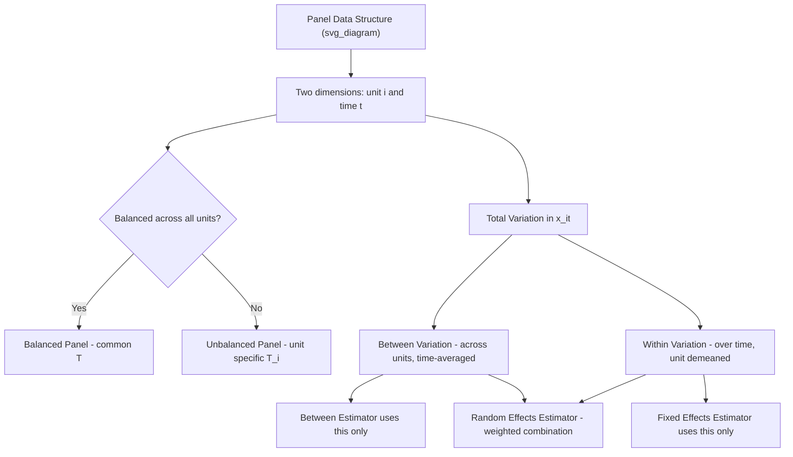

## Panel Data Structure and Notation

### Overview

Panel data (also called longitudinal data) combines a cross-sectional dimension (multiple units — individuals, firms, countries) with a time-series dimension (multiple periods observed for each unit), yielding a dataset with two indices rather than one. This structure is foundational to the entire chapter on static panel data models, since the specific notation, terminology, and data-organization conventions established here underpin every subsequent estimator (pooled OLS, fixed effects, random effects, and beyond). Understanding the structural properties of panel data — balance, dimensionality, and the sources of variation it contains — is a prerequisite for understanding why panel methods can identify effects that pure cross-sectional or pure time-series data cannot.

### Basic Notation

A typical panel data variable is indexed by two subscripts:

$$y_{it}, \quad i = 1, \dots, N, \quad t = 1, \dots, T$$

where:

- $i$ indexes the **cross-sectional unit** (individual, firm, country, household, etc.)
- $t$ indexes the **time period** (year, quarter, month)
- $N$ is the number of cross-sectional units
- $T$ is the number of time periods (per unit, in the balanced case)

The general static panel data regression model is written:

$$y_{it} = x_{it}'\beta + \alpha_i + \varepsilon_{it}$$

where $x_{it}$ is a vector of time-varying (and possibly time-invariant) explanatory variables, $\alpha_i$ represents unobserved, time-invariant individual heterogeneity, and $\varepsilon_{it}$ is the idiosyncratic error term varying across both $i$ and $t$.

**Key Points**

- The presence of $\alpha_i$ — distinct from the idiosyncratic error $\varepsilon_{it}$ — is the defining conceptual feature that separates panel data models from pooled cross-sectional regression: $\alpha_i$ captures **all** time-invariant unobserved characteristics of unit $i$ (e.g., innate ability, firm management quality, country-specific institutional quality) that would otherwise contaminate the error term of a naive cross-sectional regression
- Total number of observations in a full panel is $N \times T$ (balanced case) or $\sum_i T_i$ (unbalanced case, where $T_i$ is the number of periods observed for unit $i$)

### Balanced vs. Unbalanced Panels

**Balanced Panel**

Every cross-sectional unit $i$ is observed for the same set of time periods $t = 1, \dots, T$ — no missing observations for any unit-time combination.

**Unbalanced Panel**

Different units are observed for different numbers of periods or different specific periods (e.g., firms entering/exiting the sample, individuals joining a survey partway through, or attrition from a longitudinal study). Notated with $T_i$ (unit-specific number of periods) rather than a common $T$.

**Key Points**

- Most standard panel estimators (fixed effects, random effects, first-differencing) extend naturally to unbalanced panels **provided the reason for imbalance is unrelated to the outcome of interest (missing completely at random or missing at random conditional on covariates)** — if missingness is itself correlated with the error term (e.g., differential attrition based on unobserved outcome trajectories), this reintroduces a **sample selection problem** requiring the specialized selection-correction methods discussed elsewhere in this material
- Software implementations of standard panel estimators generally handle unbalanced panels automatically, but the researcher should always verify whether the pattern of missingness is plausibly exogenous to the process being studied

### Long vs. Wide Data Format

**Long Format**

Each row represents a single unit-time observation $(i, t)$; a unit with $T$ periods occupies $T$ rows. This is the standard format required by virtually all panel data estimation commands and software packages.

| id | year | y | x1 |
| --- | --- | --- | --- |
| 1 | 2018 | 5.2 | 1.1 |
| 1 | 2019 | 5.8 | 1.3 |
| 2 | 2018 | 3.1 | 0.9 |
| 2 | 2019 | 3.4 | 1.0 |

**Wide Format**

Each row represents a single unit $i$, with separate columns for each time period's value of a variable (e.g., `y_2018`, `y_2019`). Common in raw survey data exports but requires reshaping ("melting" or "stacking") into long format before most panel regression commands can be applied.

**Key Points**

- Data cleaning workflows for panel data typically begin with a **reshape step** converting wide-format raw data into long format, since nearly all standard software estimation commands (e.g., `xtreg` in Stata, `plm` in R) expect long-format input
- Understanding which format a dataset is in, and correctly identifying the unit identifier and time identifier variables, is a prerequisite step before any panel-specific commands can be correctly applied

### Sources of Variation in Panel Data

A defining conceptual advantage of panel data is that it decomposes total variation in a variable into distinct components, which different estimators exploit differently:

**Between Variation**

Variation **across units**, averaging over time for each unit:

$$\bar{x}_i = \frac{1}{T_i}\sum_{t} x_{it}$$

Between variation captures differences in the time-averaged level of $x$ across different individuals/firms/countries.

**Within Variation**

Variation **within a unit over time**, after removing the unit's own time average:

$$\ddot{x}_{it} = x_{it} - \bar{x}_i$$

Within variation captures how a given unit's value of $x$ changes over time relative to its own average.

**Overall Variation**

The total variation in $x_{it}$ across the full sample, combining both between and within components:

$$x_{it} - \bar{x} = (\bar{x}_i - \bar{x}) + (x_{it} - \bar{x}_i)$$

where $\bar{x}$ is the grand mean across all $i$ and $t$.

**Key Points**

- **Fixed effects (within) estimators** use only the **within** variation, since they remove $\alpha_i$ (and hence all between-unit variation) by construction — this is precisely why fixed effects estimation cannot estimate the coefficient on any variable that does not vary over time for a given unit (e.g., an individual's sex in a standard panel, a country's geographic area)
- **Between estimators** use only the between variation (essentially running OLS on unit-level time-averages), discarding all within-unit time variation
- **Random effects (GLS) estimators** use a weighted combination of within and between variation, with weights depending on the relative variances of the individual effect and idiosyncratic error — this is the source of the additional efficiency gain of random effects over fixed effects when the underlying assumptions justifying random effects hold
- Whether an explanatory variable of interest has substantial within-unit variation is a critical practical consideration: if $x_{it}$ barely changes over time within units (little within variation), fixed effects estimates of its coefficient will be very imprecisely estimated (large standard errors), even if there is substantial between-unit variation in $x$

### Types of Panel Data

**Micro Panels**: large $N$ (many individuals, households, or firms), small-to-moderate $T$ (few time periods) — e.g., household survey panels followed for 5-10 years. Asymptotic theory for these settings typically fixes $T$ and lets $N \to \infty$.

**Macro Panels**: smaller $N$ (e.g., countries, states), larger $T$ (many years or quarters) — e.g., cross-country GDP growth panels spanning several decades. Asymptotic theory here often requires different considerations, including potential nonstationarity in $T$, cross-sectional dependence across units, and the need for panel unit-root/cointegration methods not required in short-panel micro settings.

**Pseudo-Panels (Repeated Cross-Sections)**: distinct individuals are sampled in each period (not the same units followed over time), but they can be grouped into cohorts (e.g., by birth year) whose cohort-average characteristics are tracked over time, constructing a "panel" at the cohort level even though no single individual is actually followed repeatedly.

**Key Points**

- The appropriate econometric methods, asymptotic approximations, and diagnostic concerns (e.g., unit roots, cross-sectional dependence) differ substantially between micro and macro panels, so it is important to recognize which regime a given application falls into before selecting an estimation strategy
- Pseudo-panels require additional assumptions (that cohort composition is stable over time, that within-cohort averaging adequately proxies for tracking the same individuals) not needed for genuine panels

### Panel Data Notation Summary Table

| Symbol | Meaning |
| --- | --- |
| $i = 1, \dots, N$ | Cross-sectional unit index |
| $t = 1, \dots, T$ | Time period index |
| $T_i$ | Number of periods observed for unit $i$ (unbalanced panels) |
| $y_{it}$, $x_{it}$ | Outcome and covariates for unit $i$ at time $t$ |
| $\alpha_i$ | Unobserved, time-invariant individual effect |
| $\varepsilon_{it}$ | Idiosyncratic error, varies across $i$ and $t$ |
| $\bar{x}_i$ | Unit-specific time average (source of between variation) |
| $\ddot{x}_{it} = x_{it} - \bar{x}_i$ | Demeaned value (source of within variation) |

### Diagram: Panel Data Structure and Variation Decomposition

### Illustration: Within vs. Between Variation

<svg xmlns="http://www.w3.org/2000/svg" viewBox="0 0 640 340">
<text x="320" y="24" font-size="16" font-weight="bold" text-anchor="middle" fill="#222">Within vs Between Variation Across Units (svg_diagram)</text>
<line x1="70" y1="290" x2="580" y2="290" stroke="#333" stroke-width="2" />
<line x1="70" y1="290" x2="70" y2="50" stroke="#333" stroke-width="2" />
<text x="325" y="320" font-size="13" text-anchor="middle" fill="#333">Time (t)</text>
<text x="30" y="170" font-size="13" text-anchor="middle" fill="#333" transform="rotate(-90 30 170)">x_it</text>

<line x1="70" y1="120" x2="580" y2="120" stroke="#1f77b4" stroke-dasharray="4" />
<path d="M 100 130 L 200 105 L 300 125 L 400 100 L 500 115" stroke="#1f77b4" stroke-width="2.5" fill="none" />
<text x="590" y="120" font-size="11" fill="#1f77b4">Unit A mean</text>

<line x1="70" y1="220" x2="580" y2="220" stroke="#d62728" stroke-dasharray="4" />
<path d="M 100 230 L 200 210 L 300 235 L 400 205 L 500 225" stroke="#d62728" stroke-width="2.5" fill="none" />
<text x="590" y="220" font-size="11" fill="#d62728">Unit B mean</text>

<text x="100" y="70" font-size="11" fill="#555">Gap between dashed lines = Between variation</text>

<text x="250" y="160" font-size="11" fill="#555">Wiggles around each dashed line = Within variation</text>

</svg>

*Note: the vertical gap between Unit A's and Unit B's mean lines represents between-unit variation; the fluctuation of each unit's solid line around its own dashed mean line represents within-unit variation. A fixed effects estimator uses only the latter.*

### Worked Example

A researcher has firm-level data on 500 firms ($N=500$) observed annually from 2015-2020 ($T=6$), a balanced panel with $N \times T = 3{,}000$ total observations, examining the relationship between R&D spending ($x_{it}$) and productivity ($y_{it}$):

- **Between variation** in R&D spending reflects that some firms are simply larger, more R&D-intensive businesses on average (e.g., a pharmaceutical firm vs. a retail firm) — this variation is present even looking only at each firm's 2015-2020 average
- **Within variation** reflects how a *given* firm's R&D spending fluctuates from year to year around its own average (e.g., a temporary R&D tax credit inducing a firm to increase spending in 2019 relative to its own typical level)
- If the researcher is concerned that time-invariant firm characteristics (management quality, baseline technological sophistication) are correlated with both R&D spending levels **and** unobserved productivity determinants, a fixed effects estimator — using only the within variation — removes this confound, but at the cost of discarding the (larger, but potentially confounded) between-firm variation, generally resulting in less precise estimates than would result from exploiting all the variation naively (as pooled OLS would, at the risk of bias)

**[Inference]** This example uses a hypothetical dataset structure for illustration; it is not drawn from a specific cited firm-level R&D study.

### Software Implementation Notes

- **R**: `plm` package's `pdata.frame()` function declares panel structure (unit and time identifiers); `is.pbalanced()` checks balance; `plm()` with `model = "within"`, `"between"`, `"random"`, or `"pooling"` implements the corresponding estimator directly on correctly declared panel data
- **Stata**: `xtset id time` declares panel structure prior to any `xt`-prefixed command; `xtdescribe` summarizes the panel's balance pattern; `reshape long`/`reshape wide` converts between formats
- **Python**: `pandas` `MultiIndex` (typically `set_index(['id', 'time'])`) is the standard way to declare panel structure; `linearmodels.panel` package (`PanelOLS`, `BetweenOLS`, `RandomEffects`) implements the corresponding estimators on properly indexed data

**[Unverified]** Exact function names, syntax, and default handling of unbalanced panels can vary across package versions; consult current documentation for the specific version in use.

### Related Topics

- Pooled OLS estimation and its limitations in panel settings
- The fixed effects (within) estimator
- The random effects (GLS) estimator and the Hausman test
- First-differencing as an alternative to within-transformation
- Dynamic panel data models (Arellano-Bond, system GMM)
- Panel unit roots and cross-sectional dependence (macro panel considerations)
- Clustered standard errors in panel data settings