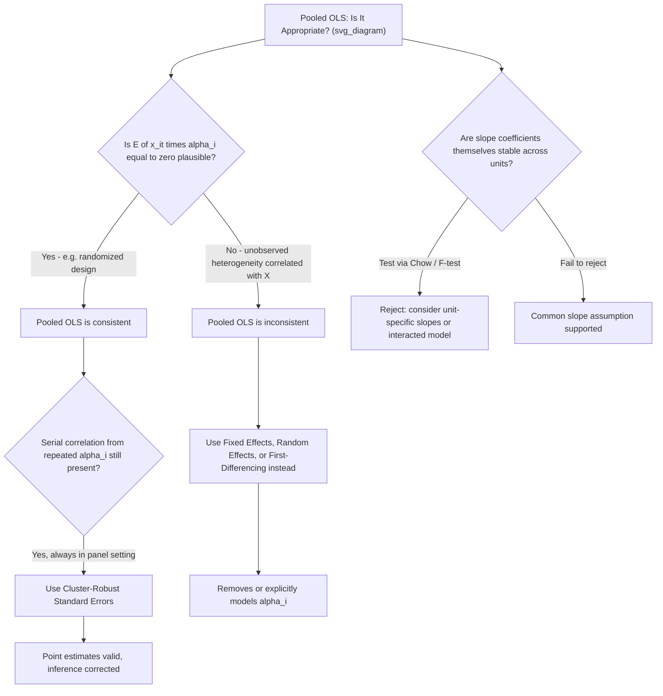

## Pooled OLS and Its Limitations

### Overview

Pooled Ordinary Least Squares (Pooled OLS) is the most naive approach to estimating a regression model with panel data: it simply stacks all $N \times T$ observations together and runs standard OLS, completely ignoring the panel structure — treating every unit-time observation as if it were an independent draw from a single cross-section. While computationally trivial, pooled OLS is generally **inconsistent** whenever unobserved time-invariant heterogeneity exists and is correlated with the regressors, making it the natural starting point for motivating why panel-specific estimators (fixed effects, random effects) are needed at all.

### The Pooled OLS Model and Estimator

Starting from the standard panel data model:

$$y_{it} = x_{it}'\beta + \alpha_i + \varepsilon_{it}$$

Pooled OLS treats the composite error term $u_{it} = \alpha_i + \varepsilon_{it}$ as a single, undifferentiated disturbance and estimates:

$$y_{it} = x_{it}'\beta + u_{it}$$

by running OLS on the stacked $N \times T$ dataset, exactly as if it were a single cross-section of $NT$ independent observations:

$$\hat{\beta}_{Pooled} = \left(\sum_{i=1}^N\sum_{t=1}^T x_{it}x_{it}'\right)^{-1} \left(\sum_{i=1}^N\sum_{t=1}^T x_{it}y_{it}\right)$$

**Key Points**

- Pooled OLS makes **no attempt** to separate $\alpha_i$ from $\varepsilon_{it}$ — it simply lumps them together into a single error term
- This is mechanically identical to running OLS on a dataset that happens to have repeated observations per unit, without using that repeated structure in any special way

### The Core Problem: Correlation Between $\alpha_i$ and $x_{it}$

**Consistency Condition**

Pooled OLS is consistent if and only if the standard OLS exogeneity condition holds for the **composite error**:

$$E[x_{it} \cdot u_{it}] = E[x_{it}(\alpha_i + \varepsilon_{it})] = 0$$

This requires **both**:

1. $E[x_{it}\varepsilon_{it}] = 0$ (standard exogeneity of the idiosyncratic error)
2. $E[x_{it}\alpha_i] = 0$ (the regressors are uncorrelated with the **unobserved individual effect**)

**Key Points**

- Condition (2) is the critical, panel-specific requirement, and it is precisely the condition that **fails** in the vast majority of realistic economic applications where $\alpha_i$ represents something like innate ability, firm management quality, or country-specific institutional characteristics that plausibly correlate with the observed regressors
- The classic motivating example: in a wage equation, $\alpha_i$ might represent unobserved ability; if ability is correlated with observed years of education ($x_{it}$) — because more able individuals tend to acquire more education — then $E[x_{it}\alpha_i] \ne 0$, and pooled OLS's estimated return to education will be **upward biased** (conflating the true causal return to education with the fact that education is a proxy for otherwise-unobserved ability)

### Consequences of Ignoring Unobserved Heterogeneity

**Omitted Variable Bias**

When $\alpha_i$ is correlated with $x_{it}$, pooled OLS suffers from a form of omitted variable bias analogous to the classical cross-sectional case, except here the "omitted variable" is the entire vector of individual-specific unobserved characteristics, which by definition **cannot** be directly measured or included as an observed regressor.

**Serial Correlation in the Composite Error**

Even when $E[x_{it}\alpha_i] = 0$ (so pooled OLS remains **consistent**), the composite error $u_{it} = \alpha_i + \varepsilon_{it}$ is, by construction, **serially correlated within each unit** across time periods, because $\alpha_i$ is the same value repeated in every period for a given unit:

$$\text{Cov}(u_{it}, u_{is}) = \text{Var}(\alpha_i) = \sigma_\alpha^2 \ne 0 \quad \text{for } t \ne s$$

**Key Points**

- This serial correlation means that even in the "lucky" case where pooled OLS is consistent, the standard OLS variance formula (assuming independent errors) is **invalid**, and conventional OLS standard errors will generally be **understated**, leading to over-rejection of true null hypotheses if uncorrected
- The correct remedy in this case is **not** to abandon pooled OLS entirely, but to compute **cluster-robust standard errors**, clustering at the individual/unit level, which properly accounts for the within-unit correlation induced by the repeated presence of $\alpha_i$ across time periods for the same unit

### Distinguishing Two Separate Problems

It is important to keep two distinct issues conceptually separate, since they call for different remedies:

| Problem | Cause | Consequence | Remedy |
| --- | --- | --- | --- |
| Inconsistency | $E[x_{it}\alpha_i] \ne 0$ | Biased, inconsistent point estimates of $\beta$ | Fixed effects, first-differencing, or other transformations removing $\alpha_i$ |
| Incorrect standard errors | $\alpha_i$ induces serial correlation in $u_{it}$, even if $E[x_{it}\alpha_i]=0$ | Consistent point estimates but invalid inference (understated SEs) | Cluster-robust standard errors (clustered by unit) |

**Key Points**

- A common conceptual error in applied work is address only one of these two issues while neglecting the other — e.g., reporting pooled OLS with cluster-robust standard errors as if this alone resolves all panel-specific concerns, when the standard errors correction does nothing to address potential inconsistency if $\alpha_i$ is genuinely correlated with $x_{it}$
- Conversely, some researchers overcorrect by assuming that any panel dataset automatically requires fixed effects, even in settings where random assignment or strong institutional reasons support the (testable) assumption that $E[x_{it}\alpha_i]=0$

### When Might Pooled OLS Be Defensible?

Pooled OLS with cluster-robust standard errors can be a reasonable and even preferred choice in specific circumstances:

- When there is **strong a priori or experimental justification** that unobserved unit-level heterogeneity is uncorrelated with the regressors of interest (e.g., data from a randomized experiment repeated across time periods, where treatment assignment is independent of any unobserved individual characteristics by design)
- When the primary variable of interest is **time-invariant** (e.g., a fixed geographic or demographic characteristic), since fixed effects estimation cannot identify the coefficient on such a variable at all (it is absorbed into $\alpha_i$ and eliminated by the within-transformation) — in this specific situation, pooled OLS (or random effects) may be the only feasible approach if the coefficient on that time-invariant variable is of direct interest
- As a useful **diagnostic baseline**: comparing pooled OLS to fixed effects estimates (formally, via a Hausman-type test) can itself provide evidence on whether $E[x_{it}\alpha_i]=0$ is a plausible assumption, since a substantial divergence between the two estimates suggests the presence of problematic correlation

**[Inference]** Whether pooled OLS is "defensible" in a given application is a substantive judgment resting on institutional knowledge of the data-generating process, not something that can be settled by a purely mechanical statistical test alone — even a failure to reject a Hausman test does not definitively establish the exogeneity assumption, particularly in finite samples with limited power.

### Testing the Poolability Assumption

Before proceeding to more complex panel estimators, it is common practice to formally test whether pooling is appropriate at all, in a different but related sense: whether the **slope coefficients themselves** are stable across units (as opposed to only the intercept, $\alpha_i$, differing). A **Chow test** (or an F-test comparing the restricted pooled model to an unrestricted model allowing unit-specific slopes) checks:

$$H_0: \beta_1 = \beta_2 = \dots = \beta_N \quad \text{(common slope across all units)}$$

Rejecting this null suggests that a single pooled slope coefficient is itself a poor summary of genuinely heterogeneous unit-specific relationships — a distinct concern from the $\alpha_i$-correlation problem discussed above, since it questions whether $\beta$ itself is meaningfully "the same" $\beta$ for every unit, not merely whether the intercept differs.

### Diagram: Pooled OLS Diagnostic Decision Tree

### Illustration: Spurious Pooled OLS Relationship from Unobserved Heterogeneity

<svg xmlns="http://www.w3.org/2000/svg" viewBox="0 0 640 340">
<text x="320" y="24" font-size="16" font-weight="bold" text-anchor="middle" fill="#222">Pooled OLS Bias from Unit-Level Heterogeneity (svg_diagram)</text>
<line x1="70" y1="290" x2="580" y2="290" stroke="#333" stroke-width="2" />
<line x1="70" y1="290" x2="70" y2="50" stroke="#333" stroke-width="2" />
<text x="325" y="320" font-size="13" text-anchor="middle" fill="#333">X (e.g. education)</text>
<text x="30" y="170" font-size="13" text-anchor="middle" fill="#333" transform="rotate(-90 30 170)">Y (e.g. wage)</text>

<circle cx="140" cy="150" r="4" fill="#1f77b4" />
<circle cx="160" cy="145" r="4" fill="#1f77b4" />
<circle cx="180" cy="140" r="4" fill="#1f77b4" />
<line x1="130" y1="155" x2="190" y2="135" stroke="#1f77b4" stroke-width="1.5" />

<circle cx="340" cy="230" r="4" fill="#2ca02c" />
<circle cx="360" cy="225" r="4" fill="#2ca02c" />
<circle cx="380" cy="220" r="4" fill="#2ca02c" />
<line x1="330" y1="235" x2="390" y2="215" stroke="#2ca02c" stroke-width="1.5" />

<circle cx="480" cy="260" r="4" fill="#9467bd" />
<circle cx="500" cy="255" r="4" fill="#9467bd" />
<circle cx="520" cy="250" r="4" fill="#9467bd" />
<line x1="470" y1="265" x2="530" y2="245" stroke="#9467bd" stroke-width="1.5" />

<line x1="100" y1="145" x2="560" y2="255" stroke="#d62728" stroke-width="2.5" stroke-dasharray="6,3" />
<text x="400" y="270" font-size="11" fill="#d62728">Pooled OLS line - steep, biased</text>
<text x="140" y="120" font-size="10" fill="#555">True within-unit slopes are flat/small</text>
</svg>

*Note: within each unit's own cluster of points, the true relationship (small colored line segments) is nearly flat. But because units with systematically different unobserved levels (alpha_i) also happen to differ in average X, the pooled OLS line (red dashed) picks up a steep, spurious slope driven entirely by between-unit differences rather than the true within-unit causal relationship.*

### Worked Example

A researcher examines the relationship between a country's trade openness ($x_{it}$) and GDP growth ($y_{it}$) using a panel of 60 countries over 20 years:

- **Pooled OLS** on the stacked data finds a strong positive coefficient on trade openness
- However, countries differ substantially in unobserved, time-invariant institutional quality ($\alpha_i$) — and institutional quality is plausibly correlated with both a country's average trade openness (better institutions facilitate trade) **and** its average growth rate (better institutions directly support growth)
- This is a textbook case where $E[x_{it}\alpha_i] \ne 0$: pooled OLS's positive coefficient may substantially **overstate** the true causal effect of trade openness on growth, since it partly reflects the confounding influence of unobserved institutional quality rather than a causal trade-growth relationship
- A fixed effects specification, which removes $\alpha_i$ by relying only on **within-country** changes in trade openness over time, would provide a more credible (though not necessarily unbiased, if other time-varying confounders remain) estimate of the trade-growth relationship

**[Inference]** This example is a stylized illustration of a well-known concern in the cross-country growth literature and does not represent specific cited numerical findings.

### Software Implementation Notes

- **R**: simple `lm(y ~ x, data = df)` on the stacked panel implements pooled OLS; cluster-robust standard errors require `plm()` with `vcovHC(fit, cluster = "group")` from the `plm`/`sandwich` packages, or `felm()` from `lfe` with a cluster specification
- **Stata**: standard `regress y x` on panel-structured data implements pooled OLS; `regress y x, vce(cluster id)` adds unit-clustered standard errors; `xtreg y x, pa` (population-averaged) is a related but distinct GEE-based approach sometimes confused with simple pooled OLS
- **Python**: `statsmodels.OLS` on the stacked DataFrame implements pooled OLS; cluster-robust standard errors via `.fit(cov_type='cluster', cov_kwds={'groups': df['id']})`; `linearmodels.panel.PooledOLS` provides a panel-data-aware wrapper with built-in clustering options

**[Unverified]** Exact syntax for cluster-robust standard error specification and default clustering behavior can vary across package versions; confirm current syntax against the specific version's documentation before implementation.

### Related Topics

- Panel data structure and notation (between/within variation decomposition)
- The fixed effects (within) estimator
- The random effects (GLS) estimator and the Hausman test
- Cluster-robust standard errors and their justification
- First-differencing as an alternative transformation removing $\alpha_i$
- Chow tests and slope-heterogeneity testing across panel units
- Dynamic panel bias (Nickell bias) as a related but distinct panel data pitfall