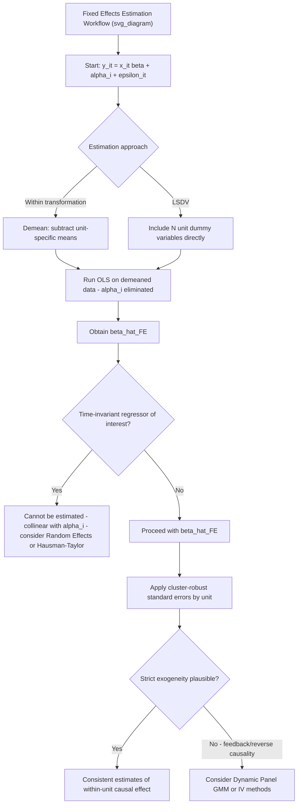

## Fixed Effects Estimation

### Overview

The fixed effects (FE) estimator, also called the **within estimator**, is the workhorse method for eliminating bias from time-invariant unobserved heterogeneity in panel data. Rather than modeling $\alpha_i$ as a random draw or attempting to measure it directly, the fixed effects approach algebraically **removes** $\alpha_i$ from the equation entirely by transforming the data, exploiting only the within-unit variation over time. This makes it robust to arbitrary correlation between $\alpha_i$ and the regressors — the single most common threat to the validity of pooled OLS in panel settings.

### The Fixed Effects Model

Starting from the standard panel model:

$$y_{it} = x_{it}'\beta + \alpha_i + \varepsilon_{it}$$

the **fixed effects assumption** treats $\alpha_i$ as a parameter to be **eliminated** (not modeled as random), and allows $\alpha_i$ to be correlated with $x_{it}$ in an arbitrary, unrestricted way — this is the estimator's central strength and distinguishing feature relative to random effects.

### The Within Transformation

For each unit $i$, average the equation over time:

$$\bar{y}_i = \bar{x}_i'\beta + \alpha_i + \bar{\varepsilon}_i$$

Subtracting this unit-specific mean equation from the original observation-level equation:

$$y_{it} - \bar{y}_i = (x_{it} - \bar{x}_i)'\beta + (\varepsilon_{it} - \bar{\varepsilon}_i)$$

or, using the demeaning notation $\ddot{y}_{it} = y_{it} - \bar{y}_i$ and $\ddot{x}_{it} = x_{it} - \bar{x}_i$:

$$\ddot{y}_{it} = \ddot{x}_{it}'\beta + \ddot{\varepsilon}_{it}$$

**The individual effect $\alpha_i$ has been algebraically eliminated** — since $\alpha_i$ is constant over time for unit $i$, it disappears from both the unit mean and the demeaned observation. Running OLS on this transformed, demeaned equation yields the **fixed effects (within) estimator**:

$$\hat{\beta}_{FE} = \left(\sum_i\sum_t \ddot{x}_{it}\ddot{x}_{it}'\right)^{-1}\left(\sum_i\sum_t \ddot{x}_{it}\ddot{y}_{it}\right)$$

**Key Points**

- The within transformation is the direct mechanical embodiment of using **only within variation** (as introduced in the panel data structure discussion): all between-unit variation is removed by demeaning, so $\hat{\beta}_{FE}$ is identified purely from how $x_{it}$ and $y_{it}$ **change over time within each unit**
- Because $\alpha_i$ is eliminated regardless of its correlation with $x_{it}$, the FE estimator is **consistent even when $E[x_{it}\alpha_i] \ne 0$** — the key property that fixes pooled OLS's central vulnerability

### The Least Squares Dummy Variable (LSDV) Equivalence

An algebraically equivalent (and numerically identical, in the balanced panel case) approach: include a full set of $N$ unit-specific dummy (indicator) variables directly in the regression:

$$y_{it} = x_{it}'\beta + \sum_{j=1}^N \delta_j D_{ij} + \varepsilon_{it}$$

where $D_{ij} = \mathbb{1}(i=j)$. Estimating $\beta$ and all $\delta_j$ simultaneously by OLS (the **Least Squares Dummy Variable, LSDV, estimator**) produces exactly the same $\hat{\beta}$ as the within-transformed regression (the Frisch-Waugh-Lovell theorem guarantees this equivalence).

**Key Points**

- LSDV is conceptually transparent (each $\hat{\delta}_j$ is directly interpretable as the estimated fixed effect for unit $j$) but computationally inefficient for large $N$, since it requires estimating and storing $N$ additional parameters
- The within-transformation approach avoids ever explicitly estimating the individual $\alpha_i$ values, making it the standard computational approach in modern software, though LSDV remains useful when the fixed effect estimates themselves are of direct interest (e.g., ranking firms or schools by their fixed effect)

### Time-Invariant Variables Cannot Be Estimated

A direct and important mechanical consequence of the within transformation: any regressor that does **not vary over time** for a given unit (e.g., an individual's sex or race in a standard panel, a country's land area, a firm's founding year) is **perfectly collinear with $\alpha_i$** and is demeaned to exactly zero:

$$\ddot{x}_{it} = x_{it} - \bar{x}_i = 0 \quad \text{if } x_{it} = x_i \; \forall t$$

**Key Points**

- This means fixed effects estimation **cannot separately identify the coefficient on any time-invariant regressor** — its effect is entirely absorbed into $\alpha_i$
- If the coefficient on a time-invariant characteristic is the object of substantive interest, fixed effects is **not** the appropriate estimator; random effects or pooled OLS (with their own respective assumptions and limitations) would be needed instead, or a **Hausman-Taylor**-style estimator that partially relaxes this restriction under additional assumptions

### Degrees of Freedom and the Incidental Parameters Consideration

Although the within-transformation approach avoids explicitly estimating $N$ separate $\alpha_i$ parameters, the **effective loss of degrees of freedom** from removing unit-specific means is real: the correct degrees of freedom for inference is $NT - N - k$ (subtracting both the $N$ implicitly estimated fixed effects and the $k$ slope parameters), not simply $NT - k$.

**Key Points**

- Most modern software automatically applies the correct degrees-of-freedom adjustment when computing standard errors from a within-transformed (or LSDV) regression — but this should be verified rather than assumed, particularly with manually implemented demeaning
- **[Inference]** With very short panels (small $T$, e.g., $T=2$ or $T=3$) and large $N$, this degrees-of-freedom loss is proportionally modest relative to $NT$; the more consequential concern in very short panels is typically the imprecision of $\hat{\beta}_{FE}$ itself if within-unit variation in $x_{it}$ is limited, rather than the degrees-of-freedom correction per se

### First-Differencing as an Alternative Transformation

For panels with $T=2$, an alternative (and, in that specific case, numerically identical) transformation is **first-differencing**:

$$y_{it} - y_{i,t-1} = (x_{it} - x_{i,t-1})'\beta + (\varepsilon_{it} - \varepsilon_{i,t-1})$$

which also eliminates $\alpha_i$ by direct subtraction, since $\alpha_i - \alpha_i = 0$.

**Key Points**

- For $T > 2$, first-differencing and the within (demeaning) transformation are **generally not numerically identical**, though both are consistent under the fixed effects assumption — they make different implicit efficiency assumptions about the serial correlation structure of $\varepsilon_{it}$
- First-differencing is generally preferred when $\varepsilon_{it}$ is suspected to follow a random walk or highly persistent process (in which case differencing may be more efficient), while the within estimator is generally preferred (and is the more commonly used default) when $\varepsilon_{it}$ is closer to serially uncorrelated, since first-differencing in that case amplifies noise (a well-known result related to negative serial correlation induced by differencing i.i.d. errors)

### Assumptions Required for Consistency

- **Strict exogeneity**: $E[\varepsilon_{it} \mid x_{i1}, x_{i2}, \dots, x_{iT}, \alpha_i] = 0$ — the idiosyncratic error must be uncorrelated with the regressors in **all** time periods, not merely contemporaneously. This is a **stronger** requirement than the corresponding assumption in a simple cross-section, since it rules out, for example, any feedback from past shocks to future regressor values (a concern particularly relevant when a lagged dependent variable is included, which violates strict exogeneity and requires dynamic panel methods instead)
- **No perfect collinearity** after demeaning (rules out time-invariant regressors, as discussed above)
- **Arbitrary correlation between $\alpha_i$ and $x_{it}$ is permitted** — this is the estimator's key relaxation relative to random effects, not an assumption that must additionally hold

**Key Points**

- Strict exogeneity failing due to **feedback** (e.g., $x_{it}$ responds to a past realization of $\varepsilon_{i,t-1}$) is a common and important threat that the FE estimator does **not** protect against — fixed effects removes bias from **time-invariant** confounding but does nothing to address **time-varying** endogeneity or reverse causality
- This is a frequently misunderstood point in applied work: including fixed effects is **not** a general-purpose solution to endogeneity; it specifically addresses omitted variable bias from **unobserved, time-invariant** factors, and other sources of endogeneity (time-varying omitted variables, simultaneity, measurement error) remain unaddressed and require separate remedies (instrumental variables, dynamic panel GMM, etc.)

### Standard Errors and Serial Correlation

Even after removing $\alpha_i$, the transformed error $\ddot{\varepsilon}_{it}$ can still exhibit serial correlation or heteroskedasticity within units (e.g., from persistent shocks, or from the mechanical fact that the within-transformation itself induces some correlation structure in $\ddot{\varepsilon}_{it}$ even if $\varepsilon_{it}$ was originally i.i.d.). **Cluster-robust standard errors (clustered by unit $i$)** are the standard default recommendation in applied fixed effects work, since they are robust to arbitrary heteroskedasticity and serial correlation within a unit, without requiring the researcher to specify the exact form of that correlation.

### Fixed Effects vs. Pooled OLS: Summary Comparison

| Feature | Pooled OLS | Fixed Effects |
| --- | --- | --- |
| Handles $\alpha_i$ correlated with $x_{it}$ | No — biased if correlated | Yes — consistent regardless |
| Uses between-unit variation | Yes | No — entirely discarded |
| Can estimate time-invariant regressors | Yes | No — perfectly collinear with $\alpha_i$ |
| Efficiency | Higher if $E[x_{it}\alpha_i]=0$ holds | Lower (discards between variation) even when consistent |
| Addresses time-varying endogeneity | No | No — only removes time-invariant confounding |
| Standard degrees of freedom | $NT - k$ | $NT - N - k$ |

### Diagram: Fixed Effects Estimation Workflow

### Illustration: Fixed Effects Removes Between-Unit Confounding

<svg xmlns="http://www.w3.org/2000/svg" viewBox="0 0 640 340">
<text x="320" y="24" font-size="16" font-weight="bold" text-anchor="middle" fill="#222">Within Transformation Isolates True Slope (svg_diagram)</text>
<line x1="70" y1="290" x2="580" y2="290" stroke="#333" stroke-width="2" />
<line x1="70" y1="290" x2="70" y2="50" stroke="#333" stroke-width="2" />
<text x="325" y="320" font-size="13" text-anchor="middle" fill="#333">Demeaned X (x_it - x_bar_i)</text>
<text x="30" y="170" font-size="13" text-anchor="middle" fill="#333" transform="rotate(-90 30 170)">Demeaned Y (y_it - y_bar_i)</text>

<circle cx="200" cy="200" r="4" fill="#1f77b4" />
<circle cx="250" cy="180" r="4" fill="#1f77b4" />
<circle cx="180" cy="220" r="4" fill="#1f77b4" />
<circle cx="300" cy="150" r="4" fill="#2ca02c" />
<circle cx="270" cy="170" r="4" fill="#2ca02c" />
<circle cx="330" cy="140" r="4" fill="#2ca02c" />
<circle cx="380" cy="120" r="4" fill="#9467bd" />
<circle cx="350" cy="135" r="4" fill="#9467bd" />
<circle cx="400" cy="110" r="4" fill="#9467bd" />

<line x1="150" y1="230" x2="430" y2="100" stroke="#d62728" stroke-width="2.5" />
<text x="440" y="95" font-size="11" fill="#d62728">FE slope: true within-unit effect</text>

<circle cx="325" cy="170" r="3" fill="#333" />
<text x="335" y="185" font-size="10" fill="#555">origin (0,0) - each unit's own mean</text>
</svg>

*Note: after demeaning, each unit's cloud of points is centered at the origin (its own mean), and the between-unit differences visible in the raw (non-demeaned) data — which drove the spurious pooled OLS slope in the previous topic's illustration — have been entirely removed. The single fitted line through the pooled, demeaned cloud now reflects only the true within-unit relationship.*

### Worked Example

Returning to the country-level trade openness and GDP growth example: applying fixed effects to the 60-country, 20-year panel removes each country's time-invariant institutional quality ($\alpha_i$) by construction.

- The fixed effects estimate of the trade-growth coefficient is typically **smaller in magnitude** than the pooled OLS estimate, consistent with the earlier finding that pooled OLS's estimate was inflated by cross-country institutional differences correlated with both trade openness and growth
- However, the fixed effects estimate is now identified purely from **within-country changes** in trade openness over time (e.g., a country liberalizing trade policy in a specific year) — if such within-country policy changes are relatively rare or measurement-error-prone, the fixed effects estimate, while less biased, may also be considerably **less precise** (larger standard errors) than the pooled OLS estimate
- If a specific country's trade liberalization in year $t$ was itself a *response* to an anticipated future growth shock (reverse causality/feedback), strict exogeneity would be violated, and even the fixed effects estimate would remain biased — illustrating that fixed effects addresses time-invariant confounding but not time-varying endogeneity

**[Inference]** This continues the stylized illustration from the pooled OLS discussion and does not represent specific cited empirical findings.

### Software Implementation Notes

- **R**: `plm(y ~ x, data = pdata, model = "within")` from the `plm` package; `felm(y ~ x | id, data = df)` from `lfe` (efficient for large numbers of fixed effects); `fixest::feols(y ~ x | id, data = df)` is a modern, fast alternative with built-in cluster-robust standard error support
- **Stata**: `xtreg y x, fe` implements the within estimator directly; `areg y x, absorb(id)` is an older alternative; both support `vce(cluster id)` for cluster-robust standard errors
- **Python**: `linearmodels.panel.PanelOLS(y, x, entity_effects=True)` implements fixed effects on properly indexed panel data, with `.fit(cov_type='clustered', cluster_entity=True)` for cluster-robust inference

**[Unverified]** Exact syntax, default standard error behavior, and performance characteristics for large numbers of fixed effects can differ across package versions; consult current documentation for the specific version in use, particularly for very high-dimensional fixed effects (e.g., firm-year or multi-way fixed effects), which may require specialized "high-dimensional fixed effects" solvers.

### Related Topics

- Panel data structure and notation (within vs. between variation)
- Pooled OLS and its limitations
- The random effects (GLS) estimator and the Hausman test
- First-differencing and its efficiency comparison to the within estimator
- Strict exogeneity and its role in ruling out lagged dependent variables
- Dynamic panel data models (Arellano-Bond) for settings where strict exogeneity fails
- Cluster-robust standard errors and multi-way clustering