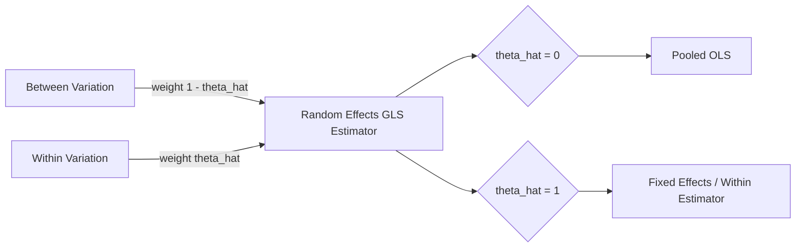

## Random Effects Estimation

### Overview

Random effects (RE) estimation is a method for analyzing panel data in which the unobserved individual-specific heterogeneity is treated as a random variable, uncorrelated with the regressors, rather than as a fixed parameter to be estimated for each unit. This assumption allows the model to be estimated more efficiently than the fixed effects (FE) estimator, since it does not require sacrificing degrees of freedom to estimate individual intercepts.

### The Random Effects Model

The panel data model is written as:

$$y_{it} = \alpha + x_{it}'\beta + u_i + \varepsilon_{it}$$

where:

- $y_{it}$ is the dependent variable for unit $i$ at time $t$
- $x_{it}$ is a vector of time-varying regressors
- $\alpha$ is the overall intercept
- $u_i$ is the unit-specific random effect (time-invariant)
- $\varepsilon_{it}$ is the idiosyncratic error term

The composite error is $v_{it} = u_i + \varepsilon_{it}$.

**Key Points**

- $u_i \sim \text{IID}(0, \sigma_u^2)$
- $\varepsilon_{it} \sim \text{IID}(0, \sigma_\varepsilon^2)$
- $u_i$ and $\varepsilon_{it}$ are independent of each other and of $x_{it}$ for all $i, t$
- Unlike fixed effects, $u_i$ is **not** a parameter to estimate — it is part of the error structure

### Critical Identifying Assumption

The defining assumption of the RE model, which distinguishes it from FE, is strict exogeneity of the individual effect with respect to the regressors:

$$E[u_i \mid x_{i1}, x_{i2}, \dots, x_{iT}] = 0$$

If this assumption fails — i.e., if $u_i$ is correlated with any $x_{it}$ — the RE estimator is inconsistent, and fixed effects should be used instead. This assumption is the central practical concern in choosing between RE and FE, and is formally tested via the Hausman test.

### Error Structure and Serial Correlation

Because $u_i$ appears in every time period for unit $i$, the composite error term is serially correlated even though the underlying components are not:

$$\text{Cov}(v_{it}, v_{is}) = \sigma_u^2 \quad \text{for } t \neq s$$

$$\text{Var}(v_{it}) = \sigma_u^2 + \sigma_\varepsilon^2$$

This induces an equicorrelated (compound symmetric) covariance structure within each individual:

$$\rho = \text{Corr}(v_{it}, v_{is}) = \frac{\sigma_u^2}{\sigma_u^2 + \sigma_\varepsilon^2}, \quad t \neq s$$

Ordinary Least Squares (OLS) on the pooled data is consistent under the RE assumptions but inefficient, and standard errors are wrong unless clustered, because it ignores this correlation structure.

### GLS Transformation and the Quasi-Demeaning Estimator

The RE estimator is obtained via Feasible Generalized Least Squares (FGLS), which transforms the data using a quasi-demeaning (partial demeaning) procedure. Define the transformation parameter:

$$\hat{\theta} = 1 - \sqrt{\frac{\sigma_\varepsilon^2}{\sigma_\varepsilon^2 + T\sigma_u^2}}$$

The transformed model is:

$$y_{it} - \hat{\theta}\bar{y}_i = \alpha(1-\hat{\theta}) + (x_{it} - \hat{\theta}\bar{x}_i)'\beta + (\text{transformed error})$$

where $\bar{y}_i$ and $\bar{x}_i$ are individual time-means. OLS applied to this transformed equation yields the RE (GLS) estimator.

**Key Points**

- If $\hat{\theta} = 0$: no demeaning occurs → reduces to pooled OLS
- If $\hat{\theta} = 1$: full demeaning occurs → reduces to the within (fixed effects) estimator
- RE is thus a weighted average, nesting both pooled OLS and FE as limiting cases
- Because RE only partially removes $\bar{x}_i$, it retains between-unit variation, which is why it can estimate coefficients on time-invariant regressors, unlike FE

### Variance Component Estimation

$\sigma_u^2$ and $\sigma_\varepsilon^2$ are unknown and must be estimated before feasible GLS can be applied. Common approaches:

- **Swamy-Arora method**: uses ANOVA-type quadratic forms from the within and between residuals
- **Wallace-Hussain method**: uses residuals from pooled OLS
- **Maximum Likelihood / REML**: estimates variance components jointly with $\beta$ under normality

$$\hat{\sigma}_\varepsilon^2 = \frac{\text{Within SSR}}{NT - N - K}$$

$$\hat{\sigma}_u^2 = \frac{\text{Between SSR}}{N - K - 1} - \frac{\hat{\sigma}_\varepsilon^2}{T}$$

[Inference] Different software packages (Stata's `xtreg, re` default vs. `xtreg, re sa`, R's `plm` package) may use different default variance-component estimators, which can produce slightly different point estimates on the same dataset.

### Estimation via Maximum Likelihood

Under normality of $u_i$ and $\varepsilon_{it}$, the RE model can alternatively be estimated by full Maximum Likelihood (ML) or Restricted Maximum Likelihood (REML), which jointly estimates $\beta$, $\sigma_u^2$, and $\sigma_\varepsilon^2$ by maximizing the log-likelihood of the panel-structured multivariate normal distribution. REML corrects for the degrees of freedom lost in estimating $\beta$, generally producing less biased variance component estimates in small samples than ML.

### Properties of the RE Estimator

**Key Points**

- **Consistent** as $N \to \infty$ (fixed $T$), provided $E[u_i \mid X_i] = 0$
- **Efficient**: under the RE assumptions, GLS is BLUE (Best Linear Unbiased Estimator) among estimators using both within and between variation
- Can estimate coefficients on **time-invariant** regressors (e.g., gender, region), unlike FE, which annihilates them via demeaning
- Uses both within-unit and between-unit variation, generally yielding smaller standard errors than FE when the RE assumption holds

### Random Effects vs. Fixed Effects: Comparison

| Criterion | Random Effects | Fixed Effects |
| --- | --- | --- |
| Handles $u_i$ | Random variable | Nuisance parameter |
| Requires $\text{Cov}(u_i, x_{it}) = 0$ | Yes | No |
| Time-invariant regressors | Estimable | Dropped (collinear) |
| Efficiency | More efficient (if valid) | Less efficient |
| Consistency if $u_i$ correlated with $x_{it}$ | Inconsistent | Consistent |
| Degrees of freedom used | Few (variance components only) | Many ($N-1$ dummies) |

### The Hausman Specification Test

The standard tool for choosing between RE and FE is the Hausman test, which compares the FE and RE coefficient vectors:

$$H = (\hat{\beta}_{FE} - \hat{\beta}_{RE})'\left[\text{Var}(\hat{\beta}_{FE}) - \text{Var}(\hat{\beta}_{RE})\right]^{-1}(\hat{\beta}_{FE} - \hat{\beta}_{RE})$$

Under $H_0: \text{Cov}(u_i, x_{it}) = 0$, both estimators are consistent, but FE is inefficient; under $H_1$, FE is consistent but RE is not. $H$ is asymptotically distributed $\chi^2(K)$, where $K$ is the number of time-varying regressors.

**Example**

A rejection of $H_0$ (small p-value) suggests the individual effects are correlated with regressors, favoring FE. Failure to reject suggests RE is more appropriate, since it is more efficient under the null. [Inference] In practice, many applied panel-data studies default to FE regardless of the Hausman test outcome, treating RE's exogeneity assumption as too strong for observational data — this is a methodological convention rather than a statistical requirement.

Note the estimated variance difference matrix $\text{Var}(\hat{\beta}_{FE}) - \text{Var}(\hat{\beta}_{RE})$ is not guaranteed to be positive semi-definite in finite samples, which can produce a negative test statistic; software typically reports this as a failed test or truncates it to zero.

### Diagram: RE Estimator as a Weighted Combination

### Breusch-Pagan Lagrange Multiplier Test

Before choosing between RE and pooled OLS, the Breusch-Pagan LM test checks whether random effects are present at all:

$$H_0: \sigma_u^2 = 0$$

$$LM = \frac{NT}{2(T-1)}\left[\frac{\sum_i \left(\sum_t \hat{\varepsilon}_{it}\right)^2}{\sum_i\sum_t \hat{\varepsilon}_{it}^2} - 1\right]^2 \sim \chi^2(1)$$

using residuals $\hat{\varepsilon}_{it}$ from pooled OLS. Rejecting $H_0$ indicates significant panel-level variance, supporting RE (or FE) over pooled OLS.

### Worked Numerical Example

**Example**

Suppose a panel of $N = 500$ firms over $T = 5$ years models $\log(\text{wage}_{it}) = \alpha + \beta_1 \text{experience}_{it} + \beta_2 \text{union}_{it} + \beta_3 \text{female}_i + u_i + \varepsilon_{it}$.

- `female` is time-invariant, so FE cannot estimate $\beta_3$ (collinear with the firm dummies); RE can.
- Suppose Swamy-Arora estimation yields $\hat{\sigma}_u^2 = 0.085$, $\hat{\sigma}_\varepsilon^2 = 0.042$.
- Then $\hat{\theta} = 1 - \sqrt{0.042 / (0.042 + 5 \times 0.085)} = 1 - \sqrt{0.042/0.467} \approx 1 - 0.300 = 0.700$
- This $\hat{\theta}$ close to 1 indicates most of the residual variance is attributable to persistent firm heterogeneity, and the RE estimator will behave similarly to (though not identically to) the FE estimator for time-varying regressors.

### Robust and Clustered Standard Errors

Standard RE standard errors assume the variance components are correctly specified and errors are homoskedastic within the assumed structure. In practice, cluster-robust standard errors (clustered at the individual level) are commonly reported alongside RE point estimates to guard against heteroskedasticity and misspecification of the error covariance, since misspecified variance structure affects efficiency and inference even when $\hat{\beta}_{RE}$ remains consistent.

### Extensions

**Next Steps**

- **Mundlak/Chamberlain approach**: augments RE by including $\bar{x}_i$ (individual means of regressors) directly, providing a way to test and partially relax strict exogeneity within an RE framework
- **Hausman-Taylor estimator**: allows some regressors to be correlated with $u_i$ using internal instruments, useful when time-invariant regressors are of interest but exogeneity is doubtful
- **Random Effects with unbalanced panels**: variance component estimation and the quasi-demeaning transformation must be adjusted when $T_i$ varies across units
- **Dynamic panel random effects models**: incorporating lagged dependent variables, requiring different estimation strategies (e.g., GMM) due to correlation between $u_i$ and $y_{i,t-1}$
- **Correlated Random Effects (CRE) models**: a bridge between FE and RE frameworks
- **Multilevel/hierarchical linear models**: RE panel models are a special case of the broader mixed-effects modeling framework

**Related Topics**

- Fixed Effects Estimation (Within and LSDV approaches)
- Hausman Specification Test (detailed derivation)
- Pooled OLS and Breusch-Pagan LM Test
- Hausman-Taylor Estimator for Endogenous Time-Invariant Regressors
- Dynamic Panel Data Models (Arellano-Bond, Blundell-Bond)
- Unbalanced Panel Data Adjustments