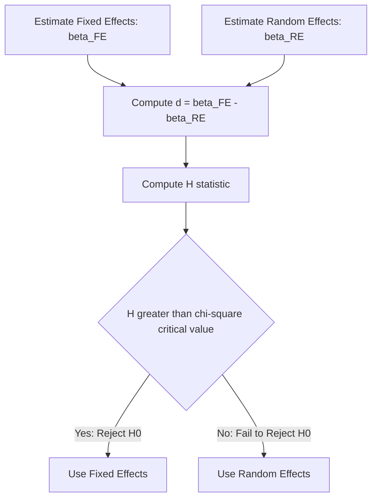

## The Hausman Specification Test

### Overview

The Hausman specification test is a general statistical procedure for comparing two estimators of the same parameter vector, one of which is efficient under the null hypothesis but inconsistent under the alternative, and the other of which is consistent under both the null and the alternative but inefficient under the null. In the context of static panel data models, it is used to choose between the random effects (RE) and fixed effects (FE) estimators by testing whether the unobserved individual effects are correlated with the regressors.

### Motivation in the Panel Data Context

Consider the standard unobserved effects model:

$$y_{it} = \alpha + x_{it}'\beta + u_i + \varepsilon_{it}$$

The RE estimator is efficient (BLUE, GLS-based) but requires:

$$H_0: \text{Cov}(u_i, x_{it}) = 0 \text{ for all } t$$

The FE estimator, obtained via within-transformation, remains consistent regardless of whether $u_i$ is correlated with $x_{it}$, because the demeaning process eliminates $u_i$ entirely:

$$y_{it} - \bar{y}_i = (x_{it} - \bar{x}_i)'\beta + (\varepsilon_{it} - \bar{\varepsilon}_i)$$

**Key Points**

- Under $H_0$: both $\hat{\beta}_{FE}$ and $\hat{\beta}_{RE}$ are consistent, but $\hat{\beta}_{RE}$ is efficient
- Under $H_1$ (endogeneity of $u_i$): $\hat{\beta}_{FE}$ remains consistent, but $\hat{\beta}_{RE}$ is inconsistent
- The test exploits the fact that under $H_0$, the difference $\hat{\beta}_{FE} - \hat{\beta}_{RE}$ should converge to zero, while under $H_1$ it should not

### Formal Hypotheses

$$H_0: E[u_i \mid x_{i1}, \dots, x_{iT}] = 0 \quad \text{(RE is consistent and efficient)}$$

$$H_1: E[u_i \mid x_{i1}, \dots, x_{iT}] \neq 0 \quad \text{(RE is inconsistent; use FE)}$$

### Test Statistic

The Hausman test statistic is constructed as a quadratic form in the difference between the two coefficient vectors:

$$H = (\hat{\beta}_{FE} - \hat{\beta}_{RE})' \left[\hat{V}(\hat{\beta}_{FE}) - \hat{V}(\hat{\beta}_{RE})\right]^{-1} (\hat{\beta}_{FE} - \hat{\beta}_{RE})$$

where $\hat{V}(\hat{\beta}_{FE})$ and $\hat{V}(\hat{\beta}_{RE})$ are the estimated variance-covariance matrices of the FE and RE estimators, restricted to the time-varying regressors common to both specifications (time-invariant regressors, which FE cannot estimate, are excluded from the comparison).

Under $H_0$, this statistic is asymptotically distributed:

$$H \sim \chi^2(K)$$

where $K$ is the number of time-varying regressors being compared.

### The Hausman Result: Simplification of the Variance Term

A key theoretical result underlying the test — due to Hausman (1978) — is that under $H_0$, the efficient estimator's variance and the covariance between the two estimators satisfy:

$$\text{Cov}(\hat{\beta}_{FE} - \hat{\beta}_{RE}, \hat{\beta}_{RE}) = 0$$

This "zero covariance" property implies:

$$V(\hat{\beta}_{FE} - \hat{\beta}_{RE}) = V(\hat{\beta}_{FE}) - V(\hat{\beta}_{RE})$$

This is what allows the test statistic to be computed using only the two individual variance estimates rather than requiring their full joint covariance matrix, which greatly simplifies computation.

**Key Points**

- This simplification only holds when $\hat{\beta}_{RE}$ is indeed the *efficient* estimator under $H_0$
- If auxiliary assumptions (e.g., homoskedasticity, no serial correlation beyond the RE structure) are violated, this simplification breaks down, and the standard Hausman test is invalid — a robust or cluster-adjusted variant should be used instead

### Practical Computation Procedure

**Example**

1. Estimate the model via Fixed Effects (within estimator), obtaining $\hat{\beta}_{FE}$ and $\hat{V}(\hat{\beta}_{FE})$
2. Estimate the model via Random Effects (FGLS), obtaining $\hat{\beta}_{RE}$ and $\hat{V}(\hat{\beta}_{RE})$
3. Restrict both coefficient vectors to the $K$ time-varying regressors shared by both models
4. Compute the difference vector $d = \hat{\beta}_{FE} - \hat{\beta}_{RE}$
5. Compute $\hat{V}(d) = \hat{V}(\hat{\beta}_{FE}) - \hat{V}(\hat{\beta}_{RE})$
6. Compute $H = d' [\hat{V}(d)]^{-1} d$
7. Compare $H$ to the critical value of $\chi^2(K)$ at the chosen significance level, or compute the associated p-value

### Decision Rule

| Result | Interpretation | Recommended Estimator |
| --- | --- | --- |
| Fail to reject $H_0$ (large p-value) | No evidence $u_i$ correlated with $x_{it}$ | RE (more efficient) |
| Reject $H_0$ (small p-value) | Evidence of correlation | FE (consistent) |

**Example**

If $H = 14.2$ with $K = 4$ time-varying regressors, the critical value at the 5% level is $\chi^2_{0.95}(4) \approx 9.49$. Since $14.2 > 9.49$, $H_0$ is rejected, indicating the individual effects are likely correlated with the regressors, and fixed effects estimation is preferred.

### Common Practical Issues

**Key Points**

- **Negative test statistic**: Because $\hat{V}(d) = \hat{V}(\hat{\beta}_{FE}) - \hat{V}(\hat{\beta}_{RE})$ is a finite-sample estimate, it is not guaranteed to be positive semi-definite, which can produce a negative or undefined $H$. Most software either reports this as a failed/non-computable test or truncates negative values to zero. [Inference] This is more likely to occur in small samples or when the two estimators are very close, and is generally taken as weak evidence against rejecting $H_0$, though this interpretation is a practical convention rather than a formal statistical result.
- **Robust standard errors**: The classical Hausman test assumes the RE estimator is fully efficient (i.e., homoskedastic, no additional serial correlation). When robust or clustered standard errors are used, the simplification $V(d) = V(\hat{\beta}_{FE}) - V(\hat{\beta}_{RE})$ generally no longer holds exactly, and a robust Hausman test formulation (e.g., an auxiliary-regression-based version) should be used instead.
- **Unbalanced panels**: The test can be applied, but variance component estimation for RE becomes more complex, and the asymptotic properties should be interpreted with the usual caveats about missing-data patterns.

### Auxiliary Regression-Based (Robust) Variant

An equivalent and more robust way to implement the test — particularly useful when heteroskedasticity is a concern — is the regression-based Hausman test, sometimes called the Mundlak or Wu-Hausman auxiliary regression approach:

1. Estimate the individual means $\bar{x}_i$ for each time-varying regressor
2. Estimate the RE model augmented with $\bar{x}_i$ as additional regressors:

$$y_{it} = \alpha + x_{it}'\beta + \bar{x}_i'\gamma + u_i + \varepsilon_{it}$$

3. Test $H_0: \gamma = 0$ using a (cluster-robust) Wald test

**Key Points**

- If $\gamma = 0$ cannot be rejected, the within-unit means carry no additional explanatory power beyond what RE already captures, supporting RE
- If $\gamma \neq 0$, this indicates correlation between $u_i$ and $x_{it}$, favoring FE (note $\hat{\beta}$ in this augmented regression equals $\hat{\beta}_{FE}$ exactly, a result known as the Mundlak equivalence)
- This form naturally accommodates robust/clustered standard errors, resolving the main weakness of the classical test

### Diagram: Hausman Test Decision Flow

### Relationship to Broader Specification Testing

**Key Points**

- The Hausman principle generalizes beyond panel data: it applies to any comparison of an efficient-but-restrictive estimator versus a robust-but-less-efficient one (e.g., OLS vs. IV in endogeneity testing, the Durbin-Wu-Hausman test)
- In panel contexts, it is sometimes supplemented or replaced by the Mundlak (1978) test or the Chamberlain approach, which nest RE and FE within a single correlated random effects (CRE) framework and avoid some finite-sample pitfalls of the classical statistic

**Next Steps**

- Mundlak's correlated random effects (CRE) formulation as a unifying framework
- Robust/cluster-adjusted Hausman test implementations
- Hausman-Taylor estimator for cases where $H_0$ is rejected but time-invariant regressors are still of interest
- Chamberlain's minimum distance approach to testing fixed vs. random effects
- Application of the Hausman principle outside panel data (OLS vs. 2SLS endogeneity testing)

**Related Topics**

- Random Effects Estimation
- Fixed Effects Estimation (Within and LSDV)
- Mundlak's Correlated Random Effects Model
- Hausman-Taylor Estimator
- Durbin-Wu-Hausman Test for Endogeneity