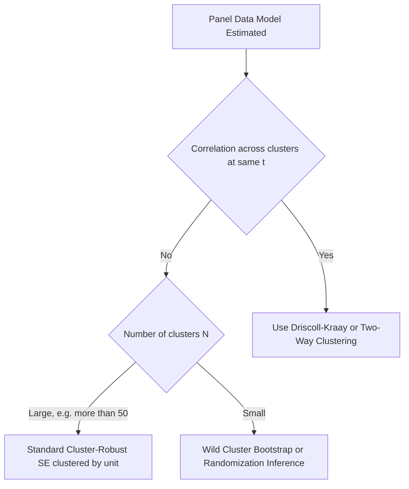

## Clustered and Panel-Robust Inference

### Overview

Clustered and panel-robust inference refers to methods for computing standard errors and conducting hypothesis tests in panel data models that remain valid under general forms of within-cluster correlation and heteroskedasticity, without requiring the analyst to correctly specify the full error covariance structure. This is essential in panel settings because standard (non-robust) standard errors are typically invalid due to serial correlation within units and heteroskedasticity across units.

### Why Conventional Standard Errors Fail in Panel Data

Consider the general panel model:

$$y_{it} = x_{it}'\beta + \nu_{it}$$

Conventional OLS, FE, or RE standard errors are derived under the assumption that errors are independently and identically distributed (IID) or, for RE, that they follow the exact equicorrelated structure imposed by the model. In practice, several problems commonly arise:

**Key Points**

- **Serial correlation within units**: shocks to a given individual $i$ often persist across time (e.g., an unmodeled persistent shock), making $\nu_{it}$ and $\nu_{is}$ correlated for $t \neq s$
- **Heteroskedasticity across units**: the variance of $\nu_{it}$ may differ systematically across individuals, industries, or regions
- **Cross-sectional dependence**: units may share common shocks (e.g., macroeconomic conditions), inducing correlation across $i$ within the same $t$
- Ignoring these features typically causes standard errors to be **underestimated**, particularly for time-invariant or slow-moving regressors, leading to overstated statistical significance

[Inference] The understatement of standard errors from ignoring within-cluster correlation tends to be most severe when both the regressor and the error term are highly persistent over time — a pattern documented extensively in applied panel literature such as Bertrand, Duflo, and Mullainathan (2004) in the context of difference-in-differences designs.

### Cluster-Robust Variance Estimation

The most common solution is to compute cluster-robust (also called Liang-Zeger or CR1) standard errors, which allow arbitrary correlation and heteroskedasticity within clusters (typically individuals/units) while assuming independence across clusters.

For a linear model estimated by (pooled, FE, or RE) least squares, the cluster-robust variance estimator is:

$$\hat{V}_{CR}(\hat{\beta}) = (X'X)^{-1} \left(\sum_{i=1}^{N} X_i' \hat{u}_i \hat{u}_i' X_i\right) (X'X)^{-1}$$

where:

- $X_i$ is the $T_i \times K$ matrix of regressors for cluster (unit) $i$
- $\hat{u}_i$ is the $T_i \times 1$ vector of residuals for unit $i$
- The sum is taken over clusters, not individual observations

**Key Points**

- This "sandwich" estimator allows $\hat{u}_i \hat{u}_i'$ to have arbitrary structure within a cluster — including heteroskedasticity and any pattern of serial correlation
- It requires no assumption about the *functional form* of the within-cluster correlation, only that clusters are independent of each other
- Clustering is almost always done at the individual/unit level in panel data, since that is the natural dimension along which errors are likely correlated over time

### Degrees-of-Freedom Adjustments

Because the sandwich formula is a consistent but biased-in-finite-samples estimator, most software applies a finite-sample correction:

$$\hat{V}_{CR1} = \frac{N}{N-1} \cdot \frac{NT-1}{NT-K} \cdot \hat{V}_{CR}$$

**Key Points**

- Different packages use different small-sample corrections (e.g., Stata's default vs. R's `sandwich`/`plm` packages), so numerically identical point estimates may show slightly different standard errors across software
- With a small number of clusters (commonly cited rule of thumb: fewer than 30–50), asymptotic cluster-robust inference can be unreliable, and the effective degrees of freedom for hypothesis testing may need to be based on the number of clusters $N$, not the number of observations $NT$

### Asymptotic Requirements

Cluster-robust inference relies on asymptotics as the **number of clusters** $N \to \infty$, not necessarily as $T \to \infty$. This has an important practical implication:

**Key Points**

- Valid with **few time periods** and **many cross-sectional units** ($N$ large, $T$ small/fixed)
- Becomes unreliable when $N$ is small, even if $NT$ (total observations) is large, because the effective sample size for variance estimation is the number of independent clusters
- [Inference] When $N$ is small (e.g., clustering by U.S. state with 50 clusters, or by industry with a handful of sectors), alternative approaches such as wild cluster bootstrap or randomization inference are often recommended over the standard asymptotic sandwich formula

### Panel-Robust Inference for Fixed Effects and Random Effects Estimators

Cluster-robust standard errors apply naturally to both FE and RE estimators, though the underlying rationale differs slightly:

| Estimator | Role of cluster-robust SEs |
| --- | --- |
| Pooled OLS | Corrects for both heteroskedasticity and serial correlation ignored by the pooled specification |
| Fixed Effects | Corrects for arbitrary serial correlation in $\varepsilon_{it}$ remaining after demeaning out $u_i$ |
| Random Effects | Corrects for misspecification of the assumed equicorrelated GLS structure (e.g., if true correlation isn't constant across all time lags, or if heteroskedasticity exists) |

**Example**

If a researcher estimates a wage equation via FE and reports default (non-robust) FE standard errors, but wage shocks are persistently correlated within individuals over multiple years (e.g., due to unmodeled career trajectories), the non-robust SEs will typically understate the true sampling variability of $\hat{\beta}_{FE}$. Reporting cluster-robust SEs (clustered by individual) corrects for this without requiring the analyst to model the exact serial correlation process.

### Alternative and Complementary Approaches

**Key Points**

- **Heteroskedasticity- and Autocorrelation-Consistent (HAC) estimators** (e.g., Newey-West, or the panel-specific Driscoll-Kraay estimator): useful when cross-sectional dependence is also a concern, since standard clustering assumes independence *across* clusters
- **Driscoll-Kraay standard errors**: robust to heteroskedasticity, autocorrelation, and cross-sectional dependence simultaneously; particularly relevant when $T$ is moderately large and cross-unit correlation (e.g., common macro shocks) is suspected
- **Two-way clustering**: allows clustering along two dimensions simultaneously (e.g., by firm and by year), addressing cases where both individual-level serial correlation and time-specific common shocks are present:

$$\hat{V}_{2way} = \hat{V}_{cluster(i)} + \hat{V}_{cluster(t)} - \hat{V}_{cluster(i,t)}$$

- **Wild cluster bootstrap**: a resampling-based alternative recommended when the number of clusters is small, since it better approximates the finite-sample distribution of the test statistic than the asymptotic chi-square/normal approximation

### Diagram: Choosing an Inference Strategy

### Practical Implementation Notes

**Example**

In Stata: `xtreg y x1 x2, fe vce(cluster id)` or `reg y x1 x2, vce(cluster id)`

In R (`plm` package): `coeftest(model, vcov = vcovHC(model, cluster = "group"))` or using the `sandwich` and `lmtest` packages together

In Python (`linearmodels`): `PanelOLS(...).fit(cov_type='clustered', cluster_entity=True)`

[Unverified] Exact default arguments and small-sample corrections vary by package version; consult current documentation before relying on specific numerical output matching across software.

### Common Pitfalls

**Key Points**

- **Clustering on too fine a level** (e.g., clustering by individual-year rather than individual) fails to correct for the relevant serial correlation and can understate standard errors just as badly as no clustering at all
- **Confusing FE/RE choice with the robust SE decision**: clustering does not resolve the endogeneity concern addressed by the Hausman test — it only corrects the variance-covariance matrix, not the consistency of $\hat{\beta}$ itself
- **Over-reliance on asymptotic clustered SEs with few clusters** can lead to substantial over-rejection of true null hypotheses (Type I error inflation)

**Next Steps**

- Driscoll-Kraay standard errors for cross-sectionally dependent panels
- Wild cluster bootstrap methods for inference with few clusters
- Two-way clustering in panel and difference-in-differences designs
- Cross-sectional dependence testing (e.g., Pesaran CD test)
- Newey-West HAC estimators in time-series and panel contexts

**Related Topics**

- Fixed Effects Estimation
- Random Effects Estimation
- The Hausman Specification Test
- Testing for Cross-Sectional Dependence
- Heteroskedasticity in Panel Data Models