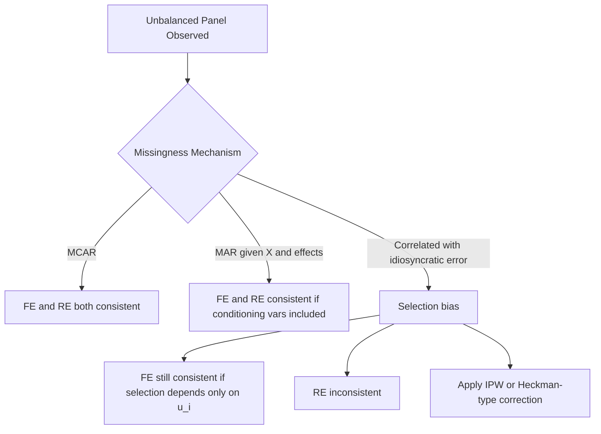

## Unbalanced Panels and Attrition

### Overview

An unbalanced panel is a dataset in which the number of time periods observed differs across cross-sectional units, in contrast to a balanced panel where every unit is observed for the same set of $T$ periods. Attrition refers to the specific case of unbalancedness caused by units dropping out of the sample over time (e.g., firms exiting, survey respondents becoming unreachable). The key econometric concern is not unbalancedness itself, but whether the process generating the missing observations is related to the model's error term, which can bias estimation if left unaddressed.

### Sources of Unbalancedness

**Key Points**

- **Attrition**: units leave the sample partway through and do not return (e.g., firm bankruptcy, survey non-response, death, migration)
- **Late entry**: units enter the panel after the initial period (e.g., new firms, new survey participants added to refresh a panel)
- **Intermittent/rotating missingness**: units are observed in non-consecutive periods (common in rotating panel surveys)
- **Design-based unbalancedness**: the sampling design intentionally observes different units for different periods, unrelated to any behavioral process

### Notation for Unbalanced Panels

Let $T_i$ denote the number of periods observed for unit $i$, which can vary across $i$. Define an indicator:

$$s_{it} = \begin{cases} 1 & \text{if } (y_{it}, x_{it}) \text{ is observed} \\ 0 & \text{otherwise} \end{cases}$$

The model of interest remains:

$$y_{it} = x_{it}'\beta + u_i + \varepsilon_{it}$$

but estimation only uses observations for which $s_{it} = 1$.

### The Central Question: Is Missingness Ignorable?

The critical issue is whether the selection mechanism $s_{it}$ is correlated with the error term, conditional on the regressors and (for RE) the individual effect.

**Key Points**

- **Missing Completely at Random (MCAR)**: $s_{it}$ is independent of $(u_i, \varepsilon_{it})$ and $x_{it}$ — attrition has no systematic relationship to the model. Estimation on the unbalanced sample remains unbiased and consistent.
- **Missing at Random (MAR)**: $s_{it}$ depends on observed variables (e.g., $x_{it}$ or lagged $y$) but not on the contemporaneous unobserved error, conditional on those observables. Standard FE/RE estimators generally remain consistent under MAR when the conditioning variables are included in the model.
- **Non-ignorable / Selective attrition**: $s_{it}$ depends on the unobserved error term $\varepsilon_{it}$ itself (e.g., firms with unusually poor unobserved performance exit the sample). This is analogous to a sample selection problem and produces inconsistent estimates if uncorrected.

[Inference] In applied panel work, MCAR is rarely literally true, but many researchers proceed under the weaker and more defensible MAR-type assumption that attrition is unrelated to the error term once observable characteristics and fixed effects are controlled for — though this assumption is generally not directly testable without additional information about non-respondents.

### Fixed Effects Estimation with Unbalanced Panels

The within (FE) estimator extends naturally to unbalanced panels by demeaning each unit's data using its own unit-specific mean over the periods it is actually observed:

$$\bar{y}_i = \frac{1}{T_i}\sum_{t: s_{it}=1} y_{it}, \qquad \bar{x}_i = \frac{1}{T_i}\sum_{t: s_{it}=1} x_{it}$$

$$y_{it} - \bar{y}_i = (x_{it} - \bar{x}_i)'\beta + (\varepsilon_{it} - \bar{\varepsilon}_i)$$

**Key Points**

- FE remains consistent under unbalancedness provided the missingness is uncorrelated with $\varepsilon_{it}$ conditional on $u_i$ (a form of selection on the fixed effect is actually permitted, since FE already conditions it out)
- A key robustness property: FE can tolerate selection into the sample that is correlated with the **time-invariant** unobserved effect $u_i$, because that component is differenced out regardless — this is a meaningful advantage over RE in the presence of attrition
- Units with only one observed period ($T_i = 1$) contribute no information to the within estimator (their demeaned values are identically zero) and are effectively dropped

### Random Effects Estimation with Unbalanced Panels

Unbalancedness complicates RE estimation because the GLS transformation parameter $\hat{\theta}_i$ becomes unit-specific:

$$\hat{\theta}_i = 1 - \sqrt{\frac{\hat{\sigma}_\varepsilon^2}{\hat{\sigma}_\varepsilon^2 + T_i \hat{\sigma}_u^2}}$$

**Key Points**

- Each unit $i$ receives its own quasi-demeaning weight based on $T_i$, so units observed for more periods are demeaned more heavily (approaching the within transformation), while units with few periods are demeaned less (retaining more of the between/level variation)
- Variance component estimation ($\hat{\sigma}_u^2$, $\hat{\sigma}_\varepsilon^2$) must be adjusted for unbalanced degrees of freedom in the ANOVA-type sums of squares
- RE is **more vulnerable** to attrition bias than FE, because RE requires $E[u_i \mid x_{i1},\dots,x_{iT_i}, s_i] = 0$ — if attrition is related to $u_i$, RE becomes inconsistent even though FE would remain valid

### Testing for Selective Attrition

**Example**

A widely used approach, due to Nijman and Verbeek (1992) and Verbeek and Nijman (1992), tests for attrition bias by adding a "will the unit be observed next period" indicator (or a count of future observations) as an additional regressor in the model estimated on the balanced sub-panel:

$$y_{it} = x_{it}'\beta + \gamma \cdot d_{i,t+1} + u_i + \varepsilon_{it}$$

where $d_{i,t+1} = 1$ if unit $i$ is still observed in $t+1$. A statistically significant $\hat{\gamma}$ suggests attrition is related to the outcome process, indicating non-ignorable selection.

**Key Points**

- Alternative variable: a count of the total number of future periods the unit remains in the sample, included as a regressor
- Rejection of $\gamma = 0$ does not by itself tell the researcher which correction to apply — only that naive pooled/FE/RE estimation on the unbalanced sample should be treated cautiously

### Correcting for Non-Ignorable Attrition

**Key Points**

- **Inverse Probability Weighting (IPW)**: model the probability of remaining in the sample (e.g., via probit/logit on lagged observables) and weight observations by the inverse of the estimated retention probability, analogous to Heckman-style correction
- **Heckman-type selection correction adapted to panels**: incorporate a selection equation and estimate jointly with the outcome equation, often via a control function approach
- **Bounding approaches**: when correction models are not credible, some researchers report bounds on the parameter of interest under best-case and worst-case attrition scenarios rather than point estimates
- **Comparing balanced vs. unbalanced sample estimates**: as an informal diagnostic, if $\hat{\beta}$ differs substantially between the estimator applied only to the balanced sub-panel and the estimator applied to the full unbalanced panel, this is suggestive (though not conclusive) evidence of selective attrition

### Diagram: Missingness Mechanisms and Estimator Validity

### Practical Estimation Considerations

**Example**

Most panel data software handles unbalanced panels automatically for FE and RE point estimation (e.g., Stata's `xtreg`, R's `plm`), but the following require explicit attention:

- Cluster-robust standard errors remain valid under unbalancedness as long as clustering is done at the unit level, since the sandwich estimator naturally accommodates unequal $T_i$ across clusters
- Some balanced-panel-specific tests (e.g., certain forms of the Breusch-Pagan LM test) require modification for unbalanced data; consult the specific test's documented unbalanced-panel formula before applying it directly
- [Unverified] Default behavior for dropping singleton observations ($T_i = 1$) in FE estimation varies by software and version, and can materially affect standard error calculations if singletons are retained versus dropped; this should be checked against current package documentation.

### Attrition vs. Refreshment Samples

**Key Points**

- Some panel surveys address attrition by adding "refreshment samples" — new, randomly drawn units introduced in later waves to restore cross-sectional representativeness
- Refreshment samples can also be used to formally test for and adjust for non-ignorable attrition, by comparing the characteristics of the refreshed sample to those of surviving original panel members at the same time point

**Next Steps**

- Nijman-Verbeek and Verbeek-Nijman tests for attrition bias
- Inverse probability weighting for panel attrition correction
- Heckman-type selection models adapted to panel data
- Rotating and refreshment panel sample designs
- Dynamic panel models with unbalanced data (interaction with lagged dependent variables)

**Related Topics**

- Fixed Effects Estimation
- Random Effects Estimation
- Clustered and Panel-Robust Inference
- Sample Selection Models (Heckman Correction)
- The Hausman Specification Test