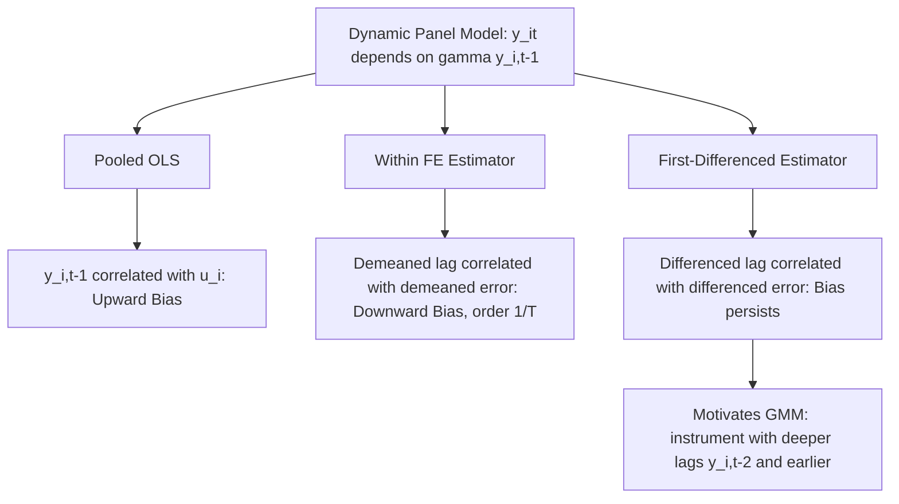

## Dynamic Panel Bias

### Overview

Dynamic panel bias, also known as Nickell bias, refers to the inconsistency that arises when standard fixed effects (within) or first-difference estimators are applied to panel data models containing a lagged dependent variable as a regressor. The bias originates from a mechanical correlation between the transformed lagged dependent variable and the transformed error term, and it does not vanish as the number of cross-sectional units $N \to \infty$ for fixed $T$.

### The Dynamic Panel Model

The canonical dynamic panel model is:

$$y_{it} = \gamma y_{i,t-1} + x_{it}'\beta + u_i + \varepsilon_{it}$$

where $|\gamma| < 1$ for stationarity, $u_i$ is the unobserved individual effect, and $\varepsilon_{it}$ is the idiosyncratic error, typically assumed IID over $i$ and $t$.

**Key Points**

- The presence of $y_{i,t-1}$ as a regressor is what distinguishes dynamic panel models from the static models covered previously
- $u_i$ affects every value of $y_{it}$ in the series, including $y_{i,t-1}$, so $y_{i,t-1}$ is mechanically correlated with $u_i$ by construction — this is the root of the problem

### Why Pooled OLS Fails

Estimating the model by pooled OLS ignores $u_i$ entirely, folding it into the composite error $v_{it} = u_i + \varepsilon_{it}$. Since $y_{i,t-1}$ depends on $u_i$ (through the recursive structure of the process), we have:

$$\text{Cov}(y_{i,t-1}, v_{it}) = \text{Cov}(y_{i,t-1}, u_i) \neq 0$$

This produces an **upward-biased** estimate of $\gamma$, since $y_{i,t-1}$ acts partly as a proxy for the persistent, positively correlated $u_i$.

### Why the Within (Fixed Effects) Estimator Fails

The natural instinct to eliminate $u_i$ via the within transformation does not solve the problem in dynamic models. Demeaning gives:

$$y_{it} - \bar{y}_i = \gamma(y_{i,t-1} - \bar{y}_{i,-1}) + (x_{it} - \bar{x}_i)'\beta + (\varepsilon_{it} - \bar{\varepsilon}_i)$$

where $\bar{y}_{i,-1} = \frac{1}{T-1}\sum_{t} y_{i,t-1}$.

**Key Points**

- The demeaned regressor $(y_{i,t-1} - \bar{y}_{i,-1})$ contains $\bar{y}_{i,-1}$, which includes future values of $y$ relative to some periods
- The demeaned error $(\varepsilon_{it} - \bar{\varepsilon}_i)$ contains $\bar{\varepsilon}_i$, which includes $\varepsilon_{it-1}, \dots$, the same innovations that determined $y_{i,t-1}$
- Because $\bar{y}_{i,-1}$ is correlated with $\bar{\varepsilon}_i$ (both are averages over overlapping time indices), the regressor $(y_{i,t-1} - \bar{y}_{i,-1})$ is correlated with the error $(\varepsilon_{it} - \bar{\varepsilon}_i)$ even though the original $\varepsilon_{it}$ is IID
- This correlation does **not** disappear as $N \to \infty$ for fixed $T$; it is a **within-transformation-induced** correlation, not one driven by $u_i$

### Direction and Magnitude of Nickell Bias

Nickell (1981) formally derived the asymptotic bias of the within estimator in a simple AR(1) panel model (no exogenous regressors) as $N \to \infty$ with $T$ fixed:

$$\text{plim}_{N \to \infty} (\hat{\gamma}_{FE} - \gamma) = \frac{-(1+\gamma)}{T-1}\left[1 - \frac{1}{T}\frac{1-\gamma^T}{1-\gamma}\right] + O\left(\frac{1}{T}\right)$$

**Key Points**

- The bias is generally **negative** (downward) for the within estimator when $\gamma > 0$, in contrast to the **positive** (upward) bias of pooled OLS
- The magnitude of the bias is on the order of $1/T$, meaning it shrinks as $T \to \infty$, but for the short panels common in microeconometric applications (small $T$, large $N$), the bias can be substantial
- This gives rise to a well-known practical heuristic: the true $\gamma$ typically lies **between** the (upward-biased) pooled OLS estimate and the (downward-biased) within FE estimate — a useful diagnostic for whether a proposed dynamic panel estimator's result is plausible

**Example**

For $T = 5$ and $\gamma = 0.5$, the Nickell bias formula implies a downward bias in the within estimator that can be roughly on the order of -0.1 to -0.2 in commonly cited illustrative calculations. [Inference] Exact numerical magnitudes depend on the specific value of $\gamma$ and $T$ and should be computed from the formula directly rather than assumed from a single illustrative case; simulation studies are the standard way applied researchers gauge expected bias magnitude for their specific $(N,T,\gamma)$ configuration.

### Why the Bias Persists Even With Large N

**Key Points**

- Standard consistency arguments for cross-sectional and static panel estimators rely on the law of large numbers operating over $i = 1, \dots, N$ as $N \to \infty$
- In the within-transformed dynamic model, the source of inconsistency is a correlation between regressor and error **within each unit's transformed data**, which is structural to the transformation itself, not a sampling-variability problem that averages out across more units
- Therefore, increasing $N$ does not fix the problem; only increasing $T$ (which is often infeasible in short micro-panels) attenuates it

### First-Differencing and the Same Underlying Problem

An alternative transformation — first-differencing rather than demeaning — is often proposed as an alternative to the within transformation, since it also eliminates $u_i$:

$$\Delta y_{it} = \gamma \Delta y_{i,t-1} + \Delta x_{it}'\beta + \Delta \varepsilon_{it}$$

**Key Points**

- $\Delta y_{i,t-1} = y_{i,t-1} - y_{i,t-2}$ is correlated with $\Delta \varepsilon_{it} = \varepsilon_{it} - \varepsilon_{i,t-1}$ because $y_{i,t-1}$ depends on $\varepsilon_{i,t-1}$, which also appears in $\Delta\varepsilon_{it}$
- This correlation is the analogous source of bias in the first-differenced specification, and it also does not vanish as $N \to \infty$
- This structure, however, is precisely what motivates the standard solution: since $\Delta y_{i,t-1}$ is correlated with $\Delta\varepsilon_{it}$ but not with further-lagged levels like $y_{i,t-2}$ or earlier (under the assumption of no serial correlation in $\varepsilon_{it}$), those lagged levels can serve as valid instruments

### Diagram: Sources of Bias by Estimator

### Implications for Estimator Choice

**Key Points**

- The presence of dynamic panel bias in both the within and first-differenced OLS estimators is the central motivation for instrumental-variables/GMM approaches to dynamic panel estimation
- Neither pooled OLS nor standard FE should be used as the primary estimator for models with a lagged dependent variable when $T$ is small, though both are frequently reported as informal bounds ("bracketing" the true parameter) alongside a consistent GMM estimate
- As $T$ grows large relative to $N$ (long panels), the within estimator's bias becomes asymptotically negligible, and it can become a reasonable choice again — this is part of why the distinction between micro-panels (small $T$, large $N$) and macro-panels (large $T$, moderate $N$) matters for estimator selection

**Next Steps**

- Arellano-Bond difference GMM estimator
- Blundell-Bond system GMM estimator
- Anderson-Hsiao instrumental variables estimator
- Bias-corrected fixed effects estimators for dynamic panels (e.g., Kiviet correction)
- Long panel vs. short panel considerations in dynamic model estimation

**Related Topics**

- Fixed Effects Estimation
- Arellano-Bond GMM Estimator
- Blundell-Bond System GMM Estimator
- Instrumental Variables in Panel Data
- Testing for Serial Correlation in Dynamic Panels