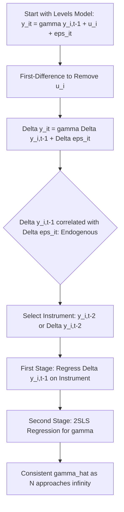

## The Anderson-Hsiao Estimator

### Overview

The Anderson-Hsiao (1981, 1982) estimator is an instrumental variables approach for consistently estimating dynamic panel data models containing a lagged dependent variable, designed to overcome the dynamic panel (Nickell) bias that afflicts the within and first-differenced OLS estimators. It works by first-differencing the model to eliminate the individual effect, then instrumenting the resulting endogenous differenced lag with a deeper lag of the level (or difference) of the dependent variable.

### The Underlying Problem It Solves

Starting from the dynamic panel model:

$$y_{it} = \gamma y_{i,t-1} + x_{it}'\beta + u_i + \varepsilon_{it}$$

First-differencing removes $u_i$:

$$\Delta y_{it} = \gamma \Delta y_{i,t-1} + \Delta x_{it}'\beta + \Delta \varepsilon_{it}$$

**Key Points**

- $\Delta y_{i,t-1} = y_{i,t-1} - y_{i,t-2}$ is mechanically correlated with $\Delta \varepsilon_{it} = \varepsilon_{it} - \varepsilon_{i,t-1}$, since $y_{i,t-1}$ is a function of $\varepsilon_{i,t-1}$
- Simple OLS on the differenced equation is therefore still inconsistent, motivating an instrumental variables solution for $\Delta y_{i,t-1}$

### The Instrument Choice

Anderson and Hsiao propose using a lagged **level** or lagged **difference** of $y$, dated $t-2$ or earlier, as an instrument for $\Delta y_{i,t-1}$:

$$\text{Instrument candidates: } y_{i,t-2} \quad \text{or} \quad \Delta y_{i,t-2} = y_{i,t-2} - y_{i,t-3}$$

**Key Points**

- Under the assumption that $\varepsilon_{it}$ is serially uncorrelated, $y_{i,t-2}$ is correlated with $\Delta y_{i,t-1}$ (relevance) but uncorrelated with $\Delta \varepsilon_{it} = \varepsilon_{it} - \varepsilon_{i,t-1}$ (exogeneity), since $y_{i,t-2}$ only depends on $\varepsilon_{i,t-2}$ and earlier shocks
- Both $y_{i,t-2}$ (levels instrument) and $\Delta y_{i,t-2}$ (differenced instrument) are valid under this assumption, but they are **not equally efficient**
- The choice between the two forms is the central methodological distinction within the Anderson-Hsiao approach

### Anderson-Hsiao (1981) Levels-Instrument (2SLS/IV) Estimator

Using $y_{i,t-2}$ as the instrument for $\Delta y_{i,t-1}$, the model is estimated by standard two-stage least squares (2SLS) or IV on the first-differenced equation:

**First stage:**

$$\Delta y_{i,t-1} = \pi_1 y_{i,t-2} + \pi_2 \Delta x_{it} + \text{error}$$

**Second stage:**

$$\Delta y_{it} = \gamma \widehat{\Delta y_{i,t-1}} + \Delta x_{it}'\beta + \Delta \varepsilon_{it}$$

**Key Points**

- This requires at least $T \geq 3$ periods, since computing $y_{i,t-2}$ as an instrument and $\Delta y_{i,t-1}$ as a regressor both require data going back two periods before the estimation period
- Provides a **consistent** estimator of $\gamma$ and $\beta$ as $N \to \infty$ for fixed $T$, resolving the Nickell bias problem inherent in FE/within estimation

### Anderson-Hsiao (1982) Differences-Instrument Estimator

An alternative version instruments $\Delta y_{i,t-1}$ with $\Delta y_{i,t-2}$ instead of the level $y_{i,t-2}$:

$$\Delta y_{i,t-1} = \pi_1 \Delta y_{i,t-2} + \pi_2 \Delta x_{it} + \text{error}$$

**Key Points**

- Both $y_{i,t-2}$ and $\Delta y_{i,t-2}$ satisfy the exogeneity condition with respect to $\Delta \varepsilon_{it}$ under serial-uncorrelatedness of $\varepsilon_{it}$
- However, they differ in **relevance** (first-stage strength) depending on the underlying data-generating process, which affects the relative efficiency of the two variants

### Efficiency Comparison Between the Two Variants

**Key Points**

- [Inference] The levels instrument $y_{i,t-2}$ is generally considered to provide a stronger first stage (and hence a more efficient IV estimator) than the differenced instrument $\Delta y_{i,t-2}$ under typical AR(1) panel data-generating processes, a result that follows from the relative correlations implied by the process's autocovariance structure, though the exact ranking can depend on the true value of $\gamma$ and the variance of $u_i$ relative to $\varepsilon_{it}$
- Neither Anderson-Hsiao variant is generally as efficient as the GMM-based estimators developed subsequently (Arellano-Bond), which exploit the **full set** of available lagged instruments ($y_{i,t-2}, y_{i,t-3}, \dots$) rather than a single lag, at each time period

### Comparison of Estimator Properties

| Estimator | Instrument(s) used | Consistency | Efficiency |
| --- | --- | --- | --- |
| Pooled OLS | None (no IV) | Inconsistent | N/A |
| Within (FE) | None (no IV) | Inconsistent (Nickell bias) | N/A |
| Anderson-Hsiao (levels) | $y_{i,t-2}$ | Consistent | Uses only 1 instrument per period |
| Anderson-Hsiao (differences) | $\Delta y_{i,t-2}$ | Consistent | Uses only 1 instrument per period |
| Arellano-Bond GMM | All valid lags $y_{i,t-2}, y_{i,t-3},\dots$ | Consistent | More efficient (more moment conditions) |

### Extension to Models with Exogenous Regressors

When the model includes strictly exogenous regressors $x_{it}$:

$$\Delta y_{it} = \gamma \Delta y_{i,t-1} + \Delta x_{it}'\beta + \Delta \varepsilon_{it}$$

**Key Points**

- $\Delta x_{it}$ is treated as exogenous (or the levels $x_{it}$ can serve as their own instruments if strictly exogenous) and included directly, alongside the excluded instrument for $\Delta y_{i,t-1}$
- If some elements of $x_{it}$ are only predetermined (correlated with past but not present/future shocks) rather than strictly exogenous, they too must be instrumented with appropriately lagged values

### Worked Example

**Example**

Suppose a panel of firms with $T = 6$ years models investment as $y_{it} = \gamma y_{i,t-1} + \beta \cdot \text{sales}_{it} + u_i + \varepsilon_{it}$.

1. First-difference: $\Delta y_{it} = \gamma \Delta y_{i,t-1} + \beta \Delta \text{sales}_{it} + \Delta \varepsilon_{it}$
2. Estimate the first stage: regress $\Delta y_{i,t-1}$ on $y_{i,t-2}$ and $\Delta \text{sales}_{it}$
3. Obtain fitted values $\widehat{\Delta y_{i,t-1}}$
4. Regress $\Delta y_{it}$ on $\widehat{\Delta y_{i,t-1}}$ and $\Delta \text{sales}_{it}$ to obtain consistent $\hat{\gamma}$ and $\hat{\beta}$

This uses only observations from $t = 3$ onward (since $y_{i,t-2}$ must be available), reducing the effective sample relative to $T$.

### Diagram: Anderson-Hsiao Estimation Procedure

### Limitations

**Key Points**

- **Inefficiency relative to GMM**: by using only a single instrument per equation rather than the full set of valid lagged instruments available at each time period, Anderson-Hsiao does not exploit all available moment conditions, unlike Arellano-Bond
- **Sensitivity to instrument choice**: the levels vs. differences instrument choice can produce noticeably different point estimates in finite samples, and there is no universally dominant choice across all data-generating processes
- **Weak instrument concerns**: if $\gamma$ is close to the unit root ($\gamma$ near 1), $y_{i,t-2}$ and $\Delta y_{i,t-2}$ can become weak instruments for $\Delta y_{i,t-1}$, leading to poor finite-sample performance — a known motivation for the subsequently developed system GMM estimator, which incorporates additional moment conditions from the levels equation to improve instrument strength in persistent series
- **Requires serially uncorrelated $\varepsilon_{it}$**: if the original idiosyncratic error exhibits serial correlation (e.g., MA(1) structure), the deeper-lag instruments may themselves be invalid, and the moving-average structure of $\Delta \varepsilon_{it}$ must be accounted for when selecting valid lags

### Historical and Pedagogical Role

**Key Points**

- Anderson-Hsiao is historically significant as the first widely used consistent estimator for dynamic panel models with fixed effects, and remains a useful pedagogical stepping stone to understanding the logic behind the later, more efficient GMM-based estimators
- It is rarely used as the final estimator in contemporary applied work, having been largely superseded by Arellano-Bond difference GMM and Blundell-Bond system GMM, which generalize the same instrumentation logic to a full set of lagged instruments and additional moment conditions

**Next Steps**

- Arellano-Bond difference GMM estimator (generalizing Anderson-Hsiao's instrument set)
- Blundell-Bond system GMM estimator (addressing weak instrument problems)
- Testing instrument validity via Sargan/Hansen overidentification tests
- Serial correlation testing in the differenced residuals (Arellano-Bond AR(1)/AR(2) tests)
- Weak instrument diagnostics in dynamic panel IV/GMM settings

**Related Topics**

- Dynamic Panel Bias
- Arellano-Bond GMM Estimator
- Blundell-Bond System GMM Estimator
- Instrumental Variables Estimation
- Testing for Serial Correlation in Panel Models