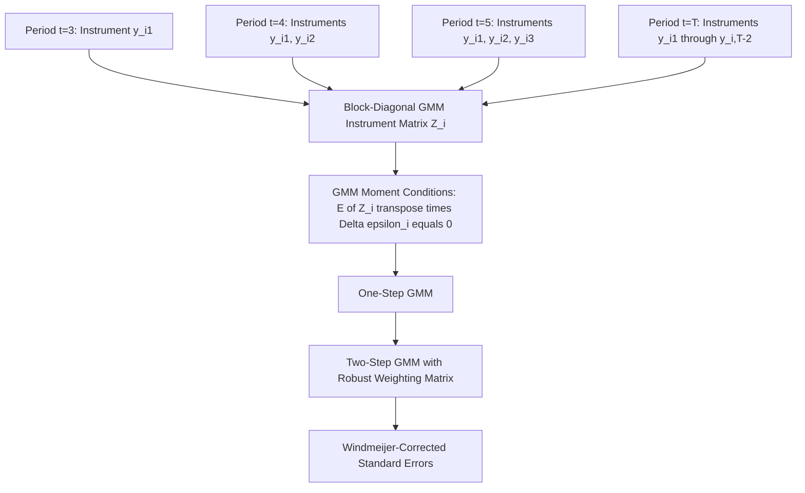

## Arellano-Bond Difference GMM

### Overview

The Arellano-Bond (1991) difference GMM estimator is a Generalized Method of Moments approach for estimating dynamic panel data models with a lagged dependent variable, designed to exploit the full set of valid lagged instruments available at each time period rather than the single instrument used by Anderson-Hsiao. It remains one of the most widely used estimators for short, wide panels ($T$ small, $N$ large) with a dynamic component.

### The Model

$$y_{it} = \gamma y_{i,t-1} + x_{it}'\beta + u_i + \varepsilon_{it}$$

with the standard assumptions:

$$E[\varepsilon_{it}] = 0, \quad E[\varepsilon_{it}\varepsilon_{is}] = 0 \text{ for } t \neq s, \quad E[u_i \varepsilon_{it}] = 0$$

First-differencing removes the fixed effect:

$$\Delta y_{it} = \gamma \Delta y_{i,t-1} + \Delta x_{it}'\beta + \Delta \varepsilon_{it}$$

**Key Points**

- As with Anderson-Hsiao, $\Delta y_{i,t-1}$ is correlated with $\Delta \varepsilon_{it}$ through the shared term $\varepsilon_{i,t-1}$, requiring instrumentation
- The key innovation of Arellano-Bond is recognizing that **more than one** valid lagged instrument exists at each time period, and that the number of valid instruments grows as $t$ increases

### The Expanding Instrument Set

For a given period $t$, under the assumption that $\varepsilon_{it}$ is serially uncorrelated and $y_{i,t-2}, y_{i,t-3}, \ldots$ are uncorrelated with $\Delta\varepsilon_{it}$, **all** lags of $y$ dated $t-2$ and earlier are valid instruments:

$$E[y_{i,t-2-j} \cdot \Delta\varepsilon_{it}] = 0 \quad \text{for all } j \geq 0$$

**Key Points**

- At $t = 3$: only $y_{i1}$ is available as an instrument
- At $t = 4$: both $y_{i1}$ and $y_{i2}$ are available
- At $t = T$: all of $y_{i1}, y_{i2}, \dots, y_{i,T-2}$ are available
- This produces a **period-specific, expanding** instrument set, which is naturally organized as a block-diagonal instrument matrix — the defining structural feature of the Arellano-Bond GMM estimator

### The GMM Instrument Matrix

For each unit $i$, the instrument matrix $Z_i$ is block-diagonal, with the valid instrument set for each time period placed in its own row block:

$$Z_i = \begin{bmatrix} y_{i1} & 0 & 0 & \cdots \\ 0 & y_{i1}, y_{i2} & 0 & \cdots \\ 0 & 0 & y_{i1}, y_{i2}, y_{i3} & \cdots \\ \vdots & & & \ddots \end{bmatrix}$$

**Key Points**

- Strictly exogenous regressors $x_{it}$ contribute their own (typically simpler) instrument rows, often just $\Delta x_{it}$ itself for each period
- Predetermined (but not strictly exogenous) regressors require the same expanding-lag instrumentation logic as $y_{i,t-1}$
- The moment conditions implied by this structure are:

$$E[Z_i' \Delta \varepsilon_i] = 0$$

### The GMM Estimator

The GMM estimator minimizes a quadratic form in the sample moment conditions:

$$\hat{\gamma}_{GMM} = \arg\min_{\gamma} \left(\sum_i Z_i' \Delta\hat{\varepsilon}_i(\gamma)\right)' W_N \left(\sum_i Z_i' \Delta\hat{\varepsilon}_i(\gamma)\right)$$

where $W_N$ is a weighting matrix.

**Key Points**

- **One-step GMM**: uses a weighting matrix based on an assumed (typically simple, homoskedastic) structure of $\Delta\varepsilon_{it}$, which under the MA(1) structure induced by differencing gives a specific known weighting matrix
- **Two-step GMM**: uses the residuals from the one-step estimator to construct a robust, efficient weighting matrix $\hat{W}_N = \left(\frac{1}{N}\sum_i Z_i' \Delta\hat{\varepsilon}_i \Delta\hat{\varepsilon}_i' Z_i\right)^{-1}$, which is asymptotically efficient under general heteroskedasticity
- Two-step GMM standard errors are known to be biased downward in finite samples unless a finite-sample correction (Windmeijer, 2005) is applied; the **Windmeijer-corrected** two-step standard errors are now standard practice in applied work

### Difference GMM Estimation Procedure

**Example**

1. First-difference the model to eliminate $u_i$
2. Construct the block-diagonal instrument matrix $Z_i$ using all valid lags of $y$ (and any predetermined regressors) at each time period
3. Estimate via one-step GMM to obtain initial residuals
4. Construct the robust weighting matrix from step 3 residuals
5. Re-estimate via two-step GMM using the robust weighting matrix
6. Apply the Windmeijer finite-sample correction to the two-step standard errors
7. Conduct specification tests (Sargan/Hansen, AR(1)/AR(2))

### Specification Testing

Because the estimator relies on the validity of the instrument set, two diagnostic tests are standard practice alongside every Arellano-Bond GMM estimation:

**Key Points**

- **Sargan/Hansen test of overidentifying restrictions**: tests the joint validity of all instruments used. The Sargan test assumes homoskedasticity and is used with one-step GMM; the Hansen J-test is robust to heteroskedasticity and is paired with two-step GMM. Failure to reject the null supports instrument validity, though the Hansen test can be weakened (over-accepting) when the number of instruments is very large relative to $N$.
- **Arellano-Bond AR(1) and AR(2) tests for serial correlation in the differenced residuals**: since $\Delta\varepsilon_{it}$ is mechanically first-order serially correlated by construction (it shares $\varepsilon_{i,t-1}$ with $\Delta\varepsilon_{i,t-1}$), **rejecting** the null of no AR(1) correlation in differenced residuals is expected and uninformative. However, the test for **AR(2)** correlation is the meaningful diagnostic: rejecting the null of no second-order serial correlation would indicate that the original $\varepsilon_{it}$ is itself serially correlated, invalidating the deeper lags used as instruments.

### The Instrument Proliferation Problem

**Key Points**

- As $T$ grows, the number of available instruments grows quadratically (roughly $T(T-1)/2$), which can exceed the number of cross-sectional units $N$ in some applications
- Too many instruments relative to $N$ can **overfit** the endogenous variable in the first stage, biasing GMM estimates toward the (inconsistent) within/OLS estimates, and can weaken the power of the Hansen overidentification test
- **Common remedies**: limiting the number of lags used as instruments (e.g., using only $y_{i,t-2}$ rather than all available deeper lags), or "collapsing" the instrument matrix so that each lag distance contributes only one instrument column summed across time periods rather than one column per period

[Inference] Applied practice generally recommends reporting the number of instruments relative to $N$ explicitly and conducting sensitivity analysis using a restricted/collapsed instrument set, since there is no universally agreed-upon threshold at which instrument proliferation is judged problematic.

### Diagram: Expanding Instrument Structure

### Limitations and the Motivation for System GMM

**Key Points**

- **Weak instruments when $\gamma$ is close to 1**: when the autoregressive process is highly persistent (near unit root), lagged levels $y_{i,t-2}$ become weakly correlated with $\Delta y_{i,t-1}$, since a near-random-walk series has small period-to-period changes that are hard to predict from distant past levels — this produces poor finite-sample performance and biased estimates
- **Data loss from differencing**: first-differencing eliminates all time-invariant regressors and reduces the estimation sample (observations are lost both to differencing and to the lag structure required for instruments)
- **Sensitivity to the number of instruments used**: as discussed, instrument proliferation and instrument choice can materially affect point estimates in finite samples
- These limitations, particularly the weak-instrument problem under high persistence, directly motivated the development of the **Blundell-Bond system GMM** estimator, which augments the difference equations with level equations instrumented by lagged differences, improving instrument strength for persistent series

### Practical Implementation Notes

**Example**

In Stata: the `xtabond` command implements Arellano-Bond difference GMM directly. In R, the `plm` package's `pgmm()` function, or the `panelvar`/`Ecdat`-adjacent implementations, support both difference and system GMM specifications. [Unverified] Exact default options for instrument lag limits, collapsing, and small-sample corrections vary across software versions and should be confirmed in current documentation before use.

**Next Steps**

- Blundell-Bond system GMM estimator
- Windmeijer finite-sample correction for two-step GMM standard errors
- Instrument collapsing techniques and instrument count diagnostics
- Hansen J-test and Sargan test interpretation in applied GMM panel work
- Dynamic panel model specification with predetermined (non-strictly-exogenous) regressors

**Related Topics**

- Dynamic Panel Bias
- The Anderson-Hsiao Estimator
- Blundell-Bond System GMM Estimator
- Testing for Serial Correlation in Dynamic Panels
- Generalized Method of Moments (GMM) Foundations