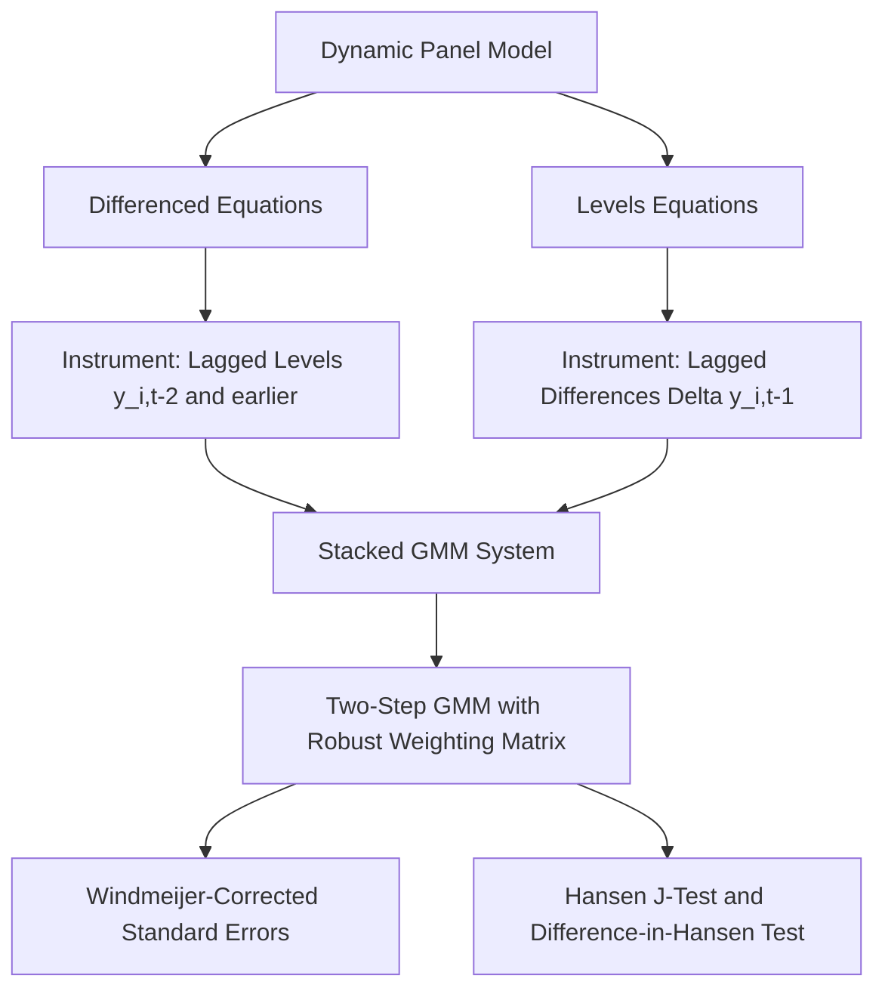

## Blundell-Bond System GMM

### Overview

The Blundell-Bond (1998) system GMM estimator extends the Arellano-Bond difference GMM framework by combining the first-differenced equations with the original levels equations into a single "system," using additional moment conditions from the levels equations to improve instrument strength. It was specifically developed to address the weak-instrument problem that afflicts difference GMM when the autoregressive process is highly persistent.

### Motivation: The Weak Instrument Problem in Difference GMM

In the Arellano-Bond difference GMM estimator, lagged levels $y_{i,t-2}, y_{i,t-3}, \dots$ serve as instruments for $\Delta y_{i,t-1}$ in the differenced equation:

$$\Delta y_{it} = \gamma \Delta y_{i,t-1} + \Delta x_{it}'\beta + \Delta \varepsilon_{it}$$

**Key Points**

- When $\gamma$ is close to 1 (highly persistent series, near unit root), or when the variance of $u_i$ relative to $\varepsilon_{it}$ is large, the series $y_{it}$ behaves nearly like a random walk with a strong permanent component
- In this case, period-to-period changes $\Delta y_{i,t-1}$ become weakly correlated with lagged **levels** $y_{i,t-2}$, because the levels are dominated by the persistent individual effect and convey little information about the (comparatively small) period-to-period changes
- This produces a **weak instruments problem**: the first-stage relationship between the instrument and the endogenous regressor is weak, leading to biased and imprecisely estimated GMM coefficients in finite samples, even though the estimator remains asymptotically consistent

### The System GMM Solution: Adding the Levels Equation

Blundell-Bond propose supplementing the differenced equation with the **levels equation**, using **lagged differences** of $y$ as instruments for the endogenous levels regressor $y_{i,t-1}$:

$$y_{it} = \gamma y_{i,t-1} + x_{it}'\beta + u_i + \varepsilon_{it}$$

$$\text{Instrument: } \Delta y_{i,t-1} = y_{i,t-1} - y_{i,t-2}$$

**Key Points**

- The key additional assumption required is that changes in $y$ are uncorrelated with the individual effect: $E[\Delta y_{i,t-1} \cdot u_i] = 0$
- This is a **stationarity-type initial conditions assumption** (specifically, that deviations from long-run individual means are not systematically related to the level of the individual effect), and it is a genuinely additional assumption beyond what difference GMM requires
- Under this assumption, $\Delta y_{i,t-1}$ is a valid instrument in the levels equation, since it is correlated with $y_{i,t-1}$ (relevance, especially when $\gamma$ is close to 1) but uncorrelated with $u_i + \varepsilon_{it}$ (exogeneity)

### The Combined System

The system GMM estimator stacks the differenced equations (instrumented with lagged levels, as in Arellano-Bond) and the levels equations (instrumented with lagged differences) into a single joint GMM system:

$$\begin{bmatrix} \Delta y_{it} \\ y_{it} \end{bmatrix} = \gamma \begin{bmatrix} \Delta y_{i,t-1} \\ y_{i,t-1} \end{bmatrix} + \begin{bmatrix} \Delta x_{it} \\ x_{it} \end{bmatrix}'\beta + \begin{bmatrix} \Delta \varepsilon_{it} \\ u_i + \varepsilon_{it} \end{bmatrix}$$

with the instrument matrix combining:

$$Z_i^{diff} = \text{block-diagonal lagged levels } (y_{i1}, \dots, y_{i,t-2}) \text{ for the differenced equations}$$

$$Z_i^{level} = \text{lagged differences } \Delta y_{i,t-1} \text{ for the levels equations}$$

**Key Points**

- The moment conditions from both blocks are combined and estimated jointly via two-step (or one-step) GMM, using the same efficient weighting matrix logic as difference GMM
- This larger and stronger instrument set is what improves finite-sample performance relative to difference GMM alone, particularly for persistent series

### Why System GMM Improves on Difference GMM

| Feature | Difference GMM | System GMM |
| --- | --- | --- |
| Equations used | First-differenced only | Differenced + Levels |
| Instruments for lagged $y$ | Lagged levels | Lagged levels (diff eq.) + lagged differences (levels eq.) |
| Performance under high persistence ($\gamma$ near 1) | Weak instruments, poor finite-sample performance | Substantially improved instrument relevance |
| Time-invariant regressors | Cannot be estimated (differenced out) | Can be estimated (retained in levels equation) |
| Additional assumptions required | Standard predeterminedness/exogeneity | Requires initial-conditions/stationarity assumption on $\Delta y_{i,t-1}$ |

**Key Points**

- Because the levels equation is retained (not differenced away), system GMM can estimate coefficients on **time-invariant regressors**, a practical advantage similar to that of random effects over fixed effects in the static case
- [Inference] System GMM is generally regarded in the applied panel literature as more efficient and better-behaved in finite samples than difference GMM when the autoregressive parameter is large or the ratio of individual-effect variance to idiosyncratic variance is high, though this improvement comes at the cost of the additional, non-testable-in-isolation stationarity assumption

### The Additional Identifying Assumption and Its Testability

**Key Points**

- The critical assumption $E[\Delta y_{i,t-1} \cdot u_i] = 0$ is not directly testable on its own, but its **overall validity jointly with other moment conditions** can be assessed indirectly via the Hansen J-test of overidentifying restrictions applied to the full system
- A common robustness check is the **difference-in-Hansen test** (also called the C-statistic or incremental Hansen test), which compares the Hansen statistic from the full system against the Hansen statistic from the difference-GMM-only subset of moment conditions; a significant difference suggests the additional levels-equation instruments are not jointly valid

### Instrument Proliferation in System GMM

**Key Points**

- System GMM adds even more instruments than difference GMM alone (since it includes both the differenced-equation instrument blocks and the levels-equation instruments), exacerbating the instrument proliferation problem discussed for Arellano-Bond
- **Collapsing instruments** (restricting to one instrument column per lag distance rather than one column per time period) is especially important in system GMM applications to keep the instrument count manageable relative to $N$
- A commonly cited applied rule of thumb is to keep the number of instruments below the number of cross-sectional units $N$, though [Inference] this is a practical guideline rather than a formally derived threshold, and some researchers argue the relevant criterion should be based on the rate of growth of instruments relative to $N$ rather than a simple headcount comparison

### Estimation Procedure

**Example**

1. Specify the dynamic model in both level and first-differenced form
2. Construct instruments: lagged levels ($y_{i,t-2}$ and deeper) for the differenced equations; lagged differences ($\Delta y_{i,t-1}$) for the levels equations
3. Optionally collapse the instrument matrix to limit instrument count
4. Estimate via one-step GMM to obtain preliminary residuals
5. Construct the robust two-step weighting matrix and re-estimate
6. Apply the Windmeijer (2005) finite-sample correction to two-step standard errors
7. Conduct the Hansen J-test and the difference-in-Hansen test for the validity of the levels-equation instruments
8. Conduct AR(1) and AR(2) tests on the differenced residuals (AR(2) is the meaningful diagnostic, as in difference GMM)

### Diagram: System GMM Structure

### Practical Guidance and Common Pitfalls

**Key Points**

- **Overuse in applied work with large N, large T**: system/difference GMM estimators are designed for the "small $T$, large $N$" micro-panel setting; applying them to long panels (large $T$) can produce instrument proliferation and unreliable inference, and simpler estimators (e.g., bias-corrected FE) may be preferable in that setting
- **Reporting both difference and system GMM results** alongside pooled OLS and within-FE estimates as informal bounds is common applied practice, since the true $\gamma$ is expected to lie between the upward-biased OLS estimate and the downward-biased within estimate
- **Instrument count transparency**: given the sensitivity of GMM results to instrument set specification, well-documented applied studies typically report the exact instrument count and specification choices (collapsed vs. full, lag limits) explicitly, and often show robustness across alternative specifications

### Practical Implementation Notes

**Example**

In Stata: `xtabond2` (a user-written but widely used command) implements both difference and system GMM with options for collapsing instruments and applying the Windmeijer correction. In R: the `plm` package's `pgmm()` function supports a `transformation = "ld"` (levels and differences) argument for system GMM. [Unverified] Exact syntax, defaults, and available options vary by software version; current package documentation should be consulted before implementation.

**Next Steps**

- Difference-in-Hansen test for validating additional system GMM instruments
- Instrument collapsing strategies for large-T dynamic panels
- Bias-corrected fixed effects estimators as alternatives for long panels
- Testing the initial-conditions/stationarity assumption underlying system GMM
- Nonlinear dynamic panel data models (e.g., dynamic panel probit/logit)

**Related Topics**

- Dynamic Panel Bias
- Arellano-Bond Difference GMM
- The Anderson-Hsiao Estimator
- Testing for Serial Correlation in Dynamic Panels
- Generalized Method of Moments (GMM) Foundations