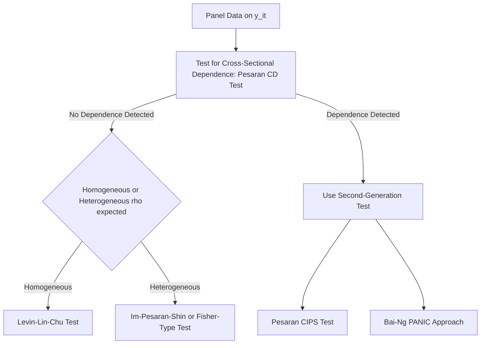

## Panel Unit Root Tests

### Overview

Panel unit root tests extend classical time-series unit root testing (e.g., Dickey-Fuller, Augmented Dickey-Fuller) to panel data settings, exploiting the cross-sectional dimension to substantially increase testing power relative to applying unit root tests to a single time series. They address the question of whether a variable observed across $N$ units and $T$ time periods is stationary or contains a unit root, which has direct implications for dynamic panel model specification, spurious regression risk, and the validity of standard inference.

### Motivation

**Key Points**

- Classical time-series unit root tests (ADF, Phillips-Perron) are known to have low power in finite samples, particularly when $T$ is short — a common feature of micro-panels
- Combining information across the cross-sectional dimension ($N$ units) allows panel unit root tests to achieve substantially higher power than applying a univariate test separately to each series, even when each individual series has too few observations for a reliable univariate test
- This matters directly for dynamic panel models: if $y_{it}$ contains a unit root, the stationarity assumption ($|\gamma| < 1$) underlying standard dynamic panel estimators (Arellano-Bond, Blundell-Bond) is violated, and the interpretation of estimated persistence parameters, as well as the validity of some GMM moment conditions, needs reconsideration

### The General Testing Framework

Consider an AR(1) representation for each cross-sectional unit:

$$y_{it} = \rho_i y_{i,t-1} + z_{it}'\delta_i + \varepsilon_{it}$$

where $z_{it}$ may include a constant, time trend, or other deterministic terms.

The unit root null hypothesis is generally:

$$H_0: \rho_i = 1 \text{ for all } i$$

**Key Points**

- The nature of the **alternative hypothesis** is what fundamentally distinguishes different panel unit root tests, and this distinction is the single most important conceptual issue in the topic
- **Homogeneous alternative** (common $\rho$): $H_1: \rho_i = \rho < 1$ for all $i$ — all units revert to stationarity at the same rate
- **Heterogeneous alternative**: $H_1:$ at least some (or a specified fraction of) $\rho_i < 1$, allowing different units to have different persistence, including some that may remain non-stationary

### First-Generation Tests: Cross-Sectional Independence Assumed

**Levin-Lin-Chu (LLC) Test**

Assumes a homogeneous autoregressive root across all units ($\rho_i = \rho$):

$$\Delta y_{it} = \rho y_{i,t-1} + \sum_j \phi_j \Delta y_{i,t-j} + z_{it}'\delta_i + \varepsilon_{it}$$

$$H_0: \rho = 0 \quad \text{vs.} \quad H_1: \rho < 0$$

**Key Points**

- Requires demeaning and standardization adjustments to account for cross-sectional heteroskedasticity before pooling
- Assumes cross-sectional independence across units — a significant limitation in many macro/finance panel applications where common shocks are likely
- The homogeneous-$\rho$ assumption is often criticized as unrealistic: it implies that if the null is rejected, **all** units are stationary, which is a strong and often implausible restriction

**Im-Pesaran-Shin (IPS) Test**

Allows for heterogeneous autoregressive roots across units:

$$H_0: \rho_i = 0 \text{ for all } i \quad \text{vs.} \quad H_1: \rho_i < 0 \text{ for at least some } i$$

The test statistic is based on the average of individual (augmented) Dickey-Fuller $t$-statistics across units:

$$\bar{t} = \frac{1}{N}\sum_{i=1}^{N} t_{\rho_i}$$

standardized to a standard normal distribution using tabulated moments.

**Key Points**

- More flexible than LLC because it does not require a common $\rho$ across units
- Rejecting $H_0$ under IPS only implies that **some** fraction of units are stationary, not necessarily all — a more realistic and generally preferred interpretation for heterogeneous panels
- Still assumes cross-sectional independence, which remains a key limitation shared with LLC

**Fisher-Type Tests (Maddala-Wu, Choi)**

Combine p-values from individual unit-level unit root tests (of any type, e.g., ADF or PP) using a Fisher-style combination:

$$P = -2\sum_{i=1}^{N} \ln(p_i) \sim \chi^2(2N)$$

**Key Points**

- Allows unbalanced panels and different lag lengths/specifications for each unit, offering more flexibility than LLC or IPS
- Also assumes cross-sectional independence in its standard form
- Choi (2001) proposes alternative standardized combination statistics with better asymptotic properties in some settings

### Second-Generation Tests: Allowing Cross-Sectional Dependence

**Key Points**

- First-generation tests (LLC, IPS, Fisher-type) can be **severely size-distorted** (over-rejecting the null too often) when cross-sectional dependence is present but ignored — a serious concern in panels of countries, industries, or firms subject to common macroeconomic shocks
- Second-generation tests explicitly model or filter out common factors before testing, addressing this limitation

**Pesaran (2007) CIPS Test (Cross-sectionally Augmented IPS)**

Augments the standard ADF regression for each unit with the cross-sectional averages of $y_{it}$ and its lags, to proxy for and filter out an unobserved common factor:

$$\Delta y_{it} = \rho_i y_{i,t-1} + \phi_i \bar{y}_{t-1} + \sum_j \theta_{ij} \Delta \bar{y}_{t-j} + \varepsilon_{it}$$

where $\bar{y}_t = \frac{1}{N}\sum_i y_{it}$ is the cross-sectional average. The CIPS statistic averages the resulting cross-sectionally augmented $t$-statistics (CADF statistics) across units.

**Key Points**

- Explicitly designed to be robust to a single common factor structure driving cross-sectional dependence
- Considered a standard modern choice when cross-sectional dependence is suspected but a full factor-model estimation is not desired
- **Bai-Ng (2004) PANIC approach**: an alternative second-generation framework that explicitly decomposes each series into common factors and idiosyncratic components via principal components analysis, then tests each component for a unit root separately — more flexible in allowing multiple common factors, at the cost of greater complexity

### Comparison of Major Panel Unit Root Tests

| Test | Alternative Hypothesis | Cross-Sectional Independence Required | Notes |
| --- | --- | --- | --- |
| Levin-Lin-Chu (LLC) | Homogeneous $\rho$ | Yes | Strong, often unrealistic restriction |
| Im-Pesaran-Shin (IPS) | Heterogeneous $\rho_i$ | Yes | More flexible than LLC |
| Fisher-type (Maddala-Wu, Choi) | Heterogeneous $\rho_i$ | Yes | Allows unbalanced panels, flexible lag structure |
| Pesaran CIPS | Heterogeneous $\rho_i$ | No (robust to one common factor) | Standard modern choice under cross-sectional dependence |
| Bai-Ng PANIC | Heterogeneous, factor-structured | No (multiple factors allowed) | More general but more complex |

### Testing for Cross-Sectional Dependence First

**Key Points**

- Before selecting a panel unit root test, it is standard practice to first test for cross-sectional dependence in the data, typically via the **Pesaran CD test**, which examines the average pairwise correlation of residuals across units
- If cross-sectional dependence is detected, a first-generation test (LLC, IPS, Fisher-type) should generally be avoided in favor of a second-generation test (CIPS, PANIC)
- [Inference] This sequential testing strategy — first testing for cross-sectional dependence, then choosing the panel unit root test accordingly — is widely recommended in the applied panel time-series literature, though the specific choice of second-generation test when dependence is confirmed still depends on the suspected factor structure and researcher judgment

### Diagram: Test Selection Logic

### Implications for Dynamic Panel Modeling

**Key Points**

- If panel unit root tests suggest $y_{it}$ is non-stationary, standard dynamic panel GMM estimators (Arellano-Bond, Blundell-Bond) built on the assumption $|\gamma| < 1$ may require reconsideration, and panel cointegration techniques may be more appropriate if a long-run relationship among non-stationary variables is of interest
- The near-unit-root case is also directly relevant to the weak-instrument problem discussed for difference GMM: evidence of a root close to 1 from panel unit root testing reinforces the case for preferring system GMM over difference GMM in that application
- [Unverified] The precise finite-sample power gains from various panel unit root tests depend heavily on $N$, $T$, the true degree of cross-sectional dependence, and the specific deterministic terms included; simulation evidence in the literature should be consulted for guidance in specific applied settings rather than relying on general asymptotic power rankings alone

### Practical Implementation Notes

**Example**

In Stata: `xtunitroot llc`, `xtunitroot ips`, `xtunitroot fisher`, and user-written commands such as `pescadf` for the Pesaran CIPS test. In R: the `plm` package's `purtest()` function supports LLC, IPS, Fisher-type (via `madwu`, `Pm`, `invnormal`, `logit` options), and some second-generation tests. [Unverified] Exact test variants, lag selection defaults, and deterministic term options vary across software and versions; current documentation should be checked before implementation.

**Next Steps**

- Pesaran CD test for cross-sectional dependence detection
- Panel cointegration testing (Pedroni, Westerlund tests)
- Factor-augmented panel data models
- Implications of near-unit-root persistence for GMM instrument strength
- Spurious regression risk in non-stationary panel data

**Related Topics**

- Dynamic Panel Bias
- Blundell-Bond System GMM
- Testing for Cross-Sectional Dependence
- Panel Cointegration
- Clustered and Panel-Robust Inference