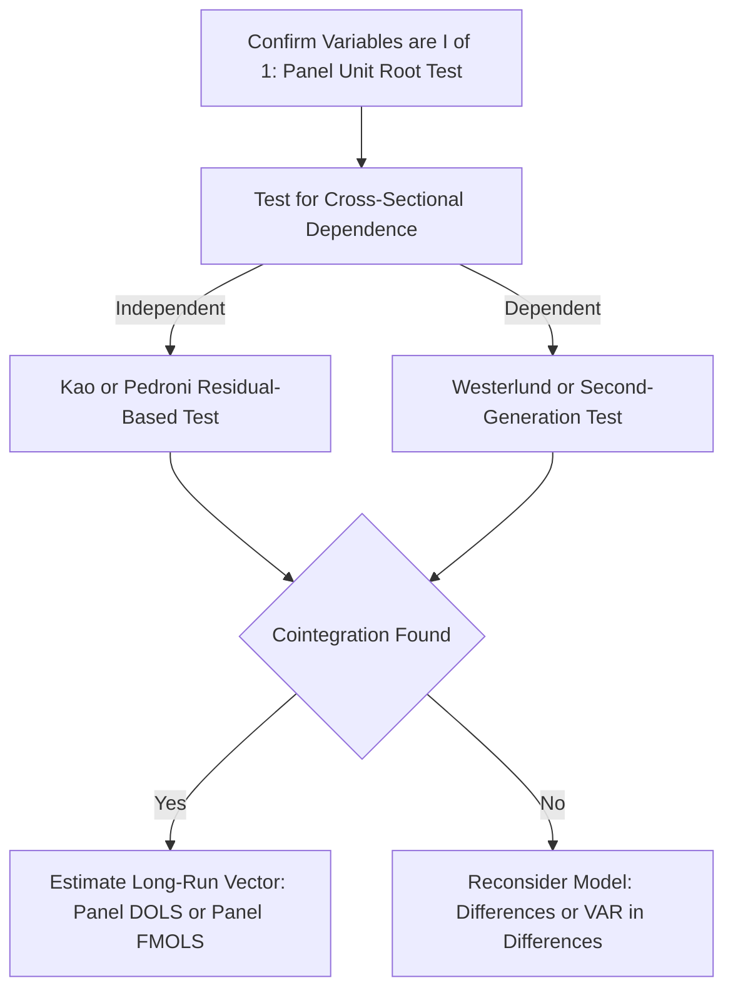

## Panel Cointegration Methods

### Overview

Panel cointegration methods extend the concept of cointegration from univariate time-series analysis to panel data, testing and estimating long-run equilibrium relationships among non-stationary variables observed across multiple cross-sectional units. These methods are relevant when panel unit root tests indicate that the variables of interest are integrated (e.g., $I(1)$), making standard dynamic panel regression on levels susceptible to spurious regression, while still leaving open the possibility of a meaningful long-run relationship among the variables.

### Motivation

**Key Points**

- If two or more $I(1)$ (unit-root, non-stationary) series are regressed on each other in levels without cointegration, the regression is subject to the classical **spurious regression** problem: high $R^2$ and significant t-statistics can arise even when the series are unrelated
- **Cointegration** exists when a linear combination of non-stationary variables is itself stationary, implying a stable long-run equilibrium relationship even though the individual series wander without bound
- Extending cointegration analysis to panels leverages the cross-sectional dimension to substantially increase testing power relative to single time-series cointegration tests, analogous to the power gains seen in panel unit root testing

### The Panel Cointegration Model

A typical panel cointegrating regression takes the form:

$$y_{it} = \alpha_i + x_{it}'\beta_i + e_{it}$$

where $y_{it}$ and $x_{it}$ are both $I(1)$, and cointegration holds if the residual $e_{it}$ is $I(0)$ (stationary) for each $i$ (or in a pooled sense, depending on the test).

**Key Points**

- $\alpha_i$ allows for individual-specific fixed effects (intercepts), analogous to the static panel FE model
- $\beta_i$ may be allowed to vary across units (heterogeneous cointegrating vectors) or restricted to be common across units ($\beta_i = \beta$), a distinction that parallels the homogeneous/heterogeneous alternative distinction in panel unit root testing

### Residual-Based Panel Cointegration Tests

**Pedroni (1999, 2004) Tests**

Pedroni's approach tests the null of no cointegration by examining the stationarity properties of the estimated residuals $\hat{e}_{it}$ from the panel cointegrating regression, allowing for heterogeneity in both the cointegrating vector and the dynamics across units.

$$H_0: \text{no cointegration (residuals contain a unit root)}$$

**Key Points**

- Pedroni proposes **seven** distinct test statistics, divided into two categories:
  - **Panel (within-dimension) statistics**: pool information across units by summing numerator and denominator terms across $i$ before forming the ratio, effectively imposing a common root under the alternative
  - **Group-mean (between-dimension) statistics**: average the individual unit-specific test statistics, allowing for heterogeneous autoregressive roots under the alternative
- This within/between distinction is directly analogous to the LLC (homogeneous) vs. IPS (heterogeneous) distinction in panel unit root testing
- Both categories of statistics are asymptotically standard normal under appropriate standardization, based on tabulated moments (analogous to the IPS approach)

**Kao (1999) Test**

A residual-based test similar in spirit to Pedroni's but restricted to a **homogeneous** cointegrating vector across units, making it a special case with less flexibility but a simpler and more parsimonious framework.

**Key Points**

- Kao's test is based on Dickey-Fuller and Augmented Dickey-Fuller type statistics applied to the pooled panel residuals under a common-slope assumption
- Generally viewed as an important precursor and simpler counterpart to Pedroni's more flexible framework

### Likelihood-Based Panel Cointegration Tests

**Larsson, Lyhagen, and Löthgren (2001) Test**

Extends the Johansen (1988) maximum-likelihood cointegration rank testing procedure from a single VAR system to a panel setting, testing for the number of cointegrating relationships (the cointegration rank) using a panel version of the trace statistic.

**Key Points**

- Provides a panel analogue to the standard time-series question "how many cointegrating vectors exist?" rather than simply testing the binary null of "no cointegration" vs. "cointegration"
- Requires estimating a VAR/VECM system for each cross-sectional unit before combining information across units, which is more computationally demanding than residual-based approaches

### Cross-Sectional Dependence and Second-Generation Panel Cointegration Tests

**Key Points**

- As with panel unit root tests, first-generation panel cointegration tests (Pedroni, Kao) generally assume **cross-sectional independence** across units, which can be violated in practice (e.g., panels of countries subject to common global shocks)
- **Westerlund (2007) error-correction-based tests** address this by testing for cointegration through the significance of the error-correction term in a conditional error-correction model, and can be implemented with bootstrap-based critical values that account for cross-sectional dependence
- **Second-generation approaches** more broadly, in analogy with second-generation panel unit root tests (CIPS, PANIC), incorporate common factor structures or cross-sectionally augmented regressions to remain valid under cross-sectional dependence

### Estimating the Long-Run Cointegrating Vector

Once cointegration is established (or assumed), several estimators are available for the cointegrating vector $\beta$ itself, analogous to time-series cointegration estimation (e.g., Engle-Granger, fully modified OLS):

**Key Points**

- **Panel Dynamic OLS (Panel DOLS)**: augments the cointegrating regression with leads and lags of $\Delta x_{it}$ to correct for endogeneity and serial correlation bias in the long-run coefficient estimate, extending Stock-Watson DOLS to the panel setting
- **Panel Fully Modified OLS (Panel FMOLS)**: applies a semi-parametric correction to standard OLS estimates of the cointegrating vector to address endogeneity and serial correlation, extending Phillips-Hansen FMOLS to panels
- Both approaches can be implemented allowing for either homogeneous ($\beta_i = \beta$) or heterogeneous (group-mean, averaging individual $\hat\beta_i$) cointegrating vectors across units

**Example**

A researcher studying the long-run relationship between energy consumption and GDP across a panel of countries might: (1) confirm both series are $I(1)$ using a second-generation panel unit root test, (2) test for cointegration using Pedroni's group-mean statistics (allowing heterogeneous dynamics across countries), and (3) estimate the long-run elasticity using Panel FMOLS or Panel DOLS if cointegration is confirmed.

### Comparison of Major Panel Cointegration Approaches

| Method | Type | Cointegrating Vector | Cross-Sectional Independence Required |
| --- | --- | --- | --- |
| Kao (1999) | Residual-based | Homogeneous | Yes |
| Pedroni (1999, 2004) | Residual-based | Heterogeneous (group-mean) or pooled (panel) | Yes |
| Larsson-Lyhagen-Löthgren | Likelihood-based (VECM rank test) | Determines rank per system | Yes |
| Westerlund (2007) | Error-correction-based | Flexible | No (robust variants available) |

### Diagram: Panel Cointegration Analysis Workflow

### Relationship to Error-Correction Models

**Key Points**

- If cointegration is established, the relationship can be represented in a **Panel Vector Error-Correction Model (Panel VECM)**, which combines short-run dynamics with an error-correction term that pulls the system back toward the long-run equilibrium
- The Westerlund test's use of the error-correction term significance as its testing basis directly reflects this connection, unifying the cointegration testing and error-correction modeling steps within a single framework

### Practical Considerations and Limitations

**Key Points**

- Panel cointegration methods are primarily designed for **macro-panels** (moderate-to-large $T$, e.g., cross-country panels over several decades), since reliable estimation of unit-specific long-run dynamics generally requires a non-trivial time dimension — this contrasts with the micro-panel (small $T$, large $N$) focus of the GMM dynamic panel estimators covered earlier in this chapter
- [Inference] Choice among the many available tests and estimators in applied work is often guided by the suspected degree of parameter heterogeneity and cross-sectional dependence in the specific application, and robustness checks across multiple methods are commonly reported given the sensitivity of finite-sample results to test/estimator choice
- [Unverified] Finite-sample size and power properties of these tests vary with $N$, $T$, and the number of regressors; simulation-based guidance in the primary literature (e.g., Pedroni 2004, Westerlund 2007) should be consulted for specific application design choices

### Practical Implementation Notes

**Example**

In Stata: `xtcointtest` supports Pedroni, Kao, and Westerlund tests. In R: the `plm` package provides `pcdtest()` for cross-sectional dependence and cointegration-adjacent diagnostics, while dedicated packages such as `pco` or `phtt` provide Pedroni/Kao/Westerlund implementations. [Unverified] Exact command syntax, available test variants, and default options vary by software and version and should be confirmed against current documentation.

**Next Steps**

- Panel Vector Error-Correction Models (Panel VECM)
- Panel Dynamic OLS and Panel FMOLS estimation in detail
- Westerlund bootstrap-based cointegration testing under cross-sectional dependence
- Heterogeneous vs. homogeneous cointegrating vector specification choices
- Applications to macro-panel long-run relationships (e.g., purchasing power parity, growth convergence)

**Related Topics**

- Panel Unit Root Tests
- Testing for Cross-Sectional Dependence
- Blundell-Bond System GMM
- Dynamic Panel Bias
- Panel Vector Autoregression (Panel VAR)