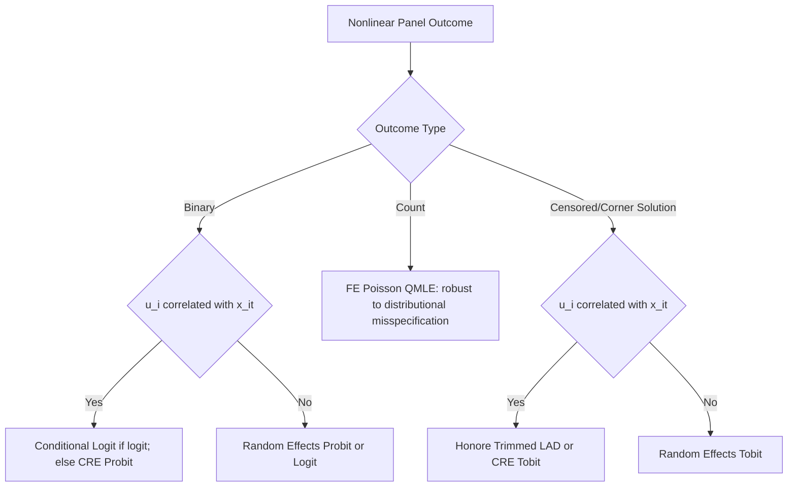

## Nonlinear Panel Data Models

### Overview

Nonlinear panel data models extend panel data methods to settings where the dependent variable or the functional form of the relationship between variables is not linear, most commonly arising with binary, count, censored, or fractional outcomes. Unlike the linear panel models covered earlier, incorporating unobserved individual heterogeneity in nonlinear models raises fundamental identification and estimation challenges that do not have straightforward analogues to the linear within-transformation.

### The Incidental Parameters Problem

The central conceptual challenge distinguishing nonlinear panel models from linear ones is the **incidental parameters problem** (Neyman and Scott, 1948).

**Key Points**

- In linear fixed effects models, the within-transformation eliminates $u_i$ algebraically before estimation, so the fact that $u_i$ is estimated with only $T$ observations per unit does not contaminate $\hat\beta$
- In most nonlinear models, $u_i$ cannot be differenced out because the nonlinear function does not permit an additive separation of the individual effect from the index term
- If $u_i$ must instead be **estimated jointly** with $\beta$ (as in a "brute-force" fixed effects nonlinear approach), each $\hat{u}_i$ is estimated from only $T_i$ observations. As $N \to \infty$ with $T$ fixed, the number of incidental parameters $u_i$ grows alongside $N$, and their estimation error does not vanish — this generally **contaminates** the estimate of $\hat\beta$, producing inconsistency even as $N \to \infty$
- [Inference] The severity of this inconsistency generally diminishes as $T$ grows, since more observations per unit improve the precision of each $\hat{u}_i$, but for the short panels ($T$ small) common in microeconometric applications, the bias can be substantial and is not addressed simply by increasing $N$

### Binary Choice Panel Models

**Fixed Effects Logit (Conditional Logit)**

For a binary outcome, $y_{it} = 1[x_{it}'\beta + u_i + \varepsilon_{it} > 0]$, the logit specification permits a special **conditional maximum likelihood** approach that eliminates $u_i$ without needing to estimate it.

**Key Points**

- Conditioning on the **sufficient statistic** $\sum_t y_{it}$ (the total number of "successes" for unit $i$) removes $u_i$ from the conditional likelihood, analogous in spirit (though not in mechanism) to the linear within-transformation
- This conditional logit approach yields a **consistent** estimator of $\beta$ (up to scale, since the fixed effect's absolute level cannot be identified) without incurring the incidental parameters problem
- **Key limitation**: units with $\sum_t y_{it} = 0$ or $\sum_t y_{it} = T_i$ (no variation in the outcome across time) contribute no information and are dropped from estimation, which can be a substantial share of the sample in applications with rare or near-universal outcomes
- Average partial effects (APEs) are **not directly recoverable** from the conditional logit fixed effects estimator, since $u_i$ is never estimated and its distribution across the population is unknown — this is a significant practical limitation relative to linear FE models, where APEs coincide with $\hat\beta$

**Fixed Effects Probit**

**Key Points**

- Unlike logit, the probit model does **not** admit a sufficient statistic that eliminates $u_i$, so there is no exact conditional likelihood analogue
- Estimating $u_i$ jointly with $\beta$ (brute-force fixed effects probit) suffers from the incidental parameters problem and produces inconsistent $\hat\beta$ for fixed $T$
- This asymmetry between logit and probit is a frequently tested conceptual point: the availability of a sufficient statistic is a special feature of the logistic functional form, not a general property of binary choice models

**Random Effects Probit/Logit**

**Key Points**

- Specifies $u_i$ as a random variable (typically normal for probit, or a distribution compatible with logit) with a specified distribution, uncorrelated with $x_{it}$, and integrates it out of the likelihood
- Requires the same exogeneity assumption as linear RE: $E[u_i \mid x_{i1}, \dots, x_{iT}] = 0$; if violated, RE estimates are inconsistent (as in the linear case)
- Estimation requires numerical integration (e.g., Gauss-Hermite quadrature) over the distribution of $u_i$, since the likelihood does not have a closed form once $u_i$ is integrated out (except in special cases)
- Because RE avoids the incidental parameters problem (it treats $u_i$ as a nuisance distribution rather than $N$ separate parameters), it delivers both consistent coefficient estimates and directly interpretable average partial effects — a key practical advantage over FE probit/logit, at the cost of the stronger exogeneity assumption

### Comparison of Binary Choice Panel Approaches

| Approach | Handles $u_i$ correlated with $x_{it}$ | Incidental parameters problem | Average partial effects recoverable |
| --- | --- | --- | --- |
| Fixed Effects Logit (conditional) | Yes | Avoided (via sufficient statistic) | No |
| Fixed Effects Probit (brute force) | Yes | Present (inconsistent for fixed $T$) | Yes, but biased |
| Random Effects Probit/Logit | No | Avoided (integrated out) | Yes |
| Pooled Probit/Logit with cluster-robust SEs | No | N/A (ignores $u_i$ correlation) | Yes, but potentially biased if $u_i$ matters |

### Count Data Panel Models

**Fixed Effects Poisson**

**Key Points**

- Unlike probit, the **Poisson** fixed effects model has a notable robustness property: the FE Poisson (conditional maximum likelihood) estimator remains **consistent for $\beta$** even if the underlying data are not truly Poisson-distributed, as long as the conditional mean is correctly specified as $E[y_{it} \mid x_{it}, u_i] = u_i \exp(x_{it}'\beta)$
- This makes FE Poisson a popular **quasi-maximum likelihood (QMLE)** estimator for count and even some continuous non-negative outcomes, valued for this robustness rather than strict distributional adherence
- As with logit, this conditional approach avoids the incidental parameters problem, unlike a brute-force joint estimation of $u_i$ and $\beta$

**Negative Binomial Fixed Effects**

**Key Points**

- Widely used, but the standard fixed-effects negative binomial specification (Hausman, Hall, Griliches 1984) has been shown in later research to not fully eliminate the individual effect in the same clean conditional-likelihood sense as Poisson, and its properties are more delicate than often assumed in applied practice
- [Inference] Applied researchers concerned about this issue sometimes prefer FE Poisson QMLE with robust/clustered standard errors even for overdispersed count data, given its more transparent and better-understood robustness properties

### Censored and Corner Solution Panel Models

**Fixed Effects Tobit**

**Key Points**

- The Tobit model (for censored/corner-solution outcomes, e.g., zero-inflated continuous variables) does **not** have a general sufficient-statistic-based conditional MLE that removes $u_i$, similar to the probit case
- Brute-force fixed effects Tobit estimation suffers from the incidental parameters problem
- Semi-parametric alternatives (e.g., Honoré's (1992) trimmed least absolute deviations estimator) have been developed specifically to provide consistent estimation of Tobit-type panel models with fixed effects, without requiring the strong distributional assumptions of the parametric Tobit likelihood

### Correlated Random Effects (Chamberlain-Mundlak) Approach for Nonlinear Models

**Key Points**

- A widely used practical compromise, especially for probit and Tobit models where no clean FE conditional likelihood exists, is the **correlated random effects (CRE)** approach: specify $u_i$ as a function of the within-unit means of the regressors, e.g., $u_i = \bar{x}_i'\lambda + a_i$ with $a_i$ independent of $x_{it}$
- Substituting this into the random effects likelihood allows correlation between $u_i$ and $x_{it}$ (through $\bar{x}_i$) to be captured, while retaining the tractable random-effects estimation machinery (including recoverable average partial effects)
- This Mundlak-Chamberlain device is a key bridge between the FE and RE nonlinear model literatures, and is often the most practical estimation route for probit and Tobit panel models with suspected fixed-effect endogeneity

### Diagram: Estimator Choice for Nonlinear Panel Models

### Average Partial Effects in Nonlinear Panel Models

**Key Points**

- Unlike linear models, where $\hat\beta$ directly gives the marginal effect, nonlinear models require computing **average partial effects (APEs)** by averaging the model-implied partial derivative (or discrete change) across the estimated distribution of $u_i$ and the observed distribution of $x_{it}$
- APEs are readily computable for random effects and correlated random effects specifications (where the distribution of $u_i$ is estimated), but are **not generally identified** from the fixed-effects conditional logit or Poisson estimators alone, since those approaches never recover the distribution of $u_i$
- This is a frequently overlooked practical distinction: obtaining a consistent $\hat\beta$ (via FE) does not automatically provide an interpretable marginal effect in nonlinear models, unlike in the linear case

### Dynamic Nonlinear Panel Models and the Initial Conditions Problem

**Key Points**

- Adding a lagged dependent variable to a nonlinear panel model (e.g., dynamic panel probit or logit, used to study state dependence such as persistence in unemployment or firm survival) introduces the **initial conditions problem**: the first observed period $y_{i1}$ is itself a function of the individual effect $u_i$, and this initial realization is generally correlated with $u_i$ in ways that standard random-effects likelihoods do not account for
- **Heckman's (1981) reduced-form approach** approximates the distribution of $y_{i1}$ conditional on $u_i$ and pre-sample information, providing a practical (though approximate) solution widely used in applied dynamic nonlinear panel work
- [Unverified] Alternative solutions (e.g., Wooldridge's (2005) conditional maximum likelihood approach, which conditions on the initial observation directly) are also used in practice; the relative merits of these approaches in specific finite-sample settings are an active area of applied methodological discussion and should be evaluated against current literature for a given application

### Practical Implementation Notes

**Example**

In Stata: `xtlogit, fe` for conditional fixed effects logit; `xtlogit, re` and `xtprobit, re` for random effects variants; `xtpoisson, fe` for fixed effects Poisson QMLE; `xttobit` for random effects Tobit. In R: the `pglm` package supports panel GLM-type nonlinear models including logit, probit, Poisson, and ordered models under both FE and RE specifications. [Unverified] Availability of specific estimators (e.g., Honoré's trimmed LAD Tobit, Wooldridge's dynamic initial conditions approach) varies by software and often requires specialized or user-written packages; current documentation should be consulted.

**Next Steps**

- Average partial effects computation in random and correlated random effects models
- Dynamic nonlinear panel models and the initial conditions problem (Heckman and Wooldridge approaches)
- Semi-parametric fixed effects estimators (Honoré's trimmed LAD for Tobit, Manski's maximum score for binary choice)
- Panel ordered choice and multinomial choice models
- Quantile regression methods for panel data

**Related Topics**

- Fixed Effects Estimation
- Random Effects Estimation
- Dynamic Panel Bias
- Correlated Random Effects (Mundlak-Chamberlain) Models
- Maximum Likelihood Estimation Foundations