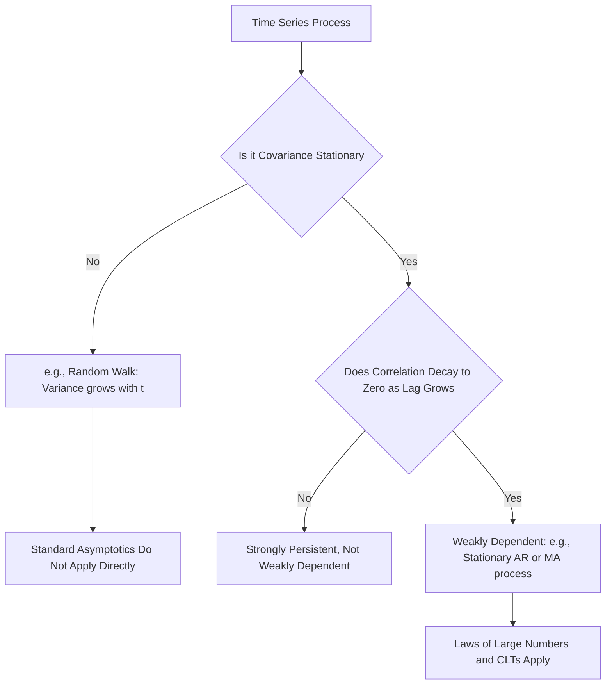

## Stationarity and Weak Dependence

### Overview

Stationarity and weak dependence are foundational concepts in time series analysis that establish the conditions under which standard asymptotic theory (laws of large numbers, central limit theorems) can be applied to dependent data. Without some form of stationarity and a limit on the persistence of dependence over time, the statistical tools used for cross-sectional and panel data — which rely on independent or weakly dependent identically distributed observations — do not generally carry over to time series settings.

### Strict Stationarity

A stochastic process $\{y_t\}$ is **strictly stationary** if the joint distribution of any collection of observations is invariant to time shifts:

$$F(y_{t_1}, y_{t_2}, \dots, y_{t_k}) = F(y_{t_1+h}, y_{t_2+h}, \dots, y_{t_k+h}) \quad \text{for all } h, k, \text{ and } t_1,\dots,t_k$$

**Key Points**

- This is a very strong requirement: it demands that the **entire joint distribution** of any subset of observations depends only on the relative spacing between them, not on the absolute time index
- Strict stationarity implies that the marginal distribution of $y_t$ is identical for every $t$ (constant mean, variance, and all higher moments, if they exist)
- Strict stationarity is rarely verified directly in practice because it is difficult to test; the weaker and more tractable concept of covariance stationarity is used far more commonly in applied econometric work

### Covariance (Weak) Stationarity

A process is **covariance stationary** (also called weakly or second-order stationary) if only the first two moments are time-invariant:

$$E[y_t] = \mu \quad \text{for all } t$$

$$\text{Var}(y_t) = \sigma^2 \quad \text{for all } t$$

$$\text{Cov}(y_t, y_{t+h}) = \gamma(h) \quad \text{depends only on } h, \text{ not on } t$$

**Key Points**

- The covariance between $y_t$ and $y_{t+h}$ — the **autocovariance function** $\gamma(h)$ — depends only on the lag length $h$, not on the specific time period $t$
- Covariance stationarity is implied by strict stationarity whenever the first two moments exist, but the reverse is not generally true — a process can be covariance stationary without being strictly stationary (e.g., if higher moments change over time even though mean and variance do not)
- For **Gaussian processes**, since the entire distribution is characterized by the first two moments, covariance stationarity and strict stationarity coincide

### The Autocorrelation Function

The autocorrelation function (ACF) standardizes the autocovariance function:

$$\rho(h) = \frac{\gamma(h)}{\gamma(0)} = \frac{\text{Cov}(y_t, y_{t+h})}{\text{Var}(y_t)}$$

**Key Points**

- $\rho(0) = 1$ by construction, and $\rho(h) = \rho(-h)$ for covariance stationary processes (symmetry around lag zero)
- The **decay pattern** of $\rho(h)$ as $h$ increases is central to distinguishing between different classes of time series models (e.g., geometric decay for AR processes, abrupt cutoff for MA processes) and to assessing the degree of persistence in the series

### Why Stationarity Matters: Consequences of Non-Stationarity

**Key Points**

- If $E[y_t]$ or $\text{Var}(y_t)$ changes over time, sample averages computed from a single realized time series do not converge to well-defined population parameters, undermining standard estimation
- Regressing one non-stationary series on another unrelated non-stationary series can produce a **spurious regression**: high $R^2$, significant t-statistics, but no genuine underlying relationship — a classical result associated with Granger and Newbold (1974) and Phillips (1986)
- This motivates the panel and time-series unit root testing procedures covered elsewhere in this course, which formally assess whether a series is stationary or contains a unit root before proceeding to regression analysis

### Weak Dependence

Stationarity alone does not guarantee that standard laws of large numbers and central limit theorems apply to dependent time series data; an additional condition — **weak dependence** — is required, limiting how much the correlation between observations can persist as the time gap between them grows.

**Key Points**

- A covariance-stationary process is weakly dependent if $\text{Corr}(y_t, y_{t+h}) \to 0$ as $h \to \infty$, meaning observations far apart in time become approximately uncorrelated
- Weak dependence is what permits an effective **law of large numbers** to operate on time series data: even though observations are not independent, if dependence decays sufficiently fast, sample averages still converge to population means, and the sample behaves in some respects like an "effectively independent" sample with a reduced number of truly informative observations
- This concept is the time-series analogue of independence across units in cross-sectional/panel settings, and its absence (e.g., in a unit root process, where correlations do not decay) is precisely why standard inferential tools break down for non-stationary, strongly dependent series

### Mixing Conditions: A Formal Characterization of Weak Dependence

**Key Points**

- **Strong (alpha) mixing**: a formal probabilistic condition requiring that the dependence between events far apart in time, measured via a specific mixing coefficient $\alpha(h)$, decays to zero as $h \to \infty$
- **Weak (phi) mixing**: a related but stronger mixing condition, using a different coefficient $\phi(h)$ that also must decay to zero
- These conditions provide the formal underpinning for central limit theorems applicable to dependent, heterogeneous processes, and are commonly invoked (though rarely tested directly) as sufficient conditions in the asymptotic theory of time series estimators, including in dynamic panel and time-series GMM contexts
- [Inference] In applied work, researchers generally do not test mixing conditions directly, since they are difficult to verify empirically; instead, weak dependence is typically argued informally based on the type of process assumed (e.g., a stationary ARMA process with roots outside the unit circle is a standard sufficient condition for weak dependence) or is simply maintained as a working assumption

### Examples of Weakly Dependent vs. Non-Weakly-Dependent Processes

**Example**

- **White noise**: $y_t = \varepsilon_t$ with $\varepsilon_t$ IID mean zero — trivially weakly dependent, since $\rho(h) = 0$ for all $h \neq 0$
- **Stationary AR(1)**: $y_t = \phi y_{t-1} + \varepsilon_t$ with $|\phi| < 1$ — weakly dependent, since $\rho(h) = \phi^{|h|} \to 0$ geometrically as $h \to \infty$
- **Random walk**: $y_t = y_{t-1} + \varepsilon_t$ — **not** covariance stationary (variance grows with $t$: $\text{Var}(y_t) = t\sigma^2_\varepsilon$) and **not** weakly dependent, since correlations between distant observations do not decay to zero in the relevant sense used for asymptotic theory
- **Moving average MA(1)**: $y_t = \varepsilon_t + \theta \varepsilon_{t-1}$ — weakly dependent with an abrupt cutoff: $\rho(1) \neq 0$ but $\rho(h) = 0$ for $h \geq 2$

### Diagram: Stationarity and Dependence Classification

### Trend Stationarity vs. Difference Stationarity

**Key Points**

- A series can be non-stationary due to a **deterministic trend** (trend-stationary: stationary once a deterministic function of time is removed) or due to a **stochastic trend** (difference-stationary: stationary only after differencing, as with a unit root process)
- Distinguishing between these two cases matters practically: detrending is the appropriate transformation for a trend-stationary series, while differencing is appropriate for a difference-stationary series, and applying the wrong transformation can introduce or fail to remove non-stationarity
- This distinction is the substantive question addressed by (panel and univariate) unit root tests, which test the null of a stochastic (unit root) trend against the alternative of stationarity (around a possible deterministic trend)

### Ergodicity: A Related but Distinct Concept

**Key Points**

- **Ergodicity** is the property that time averages from a single realization of the process converge to the corresponding population (ensemble) averages as the sample size grows
- Stationarity alone does not guarantee ergodicity, though the two concepts are frequently invoked together, since ergodicity (combined with stationarity) is generally what is actually needed to justify estimating population moments from a single observed time series
- [Inference] In practice, most standard weakly dependent stationary processes used in econometrics (e.g., stationary ARMA processes) are also ergodic, so the distinction is often treated as a technical formality in applied work rather than a separately tested condition

### Practical Diagnostic Tools

**Example**

- **Visual inspection**: plotting the series over time to check for obvious trends, changing variance, or structural breaks
- **Sample autocorrelation function (correlogram)**: plotting $\hat\rho(h)$ against $h$ to visually assess the decay pattern and identify candidate ARMA structures
- **Formal unit root tests**: Augmented Dickey-Fuller (ADF), Phillips-Perron (PP), and KPSS tests (which reverse the null and alternative relative to ADF, testing stationarity as the null) provide formal statistical evidence on the stationarity question
- [Unverified] The relative power and size properties of these tests differ across sample sizes and specific data-generating processes; no single test is universally regarded as most reliable across all applied settings, and using multiple tests in combination is a common recommended practice.

**Next Steps**

- Formal unit root testing (ADF, Phillips-Perron, KPSS)
- Autoregressive Moving Average (ARMA) model specification and identification via the ACF/PACF
- Trend-stationary vs. difference-stationary series and appropriate detrending/differencing
- Mixing conditions and their role in time series asymptotic theory
- Structural breaks and their effect on stationarity testing

**Related Topics**

- Panel Unit Root Tests
- Autoregressive Moving Average (ARMA) Models
- Spurious Regression
- Panel Cointegration Methods
- Ergodicity and Laws of Large Numbers for Dependent Data