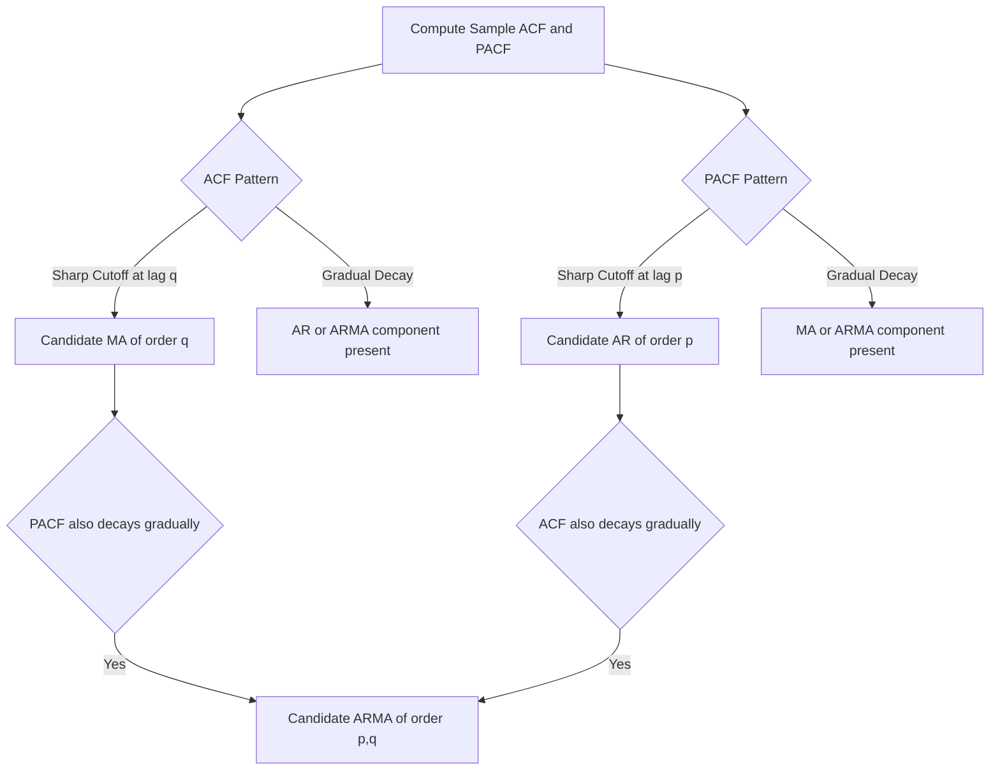

## Autocorrelation and Partial Autocorrelation Functions

### Overview

The autocorrelation function (ACF) and partial autocorrelation function (PACF) are the primary diagnostic tools for characterizing the dependence structure of a time series, used both to assess stationarity/weak dependence informally and — most importantly — to identify the appropriate order of autoregressive (AR) and moving average (MA) components in ARMA model specification. Together, their distinct decay patterns provide a systematic method (the Box-Jenkins approach) for model identification.

### The Autocorrelation Function (ACF)

For a covariance-stationary process $\{y_t\}$, the autocorrelation function at lag $h$ is:

$$\rho(h) = \frac{\gamma(h)}{\gamma(0)} = \frac{\text{Cov}(y_t, y_{t+h})}{\text{Var}(y_t)}$$

**Key Points**

- Measures the **total** linear association between $y_t$ and $y_{t+h}$, including both the direct effect and any indirect effect transmitted through the intervening observations $y_{t+1}, \dots, y_{t+h-1}$
- $\rho(0) = 1$ by construction; $\rho(h) = \rho(-h)$ for stationary processes
- The sample ACF, $\hat\rho(h)$, is estimated from data as:

$$\hat\rho(h) = \frac{\sum_{t=1}^{n-h} (y_t - \bar{y})(y_{t+h} - \bar{y})}{\sum_{t=1}^{n} (y_t - \bar{y})^2}$$

### The Partial Autocorrelation Function (PACF)

The partial autocorrelation at lag $h$, denoted $\phi_{hh}$, measures the correlation between $y_t$ and $y_{t+h}$ **after removing the linear effect of the intervening observations** $y_{t+1}, \dots, y_{t+h-1}$.

$$\phi_{hh} = \text{Corr}(y_t, y_{t+h} \mid y_{t+1}, \dots, y_{t+h-1})$$

**Key Points**

- Formally, $\phi_{hh}$ is defined as the coefficient on $y_{t-h}$ in the population linear projection of $y_t$ onto $y_{t-1}, y_{t-2}, \dots, y_{t-h}$
- Unlike the ACF, which captures cumulative/total association, the PACF isolates the **direct** relationship at exactly lag $h$, purging the contribution passed through shorter lags
- The PACF can be computed recursively via the **Durbin-Levinson algorithm**, which sequentially updates the partial autocorrelation coefficients as the lag order increases, without needing to re-estimate the full autoregression from scratch at each step

### Theoretical ACF and PACF Patterns for Standard Processes

**AR(p) Process**

For an autoregressive process of order $p$:

$$y_t = \phi_1 y_{t-1} + \phi_2 y_{t-2} + \dots + \phi_p y_{t-p} + \varepsilon_t$$

**Key Points**

- **ACF**: decays gradually (geometrically, or as a mixture of damped exponentials/sinusoids for higher-order AR processes) and never cuts off abruptly to exactly zero
- **PACF**: cuts off sharply after lag $p$ — that is, $\phi_{hh} = 0$ for all $h > p$, since by construction the direct effect of $y_{t-h}$ on $y_t$ is zero once $h$ exceeds the true autoregressive order
- This sharp PACF cutoff is the primary tool for identifying the order $p$ of an AR process from sample data

**MA(q) Process**

For a moving average process of order $q$:

$$y_t = \varepsilon_t + \theta_1 \varepsilon_{t-1} + \dots + \theta_q \varepsilon_{t-q}$$

**Key Points**

- **ACF**: cuts off sharply after lag $q$ — that is, $\rho(h) = 0$ for all $h > q$, a direct consequence of the finite memory of the MA process
- **PACF**: decays gradually (in a damped exponential or sinusoidal fashion) and does not cut off sharply
- This is the exact mirror image of the AR(p) case, and the ACF cutoff is the primary tool for identifying the order $q$ of an MA process

**ARMA(p,q) Process**

**Key Points**

- Both the ACF and PACF exhibit gradual decay (a mixture of damped exponentials/sinusoids) rather than a sharp cutoff in either function
- This makes pure ARMA processes (with both AR and MA components present) harder to identify by simple visual inspection of the ACF/PACF alone, motivating the use of information criteria (AIC, BIC) alongside ACF/PACF inspection for final order selection

### Summary Table: ACF/PACF Identification Patterns

| Process | ACF Pattern | PACF Pattern |
| --- | --- | --- |
| White Noise | Zero at all $h \neq 0$ | Zero at all $h \neq 0$ |
| AR(p) | Gradual decay (exponential/sinusoidal) | Sharp cutoff after lag $p$ |
| MA(q) | Sharp cutoff after lag $q$ | Gradual decay (exponential/sinusoidal) |
| ARMA(p,q) | Gradual decay after lag $q$ | Gradual decay after lag $p$ |

### Diagram: Box-Jenkins Identification Logic

### Statistical Inference on Sample ACF/PACF

**Key Points**

- Under the null hypothesis that the true process is white noise, the sample autocorrelations $\hat\rho(h)$ are asymptotically normally distributed with standard error approximately $1/\sqrt{n}$, giving the commonly plotted $\pm 1.96/\sqrt{n}$ confidence bands on correlogram plots
- For testing the significance of individual sample autocorrelations from a fitted AR(p) or general ARMA model (rather than testing against pure white noise), **Bartlett's formula** provides the appropriate asymptotic standard errors, which account for the fact that autocorrelations at different lags are themselves correlated once a model with dependence has been fit
- Similarly, standard errors for the sample PACF at lag $h$ under the null that the true order is less than $h$ are also approximately $1/\sqrt{n}$, providing the basis for confidence bands on PACF plots

### Joint (Portmanteau) Tests for Overall Serial Correlation

Rather than testing each individual lag separately, portmanteau tests assess the joint significance of a whole set of autocorrelations simultaneously — commonly used as a residual diagnostic after fitting an ARMA model.

**Box-Pierce Test**

$$Q = n\sum_{h=1}^{m} \hat\rho^2(h) \sim \chi^2(m - k)$$

**Ljung-Box Test**

$$Q_{LB} = n(n+2)\sum_{h=1}^{m} \frac{\hat\rho^2(h)}{n-h} \sim \chi^2(m-k)$$

where $m$ is the number of lags tested and $k$ is the number of estimated parameters in the fitted model (subtracted as a degrees-of-freedom correction).

**Key Points**

- The Ljung-Box test applies a small-sample correction factor relative to the simpler Box-Pierce test and is generally preferred in applied practice, particularly in smaller samples
- Both tests are commonly applied to the **residuals** of a fitted ARMA model as a specification check: significant remaining autocorrelation in the residuals (rejecting the null of no serial correlation) suggests the fitted model has not adequately captured the dependence structure and should be respecified
- [Inference] The choice of the number of lags $m$ to include in a portmanteau test involves a bias-variance-type tradeoff — too few lags may miss longer-range dependence, too many can dilute power — and applied guidance (e.g., choosing $m$ based on $\ln(n)$ or a small multiple thereof) varies somewhat across textbook treatments

### Practical Application to Model Building

**Example**

A researcher examining quarterly GDP growth plots the sample ACF and PACF. The PACF shows a large, significant spike at lag 1 and near-zero values thereafter, while the ACF decays gradually and geometrically. This pattern is consistent with an AR(1) process. After fitting an AR(1) model, the researcher applies the Ljung-Box test to the residuals at several lag lengths; failure to reject the null of no residual autocorrelation supports the adequacy of the AR(1) specification.

### Limitations of ACF/PACF-Based Identification

**Key Points**

- Visual identification from correlogram plots can be ambiguous, especially for processes with mixed ARMA dynamics, seasonal components, or in the presence of a small sample size where sampling variability in $\hat\rho(h)$ and $\hat\phi_{hh}$ obscures the true theoretical pattern
- Structural breaks, outliers, or non-stationarity in the underlying series can distort the sample ACF/PACF, producing patterns (e.g., very slow decay) that mimic near-unit-root behavior even when a different underlying process is at work — this is part of why formal unit root testing is typically conducted before final ACF/PACF-based model identification
- In practice, ACF/PACF inspection is generally used to **narrow down candidate model orders**, with final selection confirmed via information criteria (AIC, BIC, or corrected AIC) and residual diagnostic testing, rather than relying on visual pattern-matching alone

**Next Steps**

- ARMA model estimation methods (conditional/exact maximum likelihood, method of moments)
- Model selection via AIC, BIC, and corrected information criteria
- Residual diagnostic testing (Ljung-Box, Jarque-Bera for normality)
- Seasonal ARMA (SARMA) models and seasonal ACF/PACF patterns
- Unit root testing and its relationship to ACF decay patterns

**Related Topics**

- Stationarity and Weak Dependence
- Autoregressive Moving Average (ARMA) Models
- Panel Unit Root Tests
- Model Selection Criteria (AIC, BIC)
- Box-Jenkins Methodology