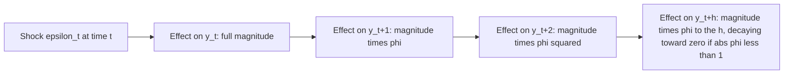

## Autoregressive Models

### Overview

Autoregressive (AR) models represent a time series as a linear function of its own past values plus a stochastic error term. They form one of the two fundamental building blocks of the Box-Jenkins ARMA framework and are widely used both as standalone forecasting models and as components within more complex dynamic specifications, including the dynamic panel data models covered earlier in this course.

### The AR(1) Model

The simplest autoregressive model expresses $y_t$ as a function of its immediately preceding value:

$$y_t = c + \phi y_{t-1} + \varepsilon_t, \qquad \varepsilon_t \sim \text{WN}(0, \sigma^2)$$

where WN denotes white noise (mean zero, constant variance, serially uncorrelated).

**Key Points**

- $c$ is a constant (intercept); the unconditional mean, when it exists, is $\mu = c/(1-\phi)$
- $\phi$ is the autoregressive coefficient, governing the persistence of shocks
- $\varepsilon_t$ is assumed uncorrelated with past values of $y$ and with its own past and future realizations

### Stationarity Condition for AR(1)

**Key Points**

- The AR(1) process is covariance stationary if and only if $|\phi| < 1$
- If $|\phi| < 1$: shocks decay geometrically over time, and the process has a well-defined, time-invariant mean and variance
- If $\phi = 1$: the process becomes a random walk (with drift if $c \neq 0$), which is non-stationary — its variance grows without bound over time
- If $|\phi| > 1$: the process is explosive, with the effect of shocks growing without bound — rarely used to model actual economic data except in specific bubble/instability contexts

### Moments of the Stationary AR(1) Process

For $|\phi| < 1$:

$$E[y_t] = \mu = \frac{c}{1-\phi}$$

$$\text{Var}(y_t) = \gamma(0) = \frac{\sigma^2}{1-\phi^2}$$

$$\rho(h) = \phi^{|h|}$$

**Key Points**

- The autocorrelation function decays **geometrically** at rate $\phi$, consistent with the ACF pattern discussed for general AR processes
- Larger $|\phi|$ (closer to the unit root boundary of 1) implies slower decay and greater persistence — shocks take longer to dissipate

### The General AR(p) Model

The autoregressive model of order $p$ extends the dependence to $p$ lags:

$$y_t = c + \phi_1 y_{t-1} + \phi_2 y_{t-2} + \dots + \phi_p y_{t-p} + \varepsilon_t$$

Using the lag operator $L$ (where $Ly_t = y_{t-1}$), this can be written compactly as:

$$\phi(L) y_t = c + \varepsilon_t, \qquad \phi(L) = 1 - \phi_1 L - \phi_2 L^2 - \dots - \phi_p L^p$$

### Stationarity Condition for AR(p): The Characteristic Equation

**Key Points**

- The AR(p) process is covariance stationary if and only if all roots of the **characteristic equation** $\phi(z) = 1 - \phi_1 z - \phi_2 z^2 - \dots - \phi_p z^p = 0$ lie **outside** the unit circle (i.e., have modulus greater than 1)
- Equivalently, the process is stationary if all **eigenvalues** of the companion-form matrix representation of the AR(p) process lie strictly inside the unit circle
- This generalizes the simple $|\phi| < 1$ condition for AR(1): for higher-order processes, stationarity is a joint condition on all coefficients simultaneously, not simply a condition on each $\phi_j$ individually

### The AR(2) Case: A Worked Illustration

**Example**

For $y_t = \phi_1 y_{t-1} + \phi_2 y_{t-2} + \varepsilon_t$, the stationarity region in $(\phi_1, \phi_2)$ space (a "stationarity triangle") is defined by the joint conditions:

$$\phi_1 + \phi_2 < 1, \qquad \phi_2 - \phi_1 < 1, \qquad |\phi_2| < 1$$

If these conditions are satisfied, the roots of the characteristic equation lie outside the unit circle. If $\phi_1^2 + 4\phi_2 < 0$ within this stationary region, the roots are complex, and the ACF exhibits damped **sinusoidal** (oscillating) decay rather than smooth exponential decay — a signature of cyclical dynamics in the underlying series.

### Estimation of AR Models

**Key Points**

- **Ordinary Least Squares (OLS)**: for a pure AR(p) model with no MA component, OLS applied directly to the regression of $y_t$ on $y_{t-1}, \dots, y_{t-p}$ (and a constant) yields a **consistent** estimator, since under stationarity and weak dependence, the lagged regressors and the current error term are uncorrelated by construction of the model
- OLS estimates of AR coefficients are, however, **biased in finite samples** (though the bias vanishes asymptotically), particularly when $\phi$ is close to the non-stationary boundary — a small-sample phenomenon analogous in spirit, though distinct in mechanism, to the Nickell bias discussed for dynamic panel models
- **Maximum Likelihood Estimation (MLE)**: under an assumed distribution (typically Gaussian) for $\varepsilon_t$, conditional or exact MLE can be used; conditional MLE conditions on the first $p$ observations and is often numerically equivalent to OLS for pure AR models, while exact MLE incorporates the likelihood contribution of the initial observations as well
- [Inference] For pure AR(p) models with Gaussian errors, conditional MLE and OLS typically produce very similar point estimates in moderate-to-large samples, with differences concentrated in how the first $p$ observations are treated; the practical distinction becomes more relevant for models with an MA component, where OLS is not directly applicable

### Forecasting with AR Models

For an AR(1) process, the optimal (minimum mean squared error) $h$-step-ahead forecast, given information through time $t$, is:

$$\hat{y}_{t+h|t} = \mu + \phi^h(y_t - \mu)$$

**Key Points**

- As the forecast horizon $h \to \infty$, the forecast converges to the unconditional mean $\mu$, reflecting the process's mean-reverting nature under stationarity
- The forecast error variance grows with the horizon and converges to the unconditional variance $\sigma^2/(1-\phi^2)$ as $h \to \infty$, since forecasts far into the future carry essentially no information beyond the unconditional distribution
- For AR(p) processes, forecasts are generated recursively, using the recursion $\hat{y}_{t+h|t} = c + \sum_{j=1}^{p} \phi_j \hat{y}_{t+h-j|t}$, substituting actual observed values for any $\hat{y}$ terms that fall within the observed sample

### Diagram: AR(1) Impulse Response

### The Impulse Response Function

**Key Points**

- The impulse response function (IRF) traces the effect of a one-time unit shock $\varepsilon_t$ on current and future values of $y$
- For a stationary AR(1) process, the IRF at horizon $h$ is simply $\phi^h$, decaying geometrically toward zero
- For higher-order AR(p) processes, the IRF can be obtained by rewriting the process in its equivalent infinite moving average (Wold) representation, $y_t = \mu + \sum_{j=0}^{\infty}\psi_j \varepsilon_{t-j}$, where the $\psi_j$ coefficients (derived recursively from the $\phi_j$ parameters) trace out the impulse response at each horizon $j$

### Model Order Selection

**Key Points**

- **PACF-based identification**: as discussed in the ACF/PACF topic, a sharp cutoff in the sample PACF after lag $p$ is the classical Box-Jenkins signal for an AR(p) specification
- **Information criteria**: AIC, BIC, and the corrected AIC (AICc) are commonly used to select among candidate AR orders by balancing model fit against parsimony, particularly useful when the PACF pattern is ambiguous
- **Sequential testing (general-to-specific)**: starting with a maximal lag order and sequentially testing/removing the highest-order insignificant lag is an alternative practical approach, though it can be sensitive to the chosen starting lag order and significance threshold

### Diagnostic Checking

**Example**

After fitting an AR(p) model, standard diagnostic practice includes: (1) examining the ACF/PACF of the **residuals** to confirm no remaining significant autocorrelation, (2) applying a Ljung-Box portmanteau test to the residuals, and (3) checking that the estimated characteristic roots lie safely outside the unit circle (not merely satisfying stationarity in a technical, borderline sense), since roots close to the unit circle indicate a highly persistent, near-non-stationary fitted process that may forecast poorly out of sample.

### Relationship to Unit Root Testing

**Key Points**

- The Dickey-Fuller and Augmented Dickey-Fuller tests, central to the unit root testing framework, are formulated precisely as tests of whether the AR coefficient(s) in an autoregressive representation imply a root on the unit circle ($\phi = 1$ in the AR(1) case) versus strictly outside it (stationarity)
- This makes autoregressive model specification and unit root testing tightly linked: correctly identifying the AR order is often a prerequisite (via the augmentation lags in the ADF test) for a well-specified unit root test

**Next Steps**

- Moving Average (MA) models and their relationship to AR models via invertibility
- Combined ARMA(p,q) model specification and estimation
- Augmented Dickey-Fuller testing and its connection to AR model specification
- Wold representation theorem and infinite moving average forms
- Vector autoregression (VAR) as a multivariate extension of AR models

**Related Topics**

- Stationarity and Weak Dependence
- Autocorrelation and Partial Autocorrelation Functions
- Moving Average Models
- Panel Unit Root Tests
- Model Selection Criteria (AIC, BIC)