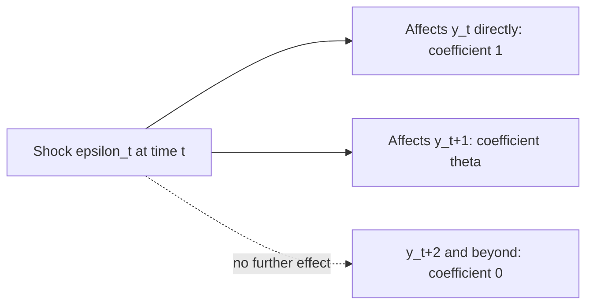

## Moving Average Models

### Overview

Moving average (MA) models represent a time series as a linear combination of current and past white noise error terms, in contrast to autoregressive models, which express the series as a function of its own past values. MA models form the second fundamental building block of the Box-Jenkins ARMA framework and play a central role in the Wold representation theorem, which shows that any stationary process can be represented as an infinite moving average.

### The MA(1) Model

$$y_t = \mu + \varepsilon_t + \theta \varepsilon_{t-1}, \qquad \varepsilon_t \sim \text{WN}(0, \sigma^2)$$

**Key Points**

- $\mu$ is the unconditional mean of the process
- $\theta$ is the moving average coefficient, governing the influence of the previous period's shock on the current observation
- Unlike AR models, MA models have **finite memory** by construction: a shock $\varepsilon_{t-1}$ affects $y_t$ but has no effect on $y_{t+1}$ or beyond, since it does not appear in later equations

### Stationarity of MA Processes: An Automatic Property

**Key Points**

- Finite-order MA processes are **always covariance stationary**, regardless of the values of the MA coefficients — this is a key structural difference from AR processes, which require a parameter restriction (roots outside the unit circle) for stationarity
- This follows directly from the fact that $y_t$ is a fixed, finite linear combination of white noise terms, so its mean and variance are automatically constant over time and its autocovariances automatically depend only on the lag $h$, not on $t$

### Moments of the MA(1) Process

$$E[y_t] = \mu$$

$$\text{Var}(y_t) = \gamma(0) = \sigma^2(1+\theta^2)$$

$$\gamma(1) = \theta\sigma^2, \qquad \gamma(h) = 0 \text{ for } h \geq 2$$

$$\rho(1) = \frac{\theta}{1+\theta^2}, \qquad \rho(h) = 0 \text{ for } h \geq 2$$

**Key Points**

- The **abrupt cutoff** in the ACF after lag 1 is the defining diagnostic signature of an MA(1) process, consistent with the general MA(q) ACF pattern discussed in the ACF/PACF topic
- The PACF of an MA(1) process decays gradually (in a damped fashion) rather than cutting off, mirroring the AR(1) ACF pattern

### The General MA(q) Model

$$y_t = \mu + \varepsilon_t + \theta_1\varepsilon_{t-1} + \theta_2\varepsilon_{t-2} + \dots + \theta_q\varepsilon_{t-q}$$

Using the lag operator, this is written compactly as:

$$y_t = \mu + \theta(L)\varepsilon_t, \qquad \theta(L) = 1 + \theta_1 L + \theta_2 L^2 + \dots + \theta_q L^q$$

**Key Points**

- $\gamma(h) = 0$ for all $h > q$, meaning the ACF cuts off sharply after lag $q$ — the primary tool for identifying the order of an MA process from sample data
- All finite-order MA(q) processes are automatically stationary for any real-valued coefficients $\theta_1, \dots, \theta_q$, and $\sigma^2$

### The Invertibility Condition

While MA processes are automatically stationary, a separate and important condition — **invertibility** — is required to ensure the MA model can be uniquely represented as an equivalent (infinite-order) autoregressive process, which matters for estimation and identification purposes.

**Key Points**

- An MA(q) process is invertible if and only if all roots of $\theta(z) = 1 + \theta_1 z + \dots + \theta_q z^q = 0$ lie **outside** the unit circle
- **Non-uniqueness problem**: for any invertible MA(1) process with parameter $\theta$, there exists a non-invertible "twin" process with parameter $1/\theta$ that produces the **exact same** autocovariance function — meaning the ACF alone cannot distinguish between $\theta$ and $1/\theta$
- By convention, the invertible root ($|\theta| < 1$ for MA(1)) is selected as the "canonical" representation, since it is the one that admits a convergent infinite AR representation and is the version produced by standard maximum likelihood estimation routines

**Example**

Consider $\theta = 0.5$ and $\theta = 2$. Both imply the same $\rho(1) = \theta/(1+\theta^2)$: for $\theta=0.5$, $\rho(1) = 0.5/1.25 = 0.4$; for $\theta = 2$, $\rho(1) = 2/5 = 0.4$ — identical. Standard estimation procedures select $\theta = 0.5$ (the invertible root) as the estimated parameter.

### Why Invertibility Matters for Estimation

**Key Points**

- Invertibility allows the MA(q) process to be rewritten as an infinite-order AR process: $\pi(L)y_t = \varepsilon_t$, where $\pi(L) = \theta(L)^{-1}$ is a convergent infinite lag polynomial
- This representation is what makes **maximum likelihood estimation** of MA models tractable via a recursive computation of the implied error terms (the innovations algorithm or Kalman filter-based approaches), since it allows the unobserved $\varepsilon_t$ terms to be recovered (approximately) from the observed data history
- Without invertibility, this recursive recovery of the shocks does not converge, and standard estimation algorithms will not produce sensible or stable results

### Estimation of MA Models

**Key Points**

- Unlike AR models, MA models **cannot** be estimated by simple OLS, because the regressors (lagged error terms $\varepsilon_{t-1}, \dots, \varepsilon_{t-q}$) are unobserved
- **Conditional/exact Maximum Likelihood**: the standard estimation approach, which iteratively constructs the likelihood by treating the unobserved past errors as zero (conditional MLE, simpler but less accurate for early observations) or by using the full unconditional likelihood via a state-space/Kalman filter representation (exact MLE, generally preferred, especially in smaller samples)
- **Method of moments**: matching sample autocovariances to their theoretical MA(q) counterparts and solving the resulting (generally nonlinear) system of equations; less commonly used in practice than MLE due to potential inefficiency and non-uniqueness issues connected to the invertibility problem
- [Inference] In most modern applied software, MLE via a state-space representation is the default and generally preferred method for MA and mixed ARMA model estimation, given its ability to handle the full likelihood and enforce or check invertibility conditions systematically.

### Diagram: MA(1) Shock Propagation

### The Wold Representation Theorem

**Key Points**

- The Wold decomposition theorem establishes that **any** covariance-stationary process (with no deterministic component) can be represented as an infinite-order moving average of white noise innovations: $y_t = \mu + \sum_{j=0}^{\infty}\psi_j\varepsilon_{t-j}$, with $\psi_0 = 1$ and $\sum \psi_j^2 < \infty$
- This is a foundational theoretical result: it justifies treating the MA representation as a universal building block for stationary time series, and it underlies the derivation of impulse response functions for AR and ARMA processes (which can always be re-expressed in this infinite MA form)
- In practice, a finite-order MA(q) or ARMA(p,q) model is used as a **parsimonious approximation** to this theoretically infinite representation, chosen to capture the empirically relevant dependence structure with a manageable number of parameters

### Comparison: AR vs. MA Structural Properties

| Property | AR(p) | MA(q) |
| --- | --- | --- |
| Stationarity | Requires parameter restriction (roots outside unit circle) | Automatic for any finite-order coefficients |
| Memory | Infinite (via recursive feedback) | Finite (exactly $q$ periods) |
| ACF pattern | Gradual decay | Sharp cutoff after lag $q$ |
| PACF pattern | Sharp cutoff after lag $p$ | Gradual decay |
| Direct OLS estimation | Feasible (regressors observed) | Not feasible (regressors unobserved) |
| Special identification issue | Unit root proximity | Invertibility / non-uniqueness of $\theta$ vs. $1/\theta$ |

### Practical Model Building Considerations

**Example**

A researcher examining a series of monthly inflation surprises observes a sample ACF with a sharp spike at lag 1 that becomes statistically insignificant thereafter, while the PACF decays gradually with alternating signs. This pattern is consistent with an MA(1) specification. After estimating via exact MLE, the researcher confirms the estimated $\hat\theta$ satisfies the invertibility condition ($|\hat\theta| < 1$) and checks the residuals via a Ljung-Box test for remaining serial correlation.

**Key Points**

- MA models are particularly natural for series constructed from **overlapping aggregation** of an underlying process (e.g., multi-period returns constructed from overlapping windows of a shorter-frequency series), since such aggregation mechanically induces a finite-order MA error structure
- MA components are also common in modeling **measurement error** or short-lived shocks that do not persist through the autoregressive feedback mechanism characteristic of AR processes

**Next Steps**

- Combined ARMA(p,q) model specification, estimation, and identification
- The Wold representation theorem in greater depth
- Seasonal MA and SARMA model structures
- State-space and Kalman filter approaches to ARMA estimation
- Vector moving average (VMA) representations in multivariate time series

**Related Topics**

- Autoregressive Models
- Autocorrelation and Partial Autocorrelation Functions
- Stationarity and Weak Dependence
- Model Selection Criteria (AIC, BIC)
- Box-Jenkins Methodology