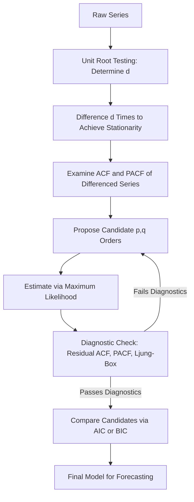

## ARMA and ARIMA Modeling

### Overview

ARMA (Autoregressive Moving Average) and ARIMA (Autoregressive Integrated Moving Average) models combine the autoregressive and moving average components covered previously into unified frameworks for modeling stationary and non-stationary time series, respectively. Together with the Box-Jenkins methodology, they constitute the classical approach to univariate time series model building: identification, estimation, diagnostic checking, and forecasting.

### The ARMA(p,q) Model

Combining an AR(p) and MA(q) component:

$$y_t = c + \phi_1 y_{t-1} + \dots + \phi_p y_{t-p} + \varepsilon_t + \theta_1\varepsilon_{t-1} + \dots + \theta_q\varepsilon_{t-q}$$

Using lag polynomial notation:

$$\phi(L) y_t = c + \theta(L)\varepsilon_t$$

**Key Points**

- Combines the AR component's ability to capture persistent, gradually decaying dependence with the MA component's ability to capture short-lived, finite-memory shocks
- **Parsimony principle**: an ARMA(p,q) model with small $p$ and $q$ can often approximate the dynamics of a pure AR or pure MA process of much higher order, since combining both components allows fewer total parameters to capture a given autocorrelation pattern — this is a key practical motivation for including both components rather than restricting to pure AR or pure MA specifications

### Stationarity and Invertibility Conditions

**Key Points**

- **Stationarity** of the ARMA(p,q) process depends only on the AR component: all roots of $\phi(z) = 0$ must lie outside the unit circle, exactly as in the pure AR(p) case
- **Invertibility** depends only on the MA component: all roots of $\theta(z) = 0$ must lie outside the unit circle, exactly as in the pure MA(q) case
- Both conditions must hold simultaneously for a well-defined, uniquely identified, stationary and invertible ARMA(p,q) representation

### ACF and PACF Behavior for ARMA(p,q)

**Key Points**

- Both the ACF and PACF exhibit **gradual decay** (a mixture of damped exponentials and/or damped sinusoids) rather than a sharp cutoff in either function — this is the key identification challenge distinguishing mixed ARMA processes from pure AR or pure MA processes
- Because neither function provides a clean cutoff signal, model order selection for ARMA processes relies more heavily on information criteria (AIC, BIC) and diagnostic testing than on visual ACF/PACF inspection alone, in contrast to pure AR or pure MA identification

### The Need for Differencing: Non-Stationary Series

ARMA models require the series to be (or be transformable into) a stationary process. Many economic and financial time series exhibit non-stationarity, commonly in the form of a stochastic trend (unit root).

**Key Points**

- If $y_t$ contains a unit root, applying ARMA directly to $y_t$ in levels violates the stationarity requirement, and standard inference/estimation results do not apply
- **Differencing** — replacing $y_t$ with $\Delta y_t = y_t - y_{t-1}$ — is the standard transformation used to induce stationarity in a difference-stationary (unit-root) series
- Some series may require **second-order differencing** ($\Delta^2 y_t$) if the first difference is still non-stationary, though this is less common in practice and warrants careful checking, since over-differencing can introduce spurious MA structure into an otherwise well-behaved series

### The ARIMA(p,d,q) Model

The Integrated (I) component formalizes the differencing step within a unified notation:

$$\phi(L)(1-L)^d y_t = c + \theta(L)\varepsilon_t$$

where $d$ is the **order of integration** — the number of times the series must be differenced to achieve stationarity.

**Key Points**

- $d = 0$: the series is already stationary, and ARIMA(p,0,q) is simply the ARMA(p,q) model applied to $y_t$ directly
- $d = 1$: the series is difference-stationary; ARIMA(p,1,q) applies an ARMA(p,q) model to $\Delta y_t$
- $d = 2$: rarely needed in practice for economic time series; typically indicates either a genuinely higher-order integrated process or a specification/differencing error that should be investigated further
- The order of integration $d$ is determined empirically via unit root testing (ADF, PP, KPSS), not chosen arbitrarily — this connects ARIMA modeling directly to the unit root testing framework

### The Box-Jenkins Methodology

**Example**

The classical Box-Jenkins approach to ARIMA model building proceeds through four iterative stages:

1. **Identification**: determine $d$ via unit root tests and visual inspection (trend, changing variance); after differencing to achieve apparent stationarity, examine the ACF/PACF of the differenced series to propose candidate $(p,q)$ orders
2. **Estimation**: fit candidate ARMA$(p,q)$ models to the (differenced) series via conditional or exact maximum likelihood
3. **Diagnostic checking**: examine residuals from the fitted model — residual ACF/PACF should show no significant remaining structure, and a Ljung-Box portmanteau test should fail to reject the null of no residual autocorrelation
4. **Forecasting**: once a satisfactory model passes diagnostic checks, use it to generate out-of-sample forecasts, typically supplemented with information criteria (AIC/BIC) comparisons across a shortlist of candidate specifications before final model selection

### Diagram: The Box-Jenkins Iterative Cycle

### Model Selection: Information Criteria

$$\text{AIC} = -2\ln(\hat{L}) + 2k, \qquad \text{BIC} = -2\ln(\hat{L}) + k\ln(n)$$

where $\hat L$ is the maximized likelihood and $k = p+q+1$ (or similar, depending on whether a constant/trend is included) is the number of estimated parameters.

**Key Points**

- **BIC** imposes a heavier penalty for additional parameters (via the $\ln(n)$ term) than AIC, and is generally consistent — asymptotically selecting the true model order if the true model is within the candidate set — whereas AIC is not consistent in this sense and tends to favor slightly larger models in large samples
- [Inference] In applied ARIMA model selection, it is common to report and compare both criteria across a shortlist of candidate orders, since they can occasionally disagree, and no single criterion is universally regarded as superior across all applications; the final choice often also weighs diagnostic test results and out-of-sample forecast performance
- Automated model selection algorithms (e.g., the Hyndman-Khandakar algorithm underlying widely used `auto.arima`-type routines) combine unit root testing for $d$, stepwise or full search over $(p,q)$ combinations using AIC/BIC (typically corrected AICc for small samples), and residual diagnostic checks into a single automated pipeline

### Forecasting with ARIMA Models

**Key Points**

- Forecasts from an ARIMA(p,d,q) model are generated by first forecasting the differenced series using the underlying ARMA(p,q) recursion, then **integrating** (cumulatively summing) the forecasted differences back to recover a forecast in levels
- For $d \geq 1$, point forecasts converge to a **deterministic trend or a constant level** as the horizon grows, depending on whether a drift term is included, while the forecast **variance grows without bound** as the horizon increases — a direct consequence of the non-stationarity in levels, in contrast to the bounded forecast variance of a purely stationary ARMA process
- Forecast intervals should widen accordingly with horizon for integrated series, and reporting only point forecasts without appropriately widening intervals is a common practical pitfall

### Seasonal ARIMA: SARIMA

**Key Points**

- Many economic series (e.g., monthly retail sales, quarterly GDP) exhibit seasonal patterns requiring a **seasonal ARIMA** extension, denoted ARIMA$(p,d,q)(P,D,Q)_s$, which adds seasonal AR, seasonal differencing, and seasonal MA components operating at the seasonal lag $s$ (e.g., $s=12$ for monthly, $s=4$ for quarterly data)
- Seasonal differencing ($D \geq 1$) removes deterministic or stochastic seasonal patterns analogous to how ordinary differencing removes a stochastic trend, and is typically identified via seasonal spikes in the ACF at multiples of the seasonal period $s$

### Overfitting and Parsimony Concerns

**Key Points**

- Including too many AR or MA terms can lead to **overfitting**: excellent in-sample fit but poor out-of-sample forecasting performance, and can also introduce near-cancelling AR and MA roots (a "common factor" problem) that signal the model is unnecessarily complex
- Checking for roots of $\phi(z)$ and $\theta(z)$ that are close to each other (indicating potential cancellation and over-parameterization) is a useful diagnostic when a fitted ARMA model includes both high AR and MA orders
- [Unverified] The specific numerical threshold for judging roots "too close" for practical common-factor concern is not a fixed universal rule and is typically assessed via sensitivity analysis (re-estimating with a lower-order specification and comparing fit) rather than a formal test in most applied treatments

### Practical Implementation Notes

**Example**

In R: `arima()` or the `forecast` package's `Arima()` and `auto.arima()` functions. In Python: `statsmodels.tsa.arima.model.ARIMA` and the `pmdarima` package's `auto_arima()` function. In Stata: `arima` command supports ARMA and ARIMA specifications with maximum likelihood estimation. [Unverified] Default estimation methods (conditional sum of squares vs. exact MLE via state-space/Kalman filter) and convergence settings vary by software and version; current documentation should be consulted, particularly when comparing estimates across packages.

**Next Steps**

- Seasonal ARIMA (SARIMA) model specification and estimation
- Automated model selection algorithms (Hyndman-Khandakar approach)
- Forecast evaluation methods (out-of-sample RMSE, Diebold-Mariano test)
- Structural break testing and its implications for ARIMA specification stability
- Vector ARMA (VARMA) as a multivariate extension

**Related Topics**

- Autoregressive Models
- Moving Average Models
- Autocorrelation and Partial Autocorrelation Functions
- Panel Unit Root Tests
- Model Selection Criteria (AIC, BIC)