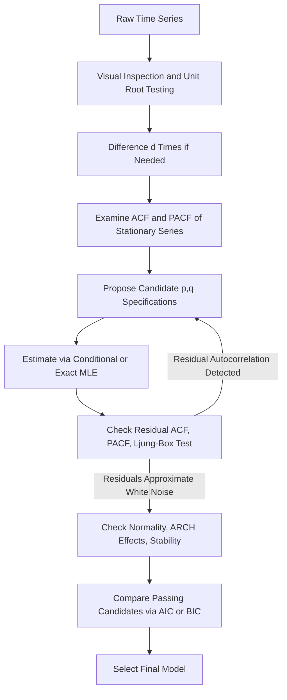

## Model Identification, Estimation, and Diagnostics

### Overview

Model identification, estimation, and diagnostics constitute the three interlocking practical stages of the Box-Jenkins methodology for building a univariate ARMA/ARIMA model. While previous topics addressed the theoretical properties of AR, MA, and ARMA processes individually, this topic synthesizes the applied workflow: how to move from raw data to a validated, forecast-ready model.

### Stage 1: Identification

Identification is the process of determining the appropriate order of integration $d$ and the candidate autoregressive and moving average orders $(p,q)$ before estimation begins.

**Assessing Stationarity and Determining $d$**

**Key Points**

- Begin with visual inspection of the time series plot: look for evident trends, changing variance (suggesting a variance-stabilizing transformation such as a log transform may be needed before differencing), or structural breaks
- Apply formal unit root tests (ADF, Phillips-Perron, KPSS) to determine whether differencing is required, and if so, how many times
- **KPSS as a complementary test**: since KPSS reverses the null and alternative relative to ADF (testing stationarity as the null, rather than a unit root as the null), using both in combination provides a more complete picture — cases where ADF fails to reject a unit root **and** KPSS rejects stationarity provide more confident evidence of non-stationarity than either test alone
- After differencing, re-examine the differenced series (plot and unit root test) to confirm apparent stationarity before proceeding; over-differencing (differencing a series that was already stationary) can introduce artificial and unnecessary MA structure

**Selecting Candidate $(p,q)$ via ACF/PACF**

**Key Points**

- Once a (apparently) stationary series is obtained, examine its sample ACF and PACF
- A sharp PACF cutoff after lag $p$ with gradually decaying ACF suggests a candidate AR(p)
- A sharp ACF cutoff after lag $q$ with gradually decaying PACF suggests a candidate MA(q)
- Gradual decay in **both** functions suggests a mixed ARMA(p,q) process, in which case ACF/PACF inspection narrows the search but does not pinpoint exact orders, and several candidate specifications should be carried forward to the estimation and comparison stage

### Stage 2: Estimation

Once candidate model orders are identified, parameters are estimated, typically via maximum likelihood.

**Key Points**

- **Conditional Sum of Squares / Conditional MLE**: treats the first $p$ (or $\max(p,q)$) observations, and any unobserved pre-sample error terms, as fixed or zero, and estimates parameters by minimizing the conditional sum of squared one-step-ahead prediction errors — computationally simple, and numerically close to full MLE in large samples, but can be less accurate in small samples
- **Exact Maximum Likelihood**: incorporates the full unconditional likelihood of the observed sample, typically implemented via a state-space representation and the Kalman filter, which handles the unobserved initial conditions and error terms more rigorously — generally preferred, particularly for shorter series or when MA components are present
- **Numerical optimization considerations**: ARMA likelihood surfaces can be non-globally-concave, especially near the boundary of the invertibility or stationarity region; multiple starting values and checking for convergence to a genuine local maximum (rather than a boundary or saddle point) are standard practical precautions
- [Inference] Estimated parameter standard errors from ARMA MLE are asymptotically valid under correct specification and standard regularity conditions, but can be unreliable in very short samples or when the fitted model is close to the non-stationarity or non-invertibility boundary, where the asymptotic normal approximation may perform poorly

### Stage 3: Diagnostic Checking

After estimation, the fitted model's adequacy must be checked before it is used for forecasting or inference.

**Residual Autocorrelation Checks**

**Key Points**

- Examine the ACF and PACF of the model **residuals** (one-step-ahead prediction errors): a well-specified model should leave residuals that resemble white noise, with no statistically significant remaining autocorrelation at any lag
- Apply the **Ljung-Box portmanteau test** to the residuals at several lag lengths, using degrees of freedom adjusted for the number of estimated parameters ($m - k$, where $k = p+q$); failure to reject the null of no residual autocorrelation supports model adequacy
- Significant residual autocorrelation at a specific lag suggests the candidate $(p,q)$ specification should be revised (e.g., by adding an AR or MA term at that lag) and the identification-estimation-diagnostics cycle repeated

**Normality and Other Residual Checks**

**Key Points**

- The **Jarque-Bera test** is commonly used to assess whether residuals are approximately normally distributed, which matters primarily for the validity of certain finite-sample inference procedures and prediction interval construction (point estimation and consistency of MLE do not generally require normality, only correct specification of the conditional mean)
- Checking for **remaining heteroskedasticity** in the squared residuals (e.g., via an ARCH-LM test) is also standard practice, since ARMA models address the conditional mean dynamics but not necessarily time-varying volatility — significant ARCH effects motivate volatility modeling (covered separately) rather than respecification of the ARMA mean equation
- Examining residuals for outliers or evidence of structural breaks (e.g., via recursive residual plots or CUSUM-type statistics) helps assess whether the fitted model is stable across the full sample period

### Diagram: The Full Identification-Estimation-Diagnostics Cycle

### Comparing Multiple Candidate Models

**Key Points**

- It is standard practice to carry **several** candidate $(p,q)$ specifications through estimation and diagnostic checking in parallel, rather than committing to a single specification after the initial identification step
- Among candidates that **pass** diagnostic checks (i.e., exhibit white-noise residuals), final selection is typically based on information criteria (AIC, BIC, or AICc for small samples), with **out-of-sample forecast performance** (e.g., pseudo-out-of-sample RMSE or MAE over a holdout period) serving as an important additional or final arbiter, particularly when the analytical purpose of the model is forecasting rather than structural inference
- A model that fits well in-sample (favorable AIC/BIC, passes all diagnostics) is not guaranteed to forecast well out-of-sample; overfitting to sample-specific noise remains a risk even after passing standard in-sample diagnostic checks

### The Principle of Parsimony

**Key Points**

- Among competing models that adequately capture the residual dependence structure, the model with the fewest parameters (most parsimonious) is generally preferred, both for interpretability and for reducing estimation uncertainty that can degrade out-of-sample forecast accuracy
- This principle is embedded directly in the penalty terms of AIC and (more heavily) BIC, but is also applied qualitatively: an analyst who finds two specifications with very similar diagnostic performance and information criteria values would typically favor the simpler one absent a specific substantive reason to prefer the more complex specification

### Practical Example: Full Worked Cycle

**Example**

A researcher examines monthly unemployment claims. Visual inspection reveals a slow-moving upward trend; the ADF test fails to reject a unit root in levels, while KPSS rejects stationarity in levels — jointly supporting $d=1$. After first-differencing, both tests support stationarity of $\Delta y_t$. The ACF of $\Delta y_t$ shows a significant spike at lag 1 with rapid decay thereafter, while the PACF shows spikes at lags 1 and 2 before cutting off, suggesting ARMA(2,1) as a leading candidate, alongside AR(2) and MA(1) as simpler alternatives. All three are estimated via exact MLE; the AR(2) specification fails the Ljung-Box test at lag 6 (indicating remaining autocorrelation), while ARMA(2,1) and MA(1) both pass. Between the latter two, ARMA(2,1) has a marginally better AIC, but MA(1) has a better BIC and involves fewer parameters; a holdout-sample forecast comparison is used to make the final choice.

### Common Pitfalls in Practice

**Key Points**

- **Over-reliance on a single information criterion** without cross-checking against residual diagnostics or out-of-sample performance can lead to selecting a model that fits well by a narrow statistical measure but performs poorly for the analyst's actual purpose
- **Treating identification as a one-shot process**: the Box-Jenkins cycle is explicitly iterative — a failed diagnostic check should prompt a return to the identification stage, not merely a re-estimation with different starting values
- **Ignoring structural breaks or regime changes**: a model that fits well on average across the full sample may mask a fundamental shift in the underlying dynamics partway through the sample, and diagnostic checks focused only on residual autocorrelation may not detect this without explicit stability testing
- [Unverified] The relative practical importance of these pitfalls varies by application domain and data frequency; applied best practices in specific fields (e.g., macroeconomic forecasting vs. financial return modeling) may emphasize different diagnostic priorities, and current field-specific literature should be consulted for domain-specific guidance.

**Next Steps**

- Structural break testing methods (Chow test, CUSUM, Bai-Perron multiple break tests)
- Volatility modeling (ARCH/GARCH) following ARCH-LM diagnostic findings
- Out-of-sample forecast evaluation methods (Diebold-Mariano test, rolling-window validation)
- Automated model selection algorithms and their relationship to manual Box-Jenkins practice
- Seasonal ARIMA identification and diagnostic considerations

**Related Topics**

- ARMA and ARIMA Modeling
- Autocorrelation and Partial Autocorrelation Functions
- Stationarity and Weak Dependence
- Model Selection Criteria (AIC, BIC)
- Panel Unit Root Tests