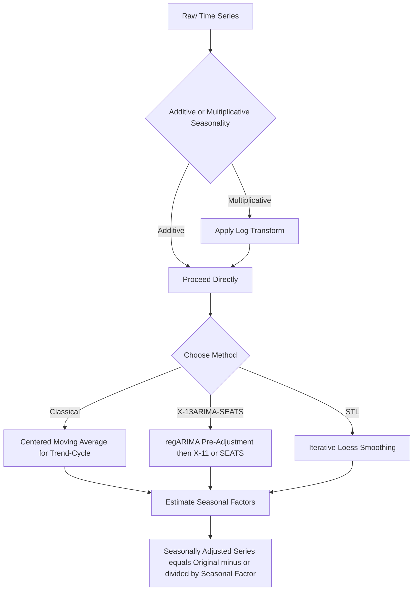

## Seasonal Adjustment and Decomposition

### Overview

Seasonal adjustment and decomposition refer to the set of techniques used to separate a time series into its underlying components — trend, seasonal, cyclical, and irregular (noise) — in order to isolate and remove systematic within-year (or within-period) patterns that recur predictably. This is a fundamental preprocessing step for many economic time series (e.g., retail sales, employment, industrial production) where seasonal patterns can obscure the underlying trend-cycle signal of primary analytical interest.

### The Classical Decomposition Framework

A time series $y_t$ is conceptually decomposed into four components:

$$y_t = T_t + C_t + S_t + I_t \quad \text{(additive)} \qquad \text{or} \qquad y_t = T_t \times C_t \times S_t \times I_t \quad \text{(multiplicative)}$$

where:

- $T_t$ is the **trend** component (long-run underlying direction)
- $C_t$ is the **cyclical** component (medium-term fluctuations not tied to a fixed calendar period, e.g., business cycles)
- $S_t$ is the **seasonal** component (systematic, calendar-period-related fluctuations, e.g., holiday retail spikes)
- $I_t$ is the **irregular** (or residual) component — unexplained, non-systematic variation

**Key Points**

- In practice, $T_t$ and $C_t$ are often combined into a single "trend-cycle" component, since separating genuine business-cycle fluctuations from the long-run trend is difficult without imposing additional structure or a much longer time span of data
- The **additive** model is appropriate when the magnitude of seasonal fluctuations is roughly constant over time (does not scale with the level of the series); the **multiplicative** model is appropriate when seasonal fluctuations scale proportionally with the level (common in series with substantial trend growth, such as nominal sales figures)
- A multiplicative decomposition can be converted to an additive one by applying a log transformation first: $\ln(y_t) = \ln(T_t) + \ln(C_t) + \ln(S_t) + \ln(I_t)$

### Classical (Moving-Average-Based) Decomposition

**Key Points**

- The trend-cycle component is typically estimated first via a centered **moving average** with a window matching the seasonal period (e.g., a 12-month centered moving average for monthly data, or a $2\times12$-MA for even seasonal periods to ensure proper centering)
- The detrended series ($y_t - \hat{T}_t$ additive, or $y_t / \hat{T}_t$ multiplicative) is then averaged across corresponding periods (e.g., averaging all January values, all February values, etc.) to estimate the seasonal component, which is typically normalized so seasonal factors sum to zero (additive) or average to one (multiplicative) across a full cycle
- The remaining irregular component is obtained as the residual after removing both the estimated trend-cycle and seasonal components

**Key Points on Limitations**

- Classical decomposition loses trend-cycle estimates at the beginning and end of the sample due to the centered moving average's requirement for data on both sides of each point — a significant practical limitation for real-time or near-real-time seasonal adjustment
- It assumes a **fixed, non-evolving** seasonal pattern across the entire sample, which can be unrealistic for series where the strength or timing of seasonality drifts over time (e.g., due to changing consumer behavior or calendar effects)

### X-13ARIMA-SEATS and Related Official Statistical Agency Methods

**Key Points**

- **X-13ARIMA-SEATS** (developed by the U.S. Census Bureau, building on the earlier X-11 and X-12-ARIMA methods) is the standard method used by many official statistical agencies for seasonal adjustment of published economic data
- It combines a **regARIMA** pre-adjustment step (using an ARIMA model to handle outliers, trading-day effects, moving holidays such as Easter, and other calendar-related irregularities, and to extend the series with forecasts/backcasts) with iterative moving-average-based decomposition (X-11 methodology) or a **SEATS** model-based signal extraction approach (based on ARIMA model decomposition, developed by the Bank of Spain)
- This addresses the end-of-sample problem in classical decomposition by using ARIMA-based forecasts and backcasts to extend the series before applying the moving-average filters, allowing seasonally adjusted estimates to be computed even for the most recent observations
- [Unverified] The exact default settings, outlier detection thresholds, and calendar effect specifications in X-13ARIMA-SEATS are numerous and can materially affect results; official agency documentation and the Census Bureau's reference manual should be consulted for authoritative default behavior and recommended practice.

### STL Decomposition (Seasonal-Trend decomposition using Loess)

**Key Points**

- **STL** (Cleveland et al., 1990) is a flexible, robust decomposition method based on iterative application of **locally weighted regression (loess)** smoothing to extract trend and seasonal components
- Key advantages over classical decomposition: STL allows the seasonal component to **change over time** (rather than assuming a fixed seasonal pattern), can handle any type of seasonality (not just monthly/quarterly), and is robust to outliers via an optional robustness iteration that downweights extreme observations
- STL requires the user to specify the smoothing window (span) for both the trend and seasonal loess fits — larger spans produce smoother, less time-varying estimates of each component, while smaller spans allow more rapid change, introducing a bias-variance tradeoff analogous to bandwidth selection in nonparametric smoothing more generally
- Unlike X-13ARIMA-SEATS, standard STL does not natively incorporate trading-day or moving-holiday calendar effect adjustments, and does not handle multiplicative decomposition directly (though this can be addressed via a log transformation prior to applying STL)

### Comparison of Major Decomposition/Adjustment Approaches

| Method | Handles Evolving Seasonality | Calendar Effects (holidays, trading days) | End-of-Sample Handling | Robustness to Outliers |
| --- | --- | --- | --- | --- |
| Classical (moving average) | No (fixed seasonal pattern) | No | Poor (data loss at ends) | Limited |
| X-13ARIMA-SEATS | Yes (gradual evolution allowed) | Yes (explicit regARIMA modeling) | Good (via ARIMA extension) | Yes (explicit outlier detection) |
| STL | Yes (fully flexible) | No (not native) | Good (loess-based, no centering loss) | Yes (optional robust iteration) |

### Diagram: Decomposition Workflow

### Seasonally Adjusted Series and Its Uses

**Key Points**

- The **seasonally adjusted series** is obtained by removing the estimated seasonal component: $y_t - \hat{S}_t$ (additive) or $y_t / \hat{S}_t$ (multiplicative), leaving the trend-cycle and irregular components
- Seasonally adjusted data is the standard form in which many official economic statistics (e.g., seasonally adjusted employment figures, seasonally adjusted GDP growth) are published and analyzed, since period-over-period comparisons (e.g., this month vs. last month) are only meaningful for the underlying trend-cycle signal once seasonal effects are removed
- Analysts should be aware that seasonally adjusted figures are typically **revised** in subsequent releases as more data become available (since trend-cycle and seasonal factor estimates near the end of the sample depend partly on ARIMA-based extrapolation or edge-effect smoothing), a phenomenon sometimes called "revision" or "end-point" instability

### Calendar Effects: Trading Days and Moving Holidays

**Key Points**

- **Trading-day effects**: variation caused by the differing number of business days (e.g., Mondays vs. Sundays) falling within a given calendar month, which can materially affect monthly totals for series sensitive to the number of working days (e.g., retail sales, industrial production)
- **Moving holiday effects**: holidays such as Easter that fall on different calendar dates (and sometimes different months) from year to year, requiring explicit modeling (as in X-13ARIMA-SEATS's regARIMA component) rather than being captured by a fixed monthly seasonal factor
- Failing to account for these effects can leave systematic, predictable variation in the "seasonally adjusted" series, undermining the goal of isolating the genuine trend-cycle signal

### Testing for the Presence and Stability of Seasonality

**Key Points**

- Formal tests (e.g., stable seasonality F-tests, as implemented within X-13ARIMA-SEATS diagnostics) assess whether a statistically significant seasonal pattern is present at all, and whether that pattern is stable over the sample period or evolving
- Spectral analysis (examining the periodogram of the series for pronounced peaks at seasonal frequencies) provides a complementary, more data-driven diagnostic approach to detecting seasonality without assuming a specific decomposition model in advance
- [Inference] In applied practice, visual inspection of the raw series (checking for a clear repeating annual pattern) combined with a formal stable seasonality test is generally regarded as sufficient practical due diligence before proceeding with seasonal adjustment, though more rigorous spectral or model-based diagnostics are used in cases of ambiguous or evolving seasonal strength.

### Practical Implementation Notes

**Example**

In R: the `stats` package's base `decompose()` function implements classical decomposition; the `stl()` function implements STL; the `seasonal` package provides an interface to X-13ARIMA-SEATS. In Python: `statsmodels.tsa.seasonal.seasonal_decompose` for classical decomposition, `statsmodels.tsa.seasonal.STL` for STL, and the `statsmodels.tsa.x13` module (requiring a separately installed X-13ARIMA-SEATS binary) for the Census Bureau method. [Unverified] Exact function arguments, default smoothing parameters, and binary dependency requirements vary by package version and operating system; current package documentation should be consulted before implementation.

**Next Steps**

- Spectral analysis and periodogram-based detection of seasonality
- Calendar effect modeling (trading-day and moving-holiday regressors) within regARIMA
- Seasonal unit root testing (HEGY test) for stochastic seasonality
- Seasonal ARIMA (SARIMA) as an alternative, model-based approach to seasonal dynamics
- Revision analysis for seasonally adjusted official statistics

**Related Topics**

- ARMA and ARIMA Modeling
- Model Identification, Estimation, and Diagnostics
- Stationarity and Weak Dependence
- Structural Break Testing
- Exponential Smoothing Methods