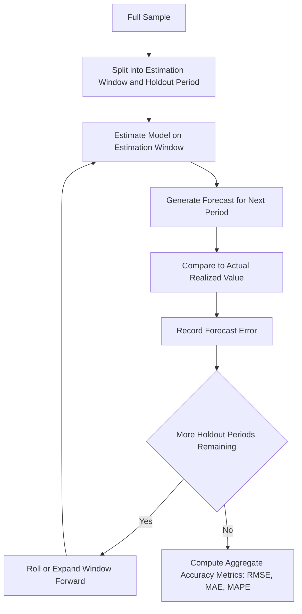

## Forecasting with Univariate Models

### Overview

Forecasting with univariate models involves generating point forecasts, forecast intervals, and evaluating forecast accuracy using a time series' own past values, without reference to other variables. This topic synthesizes the forecasting mechanics of the AR, MA, and ARIMA models covered previously into a unified framework, along with the evaluation and comparison methods needed to assess forecast quality.

### The Minimum Mean Squared Error Forecast

For a covariance-stationary process, the theoretically optimal $h$-step-ahead forecast under squared-error loss is the conditional expectation:

$$\hat{y}_{t+h|t} = E[y_{t+h} \mid \Omega_t]$$

where $\Omega_t$ denotes the information set available at time $t$ (typically the observed history of the series).

**Key Points**

- This conditional expectation minimizes expected squared forecast error among all functions of $\Omega_t$, which is why it is the standard target for point forecasting under the common squared-error loss criterion
- Under alternative loss functions (e.g., absolute error loss), the optimal forecast is instead the conditional median, and forecasts optimized for one loss function are not generally optimal under another — a distinction that matters when the analyst's actual forecasting objective is asymmetric or non-quadratic

### Recursive Forecasting for AR Processes

For an AR(p) process, forecasts are generated recursively by substituting forecasted values for future observations that fall beyond the sample:

$$\hat{y}_{t+1|t} = c + \phi_1 y_t + \phi_2 y_{t-1} + \dots + \phi_p y_{t-p+1}$$

$$\hat{y}_{t+2|t} = c + \phi_1 \hat{y}_{t+1|t} + \phi_2 y_t + \dots + \phi_p y_{t-p+2}$$

and so on, with actual observed data used wherever available and forecasted values substituted otherwise.

**Key Points**

- This **chain rule of forecasting** (also called iterated multi-step forecasting) is the standard approach for AR-type models and generalizes directly to ARMA models by additionally setting future (unobserved) error terms to their expected value of zero
- An alternative approach, **direct multi-step forecasting**, estimates a separate model for each specific horizon $h$ (regressing $y_{t+h}$ directly on $y_t, y_{t-1}, \dots$) rather than iterating a single one-step-ahead model forward — this can be more robust to model misspecification at longer horizons but sacrifices the efficiency of using a single, fully specified dynamic model

### Forecast Error Variance and Prediction Intervals

For a stationary AR(1) process, the $h$-step-ahead forecast error variance is:

$$\text{Var}(y_{t+h} - \hat{y}_{t+h|t}) = \sigma^2 \sum_{j=0}^{h-1} \phi^{2j} = \sigma^2 \frac{1-\phi^{2h}}{1-\phi^2}$$

**Key Points**

- As $h \to \infty$, this converges to $\sigma^2/(1-\phi^2)$, the unconditional variance of the process — reflecting that forecasts far into the future carry no more information than the unconditional distribution
- For a general stationary process expressed in its Wold (infinite MA) representation $y_t = \mu + \sum_j \psi_j \varepsilon_{t-j}$, the $h$-step-ahead forecast error variance is $\sigma^2 \sum_{j=0}^{h-1}\psi_j^2$, which provides a general formula applicable across AR, MA, and ARMA specifications via their respective $\psi_j$ (impulse response) coefficients
- Assuming normally distributed errors, a $(1-\alpha)$ prediction interval is constructed as $\hat{y}_{t+h|t} \pm z_{\alpha/2}\sqrt{\text{Var}(y_{t+h}-\hat{y}_{t+h|t})}$; these intervals **widen** with the forecast horizon $h$ for stationary processes (up to the bound implied by the unconditional variance) and widen **without bound** for integrated (ARIMA, $d \geq 1$) processes

### Forecasting Non-Stationary (Integrated) Series

**Key Points**

- For an ARIMA(p,d,q) model, forecasts are generated by first forecasting the (stationary) differenced series using the underlying ARMA(p,q) recursion, then **integrating** (cumulatively summing) the differenced forecasts to recover forecasts in levels
- Point forecasts for a random-walk-type series (e.g., ARIMA(0,1,0)) converge to a flat line at the last observed value (or a line with constant drift, if a drift term is included) — the point forecast does **not** revert to any long-run mean, unlike the mean-reverting behavior of stationary AR/ARMA forecasts
- The forecast error variance for an integrated process grows **linearly or faster** with the horizon rather than converging to a fixed asymptote, directly reflecting the unbounded variance of the non-stationary process itself

### Uncertainty Beyond Parameter-Known Forecast Variance

**Key Points**

- The forecast error variance formulas above treat the model parameters as known; in practice, **parameter estimation uncertainty** contributes an additional source of forecast error, generally most consequential at short-to-medium horizons and in smaller samples
- **Model uncertainty** — the possibility that the chosen $(p,d,q)$ specification itself is incorrect — is a further source of forecast risk not captured by the standard prediction interval formulas, which condition on the fitted model being the true data-generating process
- [Inference] In applied forecasting practice, these additional layers of uncertainty are sometimes addressed via bootstrap-based prediction intervals (which can incorporate parameter estimation uncertainty more directly than the analytical normal-theory formulas) or via forecast combination across multiple candidate models, though neither approach is universally adopted, and the choice often depends on the forecasting context and computational resources available

### Forecast Accuracy Evaluation Metrics

**Key Points**

- **Mean Squared Error (MSE)** and **Root Mean Squared Error (RMSE)**: $\text{RMSE} = \sqrt{\frac{1}{n}\sum(y_t - \hat{y}_t)^2}$ — penalizes large errors disproportionately (quadratic loss), in the same units as the original series (for RMSE)
- **Mean Absolute Error (MAE)**: $\text{MAE} = \frac{1}{n}\sum|y_t - \hat{y}_t|$ — more robust to outliers than RMSE, treats all errors proportionally to their magnitude
- **Mean Absolute Percentage Error (MAPE)**: $\text{MAPE} = \frac{100}{n}\sum\left|\frac{y_t-\hat{y}_t}{y_t}\right|$ — scale-independent, allowing comparison across series of different magnitudes, but undefined or unstable when $y_t$ is near zero, and asymmetric in its penalization of over- vs. under-forecasts
- **Choice of metric** should reflect the forecasting objective: RMSE is the natural companion to squared-error-loss-optimal forecasts, while MAE aligns with median (absolute-error-loss) forecasts; MAPE's scale independence is useful for cross-series comparison but its known asymmetry and instability near zero should be considered before adoption

### Out-of-Sample Evaluation: Rolling and Expanding Window Schemes

**Example**

Standard practice for honestly evaluating forecast performance uses a **holdout sample** never used in model estimation:

1. **Fixed-origin evaluation**: estimate the model once using data through some cutoff $T_0$, then generate and evaluate forecasts for all horizons beyond $T_0$ against the actual realized values
2. **Rolling window scheme**: re-estimate the model repeatedly using a fixed-length window that moves forward through the sample, generating one-step (or $h$-step) forecasts at each step and comparing against realized outcomes — better reflects real-time forecasting conditions and captures potential parameter instability over time
3. **Expanding window scheme**: similar to rolling, but the estimation window grows to include all data up to each forecast origin rather than maintaining a fixed length — uses more information at each step but can be slower to adapt if the underlying process has changed

**Key Points**

- Evaluating forecast accuracy only via in-sample fit statistics (e.g., in-sample RMSE, or fit-based information criteria like AIC/BIC) can be misleading, since a model can fit historical data well while forecasting poorly out-of-sample due to overfitting
- The choice between rolling and expanding windows involves a bias-variance-type tradeoff: rolling windows adapt faster to structural change at the cost of using less data per estimation; expanding windows use more data but adapt more slowly

### Diagram: Out-of-Sample Forecast Evaluation Scheme

### Comparing Forecasts Across Competing Models: The Diebold-Mariano Test

**Key Points**

- The **Diebold-Mariano (1995) test** formally tests whether the difference in forecast accuracy (measured via a chosen loss function, e.g., squared or absolute error) between two competing models is statistically significant, rather than relying on informal comparison of point estimates like RMSE alone
- The null hypothesis is equal predictive accuracy between the two models; the test accounts for the fact that forecast errors from overlapping multi-step forecasts are typically serially correlated, requiring an appropriate long-run variance (HAC-type) estimator in the test statistic
- [Unverified] Several modified versions of the Diebold-Mariano test (e.g., the Harvey-Leybourne-Newbold small-sample correction) exist to address size distortions in small samples; the choice among variants should be guided by current literature and the specific sample size and forecast horizon under consideration

### The Naive/Random Walk Benchmark

**Key Points**

- A simple but important practical benchmark in forecast evaluation is the **naive (random walk) forecast**: $\hat{y}_{t+h|t} = y_t$ (or with drift, extrapolating the average recent change)
- Any proposed ARIMA or other univariate model should ideally outperform this naive benchmark to be considered practically useful; failing to beat a naive random walk forecast is a common and sobering finding in some financial and highly persistent economic series, and is a standard sanity check before adopting a more complex model in practice

### Combining Forecasts

**Key Points**

- **Forecast combination** (averaging point forecasts from multiple models, e.g., a simple average or an inverse-MSE-weighted average) has been repeatedly found in the forecasting literature to often outperform any single constituent model, particularly when the individual models' errors are not highly correlated
- [Inference] This "forecast combination puzzle" — the empirical tendency for simple equal-weighted averages to perform comparably to or better than more sophisticated, optimally-weighted combination schemes — is a well-documented finding in the forecasting literature, though the precise conditions under which it holds most strongly remain an active area of research and are not fully settled

### Practical Implementation Notes

**Example**

In R: the `forecast` package provides `forecast()` methods for ARIMA objects with built-in prediction intervals, alongside `accuracy()` for computing RMSE/MAE/MAPE against a holdout set, and `dm.test()` for the Diebold-Mariano test. In Python: `statsmodels` ARIMA results objects support `.get_forecast()` with confidence intervals, and manual implementation of rolling-window evaluation and Diebold-Mariano testing is common via `sklearn.metrics` combined with custom HAC variance estimation. [Unverified] Specific default confidence levels, bootstrap options, and DM test variants available vary by package version; current documentation should be consulted.

**Next Steps**

- Diebold-Mariano test implementation and small-sample corrections
- Forecast combination methods and weighting schemes
- Bootstrap-based prediction intervals for parameter uncertainty
- State-space and Kalman filter approaches for forecasting with time-varying parameters
- Multivariate forecasting extensions (VAR forecasting)

**Related Topics**

- ARMA and ARIMA Modeling
- Model Identification, Estimation, and Diagnostics
- Autoregressive Models
- Moving Average Models
- Seasonal Adjustment and Decomposition