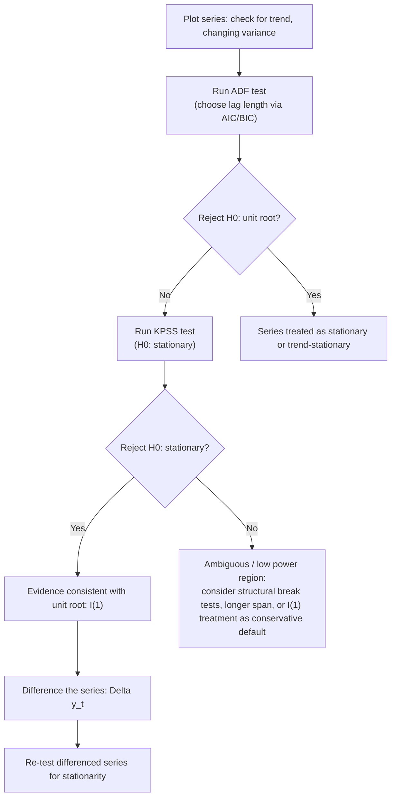

## Random Walks and Unit Root Processes

### Overview

Unit root processes are non-stationary time series whose statistical properties (mean, variance, autocovariance) change over time in a specific way: shocks have **permanent** effects rather than dying out. The canonical example is the random walk. Distinguishing unit root (difference-stationary) processes from trend-stationary processes is central to time series econometrics because it determines the correct approach to detrending, the validity of standard inference, and the risk of spurious regression.

### The Random Walk

The simplest unit root process:

$$y_t = y_{t-1} + \varepsilon_t, \quad \varepsilon_t \sim \text{i.i.d.}(0,\sigma^2)$$

with initial condition $y_0$ (often set to 0 or treated as fixed). By recursive substitution:

$$y_t = y_0 + \sum_{s=1}^{t} \varepsilon_s$$

**Key Points**

- $E[y_t] = y_0$ (constant mean, if $y_0$ fixed), but $\text{Var}(y_t) = t\sigma^2$ — variance **grows linearly with $t$**, unlike a stationary process with constant variance.
- The autocovariance $\text{Cov}(y_t, y_{t+h}) = t\sigma^2$ depends on $t$ itself, not just the lag $h$ — violating covariance stationarity.
- Shocks $\varepsilon_s$ have **permanent effects**: a one-time shock at time $s$ shifts the level of $y_t$ for all $t > s$ with coefficient exactly 1 (no decay), in contrast to a stationary AR(1) process where shocks decay geometrically.

**Random walk with drift:**

$$y_t = \delta + y_{t-1} + \varepsilon_t \quad \Rightarrow \quad y_t = y_0 + \delta t + \sum_{s=1}^t \varepsilon_s$$

This combines a deterministic linear trend ($\delta t$) with a stochastic random-walk component — both features must be accounted for in detrending and testing.

### The General AR(1) Framework and the Unit Root

Consider the AR(1) process:

$$y_t = \rho y_{t-1} + \varepsilon_t$$

- If $|\rho| < 1$: the process is **stationary** (covariance-stationary, mean-reverting); shocks decay at rate $\rho^h$ after $h$ periods.
- If $\rho = 1$: the process is a **unit root process** (random walk); shocks are permanent.
- If $|\rho| > 1$: the process is **explosive**; rarely used in applied economics.

The term "unit root" refers to the characteristic equation of the AR process: writing the AR(1) using the lag operator $L$, $(1-\rho L)y_t = \varepsilon_t$, the root of $1-\rho z = 0$ is $z = 1/\rho$. When $\rho=1$, this root equals 1 — a "unit" root — which is the source of the non-stationarity.

### Difference-Stationary vs. Trend-Stationary Processes

A crucial distinction with major implications for detrending:

**Difference-stationary (DS) process** (e.g., random walk with drift):

$$y_t = \delta + y_{t-1} + \varepsilon_t$$

Becomes stationary after **differencing**: $\Delta y_t = \delta + \varepsilon_t$ is stationary (i.i.d. plus constant).

**Trend-stationary (TS) process:**

$$y_t = \alpha + \beta t + u_t, \quad u_t \text{ stationary}$$

Becomes stationary after **removing a deterministic trend** (regressing out $\alpha + \beta t$), not by differencing.

**Key Points**

- Differencing a trend-stationary series **overdifferences** it, introducing a non-invertible MA unit root into the differenced series (a distinct econometric problem).
- Detrending a difference-stationary series (regressing on a deterministic trend and using residuals) **does not remove the stochastic trend** — the residuals remain non-stationary, since the random-walk component is stochastic, not deterministic.
- This distinction is why choosing the correct unit-root test and correct model for the deterministic component (constant only vs. constant + trend) is not a mechanical formality — using the wrong detrending approach leaves the series effectively non-stationary despite appearing "corrected."

### Consequences of Unit Roots for Standard Inference

**Key Points**

- OLS estimates of $\rho$ in $y_t = \rho y_{t-1}+\varepsilon_t$ remain consistent under a unit root, but the usual asymptotic normal distribution for the $t$-statistic **does not apply**; instead $\hat\rho$ converges to a nonstandard (Dickey-Fuller) distribution, super-consistent at rate $T$ rather than the usual $\sqrt{T}$.
- Regressing one independent unit-root series on another **unrelated** unit-root series produces **spurious regression**: high $R^2$, significant-looking $t$-statistics, but no genuine relationship — a phenomenon formalized by Granger and Newbold (1974) and Phillips (1986), driven by the nonstandard limiting distributions of both the coefficient and the $t$-statistic under non-stationarity.
- Standard confidence intervals, hypothesis tests, and forecast-interval calculations built on stationarity assumptions are invalid when applied naively to unit-root series without differencing or cointegration-based correction.

### The Dickey-Fuller Test

Tests $H_0: \rho = 1$ (unit root) against $H_1: |\rho|<1$ (stationary), using the reparameterized regression:

$$\Delta y_t = \gamma y_{t-1} + \varepsilon_t, \quad \gamma = \rho - 1$$

so $H_0: \gamma = 0$ (unit root) vs. $H_1: \gamma < 0$ (stationary). Three specifications:

1. **No constant, no trend:** $\Delta y_t = \gamma y_{t-1} + \varepsilon_t$
2. **Constant, no trend:** $\Delta y_t = \alpha + \gamma y_{t-1} + \varepsilon_t$
3. **Constant and trend:** $\Delta y_t = \alpha + \beta t + \gamma y_{t-1} + \varepsilon_t$

The $t$-statistic on $\hat\gamma$ does **not** follow a standard $t$-distribution under $H_0$; critical values come from the **Dickey-Fuller distribution**, tabulated separately for each of the three specifications (more negative critical values are required than for a standard normal/t-test, since the sampling distribution has a longer left tail under the null of a unit root).

### Augmented Dickey-Fuller (ADF) Test

Extends the DF test to allow for serial correlation in $\varepsilon_t$ by adding lagged differences:

$$\Delta y_t = \alpha + \beta t + \gamma y_{t-1} + \sum_{j=1}^{p} \phi_j \Delta y_{t-j} + \varepsilon_t$$

**Key Points**

- The number of lags $p$ is chosen via information criteria (AIC, BIC/SIC) or sequential testing (starting from a maximum lag and testing down), and results can be sensitive to this choice — too few lags leave residual serial correlation (invalidating the test), too many lags reduce power.
- The null and alternative hypotheses and critical values are unchanged from the standard DF test; only the ability to control for short-run dynamics changes.
- Choice of deterministic terms (none/constant/constant+trend) should be guided by the series' visual behavior and economic reasoning — including an unnecessary trend term reduces test power, while omitting a needed trend term biases toward not rejecting the unit root.

### Phillips-Perron (PP) Test

An alternative to ADF that addresses serial correlation and heteroskedasticity **non-parametrically** rather than via augmentation: it estimates the simple DF regression (no lagged differences) but applies a correction to the test statistic using a Newey-West-type long-run variance estimator.

**[Inference]** ADF is generally considered to have better finite-sample size properties than PP under some forms of serial correlation, while PP can be more robust under certain heteroskedasticity patterns; applied practice often reports both as a robustness check, given that neither dominates uniformly.

### KPSS Test: Reversing the Null Hypothesis

The **Kwiatkowski-Phillips-Schmidt-Shin (KPSS) test** flips the hypotheses relative to ADF/PP:

$$H_0: \text{series is stationary (or trend-stationary)} \quad H_1: \text{unit root}$$

Based on decomposing $y_t = \xi t + r_t + u_t$ where $r_t$ is a random walk with $r_t = r_{t-1} + v_t$; testing $H_0: \sigma_v^2 = 0$ (no random walk component, i.e., stationarity) using a Lagrange Multiplier-type statistic based on the partial sums of OLS residuals.

**Key Points**

- Using ADF/PP (null = unit root) and KPSS (null = stationarity) **jointly** is standard practice: consistent conclusions across both (e.g., ADF rejects unit root AND KPSS fails to reject stationarity) provide stronger evidence than either test alone, given the generally low power of unit root tests in finite samples.
- All of these tests (DF, ADF, PP, KPSS) have **low power to distinguish a unit root from a highly persistent but stationary process** (e.g., $\rho = 0.97$ vs. $\rho=1$) in samples of typical macroeconomic length (a few hundred observations), a well-documented and largely unresolved limitation.

### Structural Breaks and Unit Root Testing

Standard unit root tests are known to have reduced power in the presence of an unmodeled **structural break** (a permanent shift in mean or trend) — a trend-stationary series with a single break can appear to have a unit root under standard ADF testing (the Perron 1989 critique). Break-robust alternatives include the **Zivot-Andrews test** (endogenously estimates the break date) and related tests allowing for one or more structural breaks under both the null and alternative.

### Higher-Order Integration: I(d) Notation

A series is **integrated of order $d$**, denoted $I(d)$, if it must be differenced $d$ times to achieve stationarity:

- $I(0)$: already stationary
- $I(1)$: unit root, requires one difference (most macroeconomic levels series — GDP, price levels, exchange rates — are commonly modeled as $I(1)$)
- $I(2)$: requires two differences (less common but relevant for some nominal series, e.g., certain price indices in high-inflation contexts)

This notation underlies the definition of **cointegration** (covered separately): two or more $I(1)$ series are cointegrated if a linear combination of them is $I(0)$, implying a stable long-run equilibrium relationship despite each series individually wandering.

### Diagram: Testing Framework for Unit Roots

### Example: Testing an Exchange Rate Series

Suppose testing whether a log exchange rate series $\ln(e_t)$ has a unit root:

1. Plot $\ln(e_t)$: visually resembles a wandering, trendless series — informs using the constant-only (no trend) ADF specification.
2. Select lag length via BIC (e.g., $p=2$).
3. Run ADF: $\Delta \ln(e_t) = \alpha + \gamma \ln(e_{t-1}) + \phi_1 \Delta\ln(e_{t-1}) + \phi_2\Delta\ln(e_{t-2}) + \varepsilon_t$.

**Output** (illustrative):

- ADF $t$-statistic on $\hat\gamma$: $-1.85$; 5% critical value (constant-only case): $\approx -2.86$.
- Since $-1.85 > -2.86$ (not more negative), **fail to reject** $H_0$: unit root — consistent with the widely replicated finding that nominal exchange rates behave approximately as random walks, a stylized fact traced to Meese and Rogoff (1983).
- KPSS test on the same series: reject stationarity, reinforcing the unit-root conclusion.

### Software Implementation Notes

- **Stata:** `dfuller` (ADF), `pperron` (Phillips-Perron), `kpss` (via user-written or built-in commands depending on version).
- **R:** `tseries` package (`adf.test`, `pp.test`, `kpss.test`); `urca` package provides more granular control over deterministic specification and lag selection (`ur.df`, `ur.pp`, `ur.kpss`).
- **Python:** `statsmodels.tsa.stattools` (`adfuller`, `kpss`).

### Limitations

- Low statistical power against near-unit-root stationary alternatives means failure to reject a unit root is weak evidence of a *true* unit root rather than strong confirmation — sample size and persistence both matter.
- Choice of deterministic terms (trend inclusion) and lag length materially affects test conclusions; results are not always robust across reasonable specification choices, and pre-testing the deterministic component using the same data introduces its own sequential-testing distortions.
- Structural breaks, if present and unmodeled, bias standard unit root tests toward non-rejection of the unit root null, potentially leading researchers to over-difference series that are actually trend-stationary with a break.
- **[Inference]** The economic interpretation of "unit root vs. trend-stationary" is not merely statistical — it carries substantive implications (e.g., whether GDP shocks have permanent or transitory effects), and reasonable economists continue to disagree on interpretation even when unit root test results themselves are not in dispute, given the tests' known power limitations.

**Related Topics**

- Cointegration and the Engle-Granger two-step procedure
- Error correction models (ECM)
- Spurious regression (Granger-Newbold, Phillips)
- Structural break tests (Zivot-Andrews, Bai-Perron)
- Panel unit root tests (Levin-Lin-Chu, Im-Pesaran-Shin)
- Vector autoregressions (VAR) with non-stationary variables