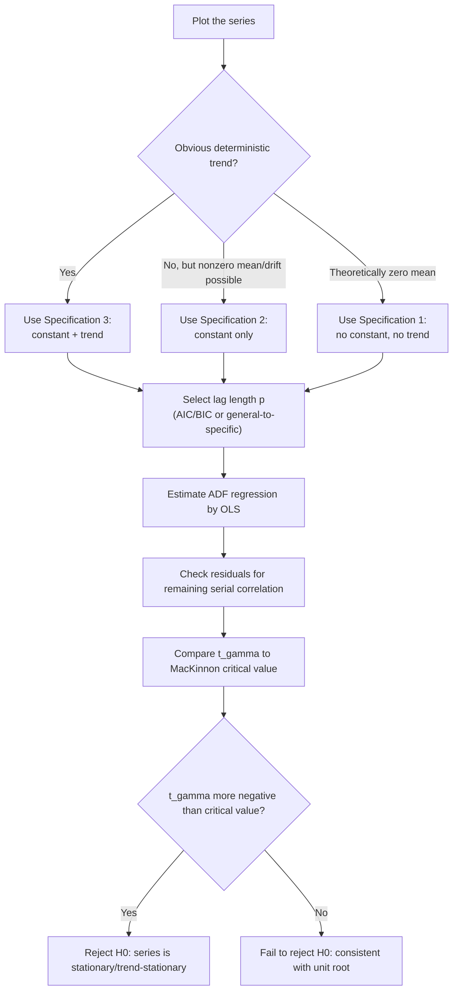

## The Augmented Dickey-Fuller Test

### Overview

The Augmented Dickey-Fuller (ADF) test extends the original Dickey-Fuller (DF) test by allowing for higher-order autoregressive dynamics in the error process, addressing the possibility of serial correlation that would otherwise invalidate the simple DF test. It remains the most widely used unit root test in applied econometrics due to its relative simplicity, well-tabulated critical values, and flexibility across model specifications.

### Motivation: From DF to ADF

The simple Dickey-Fuller test regression:

$$\Delta y_t = \alpha + \beta t + \gamma y_{t-1} + \varepsilon_t$$

is valid only if $\varepsilon_t$ is white noise. If the true data-generating process has richer dynamics — e.g., $y_t$ follows an AR($p$) process rather than AR(1) — then $\varepsilon_t$ in the simple DF regression will be serially correlated, which invalidates the Dickey-Fuller distribution used for critical values and biases the test.

The ADF test resolves this by explicitly modeling the short-run dynamics with lagged difference terms, "augmenting" the regression:

$$\Delta y_t = \alpha + \beta t + \gamma y_{t-1} + \sum_{j=1}^{p} \phi_j \Delta y_{t-j} + \varepsilon_t$$

This is derived by taking a general AR($p+1$) process for $y_t$ and reparameterizing it in terms of the level $y_{t-1}$ and lagged first differences — algebraically equivalent to the original AR representation, but isolating the parameter of interest, $\gamma$, which governs the unit root.

### Hypotheses

$$H_0: \gamma = 0 \quad \text{(unit root; } y_t \text{ is } I(1)\text{)}$$

$$H_1: \gamma < 0 \quad \text{(stationary; } y_t \text{ is } I(0)\text{, or trend-stationary depending on specification)}$$

The test is constructed as a **one-sided left-tail test**: only $\gamma < 0$ is a meaningful alternative, since $\gamma > 0$ would imply an explosive root, generally excluded from consideration in standard macro/financial applications.

### The Three Model Specifications

Because the appropriate null model depends on the deterministic components believed to characterize the series, three specifications are standard:

**Specification 1 — No constant, no trend:**

$$\Delta y_t = \gamma y_{t-1} + \sum_{j=1}^p \phi_j \Delta y_{t-j} + \varepsilon_t$$

Appropriate only when theory dictates $y_t$ has zero mean under the null (rare in practice; random walk without drift).

**Specification 2 — Constant, no trend:**

$$\Delta y_t = \alpha + \gamma y_{t-1} + \sum_{j=1}^p \phi_j \Delta y_{t-j} + \varepsilon_t$$

Appropriate for series without an obvious deterministic trend but possibly a non-zero mean/drift (e.g., interest rates, exchange rates).

**Specification 3 — Constant and trend:**

$$\Delta y_t = \alpha + \beta t + \gamma y_{t-1} + \sum_{j=1}^p \phi_j \Delta y_{t-j} + \varepsilon_t$$

Appropriate for series that appear to grow over time under the alternative (e.g., GDP, price levels) — tests $I(1)$ against trend-stationary, not merely against a zero-mean stationary process.

**Key Points**

- Each specification has its **own set of critical values** — a $t$-statistic on $\hat\gamma$ cannot be compared to Specification-1 critical values if Specification 3 was estimated, and vice versa.
- Including an unnecessary trend term (Specification 3 when the series is not trending) **reduces test power**, making it harder to reject the unit root null even when the series is stationary.
- Omitting a necessary trend term (Specification 2 when the series clearly trends) **biases the test toward failing to reject** the unit root, since the trend gets absorbed into $y_{t-1}$ and drives $\hat\gamma$ toward zero.

### Non-Standard Distribution: Why Not a t-Table

Under $H_0: \gamma=0$, the test statistic $\hat{t}_\gamma = \hat\gamma / \text{SE}(\hat\gamma)$ does **not** follow a standard $t$-distribution, even asymptotically. Because $y_{t-1}$ is non-stationary under the null, the usual central limit theorem arguments fail; instead, $\hat{t}_\gamma$ converges to a **functional of Brownian motion**, known as the Dickey-Fuller distribution:

$$\hat{t}_\gamma \xrightarrow{d} \frac{\int_0^1 W(r)\,dW(r)}{\left(\int_0^1 W(r)^2\,dr\right)^{1/2}}$$

(for the no-constant case; the constant and trend cases have analogous but distinct limiting functionals involving demeaned/detrended Brownian motion $W(r)$).

**Key Points**

- The Dickey-Fuller critical values are **more negative** than standard normal/t critical values at conventional significance levels — e.g., the 5% critical value for Specification 2 with moderate sample size is approximately $-2.86$, compared to $-1.96$ for a standard two-sided normal test.
- Critical values depend on **sample size** (converging to asymptotic values as $T\to\infty$) and on **which specification** is used; MacKinnon (1996) provides response-surface regressions for computing accurate finite-sample critical values, implemented in most statistical software.
- $\hat\gamma$ itself is **super-consistent**: it converges to its true value at rate $T$ rather than the usual $\sqrt{T}$, a distinctive feature of unit-root-adjacent estimation, though this does not restore standard inference for the $t$-statistic.

### Lag Length Selection

The number of augmenting lags $p$ must be chosen to whiten the residuals without over-parameterizing the model.

**Common approaches:**

1. **Information criteria:** choose $p$ minimizing AIC or BIC/SIC across a range of candidate lag lengths. BIC tends to select more parsimonious (shorter) lag lengths than AIC.
2. **General-to-specific (sequential testing):** start with a generous maximum lag $p_{\max}$ (e.g., Schwert's rule of thumb, $p_{\max} = \lfloor 12(T/100)^{1/4}\rfloor$), test significance of the last lag, and reduce until the last included lag is significant.
3. **Residual diagnostics:** after selecting $p$, verify no remaining serial correlation via a Ljung-Box test or similar on the regression residuals.

**Key Points**

- Too few lags: residual serial correlation remains, invalidating the Dickey-Fuller critical values (the actual size of the test diverges from nominal size).
- Too many lags: reduces the effective sample size and test power, making the test less able to reject a false unit root null.
- **[Inference]** BIC-based selection is often preferred in applied unit root testing for its parsimony and generally better size properties, though this is not a universal ranking across all data-generating processes; AIC can outperform BIC when the true lag order is genuinely high.

### Estimation Procedure

**Step 1:** Plot the series to assess visually whether a trend, drift, or neither is present; this informs the choice of specification (though should be supplemented with formal joint tests, not relied on visually alone).

**Step 2:** Choose a maximum lag $p_{\max}$ and select $p$ via information criterion or general-to-specific testing.

**Step 3:** Estimate the chosen ADF regression by OLS.

**Step 4:** Compare $\hat{t}_\gamma$ (the $t$-statistic on the coefficient on $y_{t-1}$) to the appropriate MacKinnon critical value for the chosen specification and sample size.

**Step 5:** Reject $H_0$ (conclude stationarity) if $\hat{t}_\gamma$ is **more negative** than the critical value; otherwise, fail to reject (cannot rule out a unit root).

### Testing Joint Significance of Deterministic Terms

Dickey and Fuller also derived joint $F$-type test statistics (often denoted $\Phi_1, \Phi_2, \Phi_3$ depending on specification) for testing the joint null of a unit root *and* zero deterministic terms (e.g., $H_0: \gamma=0, \beta=0$ in Specification 3). These have their own non-standard tabulated critical values and are used when there's ambiguity about whether to include trend/drift terms alongside testing for the unit root — though in most modern applied practice, the simple $t$-test on $\gamma$ within a carefully chosen specification is more commonly reported.

### Example: Testing a Consumption Series

Suppose testing quarterly log real consumption $\ln(C_t)$, which exhibits clear upward trending behavior over the sample.

**Step 1:** Visual inspection suggests Specification 3 (constant + trend) is appropriate, since consumption is expected to be trend-stationary or difference-stationary around a growth trend, not mean-reverting to a constant.

**Step 2:** BIC selects $p=4$ lags (consistent with quarterly seasonal-type dynamics).

**Step 3:** Estimate:

$$\Delta \ln C_t = \alpha + \beta t + \gamma \ln C_{t-1} + \sum_{j=1}^4 \phi_j \Delta \ln C_{t-j} + \varepsilon_t$$

**Output** (illustrative):

- $\hat\gamma = -0.018$, $\text{SE}(\hat\gamma) = 0.011$, $\hat t_\gamma = -1.64$.
- 5% critical value (Specification 3, $T\approx 200$): approximately $-3.43$.
- Since $-1.64 > -3.43$, **fail to reject** $H_0$: consistent with $\ln C_t$ containing a unit root (difference-stationary), a standard finding for aggregate consumption series in the literature.
- Residual diagnostics (Ljung-Box on ADF residuals): no significant remaining autocorrelation, supporting adequacy of $p=4$.

### ADF vs. Other Unit Root Tests: Comparison

| Feature | ADF | Phillips-Perron (PP) | KPSS |
| --- | --- | --- | --- |
| Null hypothesis | Unit root | Unit root | Stationarity |
| Handles serial correlation via | Parametric (lagged differences) | Non-parametric (long-run variance correction) | Non-parametric (long-run variance in LM statistic) |
| Sensitivity to lag/bandwidth choice | Sensitive to $p$ | Sensitive to bandwidth/kernel choice | Sensitive to bandwidth choice |
| Common applied practice | Most widely reported baseline test | Often reported alongside ADF as robustness check | Reported as confirmatory test with reversed null |

### Diagram: ADF Testing Decision Process

### Software Implementation Notes

- **Stata:** `dfuller varname, lags(#) trend` (or `noconstant`, `drift`); `varsoc` or manual AIC/BIC comparison for lag selection.
- **R:** `tseries::adf.test()` (fixed lag rule based on sample size by default); `urca::ur.df(y, type="trend"/"drift"/"none", selectlags="AIC"/"BIC")` for more granular control matching the three specifications above.
- **Python:** `statsmodels.tsa.stattools.adfuller(y, regression="c"/"ct"/"n"/"ctt", autolag="AIC"/"BIC")`.

### Limitations

- Low power against near-unit-root alternatives (e.g., $\gamma$ close to but not equal to 0) remains a fundamental limitation shared with all unit root tests, not resolved by the augmentation itself.
- Sensitive to specification choices — deterministic terms and lag length — that are themselves estimated from the same data, introducing sequential-testing/pretesting distortions not fully accounted for in standard critical value tables.
- Assumes a **single, unmodeled** structural break does not exist; in its presence, the ADF test is biased toward non-rejection of the unit root even for genuinely trend-stationary series with a break (Perron 1989), motivating break-robust alternatives (Zivot-Andrews, Perron's tests with known or endogenous break dates).
- **[Inference]** In small samples typical of many macroeconomic applications (under ~100 observations), simulation evidence generally shows the ADF test's actual size can deviate meaningfully from nominal size, and results should be interpreted with corresponding caution rather than treated as definitive classification of a series as $I(0)$ or $I(1)$.

**Related Topics**

- Phillips-Perron and KPSS unit root tests
- Random walks and general unit root processes
- Structural break-robust unit root tests (Zivot-Andrews, Perron)
- Cointegration and the Engle-Granger procedure
- MacKinnon critical value response surfaces
- Panel unit root tests