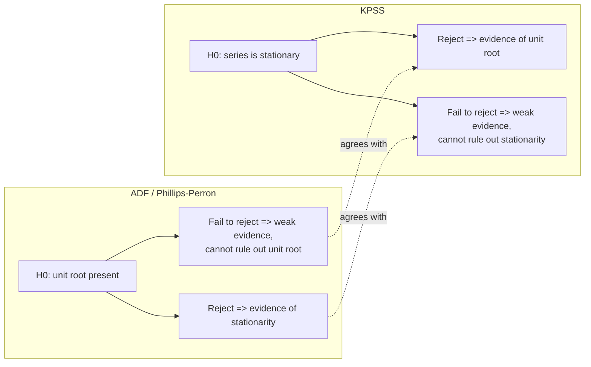

## The Phillips-Perron and KPSS Tests

### Overview

The Phillips-Perron (PP) and Kwiatkowski-Phillips-Schmidt-Shin (KPSS) tests are two further approaches to unit root/stationarity testing that complement the Augmented Dickey-Fuller (ADF) test. PP addresses serial correlation and heteroskedasticity **non-parametrically** rather than through augmentation with lagged differences, while KPSS **reverses the null hypothesis** entirely — testing stationarity rather than testing for a unit root. Using these alongside ADF is standard applied practice, since agreement across tests with opposing nulls provides more credible evidence than any single test given the generally low power of unit root testing.

### The Phillips-Perron Test

**Motivation:** The ADF test handles serial correlation in the error term by adding parametric lagged-difference terms. The Phillips-Perron (1988) approach instead estimates the **simple** Dickey-Fuller regression (no augmentation):

$$\Delta y_t = \alpha + \beta t + \gamma y_{t-1} + u_t$$

and then applies a **non-parametric correction** to the resulting test statistics to account for serial correlation and heteroskedasticity in $u_t$, rather than modeling the dynamics directly.

**Construction:** The correction adjusts both the estimated coefficient and its $t$-statistic using a consistent estimator of the long-run variance of $u_t$, typically a Newey-West-type kernel estimator:

$$\hat\lambda^2 = \hat\sigma_u^2 + 2\sum_{j=1}^{\ell} w(j,\ell)\,\hat\gamma_j$$

where $\hat\gamma_j$ are estimated autocovariances of $u_t$, $w(j,\ell)$ is a kernel weighting function (commonly Bartlett), and $\ell$ is the bandwidth (truncation lag) parameter. The adjusted $t$-statistic:

$$Z_t = \sqrt{\frac{\hat\sigma_u^2}{\hat\lambda^2}}\,\hat t_\gamma - \frac{(\hat\lambda^2-\hat\sigma_u^2)}{2\hat\lambda \cdot \text{SE}(\hat\gamma)/\hat\sigma_u}$$

(exact formula varies slightly by source/software; the essential structure is a correction term added to the raw DF $t$-statistic using the ratio of short-run to long-run variance). A corresponding adjustment $Z_\rho$ is applied directly to $T(\hat\rho-1)$.

**Key Points**

- PP and ADF test the **same null hypothesis** ($H_0: \gamma=0$, unit root) and share the **same asymptotic (Dickey-Fuller) critical value distributions** — the distinction is purely in how serial correlation/heteroskedasticity is handled, not in the hypothesis being tested.
- PP requires choosing a **bandwidth/truncation lag** $\ell$ (analogous to choosing lag length $p$ in ADF), commonly via Newey-West or Andrews (1991) automatic bandwidth selection rules.
- PP is **more robust to certain forms of heteroskedasticity** in the error term than the basic ADF test, since the non-parametric correction directly targets the long-run variance without assuming a specific parametric error structure.

### PP vs. ADF: Practical Comparison

| Feature | ADF | Phillips-Perron |
| --- | --- | --- |
| Handles serial correlation via | Parametric: lagged $\Delta y_{t-j}$ terms | Non-parametric: kernel-based long-run variance correction |
| Tuning parameter | Lag length $p$ | Bandwidth/truncation lag $\ell$ |
| Robust to conditional heteroskedasticity | Only if modeled via robust SEs | Directly, by construction of the correction |
| Finite-sample size distortions | Can occur with poor lag selection | **[Inference]** Some Monte Carlo evidence suggests PP can have more severe size distortions than ADF in the presence of negative MA components in the error process |
| Popularity in applied practice | More commonly reported as primary test | Frequently reported as a robustness/secondary check alongside ADF |

**[Inference]** Neither test uniformly dominates the other across all data-generating processes; the common applied recommendation is to report both and treat agreement as reinforcing evidence, and disagreement as a signal to investigate further (e.g., via KPSS or structural break tests) rather than a mechanical rule about which to trust.

### The KPSS Test

**Motivation:** Both ADF and PP share unit root as the **null** hypothesis, meaning failure to reject provides only weak evidence *for* a unit root (absence of evidence is not evidence of absence). Kwiatkowski, Phillips, Schmidt, and Shin (1992) proposed a test with the **opposite** null, allowing researchers to check whether the data are consistent with stationarity being rejected as well — a useful complement given the asymmetric burden of proof in the ADF/PP framework.

**Model setup:** Decompose the series as the sum of a deterministic trend, a random walk, and a stationary error:

$$y_t = \xi t + r_t + u_t$$

$$r_t = r_{t-1} + v_t, \quad v_t \sim \text{i.i.d.}(0,\sigma_v^2)$$

where $u_t$ is stationary (I(0)) and $r_t$ is a pure random walk component with $r_0$ as a fixed initial value. The hypotheses concern whether the random walk component is degenerate:

$$H_0: \sigma_v^2 = 0 \quad \text{(no random walk component} \Rightarrow y_t \text{ is trend-stationary/stationary)}$$

$$H_1: \sigma_v^2 > 0 \quad \text{(unit root present)}$$

**Test statistic construction:**

1. Estimate $y_t = \alpha + \beta t + u_t$ (or just $y_t = \alpha + u_t$ if testing level-stationarity rather than trend-stationarity) by OLS, obtain residuals $\hat u_t$.
2. Compute the partial sum process $\hat S_t = \sum_{s=1}^t \hat u_s$.
3. Compute the KPSS statistic:

$$KPSS = \frac{1}{T^2}\sum_{t=1}^T \hat S_t^2 \Big/ \hat\lambda^2$$

where $\hat\lambda^2$ is a consistent long-run variance estimator of $u_t$ (again typically Newey-West/Bartlett-kernel based, requiring a bandwidth choice).

**Key Points**

- Two variants exist: $\eta_\mu$ (testing level stationarity, $H_0: y_t \sim I(0)$ around a constant) and $\eta_\tau$ (testing trend stationarity, $H_0: y_t \sim I(0)$ around a deterministic trend) — analogous to the constant-only vs. constant-plus-trend distinction in ADF, and the choice must match the series' visual behavior.
- Critical values are **non-standard** but tabulated (Kwiatkowski et al. 1992); larger KPSS statistics indicate stronger evidence against stationarity, so the test **rejects $H_0$ (stationarity) for large values** of the statistic — the opposite decision rule direction from ADF/PP.
- Like PP, KPSS requires a bandwidth choice for the long-run variance estimator, and results can be sensitive to this choice, particularly in smaller samples.

### Combining ADF/PP and KPSS: Interpretation Matrix

| ADF/PP result | KPSS result | Interpretation |
| --- | --- | --- |
| Reject unit root | Fail to reject stationarity | Strong, consistent evidence of stationarity |
| Fail to reject unit root | Reject stationarity | Strong, consistent evidence of a unit root |
| Reject unit root | Reject stationarity | Conflicting/ambiguous — possible fractional integration, structural break, or low power in one test |
| Fail to reject unit root | Fail to reject stationarity | Ambiguous/inconclusive — commonly attributed to low power of both tests in short or noisy samples |

**Key Points**

- The two "conflicting" outer cells are not uncommon in applied work and are widely recognized as a **known limitation of the joint testing framework**, not evidence that either test is implemented incorrectly.
- When results conflict, common next steps include: examining the series for structural breaks, considering fractionally integrated ($I(d)$ for non-integer $d$) alternatives, extending the sample if possible, or explicitly reporting the ambiguity rather than forcing a binary conclusion.

### Diagram: Complementary Null Hypotheses

### Example: Testing a Short-Term Interest Rate Series

Suppose testing a monthly short-term interest rate series believed to be persistent but plausibly mean-reverting over long horizons.

**Step 1 — ADF:** Specification 2 (constant, no trend), lag length $p=3$ via BIC.

**Output (illustrative):** $\hat t_\gamma = -2.41$; 5% critical value $\approx -2.87$. Fail to reject unit root.

**Step 2 — Phillips-Perron:** Same specification, Bartlett kernel, Newey-West automatic bandwidth ($\ell=4$).

**Output (illustrative):** $Z_t = -2.55$; same critical value framework. Fail to reject unit root — broadly consistent with ADF.

**Step 3 — KPSS:** Level-stationarity variant ($\eta_\mu$), same bandwidth choice.

**Output (illustrative):** $KPSS = 0.68$; 5% critical value $\approx 0.463$. Since $0.68 > 0.463$, **reject** $H_0$: stationarity.

**Conclusion:** All three tests point toward the interest rate series containing a unit root (or at minimum, being highly persistent and not clearly stationary) over the sample period — a common empirical finding for short-term interest rates, though **[Inference]** economic theory (mean-reversion arguments from monetary policy rules) leads some researchers to treat such series as highly persistent but ultimately stationary, illustrating the tension between statistical test results and theoretical priors in this literature.

### Bandwidth Selection for PP and KPSS

Both tests require choosing $\ell$ (truncation lag/bandwidth) for the long-run variance estimator. Common approaches:

- **Newey-West (1994) automatic bandwidth:** a data-driven plug-in method based on estimated autocorrelation of the residuals.
- **Fixed rule-of-thumb:** e.g., $\ell = \lfloor 4(T/100)^{2/9}\rfloor$ or $\ell=\lfloor 12(T/100)^{1/4}\rfloor$, varying by source and software default.
- **Kernel choice:** Bartlett kernel is most common (guarantees a positive semi-definite variance estimate); Quadratic Spectral and Parzen kernels are used in some implementations.

**Key Points**

- Test results (especially KPSS) can be **sensitive to bandwidth choice** — too small a bandwidth under-corrects for serial correlation (inflating rejection rates), too large a bandwidth over-smooths and can reduce power.
- Reporting results across a small range of bandwidth choices as a robustness check is common in careful applied work, particularly for KPSS given its documented sensitivity.

### Software Implementation Notes

- **Stata:** `pperron varname, lags(#) trend` for PP (with `newey` or `regress`-based automatic lag selection options depending on version); KPSS available via community-contributed commands (e.g., `kpss`) with `trend`/`notrend` and bandwidth options.
- **R:** `tseries::pp.test()` and `tseries::kpss.test(y, null="Level"/"Trend")`; `urca::ur.pp()` and `urca::ur.kpss()` provide more granular kernel/bandwidth control.
- **Python:** `statsmodels.tsa.stattools.kpss(y, regression="c"/"ct", nlags="auto")`; PP test available via `arch.unitroot.PhillipsPerron` in the `arch` package (not in base `statsmodels`).

### Limitations

- Both PP and KPSS share the general low-power problem of all unit root/stationarity tests against near-unit-root alternatives in samples of typical economic length.
- KPSS is known to **over-reject stationarity** (i.e., too readily conclude a unit root is present) in finite samples when the bandwidth is chosen too small relative to the persistence of the stationary component, a well-documented finite-sample size distortion.
- PP's non-parametric correction can perform poorly in the presence of large negative moving-average components in the error process, a scenario where ADF with sufficient augmentation lags is often preferred.
- Neither test accounts for structural breaks; as with ADF, an unmodeled break can bias PP toward non-rejection of the unit root and KPSS toward rejection of stationarity, both pointing spuriously toward "unit root" conclusions for genuinely (but break-affected) stationary series.

**Related Topics**

- The Augmented Dickey-Fuller test
- Random walks and unit root processes
- Newey-West long-run variance estimation
- Structural break-robust unit root tests (Zivot-Andrews, Perron)
- Fractional integration and long-memory processes
- Cointegration testing frameworks