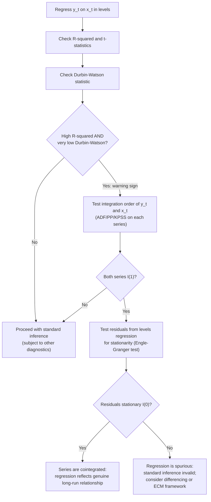

## Spurious Regression

### Overview

Spurious regression refers to the phenomenon in which regressing one non-stationary time series on another, statistically unrelated, non-stationary time series produces regression output that *appears* highly significant — large $R^2$, seemingly significant $t$-statistics — despite there being no genuine underlying relationship between the two series. This is one of the most consequential findings in time series econometrics, fundamentally altering how applied researchers approach regression with trending or unit-root data.

### The Monte Carlo Demonstration: Granger and Newbold (1974)

Granger and Newbold generated two **independent** random walks:

$$y_t = y_{t-1} + \varepsilon_{1t}, \qquad x_t = x_{t-1} + \varepsilon_{2t}$$

with $\varepsilon_{1t}$ and $\varepsilon_{2t}$ mutually independent i.i.d. white noise series — by construction, there is **no relationship whatsoever** between $y_t$ and $x_t$. They then regressed $y_t$ on $x_t$ via OLS:

$$y_t = \beta_0 + \beta_1 x_t + u_t$$

**Key finding:** across repeated simulations, this regression rejected $H_0: \beta_1 = 0$ far more often than the nominal 5% significance level would predict — in their original simulations, rejection rates exceeded 75% in many cases, despite $\beta_1$'s true value being exactly zero by construction. $R^2$ values were also frequently large (often above 0.1–0.3, sometimes considerably higher), and the Durbin-Watson statistic was typically very low, signaling severe residual autocorrelation — itself a diagnostic red flag for the phenomenon.

### Theoretical Explanation: Phillips (1986)

Phillips provided the asymptotic theory explaining why this happens. When both $y_t$ and $x_t$ are independent $I(1)$ processes:

- The OLS estimator $\hat\beta_1$ does **not** converge to zero as $T\to\infty$; instead, it converges in distribution to a **non-degenerate random variable** (a functional of independent Brownian motions), rather than collapsing to a constant.
- The $t$-statistic on $\hat\beta_1$ **diverges** as $T\to\infty$ (grows without bound in absolute value) rather than converging to a standard normal distribution — meaning that with a large enough sample, the spurious regression will show an *arbitrarily large* and seemingly more "significant" $t$-statistic, the opposite of the usual pattern of increasing precision with more data.
- $R^2$ converges to a **non-degenerate random variable** rather than to zero, meaning a spuriously high $R^2$ is not a small-sample artifact that vanishes with more data — it persists asymptotically.

**Key Points**

- This is fundamentally different from omitted-variable bias or measurement error in stationary regressions, where standard asymptotic theory (consistency, standard errors shrinking at rate $\sqrt{T}$) still applies even if biased. Spurious regression represents a **breakdown of the standard asymptotic framework itself** when regressors are non-stationary and unrelated.
- The phenomenon is not limited to random walks specifically — it arises whenever two or more $I(1)$ (or higher-order integrated) series that are **not cointegrated** are regressed on one another.
- Adding a time trend to both series, or using detrended data, does **not** resolve the problem if the underlying non-stationarity is stochastic (unit root) rather than purely deterministic — detrending removes deterministic trends but not stochastic trends (see the DS vs. TS distinction under unit root processes).

### Diagnostic Signatures of Spurious Regression

**Key Points**

- **Very low Durbin-Watson statistic** (often well below 1, sometimes near 0) alongside a high $R^2$ — the classic informal warning sign identified by Granger and Newbold, sometimes summarized as "$R^2 > DW$" as a rule-of-thumb red flag.
- **Highly persistent, slowly decaying residual autocorrelation** — since if $y_t$ and $x_t$ are both $I(1)$ and not cointegrated, the residual $u_t = y_t - \hat\beta_0 - \hat\beta_1 x_t$ is itself $I(1)$, not stationary, directly violating the classical regression assumption that errors are stationary (or at least have bounded variance).
- **Sensitivity of results to sample period** — spurious relationships often display coefficient instability across subsamples, unlike genuine structural relationships that ideally replicate across different periods.

### Distinguishing Spurious Regression from Cointegration

This is the central practical question the spurious regression literature raises: **when is a regression involving $I(1)$ variables valid, and when is it spurious?**

The answer is **cointegration**: if $y_t$ and $x_t$ are both $I(1)$ but a linear combination $u_t = y_t - \beta x_t$ is $I(0)$ (stationary), then $y_t$ and $x_t$ are said to be cointegrated, and the OLS regression of $y_t$ on $x_t$ is **not spurious** — in fact, Engle and Granger (1987) showed $\hat\beta$ is **super-consistent** in this case (converges at rate $T$ rather than $\sqrt{T}$), and the regression recovers a genuine long-run equilibrium relationship.

**Key Points**

- The critical diagnostic distinction is whether the **residuals from the levels regression are stationary**. If residuals are $I(1)$ (non-stationary), the regression is spurious. If residuals are $I(0)$ (stationary), the variables are cointegrated and the regression is meaningful. This residual-stationarity test is precisely the **Engle-Granger cointegration test** (covered separately).
- Economic theory suggesting a genuine long-run relationship (e.g., money demand, purchasing power parity, consumption-income relationships) provides *prior* justification for expecting cointegration, but does not substitute for formally testing residual stationarity.
- A high $R^2$ and significant $t$-statistics in a levels regression involving $I(1)$ variables should **never** be taken at face value without first checking (a) the integration order of each series and (b) whether the residuals are stationary.

### Consequences for Applied Practice

**Key Points**

- **Do not regress levels of non-stationary series without first testing for cointegration.** If unit roots are present and the series are not cointegrated, standard inference (t-tests, F-tests, confidence intervals) from the levels regression is invalid, regardless of how "significant" it appears.
- **Differencing as a naive fix has its own costs.** Regressing $\Delta y_t$ on $\Delta x_t$ avoids spurious regression (since differenced $I(1)$ series are $I(0)$), but if the series are actually cointegrated, this **discards the long-run equilibrium information** entirely, estimating only short-run co-movement — motivating the **error correction model (ECM)** framework, which retains both short-run dynamics and the long-run relationship.
- **Spurious regression is not limited to two variables** — it extends to multivariate regressions with several unrelated $I(1)$ regressors, and to spurious correlation more generally in trending panel or cross-sectional-over-time data.

### Illustrative Example

Consider regressing a country's cumulative rainfall index (a random-walk-like accumulating series with no economic content) on a stock market index (also frequently well-approximated as a random walk) over a 40-year sample, with no plausible causal channel connecting the two.

**Output** (illustrative, following the Granger-Newbold logic):

- $R^2 \approx 0.35$
- $t$-statistic on the slope coefficient $\approx 4.2$ (nominally highly significant at conventional levels)
- Durbin-Watson statistic $\approx 0.31$ (far below the threshold of concern, signaling severe residual autocorrelation)

**Conclusion:** Despite the seemingly strong statistical result, the low Durbin-Watson statistic combined with the *a priori* implausibility of any causal link is the classic signature of spurious regression. Formal testing would show both series are $I(1)$ and that the regression residuals are themselves non-stationary, confirming no genuine relationship — the significant $t$-statistic is an artifact of both series independently trending/wandering over the sample, not evidence of association.

### Diagram: Spurious Regression Diagnostic Workflow

### Extensions and Related Phenomena

- **Spurious regression in panel data:** analogous issues arise with non-stationary panels, motivating panel unit root and panel cointegration tests (Levin-Lin-Chu, Pedroni, Westerlund).
- **Nonsense correlation in cross-sectional trending data:** related historically to Yule's (1926) earlier observation of "nonsense correlations" between unrelated time-trending series, which predates the formal unit-root-based explanation by several decades.
- **Fractionally integrated processes:** spurious regression concerns extend, with modified severity, to fractionally integrated ($I(d)$, non-integer $d$) series, an active area in the long-memory time series literature.

### Limitations and Practical Caveats

- **[Inference]** While the Granger-Newbold/Phillips framework fully explains spurious regression between independent unit-root processes, in applied work the distinction between "spurious" and "cointegrated but weakly so" can be genuinely difficult to establish with limited sample sizes, given the low power of both unit root and cointegration tests.
- Structural breaks in either series can produce statistical signatures resembling spurious regression (or mask genuine cointegration), complicating diagnosis in real-world applications with regime changes.
- The Durbin-Watson rule of thumb ($R^2 > DW$) is a useful **informal** diagnostic popularized by Granger and Newbold, not a formal test; it should prompt further formal testing (unit root tests on each series, cointegration tests on residuals) rather than serve as a standalone conclusion.
- Economic plausibility of a relationship is not a substitute for formal testing — spurious correlations can arise between series with superficially plausible common trends (e.g., two series both trending upward due to unrelated causes, such as general price inflation affecting unrelated markets).

**Related Topics**

- Random walks and unit root processes
- The Engle-Granger two-step cointegration procedure
- Error correction models (ECM)
- The Augmented Dickey-Fuller test
- Panel unit root and panel cointegration tests
- Yule's nonsense correlation and the history of spurious regression